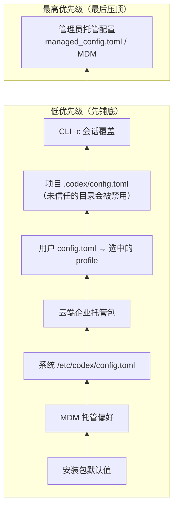
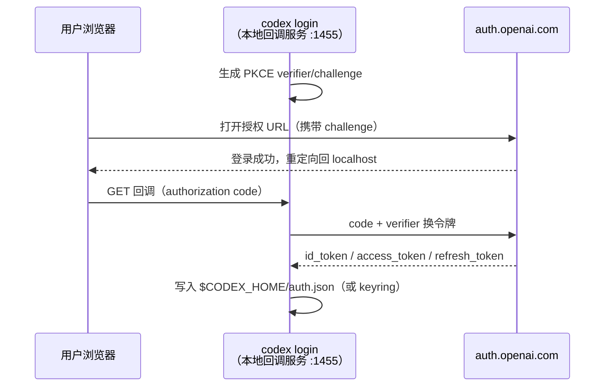

# 配置与认证

## 本章导读

这是第一部分的收官一章。前两章我们从空中俯瞰了架构、翻看了 crate 地图，
本章落地到两个每个用户第一天就会碰到的东西：`config.toml` 和 `codex login`。
读完本章，你将能够：

1. 说出 Codex 配置的分层模型与优先级顺序，解释为什么 CLI `-c` 覆盖能压过
   `config.toml`，而企业管理员的托管配置又能压过你的一切本地设置；
2. 画出从磁盘上的 TOML 文件到运行时 `Config` 对象的完整加载链；
3. 区分 ChatGPT 登录与 API key 两条认证链路，说出凭证存在哪里、如何进入
   HTTP 请求头、过期后如何被刷新。

**前置章节**：第 1 章「总览」、第 2 章「crate 地图」。本章定位是"边用边学"——
概念节尽量贴近用户视角，源码节再钻进去看实现。

## 概念与架构

### 配置是一份"会签文件"

延续第 1 章的"外包工程师团队"类比：配置就是发给团队的工作手册，但这份手册
不是一个人写的，而是层层会签的结果——

- **安装包默认值**是随产品附赠的出厂手册；
- **系统配置**（`/etc/codex/config.toml`）是 IT 部门贴在公司层面的规定；
- **云端托管配置**是总部通过企业通道下发的红头文件；
- **用户 `config.toml`** 是你自己夹在手册里的便签，**profile** 是便签上再贴一张便利贴；
- **项目级 `.codex/config.toml`** 是项目组在本仓库里立的规矩；
- **CLI `-c key=value`** 是你开工那一刻的口头叮嘱，临时但优先；
- **管理员托管配置**（MDM / `managed_config.toml`）是盖在最高层的钢印：
  它说了算，没有商量。

同一个键出现在好几层时怎么办？Codex 的规则简单而经典：**每层带一个优先级
分数，冲突时高分层赢；不冲突的键则逐层递归合并**，像补丁一样叠上去。

注意一个不对称：**项目层地位并不高**。仓库是别人写的内容，如果项目配置能随意
指定模型供应商地址，你 clone 一个恶意仓库、跑一次 Codex，凭证就发去了攻击者的
服务器。所以 Codex 给项目层设了信任门控和键位黑名单——这个安全设计我们在
「技术难点」一节细说。

### 认证是两把不同的钥匙

如果说配置决定"团队怎么干活"，认证决定"谁来为这次思考买单"。Codex 有两把钥匙：

- **API key**：一把长期有效的金属钥匙，配好就能用，适合 CI 和脚本；
- **ChatGPT 登录**：一张有时效的门卡。你在浏览器里完成 OAuth 登录，本机的
  Codex 起了一个短命的小型回调服务接住令牌；门卡（access token）快到期时
  自动用刷新令牌换新的，你几乎无感。

ChatGPT 门卡的好处是订阅额度而非按量计费，代价是多了一套令牌生命周期管理。
没有浏览器的 headless 环境则走设备码流程：终端打印一个验证码，你在任意有浏览器的
设备上输入完成授权。

## 源码深挖

### 分层与优先级：一张带分数的表

所有配置来源被建模为 `ConfigLayerSource` 枚举
（codex-rs/config/src/config_layer_source.rs#L6），每种来源的优先级由一个
整数显式给出（codex-rs/config/src/config_layer_source.rs#L33-L51）：

| 层（低 → 高） | `ConfigLayerSource` 变体 | 优先级 |
| ------------- | ------------------------ | ------ |
| 安装包默认值 | `PackagedDefaults` | -10 |
| MDM 托管偏好（macOS） | `Mdm` | 0 |
| 系统 `/etc/codex/config.toml` | `System` | 10 |
| 云端企业托管包 | `EnterpriseManaged` | 15 |
| 用户 `config.toml`（无 profile） | `User` | 20 |
| 用户 profile 层 | `User { profile: Some(..) }` | 21 |
| 项目 `.codex/config.toml` | `Project` | 25 |
| CLI `-c` 会话覆盖 | `SessionFlags` | 30 |
| 旧版 `managed_config.toml` 文件 | `LegacyManagedConfigTomlFromFile` | 40 |
| 旧版 MDM 托管配置 | `LegacyManagedConfigTomlFromMdm` | 50 |

值得一提的两个细节：其一，profile 已演化为"第二份用户文件"
（`$CODEX_HOME/<name>.config.toml`）叠在基础用户配置之上
（codex-rs/config/src/loader/mod.rs#L311-L313），而不是老文档里说的
`[profiles.*]` 表内选择；其二，项目配置实际是 cwd、目录树、git 根三处
`.codex/config.toml` 的集合，未受信任的目录会被"加载但禁用"
（codex-rs/config/src/loader/mod.rs#L115-L117）。

### 加载链：从文件到 `Config`

主链条分四站，全部可以精确定位：

| 步骤 | 位置 | 做了什么 |
| ---- | ---- | -------- |
| 入口 | codex-rs/core/src/config/mod.rs#L1440（`ConfigBuilder::build_inner`） | 解析 `CODEX_HOME`、cwd，发起加载 |
| 分层装配 | codex-rs/config/src/loader/mod.rs#L129（`load_config_layers_state`） | 按优先级组装各层：默认值内嵌于二进制（L171 `include_str!`）、系统层（L294）、云层（L309）、用户与 profile 层（L316-L359）、项目层（L422）、CLI 覆盖层（L438）、旧版托管层（L471/L488） |
| 合并与溯源 | codex-rs/config/src/state.rs#L247（`ConfigLayerStack`） | 构造时校验层序（L278）；`effective_config()`（L455）自低向高递归 merge；`origins()`（L466）记录每个键来自哪一层 |
| 反序列化 | codex-rs/core/src/config/mod.rs#L1485 | 合并后的 TOML `try_into::<ConfigToml>()`，再经 `Config::load_config_with_layer_stack`（L1503）产出运行时 `Config` |

合并语义由 `merge_toml_values`（codex-rs/config/src/merge.rs#L57）定义：两张表
递归合并、冲突键高层覆盖（L94-L119），并顺带归一化历史遗留的别名键。每层还带
一个 SHA-256 内容指纹（codex-rs/config/src/fingerprint.rs#L50-L62），让
"配置变了没有、哪一层变了"可以被精确回答。

CLI 的 `-c key=value` 由 `CliConfigOverrides`
（codex-rs/utils/cli/src/config_override.rs#L19）以"不解析右值"的形式捕获，
再由 `build_cli_overrides_layer`（codex-rs/config/src/overrides.rs#L9）折叠成
一个 TOML 表层。而 `ConfigToml` 这个结构体（codex-rs/config/src/config_toml.rs#L155）
本身就是 schema 的唯一事实来源：`just write-config-schema`（justfile#L173）用
schemars 生成 `codex-rs/core/config.schema.json`（生成逻辑在
codex-rs/config/src/schema.rs#L223-L232）。

### 认证：两条链路的实现位置

**存储。** 一切凭证的磁盘形态是 `AuthDotJson`
（codex-rs/login/src/auth/storage.rs#L41）：API key、ChatGPT 令牌、刷新时间戳、
Bedrock 凭证各有字段。存哪由 `AuthCredentialsStoreMode` 决定——`File`（默认）、
`Keyring`、`Auto`、`Ephemeral`（仅内存）
（codex-rs/config/src/types.rs#L109-L118）。

**ChatGPT 链路。** 交互式登录由 `run_login_server`
（codex-rs/login/src/server.rs#L160）驱动：生成 PKCE 码
（codex-rs/login/src/pkce.rs#L12），绑定 127.0.0.1:1455（占用则退到 1457，
server.rs#L60-L62、L637），回调拿到 code 后 `exchange_code_for_tokens`
（server.rs#L809），最后 `persist_tokens_async` 落盘（server.rs#L886）。
headless 场景走设备码：`run_device_code_login`
（codex-rs/login/src/device_code_auth.rs#L234）→ 请求用户码（L63）→
轮询令牌端点，最长等 15 分钟（L100-L108）→ 复用同一套换码与落盘逻辑。
CLI 入口在 codex-rs/cli/src/login.rs#L163 与 L354。

**API key 链路。** `login_with_api_key`（codex-rs/login/src/auth/manager.rs#L995）
直接写一份只含 key 的 auth.json。运行时解析的优先级在 `load_auth`
（manager.rs#L1461）：`CODEX_API_KEY` 环境变量最优先（L1472-L1478），其次是
外部注入的内存态令牌（L1480-L1507），再次是 `CODEX_ACCESS_TOKEN`（L1509），
最后才落到持久化存储里的 auth.json / keyring（L1538 起）。解析结果是
`CodexAuth` 枚举（manager.rs#L80-L89），共八个变体，API key 与 ChatGPT
只是其中之二。

**注入与刷新。** 模型请求发出前，`CodexAuth` 被转换为 `BearerAuthProvider`
（codex-rs/model-provider/src/auth.rs#L319-L323），由它写入
`Authorization: Bearer` 与 `ChatGPT-Account-ID` 头
（codex-rs/model-provider/src/bearer_auth_provider.rs#L32-L46）。刷新是双保险的：
`AuthManager::auth()`（manager.rs#L2372）每次取认证时主动检查——access token
距过期不足 5 分钟就换（manager.rs#L2972-L2974），refresh token 每 8 天轮换一次
（manager.rs#L2980）；万一仍撞上 401，core 侧的 `handle_unauthorized`
（codex-rs/core/src/client.rs#L2424）会触发一次恢复并重试。而在 IDE 等"外部
认证"模式下，app-server 自己并不持有刷新能力，而是通过反向请求
`account/chatgptAuthTokens/refresh`
（codex-rs/app-server-protocol/src/protocol/common.rs#L1777）向客户端要新令牌，
桥接代码在 codex-rs/app-server/src/external_auth.rs#L33-L82，超时 10 秒（L18）。

## 技术难点与设计取舍

**难点一：多源配置的合并与"这值哪来的"。** 分层覆盖听上去简单，难在两个附加
要求：一是合并必须是结构化的（递归合并 TOML 表，而非整层替换），否则用户层补
一个键就会抹掉系统层的整张表；二是合并后必须能回答"这个生效值来自哪一层"——
企业排障和 `/config` API 都依赖它。Codex 的取舍是**保留完整层栈而非只留合并
结果**：`ConfigLayerStack` 同时携带每层原文、来源与指纹，诊断能力优先于内存
节省。

**难点二：项目配置的信任问题。** 仓库内容天然不可信，但"项目级配置"又是刚需。
Codex 的解法不是二选一，而是给项目层戴上镣铐：未受信任的目录，其配置层会被
加载但禁用；即使受信任，`PROJECT_LOCAL_CONFIG_DENYLIST`
（codex-rs/config/src/loader/mod.rs#L72-L85）也明文禁止项目层设置
`openai_base_url`、`model_provider`、`otel` 等能决定凭证与遥测去向的键——
源码注释说得直白：仓库不应能选择"用户的凭证被发去哪、哪些本地命令被执行"
（loader/mod.rs#L68-L71）。这是把供应链攻击面显性写进配置系统的设计。

**难点三：token 的存储与生命周期。** 明文文件方便但脆弱，keyring 安全但有平台
差异，于是有了 File/Keyring/Auto/Ephemeral 四种存储模式。生命周期管理更微妙：
刷新太勤会被限流，太懒会撞上请求中途过期。Codex 用"双时钟"——access token
到期前 5 分钟的预防针，加上 refresh token 每 8 天的强制轮换——再叠一个 401
被动恢复兜底。最有趣的是外部认证模式：app-server 可能跑在没有凭证的远程环境，
刷新只能"掉头"向持有凭证的客户端发反向请求。凭证所有权留在用户设备上，服务
端只是借用——这个方向选择比刷新逻辑本身更值得玩味。

## 对照通用 agent 范式

**配置分层。** 多数编码 agent 的配置止步于"环境变量 + 单个 rc 文件"；把配置做成
带分数、带来源追踪、带版本指纹的层栈，更接近 Kubernetes / Kustomize 这类平台
工程的思路。Codex 的独特贡献是给分层加了**信任维度**：优先级回答"谁赢"，信任
门控回答"谁有资格说"。设计自己的 agent 时，只要配置来源里包含"别人的仓库"，
这个维度就绕不开。

**认证双轨。** API key 与 OAuth 双轨并行是业界标配（GitHub CLI、各类云 CLI 皆然），
headless 用设备码补位也已成惯例。Codex 超出惯例的有两点：一是把刷新做成
"主动预防 + 401 兜底"的双保险，而不是等失败；二是反向刷新通道——在 agent
产品日益"引擎服务化、前端多样化"的趋势下，"凭证不离开用户设备"这条约束会
越来越常见，Codex 的 ExternalAuthBridge 是一个可参考的 early sample。

## 小结与下一章预告

- 配置不是单个文件，而是一张带优先级分数的层栈：从安装包默认值（-10）到
  管理员托管配置（50），冲突时高层赢，非冲突键递归合并；
- 加载链四站：`ConfigBuilder::build_inner` → `load_config_layers_state` →
  `ConfigLayerStack`（合并 + 来源追踪 + 指纹）→ `ConfigToml` → `Config`；
- 项目层配置受信任门控与黑名单约束——仓库永远不能决定你的凭证发去哪；
- 认证两链路：ChatGPT OAuth（PKCE 本地回调 / 设备码）与 API key，存储于
  auth.json 或 keyring，共四种存储模式；
- token 刷新是双保险：5 分钟主动窗口 + 8 天轮换 + 401 兜底；外部认证模式下
  经 app-server 反向请求向客户端要令牌。

至此第一部分"认识 Codex"收官。下一部分我们钻进一次请求的内部：首章
「进程与传输」——Codex 进程如何启动、进程间用什么传输对话，以及为什么连
进程内通信都要套一层 JSON-RPC 信封。
