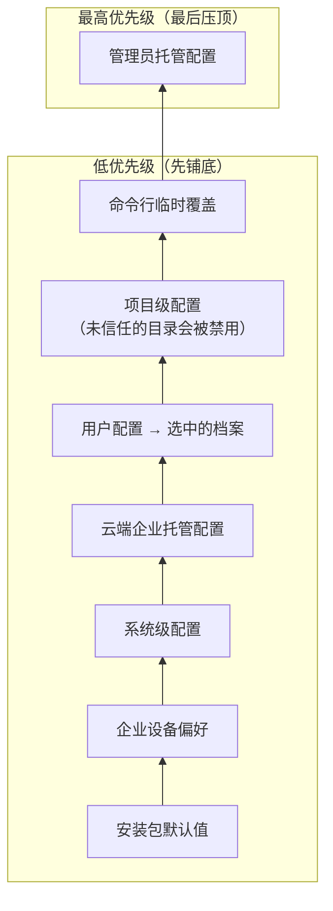
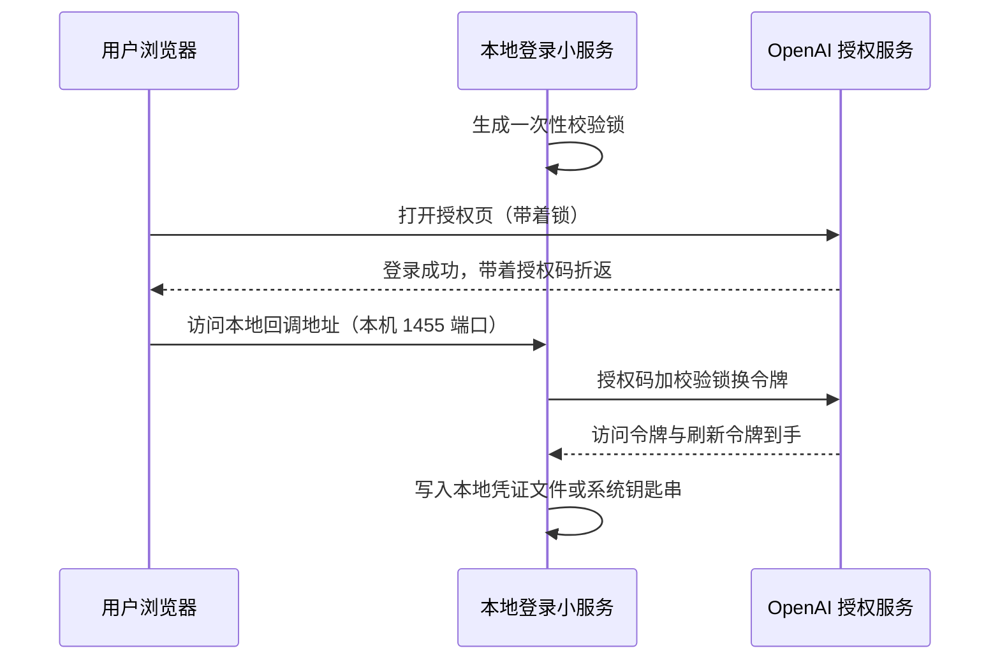

# 配置与认证

## 本章导读

从一个几乎人人都会遇到的场面开始：**你刚装好 Codex，第一次运行，它先请你登录**——浏览器弹出授权页，你点完"同意"回到终端，它就能干活了。几天后，你想在某个项目里临时换个模型试试；与此同时，公司 IT 部门又给所有员工的电脑下发了一份强制配置。于是问题来了：当公司的规定、你的个人喜好、项目里的约定和你临时起意的想法同时发话，Codex 到底听谁的？而登录完成之后，它又是怎么让远端服务器每次都认出"你是你"，并且在你毫无察觉的情况下把快过期的凭证悄悄换新的？

读完本章，你将能够：

1. 说出 Codex 配置的分层模型与优先级顺序——为什么你在命令行里临时写的一句覆盖能压过配置文件，而企业管理员的强制配置又能压过你的一切本地设置；
2. 画出一份配置从磁盘上的文本文件到程序内部"生效值"的完整旅程；
3. 区分两种登录方式（长期密钥与账号授权），说出凭证存在哪里、如何被放进网络请求、快过期时如何自动换新。

**前置章节**：第 1 章「总览」、第 2 章「代码包（crate）地图」。本章定位是"边用边学"——概念部分尽量贴近用户视角，源码部分再钻进去看实现。

## 概念与架构

### 配置是一份"会签文件"

延续第 1 章的"外包工程师团队"类比：配置就是发给团队的工作手册。但这份手册不是一个人写的，而是层层会签的结果——

- **安装包默认值**是随产品附赠的出厂手册；
- **企业设备偏好**是公司通过设备管理机制预置在电脑里的倾向性设置；
- **系统级配置**是 IT 部门贴在整台电脑层面的规定；
- **云端托管配置**是总部通过企业通道下发的红头文件；
- **用户配置**是你自己夹在手册里的便签；**档案**（profile，同一用户为不同场景准备的多份便签）是便签上再贴的一张便利贴；
- **项目级配置**是项目组在仓库里立的规矩；
- **命令行临时覆盖**是你开工那一刻的口头叮嘱，临时但优先；
- **管理员托管配置**是盖在最高层的钢印：它说了算，没有商量。

同一个键出现在好几层时怎么办？Codex 的规则简单而经典：**每层带一个优先级分数，冲突时高分层赢；不冲突的键则逐层递归合并**，像补丁一样一层层叠上去。

下面这张图把"会签顺序"画了出来：从下往上读，越低越早铺底，越高越晚压顶。

记住这张图只需一句话：**越靠近"此刻的你"，优先级越高；唯独管理员的钢印压过一切。**

注意一个不对称：**项目层地位并不高**。仓库是别人写的内容，如果项目配置能随意指定模型服务的地址，你克隆一个恶意仓库、跑一次 Codex，你的凭证就发去了攻击者的服务器。所以 Codex 给项目层设了信任门控和键位黑名单——这个安全设计我们在「技术难点」一节细说。

### 认证是两把不同的钥匙

如果说配置决定"团队怎么干活"，认证决定"谁来为这次思考买单"。Codex 有两把钥匙：

- **接口密钥**（API key）：一把长期有效的金属钥匙——一串配好就能用的长密码，适合脚本和自动化流水线；
- **ChatGPT 账号登录**：一张有时效的门卡。你在浏览器里完成授权（走的是一种叫 OAuth 的标准流程：不在终端里输密码，而是去官网登录、再带着凭证折返），本机的 Codex 会起一个短命的小型回调服务接住令牌。门卡（访问令牌）快到期时，会自动用换卡凭证（刷新令牌）换一张新的，你几乎无感。

账号登录的好处是按订阅额度计费而非按量计费，代价是多了一套令牌生命周期管理。没有浏览器的无人值守环境则走"设备码"流程：终端打印一个验证码，你在任意有浏览器的设备上输入它，完成授权。

下面这张时序图看一次浏览器登录的完整往返。重点看两件事：一次性校验锁（一种防止授权码在半路被截胡的手段）如何贯穿首尾，以及令牌最终落到哪里。

看完图记住结论即可：**密码从不经过终端，凭证只落在你自己的设备上**。后面源码部分会把每一步对号入座。

## 出场角色

进入源码之前，先认识本章要出场的角色。下表的"所在文件"都是仓库内的相对路径，现在记不住没关系，读到正文时翻回来对照即可。

| 中文名 | 英文名 | 职责（一句话） | 所在文件 |
| ------ | ------ | -------------- | -------- |
| 配置层来源枚举 | ConfigLayerSource | 给每一种配置来源定性，并附上优先级分数 | codex-rs/config/src/config_layer_source.rs |
| 配置层装配函数 | load_config_layers_state | 按优先级把各层配置从磁盘读出、组装成栈 | codex-rs/config/src/loader/mod.rs |
| 项目配置黑名单 | PROJECT_LOCAL_CONFIG_DENYLIST | 明文列出项目层永远不许设置的敏感键 | codex-rs/config/src/loader/mod.rs |
| 配置层栈 | ConfigLayerStack | 持有全部配置层，负责合并生效值与记录来源 | codex-rs/config/src/state.rs |
| 配置合并函数 | merge_toml_values | 把两张配置表递归合并，冲突键由高层覆盖 | codex-rs/config/src/merge.rs |
| 配置指纹函数 | version_for_toml | 给每层配置算内容指纹，回答"配置变没变" | codex-rs/config/src/fingerprint.rs |
| 配置构建器 | ConfigBuilder | 核心引擎侧的配置入口，发起加载并产出运行时配置 | codex-rs/core/src/config/mod.rs |
| 配置文件结构 | ConfigToml | 配置文件格式的唯一事实来源，合并结果反序列化成它 | codex-rs/config/src/config_toml.rs |
| 命令行覆盖捕获器 | CliConfigOverrides | 原样捕获命令行上的临时覆盖键值对 | codex-rs/utils/cli/src/config_override.rs |
| 覆盖折叠函数 | build_cli_overrides_layer | 把捕获到的键值对折叠成一张配置表层 | codex-rs/config/src/overrides.rs |
| 模式生成函数 | config_schema | 从配置结构生成校验用的格式说明书 | codex-rs/config/src/schema.rs |
| 凭证文件结构 | AuthDotJson | 凭证文件的格式：密钥、令牌、刷新时间各占一栏 | codex-rs/login/src/auth/storage.rs |
| 凭证存储模式 | AuthCredentialsStoreMode | 决定凭证存文件、系统钥匙串，还是只留在内存 | codex-rs/config/src/types.rs |
| 登录服务启动器 | run_login_server | 起一个本地回调服务，接住浏览器带回来的授权码 | codex-rs/login/src/server.rs |
| 校验锁生成器 | generate_pkce | 生成一次性校验锁，防止授权码被半路截胡 | codex-rs/login/src/pkce.rs |
| 设备码登录函数 | run_device_code_login | 无浏览器环境的登录流程：显示验证码并轮询结果 | codex-rs/login/src/device_code_auth.rs |
| 认证管理器 | AuthManager | 统一管理凭证的读取、刷新与对外提供 | codex-rs/login/src/auth/manager.rs |
| 认证结果枚举 | CodexAuth | 一次认证解析的全部可能结果，共八种形态 | codex-rs/login/src/auth/manager.rs |
| 密钥登录函数 | login_with_api_key | 把接口密钥直接写成一份凭证文件 | codex-rs/login/src/auth/manager.rs |
| 认证解析函数 | load_auth | 按优先级决定本次运行使用哪份凭证 | codex-rs/login/src/auth/manager.rs |
| 持票人认证提供者 | BearerAuthProvider | 把令牌写进网络请求头的执行者 | codex-rs/model-provider/src/bearer_auth_provider.rs |
| 未授权恢复函数 | handle_unauthorized | 请求被拒时触发一次令牌恢复并重试 | codex-rs/core/src/client.rs |
| 外部认证桥 | ExternalAuthBridge | 应用服务向持有凭证的客户端反向请求新令牌的通道 | codex-rs/app-server/src/external_auth.rs |

## 源码深挖

### 分层与优先级：一张带分数的表

这一小节把概念段的"会签顺序"落成代码。主角只有一位：配置层来源枚举。读完你会拿到每一层的精确分数，还会知道两个文档里不会告诉你的细节——档案的真实形态，以及项目配置其实来自三个地方。

所有配置来源被建模为配置层来源枚举 `ConfigLayerSource`（codex-rs/config/src/config_layer_source.rs#L6），每种来源的优先级由一个整数显式给出（codex-rs/config/src/config_layer_source.rs#L33-L51）：

| 层（低 → 高） | 枚举变体 | 优先级 |
| ------------- | -------- | ------ |
| 安装包默认值 | `PackagedDefaults` | -10 |
| 企业设备偏好（macOS） | `Mdm` | 0 |
| 系统级配置 | `System` | 10 |
| 云端企业托管配置 | `EnterpriseManaged` | 15 |
| 用户配置（未选档案） | `User` | 20 |
| 用户档案层 | `User { profile: Some(..) }` | 21 |
| 项目级配置 | `Project` | 25 |
| 命令行临时覆盖 | `SessionFlags` | 30 |
| 旧版托管配置文件 | `LegacyManagedConfigTomlFromFile` | 40 |
| 旧版设备管理托管配置 | `LegacyManagedConfigTomlFromMdm` | 50 |

值得一提的两个细节：其一，档案已演化为"第二份用户配置文件"，叠在基础用户配置之上（codex-rs/config/src/loader/mod.rs#L311-L313），而不是老文档里说的在配置文件内部做选择；其二，项目配置实际是当前目录、目录树、仓库根三处项目配置文件的集合，未受信任的目录会被"加载但禁用"（codex-rs/config/src/loader/mod.rs#L115-L117）。

### 加载链：从文件到运行时配置

这一小节跟踪一份配置的完整旅程：谁在起点发起加载，谁把各层装配成栈，谁负责合并与记账，最后又怎么变成程序真正使用的运行时配置。出场角色：配置构建器、配置层装配函数、配置层栈、配置文件结构。读完你能把"读文件"到"生效值"之间的四站背下来。

主链条分四站，全部可以精确定位：

| 步骤 | 位置 | 做了什么 |
| ---- | ---- | -------- |
| 入口 | codex-rs/core/src/config/mod.rs#L1440（`ConfigBuilder::build_inner`） | 解析家目录与当前目录，发起加载 |
| 分层装配 | codex-rs/config/src/loader/mod.rs#L129（`load_config_layers_state`） | 按优先级组装各层：默认值在编译期嵌入程序文件（L171）、系统层（L294）、云层（L309）、用户与档案层（L316-L359）、项目层（L422）、命令行覆盖层（L438）、旧版托管层（L471 与 L488） |
| 合并与溯源 | codex-rs/config/src/state.rs#L247（`ConfigLayerStack`） | 构造时校验层序（L278）；`effective_config()`（L455）自低向高递归合并；`origins()`（L466）记录每个键来自哪一层 |
| 反序列化 | codex-rs/core/src/config/mod.rs#L1485 | 合并后的文本被装入配置文件结构，再经 `Config::load_config_with_layer_stack`（L1503）产出运行时配置 |

合并语义由配置合并函数 `merge_toml_values`（codex-rs/config/src/merge.rs#L57）定义：两张表递归合并、冲突键由高层覆盖（codex-rs/config/src/merge.rs#L94-L119），并顺带归一化历史遗留的别名键。每层还带一个 SHA-256（一种内容指纹算法）指纹，由配置指纹函数算出（codex-rs/config/src/fingerprint.rs#L50-L62），让"配置变了没有、哪一层变了"可以被精确回答。

命令行的临时覆盖由命令行覆盖捕获器 `CliConfigOverrides`（codex-rs/utils/cli/src/config_override.rs#L20）以"不解析右值"的形式捕获，再由覆盖折叠函数 `build_cli_overrides_layer`（codex-rs/config/src/overrides.rs#L9）折叠成一张配置表层。而配置文件结构 `ConfigToml`（codex-rs/config/src/config_toml.rs#L155）本身就是格式的唯一事实来源：一条 `just write-config-schema` 命令（justfile#L173）用模式生成库 schemars（从类型定义自动生成格式说明书的工具）产出校验文件，生成逻辑在模式生成函数（codex-rs/config/src/schema.rs#L223-L232）。

### 凭证的存储与两条登录链路

这一小节回答"凭证躺在哪、怎么进来"。出场角色较多：凭证文件结构与凭证存储模式负责"躺哪"，登录服务启动器、校验锁生成器、设备码登录函数负责账号登录链路，密钥登录函数与认证解析函数负责密钥链路。读完你能把两条链路的每一步定位到源码。

**存储。** 一切凭证的磁盘形态是凭证文件结构 `AuthDotJson`（codex-rs/login/src/auth/storage.rs#L41）：接口密钥、账号令牌、刷新时间戳等各有字段。存哪由凭证存储模式 `AuthCredentialsStoreMode` 决定——文件（默认）、系统钥匙串、自动（钥匙串不可用时退回文件）、仅内存（codex-rs/config/src/types.rs#L109-L118）。

**账号登录链路。** 交互式登录由登录服务启动器 `run_login_server`（codex-rs/login/src/server.rs#L160）驱动：先用校验锁生成器（codex-rs/login/src/pkce.rs#L12）造出一次性校验锁，再绑定本机 1455 端口，被占用则退到 1457（codex-rs/login/src/server.rs#L60-L62 与 #L637）；回调拿到授权码后换令牌（codex-rs/login/src/server.rs#L809），最后异步落盘（codex-rs/login/src/server.rs#L886）。无人值守场景走设备码登录函数 `run_device_code_login`（codex-rs/login/src/device_code_auth.rs#L234）：先请求用户码（#L63），再轮询令牌端点、最长等 15 分钟（#L100-L108），最后复用同一套换码与落盘逻辑。命令行入口在 codex-rs/cli/src/login.rs#L163（浏览器流程）与 #L354（设备码流程）。

**接口密钥链路。** 密钥登录函数 `login_with_api_key`（codex-rs/login/src/auth/manager.rs#L995）直接写一份只含密钥的凭证文件。运行时解析的优先级在认证解析函数 `load_auth`（codex-rs/login/src/auth/manager.rs#L1461）：环境变量里的密钥最优先（#L1472-L1478），其次是外部注入的内存态令牌（#L1480-L1507），再次是环境变量里的访问令牌（#L1509），最后才落到持久化存储里的凭证文件或钥匙串（#L1538 起）。解析结果是认证结果枚举 `CodexAuth`（codex-rs/login/src/auth/manager.rs#L80-L89），共八个变体——接口密钥与账号登录只是其中之二，其余面向企业网关、云厂商等场景。

### 令牌的注入与刷新

这一小节看凭证"上岗"之后的事：它怎么被放进每一个发往模型服务的请求，以及快过期时怎么悄悄换新。出场角色：持票人认证提供者、认证管理器、未授权恢复函数、外部认证桥。读完你会理解"双保险"和"反向请求"这两个设计。

**注入。** 模型请求发出前，认证结果被转换为持票人认证提供者 `BearerAuthProvider`（codex-rs/model-provider/src/auth.rs#L319-L323），由它写入授权头与账号头（codex-rs/model-provider/src/bearer_auth_provider.rs#L32-L46）。

**刷新是双保险。** 认证管理器每次取认证时都会主动检查（codex-rs/login/src/auth/manager.rs#L2372）：访问令牌距过期不足 5 分钟就换（#L2972-L2974），刷新令牌本身每 8 天强制轮换一次（#L2980）。万一仍撞上"未授权"响应，核心引擎一侧的未授权恢复函数 `handle_unauthorized`（codex-rs/core/src/client.rs#L2424）会触发一次恢复并重试。而在编辑器插件等"外部认证"模式下，应用服务（app-server）——所有前端的统一入口，见第 1 章——自己并不持有刷新能力，只能通过反向请求向持有凭证的客户端要新令牌：请求名是 `account/chatgptAuthTokens/refresh`（codex-rs/app-server-protocol/src/protocol/common.rs#L1777），桥接代码在外部认证桥（codex-rs/app-server/src/external_auth.rs#L33-L82），超时 10 秒（#L18）。

## 技术难点与设计取舍

**难点一：多源配置的合并与"这值哪来的"。** 分层覆盖听上去简单，难在两个附加要求：一是合并必须是结构化的（递归合并配置表，而非整层替换），否则用户层补一个键就会抹掉系统层的整张表；二是合并后必须能回答"这个生效值来自哪一层"——企业排障和配置查询接口都依赖它。Codex 的取舍是**保留完整层栈而非只留合并结果**：配置层栈同时携带每层原文、来源与指纹，诊断能力优先于内存节省。

**难点二：项目配置的信任问题。** 仓库内容天然不可信，但"项目级配置"又是刚需。Codex 的解法不是二选一，而是给项目层戴上镣铐：未受信任的目录，其配置层会被加载但禁用；即使受信任，项目配置黑名单 `PROJECT_LOCAL_CONFIG_DENYLIST`（codex-rs/config/src/loader/mod.rs#L72-L85）也明文禁止项目层设置模型服务地址、模型供应商、遥测等能决定凭证与数据去向的键——源码注释说得直白：仓库不应能选择"用户的凭证被发去哪、哪些本地命令被执行"（codex-rs/config/src/loader/mod.rs#L68-L71）。这是把供应链攻击面显性写进配置系统的设计。

**难点三：令牌的存储与生命周期。** 明文文件方便但脆弱，系统钥匙串安全但有平台差异，于是有了文件、钥匙串、自动、仅内存四种存储模式。生命周期管理更微妙：刷新太勤会被限流，太懒会撞上请求中途过期。Codex 用"双时钟"——访问令牌到期前 5 分钟的预防针，加上刷新令牌每 8 天的强制轮换——再叠一个"未授权"被动恢复兜底。最有趣的是外部认证模式：应用服务可能跑在没有凭证的远程环境，刷新只能"掉头"向持有凭证的客户端发反向请求。凭证所有权留在用户设备上，服务端只是借用——这个方向选择比刷新逻辑本身更值得玩味。

## 对照通用 agent 范式

**配置分层。** 多数编码智能体的配置止步于"环境变量加单个配置文件"；把配置做成带分数、带来源追踪、带版本指纹的层栈，更接近 Kubernetes、Kustomize 这类平台工程的思路。Codex 的独特贡献是给分层加了**信任维度**：优先级回答"谁赢"，信任门控回答"谁有资格说"。设计自己的智能体时，只要配置来源里包含"别人的仓库"，这个维度就绕不开。

**认证双轨。** 接口密钥与浏览器授权双轨并行是业界标配（GitHub 的命令行工具、各类云厂商命令行皆然），无浏览器环境用设备码补位也已成惯例。Codex 超出惯例的有两点：一是把刷新做成"主动预防加失败兜底"的双保险，而不是等失败；二是反向刷新通道——在智能体产品日益"引擎服务化、前端多样化"的趋势下，"凭证不离开用户设备"这条约束会越来越常见，Codex 的外部认证桥是一个可参考的早期样本。

## 小结与下一章预告

- 配置不是单个文件，而是一叠带优先级分数的层：从安装包默认值（-10 分）到管理员托管配置（50 分），冲突时高层赢，非冲突键递归合并；
- 加载链四站：配置构建器发起 → 配置层装配 → 配置层栈（合并、来源追踪、指纹）→ 配置文件结构 → 运行时配置；
- 项目层配置受信任门控与黑名单约束——仓库永远不能决定你的凭证发去哪；
- 认证两链路：账号登录（浏览器授权或设备码）与接口密钥；凭证存本地文件或系统钥匙串，共四种存储模式；
- 令牌刷新是双保险：5 分钟主动窗口、8 天轮换、未授权兜底；外部认证模式下经应用服务反向请求向客户端要令牌。

至此第一部分"认识 Codex"收官。下一部分我们钻进一次请求的内部：第 4 章「进程与传输」——Codex 进程如何启动、进程间用什么传输对话，以及为什么连进程内通信都要套一层统一的消息信封。
