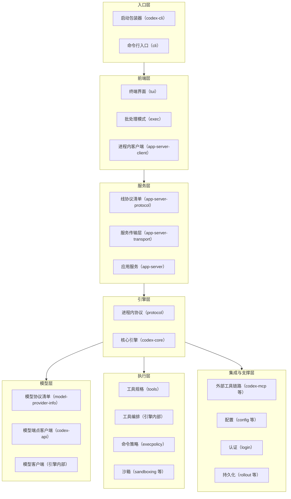

# crate 地图

## 本章导读

从一个具体的烦恼开始：你想给 Codex 加一个小功能，或者调整它执行命令时的
安全策略，于是打开代码仓库，发现主目录下面躺着一百多个文件夹。认证逻辑在
哪？沙箱在哪？想改的东西到底该进哪扇门？

本章就解决这个问题。主角是代码包（crate）——Rust 的代码组织单元，类似
其他语言的库/包：每个代码包有自己的名字和依赖清单，外部只能使用它明确
公开的部分。Codex 把全部 Rust 代码切分成一百多个代码包，放在同一个目录
下统一管理。看懂这张地图，你就拥有了在仓库里自由穿行的能力。

读完本章，你将能够：

1. 说出这一百多个代码包的分层结构，知道每一层向谁负责；
2. 按"领域"反向定位代码——想改沙箱行为、加配置项、动协议类型时，直接
   知道该进哪个目录；
3. 解释为什么 Codex 选择"碎成上百个小代码包"而不是"少数几个大代码包"，
   以及社区用什么纪律阻止核心引擎无限膨胀。

**前置章节**：第 1 章「总览」。只需记住一件事——所有前端最终都收敛到
应用服务这一个执行契约上。

## 概念与架构

### 一个类比：逛一座城市

打开代码目录，就像打开一座城市的地图。一百多个代码包是一百多栋建筑，
第一次来的人会晕，但城市其实是分区规划的：

- **入口层**是机场到达大厅——无论你从哪个航班抵达，都在这里过海关、
  分流；
- **前端层**是问讯处和售票窗口——终端界面、批处理模式这些直接面对用户
  的柜台，本身不办事，只负责接待和转达；
- **服务层**是市政服务大厅——所有窗口业务都在这里统一登记、派发，保证
  "在哪个窗口办的流程都一样"；
- **引擎层**是市政府——真正做决策的地方。核心引擎是市长办公室，进程内
  协议是红头文件的公文格式；
- **模型层**是市政府的对外热线——打电话向外部顾问（模型服务）请示；
- **执行层**是施工队和工地安全条例——工具负责干活，命令策略和沙箱负责
  "这活儿能不能干、在哪儿干"；
- **支撑层**是档案馆、户籍科、统计局——配置、认证、会话落盘、遥测，平时
  不显眼，缺了立刻瘫痪。

分区的意义不在于楼多，而在于**每栋楼只挂一个门牌**：想改认证逻辑不用逛
全城，直接去户籍科就行。

### 分层结构

下面这张图把整座城市的七个区画在一起。看什么：每一层有哪些代表性建筑，
以及层与层之间的依赖方向。

读这张图时记住它的方向感：**依赖大体从上往下流动**。前端知道服务层，
服务层知道引擎，引擎知道执行层；反过来则不行——进程内协议这样的下层
代码包绝不依赖核心引擎。城市可以向上加盖，地基不能回头依赖阁楼。

## 出场角色

进入源码之前，先认识本章要出场的角色。下表的"所在文件"都是仓库内的相对
路径，现在记不住没关系，读到正文时翻回来对照即可。

| 中文名 | 英文名 | 职责（一句话） | 所在文件 |
| ------ | ------ | -------------- | -------- |
| 工作区清单 | workspace Cargo.toml | 登记全部成员代码包与共享配置的总规划图 | codex-rs/Cargo.toml |
| 仓库军规 | AGENTS.md | 写给所有贡献者的代码组织纪律 | AGENTS.md |
| 启动包装器 | codex-cli | 按操作系统和芯片分发并启动程序 | codex-cli/bin/codex.js |
| 命令行入口 | cli | 进程的真正入口，负责子命令分发 | codex-rs/cli/src/main.rs |
| 名字分派器 | arg0 | 按"程序被以什么名字调用"切换角色 | codex-rs/arg0/src/lib.rs |
| 补丁工具 | apply-patch | 把模型给出的补丁打到文件上 | codex-rs/apply-patch |
| 终端界面 | tui | 交互式终端前端 | codex-rs/tui |
| 批处理模式 | exec | 无人值守的运行前端 | codex-rs/exec |
| 应用服务 | app-server | 所有前端的统一服务入口 | codex-rs/app-server |
| 进程内传输模块 | in_process | 用进程内消息通道替代网络、复用同一协议 | codex-rs/app-server/src/in_process.rs |
| 线协议清单 | app-server-protocol | 定义线上请求与响应的类型 | codex-rs/app-server-protocol |
| 客户端请求 | ClientRequest | 客户端可调用的全部请求的枚举 | codex-rs/app-server-protocol/src/protocol/common.rs |
| 服务传输层 | app-server-transport | 承载服务的底层通信传输 | codex-rs/app-server-transport |
| 进程内客户端 | app-server-client | 同进程前端的统一请求与事件接口 | codex-rs/app-server-client |
| 进程内协议 | protocol | 引擎的进程内协议类型，几乎不依赖别人 | codex-rs/protocol |
| 操作指令 | Op | 前端发给引擎的指令枚举 | codex-rs/protocol/src/protocol.rs |
| 事件通知 | EventMsg | 引擎发回前端的事件枚举 | codex-rs/protocol/src/protocol.rs |
| 核心引擎 | codex-core | 会话、轮循环、上下文、工具分发、审批、压缩 | codex-rs/core |
| 模型协议清单 | model-provider-info | 模型服务商与通信协议的注册表 | codex-rs/model-provider-info/src/lib.rs |
| 模型端点客户端 | codex-api | 模型端点的流式与长连接客户端 | codex-rs/codex-api |
| 响应代理 | responses-api-proxy | 模型交互协议的本地代理 | codex-rs/responses-api-proxy |
| 工具代码包 | tools | 工具规格与适配层，正从引擎迁出 | codex-rs/tools |
| 工具规格 | ToolSpec | 序列化后即是模型可见的工具定义 | codex-rs/tools/src/tool_spec.rs |
| 工具迁移自述 | tools README | 记录工具层迁出引擎的计划与禁区 | codex-rs/tools/README.md |
| 命令策略 | execpolicy | 判定一条命令能不能执行 | codex-rs/execpolicy |
| 沙箱层 | sandboxing | 跨平台的命令沙箱化 | codex-rs/sandboxing |
| Linux 沙箱 | linux-sandbox | Linux 平台的沙箱实现 | codex-rs/linux-sandbox |
| Windows 沙箱 | windows-sandbox-rs | Windows 平台的沙箱实现 | codex-rs/windows-sandbox-rs |
| 远程执行服务 | exec-server | 远程进程与文件能力 | codex-rs/exec-server |
| 外部工具服务侧 | codex-mcp | 面向外部工具的协议服务端 | codex-rs/codex-mcp |
| 外部工具客户端 | rmcp-client | 连接外部工具服务的客户端 | codex-rs/rmcp-client |
| 配置层 | config / config-schema | 分层配置加载与配置模式生成 | codex-rs/config |
| 认证 | login | 登录流程与密钥管理 | codex-rs/login |
| 认证管理器 | AuthManager | 认证数据的唯一事实来源 | codex-rs/login/src/auth/manager.rs |
| 钥匙串存储 | keyring-store | 操作系统钥匙串的存取 | codex-rs/keyring-store |
| 存档流水 | rollout | 会话内容的落盘 | codex-rs/rollout |
| 线程索引 | thread-store | 线程级别的索引与查询 | codex-rs/thread-store |
| 状态库 | state | 本地数据库形式的持久状态 | codex-rs/state |
| 历史类型 | history | 历史记录的数据类型 | codex-rs/history |
| 遥测 | otel | 运行指标与链路观测 | codex-rs/otel |
| 分析 | analytics | 使用情况分析 | codex-rs/analytics |
| 诊断 | diagnostics | 诊断信息的收集 | codex-rs/diagnostics |

## 源码深挖

### 工作区如何组织一百多个代码包

这一小节打开城市的规划图本身：那份登记所有代码包的总清单，以及约束所有
贡献者的军规文件。出场的角色是工作区清单和仓库军规。读完你会知道 146 个
代码包怎样被统一管理，以及两条必须记住的命名与体积纪律。

Rust 的构建工具 Cargo 用工作区（workspace）机制把多个代码包放在一起管理，
而工作区清单就是这份机制的总规划图。它的成员列表（codex-rs/Cargo.toml#L2）
登记了 **146 个成员代码包**；共享包信息段（codex-rs/Cargo.toml#L152）统一
了语言版本与 Apache-2.0 许可证；共享依赖段则把所有内部代码包以本地路径
依赖集中登记，成员之间互相引用只写名字、不带版本号——改一处，全仓生效。

两条命名与体积纪律写在仓库军规里，值得背下来：

- 代码包名一律加 `codex-` 前缀（AGENTS.md#L5）——目录叫 `core/`，代码包
  就叫 `codex-core`（codex-rs/core/Cargo.toml#L4）。所以读到
  `use codex_xxx::...` 时，把连字符换成下划线、到同名目录找即可；
- 模块体积有硬约束（AGENTS.md#L51）：单个文件目标 500 行以内，超过约
  800 行就要拆新模块，而不是继续往里堆。

### 按域分组的代码包索引

这一小节给出全章最实用的一张表：不按字母、而按"你想干什么"反向索引代码
位置。出场角色几乎涵盖全表所有人。读完它，你应该能直接回答导读里的问题
——改沙箱、加配置、动协议，各进哪扇门。

| 域 | 代码包 / 目录 | 职责 | 锚点 |
| --- | --- | --- | --- |
| 入口 | 启动包装器、命令行入口 | 按平台分发、进程内子命令分发 | codex-cli/bin/codex.js#L16；codex-rs/cli/src/main.rs#L1121 |
| 身份分流 | 名字分派器、补丁工具 | 按调用名变身沙箱或补丁工具 | codex-rs/arg0/src/lib.rs#L60-L100 |
| 前端 | 终端界面、批处理模式 | 交互界面、无人值守运行 | 两者都经进程内客户端进城（见第 1 章「总览」） |
| 服务 | 应用服务、线协议清单、服务传输层、进程内客户端 | 远程调用服务、线协议类型、传输、同进程客户端 | 见下一小节 |
| 协议 | 进程内协议 | 引擎的进程内协议类型 | 操作指令：codex-rs/protocol/src/protocol.rs#L596；事件通知：codex-rs/protocol/src/protocol.rs#L1360 |
| 引擎 | 核心引擎 | 会话、轮循环、上下文、工具分发、审批、压缩 | 第 7 章「Agent 核心」的主战场 |
| 模型 | 模型协议清单、模型端点客户端、响应代理 | 服务商注册表、模型端点（流式/长连接）、代理 | codex-rs/model-provider-info/src/lib.rs#L1-L6 |
| 工具 | 工具代码包、引擎内工具编排、命令策略 | 工具规格与适配、注册与编排、命令准入 | 工具规格：codex-rs/tools/src/tool_spec.rs#L22 |
| 沙箱 | 沙箱层、Linux 沙箱、Windows 沙箱 | 跨平台命令沙箱化 | codex-rs/sandboxing/src/lib.rs#L1-L12 |
| 远程执行 | 远程执行服务及其协议 | 远程进程与文件能力 | codex-rs/exec-server 目录 |
| 外部工具 | 外部工具服务侧、外部工具客户端 | 外部工具的连接与聚合 | 第 13 章「MCP 链路」展开 |
| 配置 | 配置层两兄弟 | 分层配置加载、配置模式生成 | 第 3 章「配置与认证」的主角 |
| 认证 | 认证、钥匙串存储 | 登录流程与密钥管理 | 认证管理器：codex-rs/login/src/auth/manager.rs#L2049 |
| 持久化 | 存档流水、线程索引、状态库、历史类型 | 会话落盘、线程索引、状态数据库、历史类型 | 第 10 章「持久化与恢复」展开 |
| 观测 | 遥测、分析、诊断 | 遥测与诊断 | codex-rs/otel 目录 |

### 四座值得驻足的地标建筑

表格给的是全貌，这一小节挑四栋楼走进去看看。出场的是进程内协议、线协议
清单、进程内传输模块和工具代码包。读完你会理解：这套分层为什么站得住，
以及它正在往哪个方向演化。

**进程内协议是全城最便宜的依赖。** 操作指令（Op）和事件通知（EventMsg）
定义在一个几乎不依赖别人的代码包里（codex-rs/protocol/src/protocol.rs），
于是应用服务、终端界面、批处理模式都能只依赖这份"公文格式"，而不必把
整个引擎拖进来。协议类型独立成包，是整套分层能成立的地基。

**线协议清单用宏守住线协议。** 对外的客户端请求枚举由宏生成
（codex-rs/app-server-protocol/src/protocol/common.rs#L229），序列化属性
保证每个变体在线上的形态是"资源/方法"两段式；第二版的负载类型按域拆在
独立的子目录下。改协议先改这里，Rust 与 TypeScript 两侧的类型同源生成，
不会各写各的。

**进程内不等于免协议。** 终端界面和批处理模式与应用服务同进程运行时，走
的是进程内传输模块——它的模块注释
（codex-rs/app-server/src/in_process.rs#L1-L15）讲得很清楚：有界消息通道
替代网络套接字，但响应仍套同一个 JSON-RPC 信封。传输可以本地化，协议绝
不特殊化——城市里的内部班车和对外公交，走的是同一张路网图。这正是第 1
章「总览」里"同一份执行契约"的地基。

**工具层正在"剥洋葱"式迁出引擎。** 工具迁移自述（codex-rs/tools/README.md）
说得很坦白：工具规格、模式清洗、外部工具适配等宿主侧机器，正从引擎内部
一块块剥到工具代码包里；对兼容性敏感的编排暂留引擎，等周围边界准备好再
搬；并且明确禁止把这个新代码包变成堆放无关 helper 的"杂物抽屉"
（codex-rs/tools/README.md#L42）。

## 技术难点与设计取舍

**为什么不合并成少数几个大代码包？** 表面上看，146 个代码包是管理负担；
实际上，小代码包买到三样东西：编译并行与增量构建的粒度、**强制的边界**
（私有模块加显式导出，跨包无法伸手乱摸）、以及测试的隔离。代价也真实
存在：依赖图要维护，跨层共享的类型必须下沉到进程内协议这类"地基代码包"，
新人上手成本高——本章存在的意义，就是摊薄这第三项成本。

**核心引擎的膨胀与对抗。** 核心引擎如今是源码目录下 493 个源文件、超过
22 万行的庞然大物。因为它最大，新代码"顺手"塞进去最容易；于是它越来越
大，这是典型的引力恶性循环。仓库军规用一整节下令
（AGENTS.md#L76）：**克制向核心引擎添加代码**——新功能优先考虑现有的小
代码包，或者直接开新代码包；代码评审时被鼓励就此打回改动。工具代码包的
渐进抽取就是这条军规的落地样本：不追求一次搬空，而是每次剥一块可审查的
增量。

**协议类型放哪一层。** 把操作指令和事件通知放进独立的协议代码包，而不是
塞进引擎内部，等于让"公文格式"不归市长办公室管：任何想跟引擎对话的人
（应用服务、测试、工具）都只依赖格式，不依赖决策。取舍的代价是引擎内部
演进时经常要同时改两个代码包——Codex 用"类型先行"换"边界清晰"。

## 对照通用 agent 范式

把视野放宽，智能体系统的模块化边界有四种经典切法，Codex 全占了：

- **引擎与协议分离**：如同编译器把中间表示从前端、后端中抽出来，Codex
  把操作指令与事件通知抽成独立的协议代码包，让引擎可以被任意前端复用；
- **协议与传输分离**：与外部工具协议、语言服务器协议的设计如出一辙——
  同一份远程调用语义，跑在标准输入输出、网络套接字、进程内消息通道三种
  传输上，语义零分叉；
- **策略与执行分离**：命令策略决定"能不能跑"，沙箱决定"在哪儿跑"，工具
  负责"怎么跑"——这对应策略引擎与执行器分离的通用模式；
- **宿主与工具分离**：LangChain 一类框架把工具定义混在智能体库里，Codex
  则把工具规格与适配层剥离成独立代码包，让工具生态可以脱离引擎演进。

如果你在设计自己的智能体：先画出这四条边界，再决定代码包（或模块、服务）
怎么切。Codex 的地图给出的答案是——**边界先于代码存在**。

## 小结与下一章预告

- Codex 的 Rust 代码是一个 146 成员的工作区：代码包名带统一前缀，依赖
  大体沿"入口 → 前端 → 服务 → 引擎 → 模型/执行/支撑"单向流动；
- 进程内协议是全城最便宜的依赖：操作指令与事件通知独立成包，是所有分层
  的地基；
- 同进程通信也走同一份远程调用信封——传输可以本地化，协议绝不特殊化；
- 核心引擎已膨胀到 22 万行级，社区用仓库军规"克制向核心引擎添加代码"
  和工具代码包式的渐进抽取与之对抗；
- 模块化四边界：引擎/协议、协议/传输、策略/执行、宿主/工具。

下一章是第 3 章「配置与认证」：先跑起来——配置文件的分层加载顺序、登录
背后的授权流程，以及配置、认证、钥匙串存储这几个代码包如何协作。
