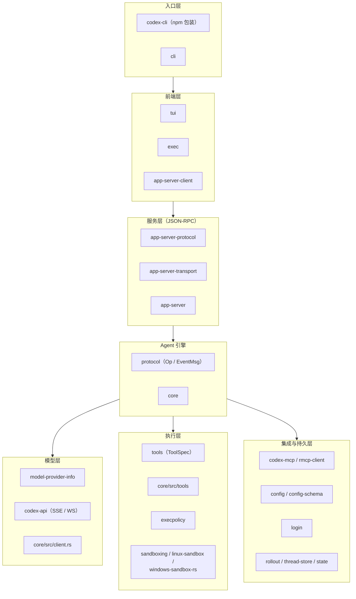

# crate 地图

## 本章导读

第 1 章建立了"前端 → app-server → codex-core → 模型 API"的主干直觉，本章把镜头
拉进 `codex-rs/` 目录本身。读完你将能够：

1. 说出这个 Cargo workspace 里一百多个 crate 的分层模型，知道每一层向谁负责；
2. 按"域"定位代码——想改沙箱行为、加配置项、动协议类型时，知道该进哪个目录；
3. 解释为什么 Codex 选择"碎成上百个小 crate"而不是"少数几个大 crate"，以及
   社区用什么军规对抗 codex-core 的膨胀。

**前置章节**：第 1 章「总览」。只需记住一件事——所有前端最终都收敛到
app-server 这一个执行契约上。

## 概念与架构

### 一个类比：逛一座城市

打开 `codex-rs/` 就像打开一座城市的地图。一百多个 crate 是一百多栋建筑，
第一次来的人会晕，但城市其实是分区规划的：

- **入口层**是机场到达大厅——无论你从哪个航班（npm 包、源码编译）抵达，
  都在这里过海关、分流；
- **前端层**是问讯处和售票窗口——TUI、`codex exec` 这些直接面对用户的
  柜台，本身不办事，只负责接待和转达；
- **服务层**是市政服务大厅——所有窗口业务（app-server 的 JSON-RPC）都在
  这里统一登记、派发，保证"在哪个窗口办的流程都一样"；
- **Agent 引擎**是市政府——真正做决策的地方，codex-core 是市长办公室，
  protocol 是红头文件的公文格式；
- **模型层**是市政府的对外热线——打电话（Responses API）向外部顾问请示；
- **执行层**是施工队和工地安全条例——工具负责干活，execpolicy 和沙箱
  负责"这活儿能不能干、在哪儿干"；
- **支撑子系统**是档案馆、户籍科、统计局——配置、认证、会话落盘、遥测，
  平时不显眼，缺了立刻瘫痪。

分区的意义不在于楼多，而在于**每栋楼只挂一个门牌**：想改认证逻辑不用逛
全城，直接去户籍科（`login/`）就行。

### 分层结构

读这张图时记住它的方向感：**依赖大体从上往下流动**。前端知道服务层，服务层
知道引擎，引擎知道执行层；反过来则不行——protocol 这样的下层 crate 绝不
依赖 core。城市可以向上加盖，地基不能回头依赖阁楼。

## 源码深挖

### workspace 的组织方式

`codex-rs/Cargo.toml` 是整个城市的规划图：`members` 列表（L2-L149）登记了
**146 个成员 crate**，`[workspace.package]`（L152-L159）统一了 edition 2024
和 Apache-2.0 许可证，`[workspace.dependencies]` 把所有内部 crate 以
`path` 依赖集中登记，成员之间引用只写名字不带版本。

两条命名纪律值得记住（AGENTS.md）：

- crate 名一律加 `codex-` 前缀——目录叫 `core/`，crate 就叫 `codex-core`
  （见 codex-rs/core/Cargo.toml#L4）。所以读 `use codex_xxx::...` 时把连字符
  换成下划线、再到同名目录找即可；
- 模块体积有硬约束：目标单文件 500 行以内，超过约 800 行就要拆新模块。

### 按域分组的 crate 索引

| 域 | crate / 目录 | 职责 | 锚点 |
| --- | --- | --- | --- |
| 入口 | `codex-cli/`、`codex-rs/cli/` | npm 按平台分发、进程内子命令分发 | codex-cli/bin/codex.js#L16；codex-rs/cli/src/main.rs#L1121 |
| 身份分流 | `arg0/`、`apply-patch/` | argv\[0\] 变身沙箱/补丁工具 | codex-rs/arg0/src/lib.rs#L60-L100 |
| 前端 | `tui/`、`exec/` | 交互界面、headless 批处理 | 两者都经 app-server-client 进城 |
| 服务 | `app-server/`、`app-server-protocol/`、`app-server-transport/`、`app-server-client/` | JSON-RPC 服务、线协议类型、传输、进程内客户端 | 见下表 |
| 协议 | `protocol/` | core 的进程内协议类型 | `Op`：codex-rs/protocol/src/protocol.rs#L596；`EventMsg`：L1360 |
| 引擎 | `core/` | Session、turn 循环、上下文、工具分发、审批、compaction | 全书第三部分的主战场 |
| 模型 | `model-provider-info/`、`codex-api/`、`responses-api-proxy/` | provider 注册表、Responses 端点（WS/SSE）、代理 | codex-rs/model-provider-info/src/lib.rs#L1-L6 |
| 工具 | `tools/`、`core/src/tools/`、`execpolicy/` | 工具 spec 与适配、注册/路由/编排、命令策略 | `ToolSpec`：codex-rs/tools/src/tool_spec.rs#L22 |
| 沙箱 | `sandboxing/`、`linux-sandbox/`、`windows-sandbox-rs/` | 跨平台命令沙箱化 | codex-rs/sandboxing/src/lib.rs#L1-L12 |
| 远程执行 | `exec-server/`、`exec-server-protocol/` | 远程进程/文件能力 | codex-rs/exec-server/src/lib.rs |
| MCP | `codex-mcp/`、`rmcp-client/` | MCP server 连接与工具聚合 | 第四部分「MCP 链路」展开 |
| 配置 | `config/`、`config-schema/` | 分层配置加载、JSON Schema 生成 | 下一章主角 |
| 认证 | `login/`、`keyring-store/` | ChatGPT OAuth / API key | `AuthManager`：codex-rs/login/src/auth/manager.rs#L2049 |
| 持久化 | `rollout/`、`thread-store/`、`state/`、`history/` | 会话落盘、线程索引、SQLite 状态库、历史类型 | 各自 lib.rs 的模块注释 |
| 观测 | `otel/`、`analytics/`、`diagnostics/` | 遥测与诊断 | codex-rs/otel/src/lib.rs |

### 几个值得驻足的"地标建筑"

**protocol 是全城最便宜的依赖。** `Op`（上行指令）和 `EventMsg`（下行事件）
定义在一个几乎不依赖别人的 crate 里（codex-rs/protocol/src/protocol.rs），
于是 app-server、tui、exec 都能只依赖这份"公文格式"而不必把引擎拖进来。
协议类型独立成 crate，是整套分层能成立的地基。

**app-server-protocol 用宏守住线协议。** 对外的 `ClientRequest` 枚举由宏生成
（codex-rs/app-server-protocol/src/protocol/common.rs#L229），`#[serde(tag =
"method", rename_all = "camelCase")]` 保证每个变体的线上形态是
`<resource>/<method>`；v2 的 payload 类型按域拆在
`app-server-protocol/src/protocol/v2/` 目录下。改协议先改这里，Rust 与
TypeScript 两侧类型同源生成。

**进程内不等于免协议。** TUI/exec 与 app-server 同进程时走
codex-rs/app-server/src/in_process.rs（模块注释 L1-L39）：bounded channel 替代
socket，但响应仍套同一个 JSON-RPC 信封——"transport-local but not
protocol-free"。城市里的内部班车和对外公交走的是同一张路网图。

**工具层正在"剥洋葱"式迁出 core。** codex-rs/tools/README.md 说得很坦白：
`ToolSpec`、schema 清洗、MCP 适配等宿主侧机器正从 `core/src/tools` 里一块块
剥到 `codex-tools`，但"compatibility-sensitive orchestration"暂留 core，且
明确禁止把这个新 crate 变成"杂物抽屉"（grab-bag）。

## 技术难点与设计取舍

**为什么不合并成少数几个大 crate？** 表面上看，146 个 crate 是管理负担；
实际上小 crate 买到三样东西：编译并行与增量构建的粒度、**强制的边界**（私有
模块 + 显式导出，跨 crate 无法伸手乱摸）、以及测试的隔离。代价也真实存在：
依赖图要维护，跨层共享的类型必须下沉到 protocol 这类"地基 crate"，新人上手
成本高——本章存在的意义就是摊薄这第三项成本。

**codex-core 的膨胀与对抗。** core 如今是 src 下 493 个文件、超过 22 万行的
庞然大物——因为它最大，新代码"顺手"塞进去最容易，于是它越来越大，这是典型
的引力恶性循环。AGENTS.md 用一整节（"The codex-core crate"）下了军规：
**resist adding code to codex-core**——新功能优先考虑现有小 crate 或直接开
新 crate，review 时被鼓励就此打回 PR。tools crate 的渐进抽取就是这条军规的
落地样本：不追求一次搬空，而是每次剥一块可审查的增量。

**协议类型放哪一层。** 把 `Op`/`EventMsg` 放进独立 protocol crate 而非 core
内部，等于让"公文格式"不归市长办公室管：任何想跟引擎对话的人（app-server、
测试、工具）都只依赖格式，不依赖决策。取舍的代价是 core 内部演进时经常要
同时改两个 crate——Codex 用"类型先行"换"边界清晰"。

## 对照通用 agent 范式

把视野放宽，agent 系统的模块化边界有四种经典切法，Codex 全占了：

- **引擎与协议分离**：如同编译器把 IR 从前端后端中抽出来，Codex 把
  Op/EventMsg 抽成 protocol crate，让引擎可以被任意前端复用；
- **协议与传输分离**：和 MCP、LSP 的设计如出一辙——同一份 JSON-RPC 语义，
  跑在 stdio、WebSocket、进程内 channel 三种传输上，语义零分叉；
- **策略与执行分离**：execpolicy 决定"能不能跑"，沙箱决定"在哪儿跑"，工具
  负责"怎么跑"——这对应策略引擎（如 OPA）与执行器分离的通用模式；
- **宿主与工具分离**：LangChain 一类框架把工具定义混在 agent 库里，Codex 则
  在把工具 spec 与适配层剥离成独立 crate，让工具生态可以脱离引擎演进。

如果你在设计自己的 agent：先画出这四条边界，再决定 crate（或模块、服务）怎么
切。Codex 的地图给出的答案是——**边界先于代码存在**。

## 小结与下一章预告

- `codex-rs/` 是一个 146 成员的 Cargo workspace，crate 名带 `codex-` 前缀，
  依赖大体沿"入口 → 前端 → 服务 → 引擎 → 模型/执行/支撑"单向流动；
- protocol 是全城最便宜的依赖：Op/EventMsg 独立成 crate，是所有分层的地基；
- 同进程通信也走同一 JSON-RPC 信封，"transport-local but not protocol-free"；
- codex-core 已膨胀到 22 万行级，社区用 AGENTS.md 军规"resist adding code
  to codex-core"和 tools crate 式的渐进抽取与之对抗；
- 模块化四边界：引擎/协议、协议/传输、策略/执行、宿主/工具。

下一章「配置与认证」：先跑起来——`config.toml` 的分层加载顺序、
`codex login` 背后的 OAuth 流程，以及 `config/`、`login/`、
`keyring-store/` 这几个 crate 如何协作。
