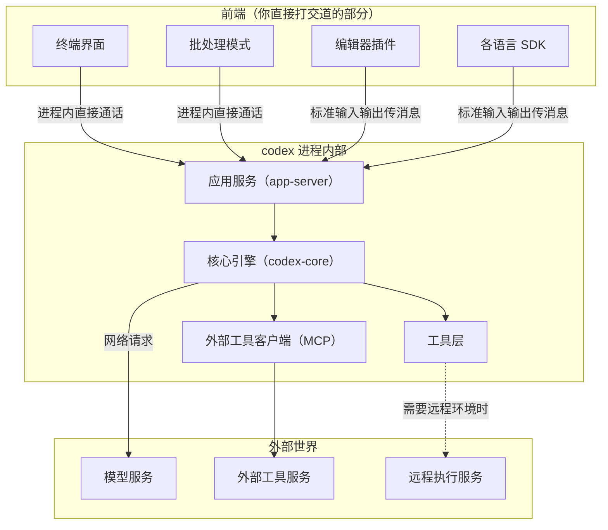

# 总览

## 本章导读

从一个最朴素的问题开始：**你在终端里敲下 codex 并按下回车，接下来发生了什么？**

你大概以为这只是一个普通的命令行工具。但实际上，同一个程序文件，既能变出
一个全屏的交互界面，也能变成无人值守的批处理器，还能变成一个供编辑器插件
调用的后台服务。一个文件，多张面孔——这是理解 Codex 整体设计的第一把钥匙。

读完本章，你将能够：

1. 说出 Codex 的发行形态：一个程序如何分饰多种角色；
2. 画出"前端 → 应用服务 → 引擎 → 模型"的主干架构；
3. 解释为什么所有前端最终都走同一条通道、遵守同一份契约。

**前置章节**：无，从这里开始就好。

## 概念与架构

### Codex 是什么

Codex 是 OpenAI 的本地编码助手：它运行在你的电脑上，能读你的代码、执行
命令、修改文件，并通过网络与模型对话来决定下一步做什么。它用 Rust 语言
写成，以"一个可执行文件"的形式发行。

可以把它想象成一个"外包工程师团队"：

- **前端**是前台接待——负责接待你、展示进度。它有好几种形态：终端界面
  （TUI，在终端里用文字绘制的交互界面）、编辑器插件、供程序调用的软件开发
  包（SDK）；
- **应用服务层**是项目经理——所有需求都经它登记、排队、派发；
- **核心引擎**是大脑——真正的智能体（能自己规划步骤、调用工具完成任务的
  程序）所在，思考下一步做什么；
- **工具层**是双手——执行命令、改文件、搜代码；
- **沙箱**是保险柜——双手干活时必须戴上手套，危险操作要审批；
- **外部工具客户端**是外援联络员——大脑需要本机以外的工具时，由它去联系
  外援；
- **远程执行服务**是远程工地——活不在本机干时，送到那里去；
- **模型服务**是外脑——大脑思考时要打电话咨询的顾问，住在远端。

### 整体架构

下面这张图是全书的"地图"：谁和谁说话、通过什么方式说话，都在上面。后面
每一章都是把这张图的一角放大。



记住这张图，只需记住三件事（保险柜没有单独画出——它长在工具层内部，
第 12 章会展开）：

三个要点决定了整个系统的气质：

1. **所有前端收敛到应用服务层**。无论你在终端界面里敲键盘，还是编辑器插件
   在后台发消息，面对的语义完全一致。消息格式统一为一种用 JSON 文本描述
   "请调用某个功能"的远程调用约定（JSON-RPC）——就连同处一个进程的前端也
   不例外。
2. **核心引擎只有一个**。它被应用服务层托管，不直接暴露给任何前端。你想跟
   大脑说话，必须先经过项目经理。
3. **模型协议只剩一种**。Codex 与模型服务对话只用 Responses API（OpenAI 的
   模型交互协议），旧协议已被彻底移除。这个决策的技术含义，我们会在第 8 章
   「采样与流式处理」展开。

## 出场角色

进入源码之前，先认识本章要出场的角色。下表的"所在文件"都是仓库内的相对
路径，现在记不住没关系，读到正文时翻回来对照即可。

| 中文名 | 英文名 | 职责（一句话） | 所在文件 |
| ------ | ------ | -------------- | -------- |
| 启动包装器 | codex-cli | 按你的操作系统和芯片找到正确的程序文件并启动它 | codex-cli/bin/codex.js |
| 命令行入口 | cli | 程序的起点，决定这次启动扮演哪个角色 | codex-rs/cli/src/main.rs |
| 名字分派器 | arg0 | 根据"程序被以什么名字调用"分派到特殊角色 | codex-rs/arg0/src/lib.rs |
| 应用服务 | app-server | 所有前端的统一入口，托管核心引擎 | codex-rs/app-server |
| 消息处理器 | MessageProcessor | 应用服务内部真正处理每条请求的调度者（第 16 章展开） | codex-rs/app-server |
| 进程内传输模块 | in_process | 用进程内消息通道替代网络通信、但保持同一协议 | codex-rs/app-server/src/in_process.rs |
| 进程内客户端 | InProcessAppServerClient | 给同进程的前端提供统一的请求与事件接口 | codex-rs/app-server-client/src/lib.rs |
| 核心引擎 | codex-core | 唯一的智能体引擎（第 7 章展开） | codex-rs/core |
| 模型协议清单 | model-provider-info | 定义 Codex 支持哪些模型通信协议 | codex-rs/model-provider-info/src/lib.rs |

## 源码深挖

### 单二进制如何分饰多角

这一小节回答导读里的问题：同一个程序文件，怎么知道自己这次该当终端界面、
还是该当后台服务？答案是一条"先看名字、再看参数"的两层分派链。读完你就
能看懂 Codex 的启动全过程。

安装 Codex 时，你拿到的其实是一个用 Node.js 写的启动包装器。它按你的
操作系统和芯片架构，在平台映射表（codex-cli/bin/codex.js#L16）里查到对应的
安装包，找到里面的 Rust 程序文件并启动它，命令行参数原样透传
（codex-cli/bin/codex.js#L241）。

Rust 侧的真正入口在 codex-rs/cli/src/main.rs：

```rust
fn main() -> anyhow::Result<()> {
    codex_build_info::initialize!();
    let remote_control_disabled = codex_app_server::take_remote_control_disabled_env();
    arg0_dispatch_or_else(move |arg0_paths: Arg0DispatchPaths| async move {
        cli_main(arg0_paths, remote_control_disabled).await?;
        Ok(())
    })
}
```

（codex-rs/cli/src/main.rs#L1121-L1128）

这段代码里前两行是初始化与环境检查，与主线无关；真正重要的是第三行开始的
分派。分派分两层：

- **名字分派器**（codex-rs/arg0/src/lib.rs#L60-L99）：先看自己被以什么
  "名字"调用。每个程序启动时都能看到自己的调用名（即 argv[0]）。如果这个
  名字是沙箱助手 `codex-linux-sandbox`，就直接进入沙箱逻辑再也不返回；如果
  是补丁工具 `apply_patch`（甚至兼容拼错的 `applypatch`），就去打补丁。同一
  个程序文件靠改个名字就能变成另一个工具——这是命令行工具界的经典玩法（最
  著名的例子是 busybox：一个程序装下几十个小工具，靠名字区分角色）。
- **子命令分派层**（codex-rs/cli/src/main.rs#L1176）：普通路径下用命令行
  解析库 clap 解析子命令，一个大匹配语句把批处理、应用服务、远程执行服务
  等分发到各自的代码；不带子命令时进入终端界面。

### 进程内的"伪网络连接"

这一小节看一个反直觉的设计：终端界面和应用服务明明在同一个进程里，本来
可以直接函数调用，Codex 却偏要让它们走"网络协议"。读完你会理解这份"契约
洁癖"换来了什么。

进程内传输模块的模块注释（codex-rs/app-server/src/in_process.rs#L1-L38）
讲得很清楚：应用服务内部真正的调度者是消息处理器，而进程内传输模块把它
原样跑起来，只是把网络套接字（程序间通信的端点）换成了有界消息通道；消息
内容仍然走与跨进程完全相同的 JSON-RPC 格式——传输可以本地化，协议绝不特
殊化。这就保证了"同一份执行契约"：不会为同进程场景发明第二套语义。

上层还有进程内客户端（codex-rs/app-server-client/src/lib.rs#L300），给
终端界面和批处理模式提供统一的异步请求/响应加事件流接口，含连接建立时的
初始化握手，以及保证不会卡死的关停流程。

### Responses API 独木桥

这一小节验证概念段的第三个要点：模型协议真的只剩一种了吗？证据链很短，
一眼就能看完。

模型协议清单里，协议枚举 `WireApi`（codex-rs/model-provider-info/src/lib.rs#L66-L72）
如今只剩 Responses 一个变体。配置解析器（codex-rs/model-provider-info/src/lib.rs#L83-L95）
遇到旧的 `wire_api = "chat"` 配置时不再静默兼容，而是直接报错并给出迁移
指引（codex-rs/model-provider-info/src/lib.rs#L61）。这是一种"攻击性"的
简洁：与其维护两条协议路径，不如让旧配置大声失败。

## 技术难点与设计取舍

**一个二进制 vs 多个二进制。** 单二进制的收益是分发极简：包管理器按平台挑
一个文件即可，子工具靠调用名复用同一文件，版本永远一致。代价是进程边界
变模糊：启动链上任何一个名字判断错了，程序就进了错误的角色。Codex 用
名字分派层加子命令分派层两级分派，把这件事显性化。

**所有前端收敛到应用服务。** 这让协议语义只有一份：终端界面能做的事，编辑器
插件也能做，行为必然一致。代价是终端界面这种本可直接调用引擎的场景也要绕
一圈请求/响应，连进程内通信都套上 JSON-RPC 格式。Codex 选择契约统一性优先
于调用路径最短——这是"多前端产品"和"单一命令行工具"的分水岭。

**协议收敛而非兼容。** 直接移除旧协议支持，短期看是破坏性的；长期看，测试
矩阵、流式处理、错误处理的工作量全部减半。智能体产品的迭代速度，往往取决
于它敢于砍掉多少历史包袱。

## 对照通用 agent 范式

在智能体系统的谱系上，一端是**库内嵌**形态（如 LangChain：智能体逻辑是你
进程里的一个库），另一端是**服务化**形态（智能体逻辑住在独立服务里，前端
是瘦客户端）。Codex 站在一个有趣的中间点：逻辑上是单二进制、可纯本地运行；
架构上却严格服务化——前端与引擎之间隔着明确的 JSON-RPC 契约，连"同进程"
都只是一种传输优化。

这种"服务化内核 + 嵌入式外壳"的混合，让它同时获得两种形态的好处：终端用户
无感于架构，插件与 SDK 开发者则得到一个稳定、可编程的智能体服务。设计自己
的智能体时，这是一个值得借鉴的起点：**先定义服务契约，再决定部署形态**。

## 小结与下一章预告

- Codex 是一个 Rust 单二进制（外裹一层 Node.js 写的启动包装器），靠调用名和
  子命令两级分派，分饰终端界面、批处理、应用服务、沙箱等角色；
- 所有前端收敛到应用服务，进程内通信也走同一份 JSON-RPC 契约；
- 核心引擎是唯一引擎，模型协议只剩 Responses API；
- 设计主线：契约统一性 > 调用路径最短，砍历史包袱 > 向后兼容。

下一章「代码包（crate）地图」：打开代码目录，看懂近百个代码包的分层与
分组，知道每类代码该去哪里找。
