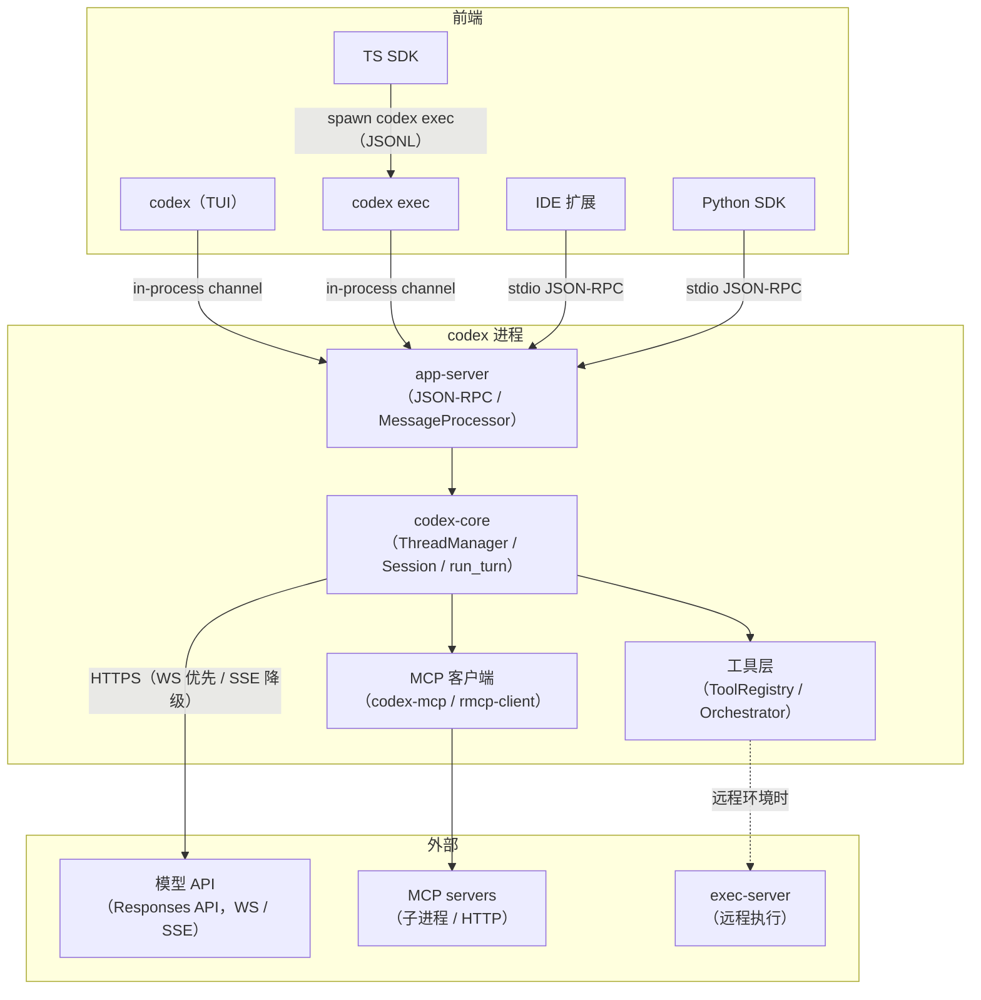

# 总览

## 本章导读

这是全书的第一章，目标是建立全局直觉。读完本章，你将能够：

1. 说出 Codex 的发行形态——一个 Rust 单二进制如何分饰 TUI、headless 执行器、
   JSON-RPC 服务等多种角色；
2. 画出"前端 → app-server → codex-core → 模型 API"的主干架构；
3. 解释为什么所有前端最终都收敛到同一个执行契约上。

**前置章节**：无，从这里开始就好。

## 概念与架构

### Codex 是什么

Codex 是 OpenAI 的本地编码 agent：它运行在你的电脑上，能读你的代码、执行命令、
修改文件，并通过模型 API 与 LLM 对话来决定下一步动作。

可以把它想象成一个"外包工程师团队"：

- **前端**（TUI、IDE 扩展、SDK）是前台——负责接待你、展示进度；
- **app-server** 是项目经理——所有需求都经它登记、排队、派发；
- **codex-core** 是大脑——真正的 agent 引擎，思考下一步做什么；
- **工具层**是双手——执行 shell、改文件、搜代码；
- **沙箱**是保险柜——双手干活时必须戴上手套，危险操作要审批；
- **模型 API** 是外脑——大脑思考时要打电话咨询的顾问。

### 整体架构



三个要点决定了整个系统的气质：

1. **所有前端收敛到 app-server 层**。无论你在 TUI 里敲键盘，还是 IDE 扩展通过
   stdio 发 JSON-RPC，面对的语义完全一致——TUI 和 `codex exec` 甚至不跨进程，
   直接走进程内 channel。
2. **codex-core 是唯一的 agent 引擎**。它被 app-server 的 `MessageProcessor`
   托管，不直接暴露给任何前端。
3. **模型协议只剩 Responses API**。旧的 Chat Completions 协议已被移除——这个
   决策的技术含义我们会在「采样与流式处理」一章展开。

## 源码深挖

### 单二进制如何分饰多角

安装 Codex 时你拿到的其实是一个 npm 包装器：`codex-cli/bin/codex.js` 按
`process.platform/arch` 在 `PLATFORM_PACKAGE_BY_TARGET`
（codex-cli/bin/codex.js#L16）里查到平台对应的 npm 包（如
`@openai/codex-darwin-arm64`），找到里面的 Rust 二进制并 spawn，参数原样透传
（codex-cli/bin/codex.js#L241）。

Rust 侧的入口是 `codex-rs/cli/src/main.rs`：

```rust
fn main() -> anyhow::Result<()> {
    codex_build_info::initialize!();
    let remote_control_disabled = codex_app_server::take_remote_control_disabled_env();
    arg0_dispatch_or_else(move |arg0_paths: Arg0DispatchPaths| async move {
        cli_main(arg0_paths, remote_control_disabled).await?;
        Ok(())
    })
}
```

（codex-rs/cli/src/main.rs#L1121-L1128）

分派分两层：

- **arg0 层**（codex-rs/arg0/src/lib.rs#L60-L96）：先看自己被以什么"名字"调用。
  如果 argv\[0\] 是 `codex-linux-sandbox`，就直接进入沙箱逻辑再也不返回；
  如果是 `apply_patch`（甚至兼容拼错的 `applypatch`），就去打补丁。同一二进制
  靠软链接改名就能变成另一个工具——这是 busybox 式的经典玩法。
- **clap 子命令层**（codex-rs/cli/src/main.rs#L1176）：普通路径下用 clap 解析
  子命令，一个大 `match` 把 `exec`、`app-server`、`exec-server`、`mcp` 等分发到
  各自的 crate；不带子命令时进入 TUI。

### 进程内的"伪 socket"

TUI 和 `codex exec` 与 app-server 同处一个进程，但 Codex 没有因此给它们开后门。
`codex-rs/app-server/src/in_process.rs` 的模块注释（L1-L38）讲得很清楚：进程内
传输用 **bounded tokio channel** 替代 socket，但响应仍然走与 stdio/WebSocket
完全相同的 JSON-RPC 信封——"transport-local but not protocol-free"，保证
「同一执行契约」，不为同进程场景发明第二套语义。

上层还有 `codex-rs/app-server-client/` 的 `InProcessAppServerClient`
（codex-rs/app-server-client/src/lib.rs#L300），给 TUI/exec 提供统一的异步
request/response + 事件流 API，含 initialize 握手与有界关停。

### Responses API 独木桥

模型协议收敛的证据在 `codex-rs/model-provider-info/src/lib.rs`：`WireApi` 枚举
（L66-L72）如今只剩 `Responses` 一个变体；反序列化器（L83-L95）遇到旧的
`wire_api = "chat"` 配置时不再静默兼容，而是直接报错并给出迁移指引
（`CHAT_WIRE_API_REMOVED_ERROR`，L61）。这是一种"攻击性"的简洁：与其维护两条
协议路径，不如让旧配置大声失败。

## 技术难点与设计取舍

**一个二进制 vs 多个二进制。** 单二进制的收益是分发极简——npm 按平台挑一个文件
即可，子工具（沙箱、apply_patch）靠 argv\[0\] 复用同一文件，永远版本一致。代价是
进程边界变模糊：启动链上任何一个名字判断错了，你就进了错误的角色。Codex 用
arg0 层 + clap 层两级分派把这件事显性化。

**所有前端收敛到 app-server。** 这让协议语义只有一份：TUI 能做的事，IDE 扩展也
能做，行为必然一致。代价是 TUI 这种本可直接调 core 的场景也要绕一圈
request/response，连进程内通信都套上 JSON-RPC 信封。Codex 选择了契约统一性
优先于调用路径最短——这是"多前端产品"和"单一 CLI 工具"的分水岭。

**协议收敛而非兼容。** 直接移除 Chat Completions 支持，短期看是破坏性的，长期看
把测试矩阵、流式处理、错误处理全部减半。agent 产品的迭代速度往往取决于它敢于
砍掉多少历史包袱。

## 对照通用 agent 范式

在 agent 系统的谱系上，一端是**库内嵌**形态（如 LangChain：agent 逻辑是你进程里
的一个库），另一端是**服务化**形态（agent 逻辑住在独立服务里，前端是瘦客户端）。
Codex 站在一个有趣的中间点：逻辑上单二进制、可纯本地跑；架构上却严格服务化——
前端与引擎之间隔着明确的 JSON-RPC 契约，连"同进程"都只是一种传输优化。

这种"服务化内核 + 嵌入式外壳"的混合，让它同时获得两种形态的好处：TUI 用户无感
于架构，IDE/SDK 开发者则得到一个稳定、可编程的 agent 服务。设计自己的 agent
时，这是一个值得借鉴的起点：**先定义服务契约，再决定部署形态**。

## 小结与下一章预告

- Codex 是一个 Rust 单二进制（外裹 npm 包装器），靠 argv\[0\] 和 clap 子命令
  分饰 TUI、exec、app-server、沙箱等角色；
- 所有前端收敛到 app-server，进程内通信也走同一 JSON-RPC 契约；
- codex-core 是唯一引擎，模型协议只剩 Responses API；
- 设计主线：契约统一性 > 调用路径最短，砍历史包袱 > 向后兼容。

下一章「crate 地图」：打开 `codex-rs/` 目录，看懂近百个 crate 的分层与分组，
知道每类代码该去哪里找。
