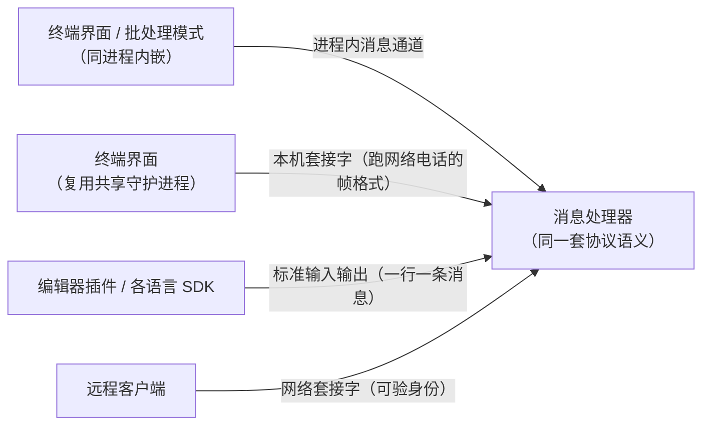
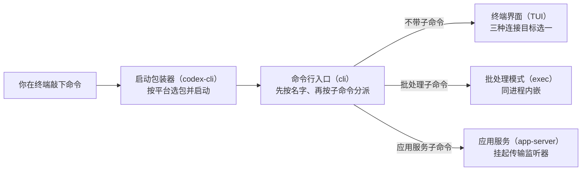

# 进程与传输

## 本章导读

想象这样一个场景：你在编辑器插件里向 Codex 提问，旁边的终端窗口里也开着
一个 Codex，而你的同事还想从另一台机器上连过来。它们都要和同一个"大脑"
对话——话到底是怎么送到的？几个窗口会不会各起一套大脑、互相不知道对方
在干什么？如果大脑挤爆了，先丢哪句话、保哪句话？

本章就来回答这个"送话"问题。读完你将能够：

1. 说出从你按下回车到具体角色（终端界面、批处理、应用服务）启动通信通道
   的完整链路；
2. 画出四条传话通道的传输矩阵，知道每条通道住在哪份代码里、适合什么场景；
3. 解释"信箱满了怎么办"的分级丢弃设计，以及终端界面如何在"自己带一个
   大脑"和"复用别人的大脑"之间做选择与降级。

**前置章节**：第 1 章「总览」（建立单程序分饰多角的全局图）、第 2 章
「代码包（crate）地图」（帮你定位本章出现的代码包）、第 3 章「配置与认证」
（解释命令行覆盖参数从何而来——它正是能否复用共享服务的裁决依据）。

## 概念与架构

### 一个类比：怎么把话传给项目经理

延续第 1 章的"外包工程师团队"类比：前端要给应用服务（app-server）这位
项目经理传话，Codex 提供了四种通讯方式——

- **进程内消息通道**：同一间办公室里递纸条。终端界面（TUI，在终端里用文字
  绘制的交互界面）和应用服务住在同一个程序进程里，理论上可以直接喊一嗓子，
  但 Codex 仍要求把话写在标准工单上，只是省掉了邮寄环节。
- **标准输入输出管道**：专线电话。编辑器插件把应用服务拉成自己的子进程，
  顺着这对管道一行一条消息地通话。一对一、与子进程同生死，简单可靠。
- **本机套接字**：楼里的内线分机。一个长驻的守护进程（daemon，默默在后台
  运行、随叫随到的服务程序）在本机固定的地址上值守，多个终端窗口都能拨
  进来，共享同一位项目经理。
- **网络套接字**：长途电话。唯一能跨机器的通道，因此要拨号（绑定地址）、
  要验明身份（令牌），代价也最高。

关键设计只有一句话：**无论走哪条线，电话那头说的是同一种语言**。四条线
上传的都是同一套用 JSON 文本描述"请调用某个功能"的远程调用约定
（JSON-RPC）。传输只决定"怎么送到"，不改变"说什么"——协议语义永远只有
一份。

### 传输全景

下面这张图画出四条通道如何汇入同一个大脑：看什么前端、走哪条线、最终都
抵达谁。

看完图请留意第二条线：本机套接字上传的竟然是"长途电话"的帧格式。守护
进程与远程客户端因此能共用同一套收发逻辑——这是源码深挖一节会展开的反
直觉设计。

还有两个概念提前打个底，源码里会反复出现：

- **信箱满了怎么办（背压）**：每条通道尽头都是容量有限的信箱。塞满时不能
  一刀切——询问你"是否批准这个操作"的话绝不能丢，而"进度更新"丢一条无伤
  大雅。Codex 按"这句话丢了会不会让双方状态失步"分三档处理。
- **共享还是独享**：第二个终端窗口可以选择复用已经在跑的守护进程（秒开、
  看到同一份会话列表），也可以自己内嵌一个大脑。复用有门槛：带着新配置
  启动时不能复用，因为已经在跑的那个大脑无法补票上车。

## 出场角色

进入源码之前，先认识本章要出场的角色。下表的"所在文件"都是仓库内的相对
路径，现在记不住没关系，读到正文时翻回来对照即可。

| 中文名 | 英文名 | 职责（一句话） | 所在文件 |
| ------ | ------ | -------------- | -------- |
| 启动包装器 | codex-cli | 按操作系统与芯片挑中正确的程序文件并启动它 | codex-cli/bin/codex.js |
| 命令行入口 | cli | Rust 侧程序起点，把子命令分发到各角色 | codex-rs/cli/src/main.rs |
| 名字分派器 | arg0 | 按调用名分派特殊角色，并搭建受控的异步运行时 | codex-rs/arg0/src/lib.rs |
| 应用服务 | app-server | 所有前端的统一服务端，托管消息处理器 | codex-rs/app-server |
| 应用服务入口函数 | run_main / run_main_with_transport_options | 按传输参数挂起监听器的启动函数 | codex-rs/app-server/src/lib.rs |
| 消息处理器 | MessageProcessor | 真正处理每条协议请求的调度者（第 16 章展开） | codex-rs/app-server |
| 进程内传输模块 | in_process | 用消息通道替代套接字、但保留同一协议信封 | codex-rs/app-server/src/in_process.rs |
| 进程内启动函数 | start（in_process 模块内） | 启动进程内运行时并完成初始化握手 | codex-rs/app-server/src/in_process.rs |
| 客户端投递函数 | try_send_client_message | 把客户端消息非阻塞地投进运行时队列 | codex-rs/app-server/src/in_process.rs |
| 必达通知判定函数 | server_notification_requires_delivery | 判定哪些服务器通知丢了会导致状态失步 | codex-rs/app-server/src/in_process.rs |
| 进程内事件枚举 | InProcessServerEvent | 进程内运行时发给客户端的事件（含掉队标记 Lagged） | codex-rs/app-server/src/in_process.rs |
| 进程内客户端 | InProcessAppServerClient | 给同进程前端提供统一的请求与事件接口 | codex-rs/app-server-client/src/lib.rs |
| 远程端点枚举 | RemoteAppServerEndpoint | 描述远程连接目标：网络套接字或本机套接字 | codex-rs/app-server-client/src/remote.rs |
| 远程客户端 | RemoteAppServerClient | 连接守护进程或远程端点的客户端 | codex-rs/app-server-client/src/remote.rs |
| 服务传输层 | app-server-transport | 四种传输的实现与事件归一化 | codex-rs/app-server-transport |
| 传输枚举 | AppServerTransport | 描述四种传输选择的枚举 | codex-rs/app-server-transport/src/transport/mod.rs |
| 传输事件 | TransportEvent | 各传输上报给主循环的统一事件 | codex-rs/app-server-transport/src/transport/mod.rs |
| 连接编号 | ConnectionId | 每条连接的递增编号 | codex-rs/app-server-transport/src/transport/mod.rs |
| 连接来源 | ConnectionOrigin | 记录连接来自哪种传输，供状态与遥测区分 | codex-rs/app-server-transport/src/transport/mod.rs |
| 标准输入输出传输 | stdio 模块 | 一行一条消息的管道传输 | codex-rs/app-server-transport/src/transport/stdio.rs |
| 控制套接字传输 | unix_socket 模块 | 本机共享守护进程使用的套接字传输 | codex-rs/app-server-transport/src/transport/unix_socket.rs |
| 网络套接字传输 | websocket 模块 | 唯一能跨机器的传输 | codex-rs/app-server-transport/src/transport/websocket.rs |
| 终端界面 | TUI | 默认前端，负责选择连接目标并在失败时降级 | codex-rs/tui |
| 连接目标 | AppServerTarget | 终端界面三种连接目标的枚举 | codex-rs/tui/src/lib.rs |
| 连接目标选择函数 | app_server_target_for_launch | 决定本次启动连内嵌、守护进程还是远程端点 | codex-rs/tui/src/lib.rs |
| 守护进程探测函数 | maybe_probe_default_daemon_socket | 探测本机默认守护进程套接字是否可用 | codex-rs/tui/src/lib.rs |
| 复用判定函数 | can_reuse_implicit_local_daemon | 判定本次启动是否有资格复用共享守护进程 | codex-rs/tui/src/lib.rs |
| 守护进程模块 | app-server-daemon | 共享守护进程的生命周期管理（启动、停止等） | codex-rs/app-server-daemon |

## 源码深挖

### 启动链：从 shell 到监听器

这一小节回答：从你按下回车，到某种传输监听器挂起来待命，中间经过哪几站。
出场的是启动包装器、命令行入口和名字分派器这三位"前台接待"。读完你就能
把第 1 章的分派故事接到本章的传输故事上。

第 1 章讲过：启动包装器按平台查表（codex-cli/bin/codex.js#L16）挑中对应
安装包里的 Rust 程序并启动它，参数原样透传
（codex-cli/bin/codex.js#L241）；Rust 侧入口
（codex-rs/cli/src/main.rs#L1121-L1128）先经名字分派器按调用名改名分派，
再由命令行解析库 clap 的大匹配语句（codex-rs/cli/src/main.rs#L1176）分发
子命令。本章补三个与传输直接相关的细节。

下面这张图概括这条链：左边是你敲的命令，右边是分叉出的三种结局。

看完图记住三个细节：

1. **名字分派器不只是改名**。它在异步运行时建立之前完成环境变量文件加载
   与命令别名准备（codex-rs/arg0/src/lib.rs#L157-L173），然后把异步入口
   放到一个独立栈大小、名叫 `codex-main` 的线程上运行
   （codex-rs/arg0/src/lib.rs#L230-L236）——后续所有传输任务都长在这个
   受控运行时里。
2. **应用服务子命令拆出传输参数**。命令行解析分支把监听地址、标准输入
   输出开关、远程控制、鉴权方式等字段解构出来
   （codex-rs/cli/src/main.rs#L1314-L1324），随后进入应用服务入口函数
   （codex-rs/app-server/src/lib.rs#L429）与带传输参数的变体
   （codex-rs/app-server/src/lib.rs#L476）。
3. **传输在启动末尾四选一挂起**：标准输入输出
   （codex-rs/app-server/src/lib.rs#L750）、本机控制套接字
   （codex-rs/app-server/src/lib.rs#L758）、网络套接字
   （codex-rs/app-server/src/lib.rs#L775）、或者干脆不挂任何监听器
   （codex-rs/app-server/src/lib.rs#L784）。

### 传输矩阵的代码落点

上一节讲了监听器在哪挂起，这一小节把四条传输逐条对号入座：每条的服务端
入口在哪份文件、有什么只在它身上成立的怪癖。读完你就能回答"某条消息此刻
正走在哪条线上"。

| 前端 | 传输 | 服务端入口 | 备注 |
| ---- | ---- | ---------- | ---- |
| 终端界面 / 批处理（默认） | 进程内有界消息通道 | codex-rs/app-server/src/in_process.rs#L371 | 不经传输枚举，直接托管消息处理器 |
| 终端界面（复用共享守护进程） | 本机套接字 + 网络帧格式 | codex-rs/app-server-transport/src/transport/unix_socket.rs#L36 | 客户端侧走远程客户端 |
| 编辑器插件 / 各语言 SDK | 标准输入输出（行分隔消息） | codex-rs/app-server-transport/src/transport/stdio.rs#L24 | 监听地址的默认值就是它 |
| 远程客户端 | 网络套接字 | codex-rs/app-server-transport/src/transport/websocket.rs#L129 | 非本机地址且无鉴权会被拒绝启动 |

几个贯穿全表的枢纽：

- 传输枚举的四个变体定义在
  codex-rs/app-server-transport/src/transport/mod.rs#L75-L81；监听地址的
  解析在解析函数 `from_listen_url`
  （codex-rs/app-server-transport/src/transport/mod.rs#L113），默认值是
  标准输入输出（codex-rs/app-server-transport/src/transport/mod.rs#L111），
  只写协议名不带路径的地址会被解析成配置目录下的控制套接字路径
  （codex-rs/app-server-transport/src/transport/mod.rs#L118-L130）。
- 所有套接字传输把连接事件归一化为传输事件（连接打开、连接关闭、收到
  消息，另有守护进程关停信号），统一定义在
  codex-rs/app-server-transport/src/transport/mod.rs#L172-L189；每条连接
  取一个递增的连接编号
  （codex-rs/app-server-transport/src/transport/mod.rs#L199-L203），连接
  来源（codex-rs/app-server-transport/src/transport/mod.rs#L191-L197）只
  记录来自哪种传输，供会话状态与遥测区分。
- 各方向的消息通道容量统一为 128 条
  （codex-rs/app-server-transport/src/transport/mod.rs#L22-L25）。
- 标准输入输出是最简实现：一个任务逐行读输入
  （codex-rs/app-server-transport/src/transport/stdio.rs#L43-L80），一个
  任务逐行写输出
  （codex-rs/app-server-transport/src/transport/stdio.rs#L82-L98），一行
  就是一条消息。
- 本机套接字的反直觉之处：接受连接之后立刻做"长途电话"协议升级
  （codex-rs/app-server-transport/src/transport/unix_socket.rs#L107-L134），
  也就是"本机套接字上跑网络帧"，于是与远程客户端共用同一套连接处理函数；
  同一个监听器还夹带一个守护进程关停端点
  （codex-rs/app-server-transport/src/transport/unix_socket.rs#L110-L131）。
- 网络套接字是唯一能跨机器的传输，因此独享一道安全闸：监听非本机回环
  地址且未配鉴权时直接拒绝启动
  （codex-rs/app-server-transport/src/transport/websocket.rs#L135-L142）。

### 进程内传输：同处一室也要守规矩

这一小节看四条线里最特别的一条：进程内消息通道。出场的是进程内传输模块
与进程内客户端。读完你会明白"传输可以本地化、协议绝不特殊化"这句原则如何
落地，以及"信箱满了怎么办"的三级答案。

进程内传输模块的模块注释把原则说得很直白：**传输本地化，但协议不免除**
（transport-local but not protocol-free，
codex-rs/app-server/src/in_process.rs#L18-L33）——消息通道替代了套接字，
但响应仍走与标准输入输出、网络套接字完全相同的协议信封。进程内启动函数
在返回句柄之前就替你完成了初始化握手
（codex-rs/app-server/src/in_process.rs#L371-L400）；上层的进程内客户端
（codex-rs/app-server-client/src/lib.rs#L299）再包一层后台任务，给终端
界面和批处理模式提供统一的异步请求、响应加事件流接口。

它的背压设计是本章的精华，共分三级：

1. **客户端到运行时**：客户端投递函数
   （codex-rs/app-server/src/in_process.rs#L260-L272）用非阻塞方式投递，
   队列满返回"暂时阻塞"错误，通道关闭返回"管道破裂"错误——调用方立即
   知情，而不是被隐式卡住。
2. **运行时到消息处理器**：请求转发同样非阻塞，满了就向调用方回一个
   "过载"协议错误（codex-rs/app-server/src/in_process.rs#L604-L617）；
   普通客户端通知满了则直接丢弃并记下警告日志
   （codex-rs/app-server/src/in_process.rs#L629-L637）。
3. **消息处理器到客户端（事件扇出）**：按消息语义分档处理。服务端发起的
   请求（比如向你询问是否批准某操作）**绝不静默丢弃**——塞不进事件队列
   时回送过载或内部错误给消息处理器，保证审批流不会无限挂起
   （codex-rs/app-server/src/in_process.rs#L689-L719）。服务器通知再分两
   档：必达通知判定函数维护一份白名单
   （codex-rs/app-server/src/in_process.rs#L109-L124），上榜的是"轮（turn）
   完成""线程（thread）队列变化"等丢了会导致双方状态机失步的事件，它们用
   阻塞方式投递；其余通知非阻塞投递、失败即弃
   （codex-rs/app-server/src/in_process.rs#L722-L749）。消费端彻底掉队时
   还会收到一个掉队标记（codex-rs/app-server/src/in_process.rs#L173-L180），
   如实告知"有事件被跳过了"。

关停也是有界的：关停等待上限 5 秒、关停确认上限 35 秒
（codex-rs/app-server/src/in_process.rs#L102-L105），超时直接终止后台
任务，绝不无限等待。

### 守护进程复用与降级

最后一小节回答导读里的第二个问题：第二个终端窗口能不能复用已经在跑的
大脑？出场的是连接目标、三个选择与降级函数。读完你会理解"共享是优化、
不是依赖"这条纪律如何被代码钉死。

终端界面的三种连接目标定义在一个枚举里
（codex-rs/tui/src/lib.rs#L296-L301）：内嵌模式（同进程自带大脑）、本地
守护进程模式（复用本机共享服务）、远程模式（显式指定的远端）。远程端点
枚举支持网络套接字与本机套接字两种形态
（codex-rs/app-server-client/src/remote.rs#L71-L80）。

选择逻辑在连接目标选择函数
（codex-rs/tui/src/lib.rs#L925-L953）：先排除"工作负载身份"这类必须在
远端主机上配置的场景，直接退回内嵌
（codex-rs/tui/src/lib.rs#L932-L940）；显式远程端点优先
（codex-rs/tui/src/lib.rs#L942）；否则若允许复用且未设置执行器环境变量，
先用守护进程探测函数检查默认套接字是否可用
（codex-rs/tui/src/lib.rs#L458），命中就走本地守护进程
（codex-rs/tui/src/lib.rs#L944-L950）；其余一律内嵌
（codex-rs/tui/src/lib.rs#L951）。

复用有明确门槛——复用判定函数
（codex-rs/tui/src/lib.rs#L987-L998）要求本次启动同时满足四个条件：不带
任何命令行覆盖、配置加载器覆盖为默认、非严格模式、不存在无法回放的启动
覆盖。注释一句话道破原因
（codex-rs/tui/src/lib.rs#L993）：**复用的守护进程无法采纳本次调用的完整
启动配置**——它带着自己启动时的配置在跑，你这次的新配置补不进去。

降级策略是显式不对称的：连本地守护进程失败时，终端界面打一条调试日志
"本地守护进程连接失败，改为启动内嵌应用服务"，把目标改写成内嵌并重新
初始化状态数据库（codex-rs/tui/src/lib.rs#L515-L523）；而显式远程端点
失败则直接报错、目标不变——你的显式意图优先于可用性。这个不对称性被
测试钉死在 codex-rs/tui/src/daemon_startup_tests.rs#L72-L80。守护进程
本身由应用服务的生命周期子命令（启动、停止等）管理
（代码包 codex-rs/app-server-daemon，状态存于配置目录下的
app-server-daemon 目录，用一个锁文件串行化生命周期操作）；本机套接字
监听器上的关停端点只对"受管启动"开放，靠一个环境变量放行
（codex-rs/app-server-transport/src/lib.rs#L6-L7）。

## 技术难点与设计取舍

**难点一：多传输共用一套协议语义。** 四种传输的读写形态完全不同——行分隔
文本、网络帧、内存消息通道——而消息处理器只想看到"一条连接、一条消息"。
Codex 的解法是传输层归一化：每种传输只负责把字节流翻译成统一的传输事件
加连接编号，协议解析、会话状态、背压全部上移；连进程内通道也保留协议
信封，把"同进程"降级为纯优化。代价是进程内通信也要付出信封构造与解析
成本；收益是终端界面与编辑器插件之间的行为差异 bug 从"可能"变成"不可能"。

**难点二：进程内通道的背压与丢弃分级。** 有界队列满了怎么办没有普世答案：
全部阻塞会把大脑卡死在前端重绘上，全部丢弃又可能丢掉"轮完成"这类关键
事件。Codex 按消息语义分级——请求失败显式回"过载"错误、必达通知阻塞
投递、普通通知允许丢弃并留痕（警告日志加掉队标记）。这本质上是把"哪些
事件丢了会导致协议状态机失步"显性编码进一张白名单里，背压策略由此从
传输参数上升为协议正确性的一部分。

**难点三：守护进程复用的收益与配置漂移。** 共享守护进程让第二个终端窗口
秒开、跨窗口看到同一份线程列表；但守护进程带着启动时的配置在跑，本次
启动的命令行覆盖无法回放给它。Codex 的取舍是宁可放弃复用也不悄悄丢
配置（复用判定函数的一串否定检查），隐式复用失败自动降级内嵌，而显式
远程端点绝不降级——你的显式意图优先于可用性。

## 对照通用 agent 范式

**语言服务器协议的多传输抽象。** 语言服务器协议（Language Server
Protocol，LSP）——编辑器与代码智能服务之间的通用通信协议——把协议定义
在 JSON-RPC 之上，标准输入输出、套接字、进程内三种绑定任选。
Codex 的"传输枚举加传输事件"与 LSP"协议与传输正交"的思路同构，且更进
一步：进程内绑定也保留协议信封。设计自己的智能体协议时，"语义一份、
传输多份"几乎总是对的——它让新前端（今天的编辑器、明天的移动端）变成
纯传输问题，而不是协议分叉问题。

**守护进程复用与可降级性。** 语言服务器通常每个工作区一个进程；而容器
引擎的后台服务、远程登录的连接复用则是共享长驻进程的代表。Codex 的本地
守护进程接近后者，但补了一条关键纪律：共享是有条件的（配置必须可回放），
失败永远可以退回自包含模式。这是"本地优先"软件的通用姿态——共享进程是
优化，不是依赖。

**背压分级。** 消息队列的确认等级、演员模型（actor model，每个实体各自
收信箱、逐条处理消息的并发模型）的有界信箱，都在回答同一个问题；Codex
的特化在于按"协议后果"而非"消息大小"分级：丢一条进度通知无伤大雅，丢
一条审批应答会让整个轮挂起。

## 小结与下一章预告

- 启动链三段：启动包装器选平台程序文件 → 名字分派器按调用名分派 →
  子命令解析；应用服务的监听地址参数决定挂哪种传输监听器；
- 传输矩阵四路：进程内消息通道、标准输入输出、本机套接字（跑网络帧
  格式）、网络套接字，全部归一化为传输事件，进入同一个消息处理器；
- 进程内传输"传输本地化、协议不免除"：信封保留，背压按消息语义分
  三级——请求回"过载"错误、必达通知阻塞投递、普通通知可弃并留痕；
- 终端界面三种连接目标：内嵌为默认，本地守护进程有条件复用（失败自动
  降级内嵌），远程端点显式指定（失败直接报错）。

下一章，第 5 章「主时序：一次请求全链路」：把本章建好的"连接"用起来——
从初始化握手开始，追踪一次提问如何穿过传输层、消息处理器、核心引擎
（codex-core）、模型接口，再沿事件流回到前端的完整时序。
