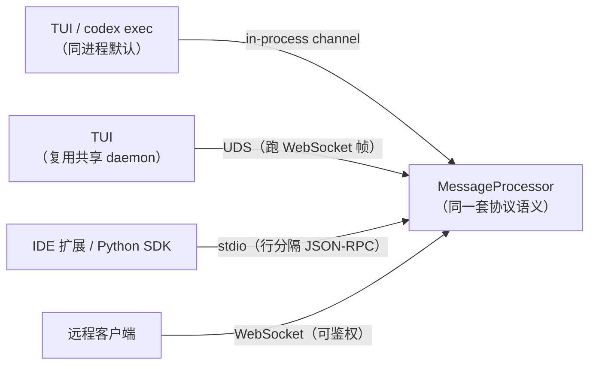
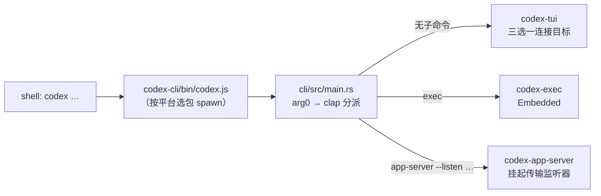

# 进程与传输

## 本章导读

本章回答一个问题：前端与 app-server 之间的"话"是怎么传过去的。读完你将能够：

1. 说出从 shell 里敲下 `codex` 到具体角色（TUI / exec / app-server）启动传输的
   完整链路；
2. 画出传输矩阵——in-process channel、stdio、UDS、WebSocket 四条通路各自的
   代码落点与适用场景；
3. 解释 in-process 传输的背压分级设计，以及 TUI 在 Embedded / LocalDaemon /
   Remote 三种连接目标间如何选择与降级。

**前置章节**：第一部分三章。第 1 章「总览」建立了单二进制分饰多角的全局图，
本章不再重复 arg0 分派与 in-process 的基本概念，而是向传输一侧深挖；「crate
地图」帮你定位本章出现的 crate 名；「配置与认证」解释了 CLI 覆盖从何而来——
它正是 TUI 能否复用共享 daemon 的裁决依据。

## 概念与架构

### 一个类比：怎么把话传给项目经理

延续第 1 章的"外包工程师团队"类比：前端要给 app-server 这位项目经理传话，
Codex 提供了四种通讯方式——

- **进程内 channel**：同一间办公室里递纸条。TUI 和 app-server 住在同一个进程，
  理论上可以直接喊一嗓子，但 Codex 仍要求把话写在标准工单上（JSON-RPC 信封），
  只是省掉了邮寄环节。
- **stdio**：专线电话。IDE 扩展把 `codex app-server` 拉成子进程，顺着
  stdin/stdout 这对管道一行一条消息地通话。一对一、与子进程同生死，简单可靠。
- **Unix socket（UDS）**：楼里的内线分机。一个长驻 daemon 在本机固定的
  socket 路径上值守，多个 TUI 窗口、多个工具都能拨进来，共享同一位项目经理。
- **WebSocket**：长途电话。唯一能跨机器的通道，因此要拨号（绑定地址）、
  要鉴权（token），代价也最高。

关键设计只有一句话：**无论走哪条线，电话那头说的是同一种语言**。传输只决定
"怎么送到"，不改变"说什么"——协议语义永远只有一份。

### 传输全景

注意 UDS 那一行：本地共享 daemon 的 socket 上传的也是 WebSocket 帧，daemon
与远程客户端因此可以共用同一套收发逻辑——这是源码深挖一节会展开的反直觉设计。

## 源码深挖

### 启动链：从 shell 到监听器

第 1 章讲过：npm 包装器按 `process.platform/arch` 查
`PLATFORM_PACKAGE_BY_TARGET`（codex-cli/bin/codex.js#L16）挑中平台包里的 Rust
二进制并 spawn（codex-cli/bin/codex.js#L241）；Rust 侧入口
（codex-rs/cli/src/main.rs#L1121-L1128）先经 arg0 层按 argv\[0\] 改名分派，
再由 clap 大 match（codex-rs/cli/src/main.rs#L1176）分发子命令。本章补三个
与传输直接相关的细节：

1. **arg0 层不只是改名**。它在 tokio runtime 建立之前完成 `.env` 加载与 PATH
   别名准备（codex-rs/arg0/src/lib.rs#L157-L173），然后把异步入口放到一个
   独立栈大小的 `codex-main` 线程上运行
   （codex-rs/arg0/src/lib.rs#L233-L236）——后续所有传输任务都长在这个
   受控 runtime 里。
2. **`app-server` 子命令拆出传输参数**。clap 分支把 `listen`、`stdio`、
   `remote_control`、`auth` 等字段解构出来
   （codex-rs/cli/src/main.rs#L1314-L1324），随后进入 app-server 的
   `run_main`（codex-rs/app-server/src/lib.rs#L429）与
   `run_main_with_transport_options`（codex-rs/app-server/src/lib.rs#L476）。
3. **传输在启动末尾四选一挂起**：stdio
   （codex-rs/app-server/src/lib.rs#L750）、UDS 控制 socket（L758）、
   WebSocket（L775）、`Off`（L784）。

### 传输矩阵的代码落点

| 前端 | 传输 | 服务端入口 | 备注 |
| ---- | ---- | ---------- | ---- |
| TUI / `codex exec`（默认） | 进程内 bounded channel | codex-rs/app-server/src/in_process.rs#L371 | 不经 `AppServerTransport`，直接托管 `MessageProcessor` |
| TUI（复用共享 daemon） | UDS + WebSocket 帧 | codex-rs/app-server-transport/src/transport/unix_socket.rs#L36 | 客户端侧走 `RemoteAppServerClient` |
| IDE 扩展 / Python SDK | stdio（行分隔 JSON-RPC） | codex-rs/app-server-transport/src/transport/stdio.rs#L24 | `--listen stdio://`，也是默认值 |
| 远程客户端 | WebSocket | codex-rs/app-server-transport/src/transport/websocket.rs#L129 | 非回环地址且无鉴权会被拒绝（L135-L142） |

几个贯穿全表的枢纽：

- `AppServerTransport` 枚举的四个变体定义在
  codex-rs/app-server-transport/src/transport/mod.rs#L75-L81；`--listen` URL
  的解析在 `from_listen_url`（L117），默认值是 `stdio://`（L115），裸
  `unix://` 会被解析成 CODEX_HOME 下的控制 socket 路径（L122-L130）。
- 所有 socket 传输把连接事件归一化为 `TransportEvent`（连接打开 / 关闭 /
  收到消息，mod.rs#L172-L189）上报给 app-server 主循环；每条连接取一个递增的
  `ConnectionId`（L199-L203），`ConnectionOrigin`（L191-L197）只记录来源，
  供会话状态与遥测区分。
- 各方向的 channel 容量统一为 `CHANNEL_CAPACITY = 128`（mod.rs#L23-L25）。
- stdio 是最简实现：一个任务逐行读 stdin
  （codex-rs/app-server-transport/src/transport/stdio.rs#L43-L80），一个任务
  逐行写 stdout（L82-L98），一行就是一条 JSON-RPC 消息。
- UDS 的反直觉之处：accept 之后立刻做 WebSocket 升级
  （codex-rs/app-server-transport/src/transport/unix_socket.rs#L107-L134），
  也就是"UDS 上跑 WS 帧"，于是与远程客户端共用 `run_websocket_connection`；
  同一个监听器还夹带 `/daemon/shutdown` 控制端点（L110-L131）。
- WebSocket 是唯一能跨机器的传输，因此独享一道安全闸：监听非回环地址且未配
  鉴权时直接拒绝启动
  （codex-rs/app-server-transport/src/transport/websocket.rs#L135-L142）。

### in-process：进程内也要守规矩

`codex-rs/app-server/src/in_process.rs` 的模块注释（L18-L32）把原则说得很
直白：**transport-local but not protocol-free**——channel 替代了 socket，
但响应仍走与 stdio/WebSocket 完全相同的 JSON-RPC 信封。`start()` 在返回
handle 之前就替你完成了 `initialize` / `initialized` 握手（L371-L400）；
上层的 `InProcessAppServerClient`
（codex-rs/app-server-client/src/lib.rs#L300）再包一层 worker task，给 TUI /
exec 提供统一的异步 request/response + 事件流 API。

它的背压设计是本章的精华，共分三级：

1. **客户端 → runtime**：`try_send_client_message`
   （codex-rs/app-server/src/in_process.rs#L259-L271）用 `try_send` 投递，
   队列满返回 `WouldBlock`，关闭返回 `BrokenPipe`——调用方立即知情，而不是
   被隐式阻塞。
2. **runtime → processor**：请求转发同样 `try_send`，满了就向调用方回一个
   JSON-RPC `OVERLOADED` 错误（L604-L617）；普通客户端通知满了则直接丢弃并
   `warn!`（L630-L639）。
3. **processor → 客户端（事件扇出）**：分消息语义处理。server request（如
   审批询问）**绝不静默丢弃**——塞不进事件队列时回送 overload / internal
   错误给 `MessageProcessor`，保证审批流不会无限挂起（L689-L719）。server
   notification 再分两档：`server_notification_requires_delivery` 白名单
   （L111-L126：`TurnCompleted`、`ThreadQueueChanged` 等"丢了会导致状态机
   失步"的事件）用 `send().await` 阻塞投递，其余通知 `try_send` 失败即弃
   （L721-L748）；消费端彻底掉队时还会收到 `Lagged` 标记（L173-L180）。

关停也是有界的：`SHUTDOWN_TIMEOUT` 5 秒、`SHUTDOWN_ACK_TIMEOUT` 35 秒
（L102-L105），超时直接 abort worker，绝不无限等待。

### daemon 复用与降级

TUI 的三种连接目标定义在一个枚举里
（codex-rs/tui/src/lib.rs#L296-L301）：`Embedded`（同进程内嵌）、
`LocalDaemon`（本机共享 daemon）、`Remote`（显式远程端点，端点类型
`RemoteAppServerEndpoint` 支持 WebSocket 与 UnixSocket 两种形态，
codex-rs/app-server-client/src/remote.rs#L71-L80）。

选择逻辑在 `app_server_target_for_launch`（codex-rs/tui/src/lib.rs#L926-L954）：
显式远程端点优先（L943）；否则若允许复用且未设置执行器环境变量，先探测默认
daemon socket（`maybe_probe_default_daemon_socket`，L458），命中就走
`LocalDaemon`（L945-L951）；其余一律 `Embedded`（L952）。

复用有明确门槛——`can_reuse_implicit_local_daemon`
（codex-rs/tui/src/lib.rs#L987-L998）要求本次启动不带任何 CLI 覆盖、loader
覆盖为默认、非 strict 模式。注释一句话道破原因（L993）：**复用的 daemon
无法采纳本次调用的完整启动配置**。

降级策略是显式不对称的：连 `LocalDaemon` 失败时，TUI 打一条 debug 日志
"local daemon connection failed; starting embedded app server"，把目标改写
成 `Embedded` 并重新初始化 state_db（codex-rs/tui/src/lib.rs#L515-L523）；
而显式 `Remote` 失败则直接报错、目标不变——这个不对称性被测试钉死在
codex-rs/tui/src/daemon_startup_tests.rs#L72-L80。daemon 本身由
`codex app-server daemon start / stop / …` 生命周期命令管理
（`codex-rs/app-server-daemon/`，状态存于 CODEX_HOME/app-server-daemon/，
用 daemon.lock 串行化生命周期操作）；UDS 监听器上的 `/daemon/shutdown`
端点只对受管启动开放（`DAEMON_SHUTDOWN_SOCKET_ENV`，
codex-rs/app-server-transport/src/lib.rs#L7-L8）。

## 技术难点与设计取舍

**难点一：多传输共用一套协议语义。** 四种传输的读写形态完全不同（行分隔文本、
WS 帧、内存 channel），而 `MessageProcessor` 只想看到"一条连接、一条消息"。
Codex 的解法是传输层归一化：每种传输只负责把字节流翻译成 `TransportEvent` +
`ConnectionId`，协议解析、会话状态、背压全部上移；连 in-process 也保留
JSON-RPC 信封，把"同进程"降级为纯优化。代价是进程内通信也要付出信封构造与
解析成本；收益是 TUI 与 IDE 扩展之间的行为差异 bug 从"可能"变成"不可能"。

**难点二：进程内 channel 的背压与丢弃分级。** bounded channel 满了怎么办没有
普世答案：全部阻塞会把 agent 卡死在前端重绘上，全部丢弃又可能丢掉
"turn 完成"这类关键事件。Codex 按消息语义分级——请求失败显式回
`OVERLOADED`、必达通知阻塞投递、普通通知允许丢弃并留痕（`warn!` +
`Lagged`）。这本质上是把"哪些事件丢了会导致协议状态机失步"显性编码进
`server_notification_requires_delivery` 的白名单里，背压策略由此从传输参数
上升为协议正确性的一部分。

**难点三：daemon 复用的收益 vs 配置漂移。** 共享 daemon 让第二个 TUI 窗口
秒开、跨窗口看到同一份线程列表；但 daemon 带着启动时的配置在跑，本次
`codex -c model=...` 的覆盖无法回放给它。Codex 的取舍是宁可放弃复用也不
悄悄丢配置（`can_reuse_implicit_local_daemon` 的一串否定检查），隐式复用失败
自动降级 `Embedded`，而显式 `Remote` 绝不降级——用户的显式意图优先于可用性。

## 对照通用 agent 范式

**LSP 的多传输抽象。** Language Server Protocol 把协议定义在 JSON-RPC 之上，
stdio / socket / 进程内三种绑定任选，rust-analyzer 等实现也支持同进程嵌入。
Codex 的 `AppServerTransport` + `TransportEvent` 与 LSP"协议与传输正交"的
思路同构，且更进一步：进程内绑定也保留 JSON-RPC 语义。设计自己的 agent 协议
时，"语义一份、传输多份"几乎总是对的——它让新前端（今天的 IDE、明天的移动
端）变成纯传输问题，而不是协议分叉问题。

**daemon 复用与可降级性。** LSP server 通常是 per-workspace 一个进程；
Docker daemon、ssh ControlMaster 则是共享长驻进程的代表。Codex 的
`LocalDaemon` 接近后者，但补了一条关键纪律：共享是有条件的（配置必须可回放），
失败永远可以退回自包含模式。这是"本地优先"软件的通用姿态——共享进程是优化，
不是依赖。

**背压分级。** 消息队列的确认等级、actor 模型的 bounded mailbox，都在回答
同一个问题；Codex 的特化在于按"协议后果"而非"消息大小"分级：丢一条进度通知
无伤大雅，丢一条审批应答会让整个 turn 挂起。

## 小结与下一章预告

- 启动链三段：npm 包装器选平台二进制 → arg0 按名字分派 → clap 子命令；
  `app-server --listen` 决定挂哪种传输监听器；
- 传输矩阵四路：in-process channel / stdio / UDS（跑 WS 帧）/ WebSocket，
  全部归一化为 `TransportEvent` 进入同一个 `MessageProcessor`；
- in-process 传输"transport-local but not protocol-free"：信封保留，背压按
  消息语义分级——请求回 `OVERLOADED`、必达通知阻塞投递、普通通知可弃；
- TUI 三目标：`Embedded` 默认、`LocalDaemon` 有条件复用（失败降级）、
  `Remote` 显式指定（失败报错）。

下一章「主时序：一次请求全链路」：把本章建好的"连接"用起来——从 `initialize`
握手开始，追踪一次 `turn/start` 穿过传输层、`MessageProcessor`、codex-core、
模型 API，再沿事件流回到前端的完整时序。
