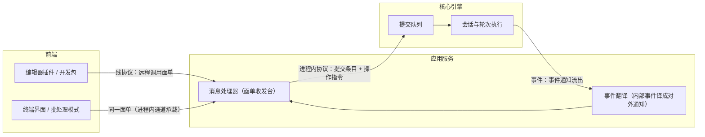
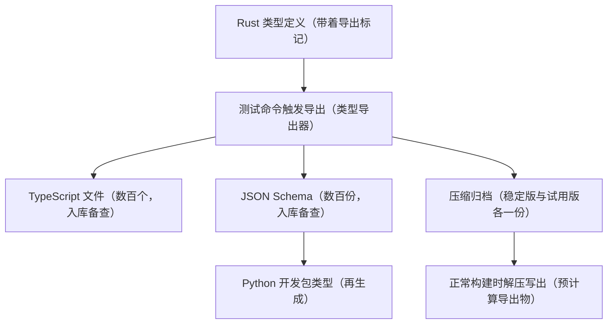

# 协议层

## 本章导读

从一个具体的瞬间开始：你在编辑器插件里看到引擎想执行一条有风险的命令，
弹窗问你"允许吗"，你点了"允许"。这个"允许"接下来要穿过好几道关卡——
从插件到后台服务，再从后台服务到引擎深处——而且不能跟别人的点击搞混。
它是靠着什么样的"单据"一路通行的？为什么终端界面和编辑器插件看到的进度
播报长得一模一样？又是谁在保证：功能天天在长，老用户却不会一觉醒来发现
接口变了脸？

本章就拆解这些单据：它们长什么样、在哪里定义、如何用一份定义同时变出
多种编程语言的版本。

读完本章，你将能够：

1. 分清引擎的"内部语言"和对外的"线上语言"这两套消息体系，说出各自的
   边界与分工；
2. 在协议代码目录里定位任意一条指令、一条事件或一个远程方法的定义；
3. 解释"一份定义生成多语言类型"的流水线如何运转，以及"实验性开关"如何
   让协议持续演进而不惊扰稳定用户。

**前置章节**：第 5 章「主时序」。如果只想走主线，记住"指令进、事件出、
对外一律标准面单"这三句话即可。

## 概念与架构

### 一个类比：邮局的标准信封与快递面单

把核心引擎想象成一家邮局的内部分拣中心，应用服务是营业厅，前端是寄件人。
货物分三种包装：

- **内部工单**：分拣中心内部的便签，写着"分拣这个""停止传送带""这批货
  客户已批准"。便签上甚至别着一根回形针——一条一次性的回执通道，柜员
  办完事顺着它把结果递回去。便签只在楼内流转，设计上就**不可能**被寄上
  公路：它根本无法装箱。
- **标准信封**：分拣中心对外寄出的通知——"包裹已发出""运输中""需要您
  签收"。信封盖统一邮戳，用标准格式书写，可以跨房间、跨楼宇寄给任何
  前端。
- **快递面单**：跨城运输的标准面单，上面写着方法名、参数和编号。关键的
  反直觉之处在于：**连同楼派送也照贴面单**——终端界面与应用服务同处一
  个进程，通信仍然走同样的面单格式，只是运输方式换成了楼内传送带。这份
  面单采用的是一种用 JSON 文本描述"请调用某个功能"的远程调用约定
  （JSON-RPC）。

于是协议自然分成两层。下面这张图看"谁对谁说哪种话"：

读这张图只需抓住两个要点：

1. **进程内协议是母语**。核心引擎与宿主之间说内部话：操作指令流入、事件
   通知流出，类型丰富，还可以携带"只能活在同一进程里"的东西（比如那根
   回形针回执通道）。
2. **线协议是普通话**。应用服务对外只说标准话：面单形状的请求、响应、
   通知，外加一类容易被忽视的**反向请求**——服务器主动向客户端发问
   （要审批、要输入、要刷新登录凭证），审批时序全靠它实现。

两层之间由应用服务做翻译：进来的客户端请求被译成操作指令投给引擎；出来
的事件通知被译成对外通知广播给前端。翻译器集中在一处，保证所有前端看到
的是同一份语义。

## 出场角色

进入源码之前，先认识本章要出场的角色。下表的"所在文件"都是仓库内的相对
路径，现在记不住没关系，读到正文时翻回来对照即可。

| 中文名 | 英文名 | 职责（一句话） | 所在文件 |
| ------ | ------ | -------------- | -------- |
| 提交条目 | Submission | 排队等待引擎处理的一条任务，携带来源编号与指令本体 | codex-rs/protocol/src/protocol.rs |
| 操作指令 | Op | 前端送给引擎的指令全集：打断、开一轮、答复审批等 | codex-rs/protocol/src/protocol.rs |
| 事件 | Event | 引擎外发的一条消息信封，用编号关联回某条提交 | codex-rs/protocol/src/protocol.rs |
| 事件通知 | EventMsg | 事件的内容本体：轮次开始、模型输出、工具进度、审批请求等 | codex-rs/protocol/src/protocol.rs |
| 协议代码包 | codex-protocol | 进程内协议的家 | codex-rs/protocol |
| 线协议代码包 | codex-app-server-protocol | 对外远程调用协议的家 | codex-rs/app-server-protocol |
| 信封枚举 | JSONRPCMessage | 线上消息的四种信封：请求、通知、响应、错误 | codex-rs/app-server-protocol/src/rpc.rs |
| 请求编号 | RequestId | 请求与响应之间的对账编号，字符串或整数皆可 | codex-rs/app-server-protocol/src/rpc.rs |
| 客户端请求 | ClientRequest | 前端发给应用服务、需要回应的方法全集 | codex-rs/app-server-protocol/src/protocol/common.rs |
| 客户端通知 | ClientNotification | 前端发给应用服务、不需回应的单向消息 | codex-rs/app-server-protocol/src/protocol/common.rs |
| 服务器请求 | ServerRequest | 应用服务反向问前端、需要答复的方法全集（审批等） | codex-rs/app-server-protocol/src/protocol/common.rs |
| 服务器通知 | ServerNotification | 应用服务推给前端的单向进度流 | codex-rs/app-server-protocol/src/protocol/common.rs |
| 负载目录 | protocol/v2 | 各方法的参数与返回值类型，按资源分文件存放 | codex-rs/app-server-protocol/src/protocol/v2/ |
| 线程启动参数 | ThreadStartParams | "开新线程"方法的参数类型，后文拿它当样本 | codex-rs/app-server-protocol/src/protocol/v2/thread.rs |
| 事件翻译器 | item_event_to_server_notification | 把引擎事件译成对外通知的集中翻译处 | codex-rs/app-server-protocol/src/protocol/event_mapping.rs |
| 类型导出器 | export | 仅在测试构建中把类型定义导出成多语言产物 | codex-rs/app-server-protocol/src/export.rs |
| 空宏代码包 | app-server-protocol-noop-macros | 正常构建时顶替代码生成的占位宏，编译零开销 | codex-rs/app-server-protocol-noop-macros |
| 预计算导出物 | precomputed_exports | 把压缩好的类型清单编进二进制、构建时解压写出 | codex-rs/app-server-protocol/src/precomputed_exports.rs |
| 实验性门控 | ExperimentalApi | 标记并检查"还在试用期"的方法与字段 | codex-rs/app-server-protocol/src/experimental_api.rs |
| 流水线脚本 | write_schema_fixtures.py | 一键重新生成全部类型产物与 Python 开发包类型 | codex-rs/app-server-protocol/scripts/write_schema_fixtures.py |

## 源码深挖

### 进程内协议：操作指令与事件通知

这一小节看引擎的"母语"：前端怎么把指令送进引擎，引擎又怎么把消息递出来。
出场的是提交条目、操作指令、事件、事件通知四位角色。读完你会知道：为什么
有些指令在物理上就不可能被误发到网络上，以及新旧两代事件名称如何和平共处。

两大枚举都住在同一个文件里——codex-rs/protocol/src/protocol.rs：

| 类型 | 定义位置 | 形态要点 |
| ---- | -------- | -------- |
| 提交条目 Submission | codex-rs/protocol/src/protocol.rs#L190-L205 | 队列条目：来源编号、指令本体、追踪信息、父轮溯源字段；只做调试输出 |
| 操作指令 Op | codex-rs/protocol/src/protocol.rs#L593-L596 | 只做调试输出、预留扩展位；不支持文本序列化——变体里嵌着一次性回执通道（codex-rs/protocol/src/protocol.rs#L627），物理上不可能被装箱发走 |
| 事件 Event | codex-rs/protocol/src/protocol.rs#L1340-L1347 | 外发信封：编号（关联回某条提交）加内容本体 |
| 事件通知 EventMsg | codex-rs/protocol/src/protocol.rs#L1360 | 带上展示名、模式描述、多语言导出三件套（codex-rs/protocol/src/protocol.rs#L1356），用统一邮戳字段区分种类（codex-rs/protocol/src/protocol.rs#L1357-L1358） |

操作指令的变体按职责分成几簇（括号内为变体所在行，均在
codex-rs/protocol/src/protocol.rs 中）：

- **生命周期**：打断（L599）、关停（L755）、压缩（L734）、线程回滚（L746）、
  恢复被打断的轮次（L631）；
- **用户输入**：开一轮（L624）、执行用户临时命令（L762）；
- **审批应答**：命令审批答复（L667）、补丁审批答复（L677）、外部工具
  提问答复（L685）、用户输入答复（L699）——注意方向，这些是前端对引擎
  所发审批**请求**的答复；
- **设置与维护**：线程设置（L646）、刷新外部工具服务（L723）、重载用户
  配置（L729）；
- **语音与协作**：实时语音一族（L606-L621）、智能体间通信（L661）、请求
  代码评审（L749）。

事件通知则是另一个方向的新闻流，同样有清晰的簇：

- **轮次生命周期**：轮次开始（L1410）、轮次完成（L1419）、轮次中止
  （L1529）、会话已配置（L1441）；
- **模型输出**：正文消息（L1426）、推理摘要（L1432）、正文流式增量
  （L1548）、推理流式增量（L1550）、用量统计（L1423）、计划更新（L1527）；
- **工具执行**：命令开始（L1474）、命令输出增量（L1477）、命令结束
  （L1482）、补丁开始（L1514）、外部工具调用开始（L1461）、联网搜索开始
  （L1465）；
- **审批与请求（引擎到前端）**：命令审批请求（L1487）、补丁审批请求
  （L1499）、权限申请（L1489）、结构化输入征求（L1497）。

两处细节值得停留。其一，事件通知头顶的注释
（codex-rs/protocol/src/protocol.rs#L1355）写着"不要让任何成员带可选
类型，否则会搞乱下游的代码生成"——事件形态被下游代码生成硬约束着。其二，
第一代到第二代的改名不是另起炉灶，而是双标签兼容：轮次开始在线上仍叫旧名，
同时接受新名作为别名（codex-rs/protocol/src/protocol.rs#L1409；轮次完成
同理见 codex-rs/protocol/src/protocol.rs#L1418）。旧前端无感，新前端可用
新名。

### 线协议：应用服务的第二代远程调用

这一小节看对外的"普通话"：面单长什么样、上百个方法如何不靠手写维护、
命名有什么铁律。出场的是信封枚举、四个方法全集和负载目录。读完你就能在
代码里定位任意一个远程方法。

信封定义在 codex-rs/app-server-protocol/src/rpc.rs。模块注释开门见山
（codex-rs/app-server-protocol/src/rpc.rs#L1-L2）："我们不做真正的
JSON-RPC 2.0"——线上不带版本标识字段。信封四种：请求、通知、响应、错误
（信封枚举，codex-rs/app-server-protocol/src/rpc.rs#L37-L42）；请求编号
支持字符串或整数（codex-rs/app-server-protocol/src/rpc.rs#L17-L21）。

四个消息枚举不是手写的，而是声明式宏生成的：一张"方法表"配一个宏，宏把
表里每一行展开成枚举变体。四张表都在
codex-rs/app-server-protocol/src/protocol/common.rs 中：

| 枚举 | 宏定义 | 表位置 | 方向 |
| ---- | ------ | ------ | ---- |
| 客户端请求 ClientRequest | codex-rs/app-server-protocol/src/protocol/common.rs#L212 | codex-rs/app-server-protocol/src/protocol/common.rs#L506 | 客户端到服务器，要响应 |
| 客户端通知 ClientNotification | 同上宏家族 | codex-rs/app-server-protocol/src/protocol/common.rs#L2035 | 客户端到服务器，单向 |
| 服务器请求 ServerRequest | codex-rs/app-server-protocol/src/protocol/common.rs#L1473 | codex-rs/app-server-protocol/src/protocol/common.rs#L1737 | 服务器到客户端，要响应 |
| 服务器通知 ServerNotification | 同上宏家族 | codex-rs/app-server-protocol/src/protocol/common.rs#L1892 | 服务器到客户端，单向 |

宏展开时给每个变体盖上"方法名"邮戳
（codex-rs/app-server-protocol/src/protocol/common.rs#L228），变体内嵌
请求编号与参数（codex-rs/app-server-protocol/src/protocol/common.rs#L234-L239），
同时生成"从原始信封认领回枚举"的转换
（codex-rs/app-server-protocol/src/protocol/common.rs#L270）与串行化域
查询（codex-rs/app-server-protocol/src/protocol/common.rs#L256，含义见
「技术难点」一节）。

方法命名统一为"资源斜杠动作"，资源用单数。线程一族从开线程
（codex-rs/app-server-protocol/src/protocol/common.rs#L559）起头；服务器
请求表则是反向请求的全家福：命令审批
（codex-rs/app-server-protocol/src/protocol/common.rs#L1741）、文件改动
审批（codex-rs/app-server-protocol/src/protocol/common.rs#L1748）、动态
工具调用（codex-rs/app-server-protocol/src/protocol/common.rs#L1772）、
外部工具输入征求
（codex-rs/app-server-protocol/src/protocol/common.rs#L1760）、登录凭证
刷新（codex-rs/app-server-protocol/src/protocol/common.rs#L1777）。表尾
的废弃区（codex-rs/app-server-protocol/src/protocol/common.rs#L1795-L1807）
还留着第一代的两个审批方法——服务旧轮次，不再生长。通知侧同理：线程已开始
（L1895）、轮次已开始（L1919）、条目已开始（L1925）、正文增量（L1935），
构成了前端渲染进度所需的全部脉冲。

负载类型按资源拆在负载目录里，模块清单一共 38 个
（codex-rs/app-server-protocol/src/protocol/v2/mod.rs#L1-L38）。以线程
启动参数为样本
（codex-rs/app-server-protocol/src/protocol/v2/thread.rs#L57-L62）：自动
派生里带着模式描述、多语言导出、实验性标记三件套；可选字段一律"可空"导出
（codex-rs/app-server-protocol/src/protocol/v2/thread.rs#L63-L64）；实验
性字段挂着单独的试用期标签
（codex-rs/app-server-protocol/src/protocol/v2/thread.rs#L83）。事件通知
到服务器通知的翻译集中在事件翻译器
（codex-rs/app-server-protocol/src/protocol/event_mapping.rs#L30-L34）。

### 单一真实来源：从 Rust 到 TypeScript 的流水线

这一小节是全章最精巧的部分：一份 Rust 类型定义，如何同时变成编辑器插件用
的 TypeScript 类型、校验用的 JSON Schema（一种描述数据结构形状的通用规范）
和 Python 开发包类型？出场的是类型导出器、空宏代码包、预计算导出物和流水
线脚本。读完你会理解"把代码生成藏进测试里"这个四两拨千斤的设计。

机关在于派生宏有两副面孔，靠"是否在跑测试"切换
（codex-rs/app-server-protocol/src/lib.rs#L65-L72）：**正常构建**使用空宏
代码包提供的空派生——接受导出标记但不生成任何代码
（codex-rs/app-server-protocol-noop-macros/src/lib.rs#L11-L20），编译零
开销；**测试构建**才换成真正的生成库（两者只出现在测试依赖里，
codex-rs/app-server-protocol/Cargo.toml#L53-L56）。于是整个类型导出器都
是仅测试可见的（codex-rs/app-server-protocol/src/lib.rs#L2-L3）：它对四
个枚举逐一全量导出
（codex-rs/app-server-protocol/src/export.rs#L123-L140），生成稳定面时再
把实验性内容整段剔除
（codex-rs/app-server-protocol/src/export.rs#L142-L144）。

产物分两层提交入库：TypeScript 文件与 JSON Schema 供人查阅，两个压缩包
（稳定版与试用版各一）则通过编译期内嵌
（codex-rs/app-server-protocol/src/precomputed_exports.rs#L15-L18）编进
二进制，构建开发包时解压写出
（codex-rs/app-server-protocol/src/precomputed_exports.rs#L115-L123）——
下游消费者不需要 Rust 工具链就能拿到类型。改完协议后跑一条任务命令
（justfile#L177-L178）：流水线脚本以测试命令触发重写
（codex-rs/app-server-protocol/scripts/write_schema_fixtures.py#L41-L57），
并顺手从 JSON Schema 再生成 Python 开发包类型
（codex-rs/app-server-protocol/scripts/write_schema_fixtures.py#L63-L82）。
引擎侧的类型（事件通知等）因被第二代负载嵌套引用，协议代码包里的导出库是
常驻依赖（codex-rs/protocol/Cargo.toml#L46-L50）。

## 技术难点与设计取舍

**单一真实来源 vs 手写双份。** 多语言开发包的经典陷阱是每种语言各写一份
类型，迟早漂移。Codex 的选择是 Rust 定义即事实源，其余全是构建产物。妙处
不在"生成"本身，而在**把生成藏进测试命令**：派生平时是空壳，编译不为代码
生成付一分钱；只有显式跑模式测试时真派生才展开。代价是流程依赖纪律——改
完协议必须记得重新生成产物，靠测试比对把守漂移。对比 TypeScript 开发包侧
手写的事件类型文件（批处理模式逐行输出路线），更能体会这条流水线的价值。

**演进而不破坏：实验性门控。** 新接口只加第二代、第一代冻结（仓库根目录的
协作规约，AGENTS.md#L269-L286），那新想法怎么安全落地？答案是能力协商：
方法级标试用期标签
（codex-rs/app-server-protocol/src/protocol/common.rs#L513），字段级标在
负载上（codex-rs/app-server-protocol/src/protocol/v2/thread.rs#L83），宏
顺手把实验方法收进一张清单
（codex-rs/app-server-protocol/src/protocol/common.rs#L410）；字段级则由
实验性门控接口
（codex-rs/app-server-protocol/src/experimental_api.rs#L5-L9）配合全局
注册表（codex-rs/app-server-protocol/src/experimental_api.rs#L22）在运行
时逐值检查。客户端握手时没声明试用能力，用到即报错
（codex-rs/app-server-protocol/src/experimental_api.rs#L29-L31）；稳定版
导出物里实验内容被物理删除
（codex-rs/app-server-protocol/src/export.rs#L142-L144）。稳定面与试验田
共处一库、互不污染。

**把架构约束写进类型系统。** 操作指令不支持序列化不是疏忽，而是防线：变体
里嵌着一次性回执通道，让"把内部指令误发到线上"在编译期就不可能。反过来，
事件通知必须可序列化且形态稳定，因为它要穿越所有边界。同样的心事还有客户
端请求的串行化域
（codex-rs/app-server-protocol/src/protocol/common.rs#L256）：对同一资源
（比如同一线程）的写操作按域串行化，避免并发请求把引擎的状态机踩乱——
协议层不只是数据形状，也承担并发语义的声明。

## 对照通用 agent 范式

**语言服务器协议（LSP，编辑器与语言分析服务之间的老牌远程调用协议）。**
"资源斜杠动作"的命名让人想起 LSP 的方法风格；信封、请求编号、通知与请求
二分也都是 LSP 熟客。分歧在于方向性：LSP 里服务器几乎不回问客户端，而
Codex 的服务器请求把客户端变成了能力提供方——审批、征求输入、刷新凭证都
是服务器发起的真请求。这是"编辑器协议"与"智能体协议"的本质差别：智能体
干的活有风险，必须保留一条随时回头问人的通道（详见第 12 章「审批与沙箱」）。

**智能体客户端协议（ACP，编辑器厂商主导的同类开放协议）。** 它同样跑在
标准输入输出之上，用"发起会话请求、回推会话更新"的方式驱动。对照看，
Codex 第二代的"开一轮"加"条目已开始、条目已完成、正文增量"
（codex-rs/app-server-protocol/src/protocol/common.rs#L1925-L1935）是同
一个"条目生命周期"建模范式：把智能体的产出抽象成一组有开始、有增量、有
终结的条目流，前端据此增量渲染。谁定义得更细不是重点，重点是行业正在收敛
到这套词汇表上。

**外部工具协议的反向调用。** 结构化输入征求方法
（codex-rs/app-server-protocol/src/protocol/common.rs#L1760）直接借用了
外部工具协议的征求输入概念——工具侧主动向用户要结构化输入（详见第 13 章
「MCP 链路」）。Codex 把这个模式从"工具服务器到客户端"推广成了"应用服务
到前端"的通用反向请求。

三者合看，一个通用智能体协议的最小配方浮出水面：**会话与任务的生命周期
方法，加条目级流式通知，加反向请求（审批与征求）**。Codex 第二代是这个
配方的一份完整工业实现，外加 Codex 独有的串行化域与实验性门控。

## 小结与下一章预告

- 两套协议各司其职：进程内的提交条目与操作指令、事件与事件通知住在一个
  文件里；线上四个消息枚举由声明式宏从方法表生成；
- 操作指令故意不可序列化（内嵌一次性回执通道），事件通知以统一邮戳字段
  上线，旧名称靠双标签别名平滑过渡；
- 第二代方法形如"资源斜杠动作"，负载遵守"参数、响应、通知三套命名加
  驼峰字段加可空导出"的刚性约定；
- Rust 类型是唯一事实源：仅测试构建的真派生生出 TypeScript 与 JSON
  Schema，压缩包随库提交、构建时解压，Python 开发包类型从 JSON Schema
  再生成；
- 实验性门控（方法级加字段级加握手能力协商）让协议持续演进而不伤稳定面。

至此第二部分收官：进程、时序、协议都已就位。下一部分潜入引擎本体——
第 7 章「Agent 核心」：操作指令被投进引擎之后，线程管理器、会话、轮次
上下文等层层对象如何接管它，一次向模型发问前的上下文又是如何被精确组装
出来的。
