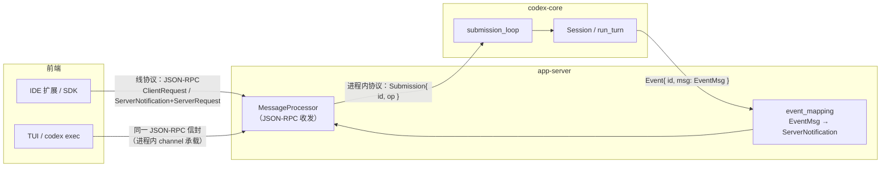
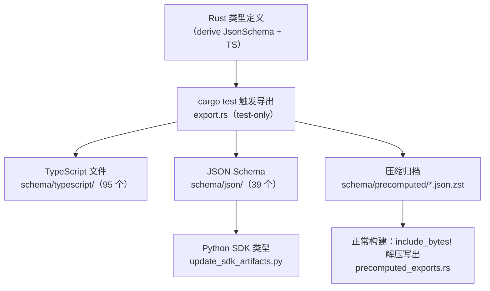

# 协议层

## 本章导读

上一章跟着一次请求走完了全链路，本章把镜头停在链路中流动的"货物"本身——
那些指令、事件与方法调用到底长什么样、在哪里定义、如何跨语言保持一致。
读完本章，你将能够：

1. 分清 Codex 的两套协议——进程内协议（`Submission`/`Op` 与 `Event`/`EventMsg`）
   与线协议（app-server v2 JSON-RPC），并说出各自的边界与责任；
2. 在 `codex-rs/protocol/` 与 `codex-rs/app-server-protocol/` 中定位任意一条
   指令、事件或 RPC 方法的定义；
3. 解释 Rust → TypeScript / JSON Schema 的"单一真实来源"管线如何运转，以及
   experimental 门控如何让协议持续演进而不炸毁稳定面。

**前置章节**：第 5 章「主时序：一次请求全链路」。如果只想走主线，记住
"Op 进、EventMsg 出、对外一律 JSON-RPC"这三句话即可。

## 概念与架构

### 一个类比：邮局的标准信封与快递单

把 codex-core 想象成一家邮局的内部分拣中心，app-server 是营业厅，前端是
寄件人。货物分两种包装：

- **内部工单（`Op`）**：分拣中心内部的便签，写着"分拣这个""停止传送带"
  "这批货客户已批准"。便签上甚至别着一根回形针——一个一次性的回执通道
  （`oneshot::Sender`），柜员办完事顺着它把结果递回去。便签只在楼内流转，
  设计上就**不可能**被寄上公路：它根本无法装箱（不可序列化）。
- **标准信封（`EventMsg`）**：分拣中心对外寄出的通知——"包裹已发出"
  "运输中""需要您签收"。信封盖统一邮戳（`type` 字段），用标准格式书写，
  可以跨进程、跨机器寄给任何前端。
- **快递面单（JSON-RPC）**：跨城运输的标准面单，写着 method、params、id。
  关键在于：**连同楼派送也照贴面单**——TUI 与 app-server 同处一个进程，
  通信仍走同样的 JSON-RPC 信封，只是运输方式换成了进程内 channel。

于是协议自然分成两层：

- **进程内协议**（`codex-rs/protocol/`）是 core 与宿主之间的母语：`Op` 流入、
  `EventMsg` 流出，类型富、可以携带 channel 这类"只能活在进程里"的东西。
- **线协议**（`codex-rs/app-server-protocol/`）是 app-server 对外的普通话：
  JSON-RPC 形状的请求、响应、通知，外加一类容易被忽视的**反向请求**
  `ServerRequest`——服务器主动向客户端发问（要审批、要输入、要刷新令牌），
  审批时序全靠它实现。

两层之间由 app-server 做翻译：进来的 `ClientRequest` 被译成 `Op` 投给 core；
出来的 `EventMsg` 被译成 `ServerNotification` 广播给前端。翻译器集中在一处，
保证所有前端看到的是同一份语义。

## 源码深挖

### 进程内协议：Op 与 EventMsg

两大枚举都住在同一个文件里——`codex-rs/protocol/src/protocol.rs`：

| 类型 | 定义位置 | 形态要点 |
| ---- | -------- | -------- |
| `Submission` | codex-rs/protocol/src/protocol.rs#L190-L205 | 队列条目：`id` / `op` / `trace` / 父 turn 溯源字段；只派生 `Debug` |
| `Op` | codex-rs/protocol/src/protocol.rs#L596 | 只派生 `Debug`（L593）且 `#[non_exhaustive]`；无 serde——变体里嵌着 `oneshot::Sender` 回执通道（L627），物理上不可能序列化 |
| `Event` | codex-rs/protocol/src/protocol.rs#L1340-L1347 | 外发信封：`id`（关联回某个 Submission）+ `msg` |
| `EventMsg` | codex-rs/protocol/src/protocol.rs#L1360 | 派生 `Display`（strum）+ `JsonSchema` + `TS`（L1356），`#[serde(tag = "type", rename_all = "snake_case")]`（L1357）配 `#[ts(tag = "type")]`（L1358） |

`Op` 的变体按职责分成几簇（括号内为变体所在行）：

- **生命周期**：`Interrupt`（L599）、`Shutdown`（L755）、`Compact`（L734）、
  `ThreadRollback`（L746）、`RecoverTurn`（L631）；
- **用户输入**：`TurnInput`（L624）、`RunUserShellCommand`（L762）；
- **审批应答**：`ExecApproval`（L667）、`PatchApproval`（L677）、
  `ResolveElicitation`（L685）、`UserInputAnswer`（L699）——注意方向，这些是
  前端对 core 所发审批**请求**的答复；
- **设置/维护**：`ThreadSettings`（L646）、`RefreshMcpServers`（L723）、
  `ReloadUserConfig`（L729）；
- **语音/协作**：`RealtimeConversation*`（L606-L621）、
  `InterAgentCommunication`（L661）、`Review`（L749）。

`EventMsg` 则是另一个方向的新闻流，同样有清晰的簇：

- **turn 生命周期**：`TurnStarted`（L1410）、`TurnComplete`（L1419）、
  `TurnAborted`（L1529）、`SessionConfigured`（L1441）；
- **模型输出**：`AgentMessage`（L1426）、`AgentReasoning`（L1432）、
  流式增量 `AgentMessageContentDelta`（L1548）、`ReasoningContentDelta`
  （L1550）、`TokenCount`（L1423）、`PlanUpdate`（L1527）；
- **工具执行**：`ExecCommandBegin`（L1474）/`ExecCommandOutputDelta`（L1477）/
  `ExecCommandEnd`（L1482）、`PatchApplyBegin`（L1514）、`McpToolCallBegin`
  （L1461）、`WebSearchBegin`（L1465）；
- **审批/请求（core → 前端）**：`ExecApprovalRequest`（L1487）、
  `ApplyPatchApprovalRequest`（L1499）、`RequestPermissions`（L1489）、
  `ElicitationRequest`（L1497）。

两处细节值得停留。其一，`EventMsg` 头顶的注释（protocol.rs#L1355）写着
"Make sure none of these values have optional types, as it will mess up the
extension code-gen"——事件形态被下游代码生成硬约束着。其二，v1 到 v2 的改名
不是另起炉灶，而是 serde 双标签：`TurnStarted` 在线上仍叫 `task_started`，
同时接受 `turn_started` 别名（protocol.rs#L1409；`TurnComplete` 同理见 L1418）。
旧前端无感，新前端可用新名。

### 线协议：app-server v2 JSON-RPC

信封定义在 `codex-rs/app-server-protocol/src/rpc.rs`。模块注释开门见山
（rpc.rs#L1-L2）："We do not do true JSON-RPC 2.0"——线上不带 `jsonrpc:
"2.0"` 字段。信封四种：`Request` / `Notification` / `Response` / `Error`
（`JSONRPCMessage`，rpc.rs#L37-L42），`RequestId` 支持字符串或整数
（rpc.rs#L17-L21）。

四个消息枚举不是手写的，而是声明式宏生成。`common.rs` 里四个宏定义配四张
方法表：

| 枚举 | 宏定义 | 表位置 | 方向 |
| ---- | ------ | ------ | ---- |
| `ClientRequest` | common.rs#L212 | 表在 common.rs#L506 | 客户端 → 服务器，要响应 |
| `ClientNotification` | — | 表在 common.rs#L2035 | 客户端 → 服务器，单向 |
| `ServerRequest` | common.rs#L1473 | 表在 common.rs#L1737 | 服务器 → 客户端，要响应 |
| `ServerNotification` | — | 表在 common.rs#L1892 | 服务器 → 客户端，单向 |

宏把每一行 `Variant => "wire/name" { params, response }` 展开成枚举变体：
`#[serde(tag = "method", rename_all = "camelCase")]`（common.rs#L228），变体
内嵌 `request_id` 与 `params`（common.rs#L234-L239），同时生成
`TryFrom<JSONRPCRequest>`（common.rs#L270）与 `serialization_scope()`
（common.rs#L256，请求串行化域，细节留待「app-server 深入」一章）。

方法命名统一为 `<resource>/<method>`，resource 用单数。`thread/*` 一族从
`thread/start`（common.rs#L559）起头；`ServerRequest` 表则是反向请求的全家福：
审批 `item/commandExecution/requestApproval`（L1741）、
`item/fileChange/requestApproval`（L1748）、动态工具调用 `item/tool/call`
（L1772）、MCP 输入征求 `mcpServer/elicitation/request`（L1760）、令牌刷新
`account/chatgptAuthTokens/refresh`（L1777）。表尾的 DEPRECATED 区
（L1795-L1807）还留着 v1 的 `ApplyPatchApproval`/`ExecCommandApproval`——
服务旧 turn，不再生长。通知侧同理：`thread/started`（L1895）、`turn/started`
（L1919）、`item/started`（L1925）、`item/agentMessage/delta`（L1935）构成了
前端渲染进度所需的全部脉冲。

payload 类型按资源拆在 `protocol/v2/` 目录——`v2/mod.rs`（L1-L38）声明了 38
个模块。以 `ThreadStartParams` 为样本（v2/thread.rs#L57-L62）：derive 里带
`JsonSchema, TS, ExperimentalApi` 三件套，`#[serde(rename_all = "camelCase")]`
配 `#[ts(export_to = "v2/")]`；可选字段一律 `#[ts(optional = nullable)]`
（L63-L64），实验性字段挂 `#[experimental("thread/start.runtimeWorkspaceRoots")]`
（L83）。`EventMsg` 到 `ServerNotification` 的翻译则集中在
`event_mapping.rs` 的 `item_event_to_server_notification`
（event_mapping.rs#L30-L34）。

### Rust → TypeScript：单一真实来源管线

这是全章最精巧的一段，值得一张图：

机关在于 derive 宏有两副面孔，由 `cfg(test)` 切换
（app-server-protocol/src/lib.rs#L64-L71）：**正常构建**用
`app-server-protocol-noop-macros` 提供的空 derive——接受 `#[ts(...)]` 属性但
不生成任何 impl（noop-macros/src/lib.rs#L11-L20），编译零开销；**测试构建**
才换成真的 `schemars` / `ts-rs`（Cargo.toml 里二者只出现在
`[dev-dependencies]`，Cargo.toml#L53-L56）。于是整个导出器 `export.rs`
都是 test-only 的（lib.rs#L2-L3）：`generate_ts_with_options`
（export.rs#L123）对四个枚举逐一 `export_all_to`（L132-L140），生成稳定面时
再用 `filter_experimental_ts` 把实验性内容整段剔除（L142-L144）。

产物分两层提交入库：`schema/typescript/` 与 `schema/json/` 供人查阅，两个
zstd 压缩包（`app-server-exports-stable.json.zst` 与 `-experimental`）则通过
`include_bytes!`（precomputed_exports.rs#L15-L18）编进二进制，构建 SDK 时
解压写出（load_exports，precomputed_exports.rs#L115-L123）——下游消费者不
需要 Rust 工具链就能拿到类型。改协议后跑 `just write-app-server-schema`
（justfile#L177-L178）：脚本（scripts/write_schema_fixtures.py#L41-L56）以
`cargo test` 触发重写 fixtures，并顺手从 JSON Schema 再生成 Python SDK 类型
（L63-L81）。核心侧的类型（`EventMsg` 等）因被 v2 payload 嵌套引用，
`codex-protocol` 里的 `ts-rs` 是常驻依赖（protocol/Cargo.toml#L46-L50）。

## 技术难点与设计取舍

**单一真实来源 vs 手写双份。** 多语言 SDK 的经典陷阱是 Rust、TS、Python 各写
一份类型，迟早漂移。Codex 的选择是 Rust 定义即事实源，TS/JSON Schema 全是
构建产物。妙处不在"生成"本身，而在**把生成藏进 `cargo test`**：derive 平时
是 noop，编译不为代码生成付一分钱；只有显式跑 schema 测试时真 derive 才
展开。代价是流程依赖纪律——改完协议必须记得重新生成 fixtures，靠测试比对
把守漂移。对比 TS SDK 侧手写的 `sdk/typescript/src/events.ts`（exec
JSONL 路线的事件类型），更能体会这条管线的价值。

**演进而不破坏：experimental 门控。** 新 API 只加 v2、v1 冻结（AGENTS.md 的
app-server 规约，AGENTS.md#L269-L286），那新想法怎么安全落地？答案是能力
协商：方法级标 `#[experimental("server/diagnostics")]`（common.rs#L513），
字段级标在 payload 上（v2/thread.rs#L83），宏顺手把实验方法收进
`EXPERIMENTAL_CLIENT_METHODS` 表（common.rs#L411）；字段级则由
`ExperimentalApi` trait（experimental_api.rs#L5-L9）配合 `inventory` 注册表
（L22）在运行时逐值检查。客户端握手时没声明 `experimentalApi` capability，
用到即报错（"{reason} requires experimentalApi capability"，L30-L32）；
稳定版导出物里实验内容被物理删除（export.rs#L142-L144）。稳定面与试验田
共处一库、互不污染。

**把架构约束写进类型系统。** `Op` 不实现 serde 不是疏忽，而是防线：变体里
嵌着 `oneshot::Sender`，让"把内部指令误发到线上"在编译期就不可能。反过来，
`EventMsg` 必须可序列化且形态稳定，因为它要穿越所有边界。同样的心事还有
`ClientRequest` 的 `serialization_scope()`（common.rs#L256）：对同一资源
（如同一 thread）的写操作按域串行化，避免并发请求把 core 的状态机踩乱——
协议层不只是数据形状，也承担并发语义的声明。

## 对照通用 agent 范式

**LSP 式 JSON-RPC。** `<resource>/<method>` 的命名让人想起 LSP 的
`textDocument/didOpen`；信封、RequestId、通知/请求二分也都是 LSP 熟客。
分歧在于方向性：LSP 里 server 几乎不回问 client，而 Codex 的
`ServerRequest` 把客户端变成了能力提供方——审批、征求输入、刷新令牌都是
server 发起的真请求。这是"编辑器协议"与"agent 协议"的本质差别：agent 干的
活有风险，必须保留一条随时回头问人的通道。

**ACP（Agent Client Protocol）。** Zed 主导的 ACP 同样跑 JSON-RPC over
stdio，`session/prompt` 驱动、`session/update` 通知回流。对照看，Codex v2
的 `turn/start` + `item/started`/`item/completed`/`item/agentMessage/delta`
（common.rs#L1925-L1935）是同一个"item 生命周期"建模范式：把 agent 的产出
抽象成一组有开始、有增量、有终结的条目流，前端据此增量渲染。谁定义得更细
不是重点，重点是行业正在收敛到这套词汇表上。

**MCP 的反向调用。** `mcpServer/elicitation/request`（common.rs#L1760）直接
借用了 MCP 的 elicitation 概念——工具侧主动向用户要结构化输入。Codex 把这
个模式从"MCP server → 客户端"推广成了"app-server → 前端"的通用反向请求。

三者合看，一个通用 agent 协议的最小配方浮出水面：**会话/任务生命周期方法
+ item 级流式通知 + 反向请求（审批与征求）**。Codex v2 是这个配方的一份
完整工业实现，外加 Codex 独有的串行化域与 experimental 门控。

## 小结与下一章预告

- 两套协议各司其职：进程内 `Submission`/`Op` 与 `Event`/`EventMsg`
  （protocol.rs），线上 JSON-RPC 四枚举由 `common.rs` 的声明式宏生成；
- `Op` 故意不可序列化（内嵌 `oneshot::Sender`），`EventMsg` 以
  `tag = "type"` + snake_case 上线，v1 名称靠 serde 别名平滑过渡；
- v2 方法形如 `<resource>/<method>`，payload 遵守 `*Params`/`*Response`/
  `*Notification` + camelCase + `#[ts(optional = nullable)]` 的刚性约定；
- Rust 类型是唯一事实源：test-only 真 derive 生成 TS/JSON Schema，压缩包
  随库提交、构建时解压，Python SDK 从 JSON Schema 再生成；
- experimental 门控（方法级 + 字段级 + capability 协商）让协议持续演进而
  不伤稳定面。

至此第二部分收官：进程、时序、协议都已就位。下一部分潜入引擎本体——
第 7 章「Agent 核心：线程模型与上下文」：`Op` 被投进 core 之后，
ThreadManager / Session / TurnContext / StepContext 五层对象如何接管它，
一次采样前的上下文又是如何被精确组装出来的。
