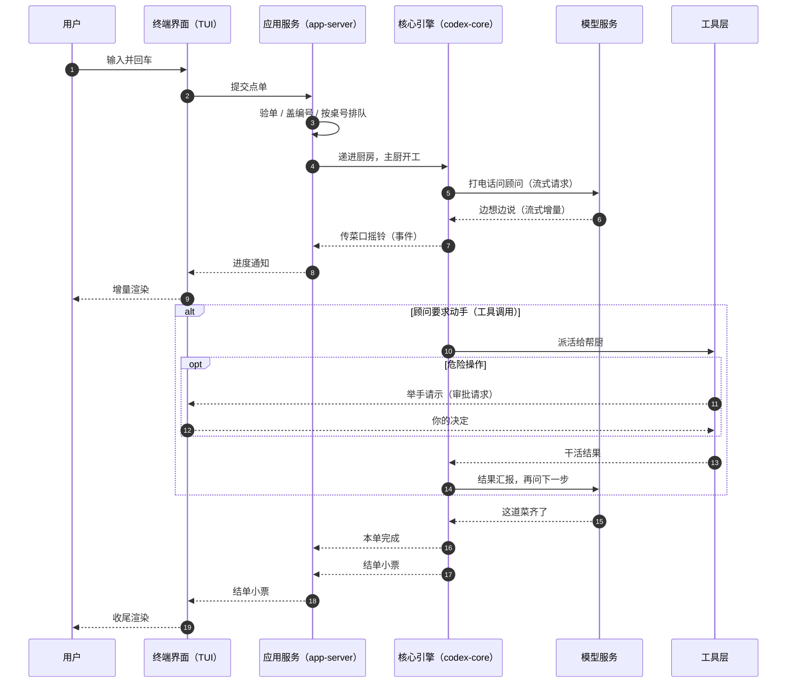

# 主时序：一次请求全链路

## 本章导读

想象这样一个场景：你在终端里敲下「帮我把这个函数改成异步的」，按下回车。

接下来你看到的是：回答一个字一个字地蹦出来；中途它忽然停下来，问你要不要
执行某条命令；你同意后，它继续干活；几分钟后，整段回答才收尾。

这背后藏着一串问题：你敲的那行字被谁接走了？它要经过多少道工序才能变成
模型的回答？为什么回答不是一次性出现，而是"流着"出现？它中途又怎么有办法
反过来问你问题？

本章就跟踪这一行字的完整旅程：从回车键出发，穿过前台界面、调度服务、
智能体引擎，抵达远端模型，再跟着进度消息一路回到屏幕。读完你将能够：

1. 默画出一次提问的完整时序：每一跳在哪个进程、跨哪条通道、经手哪些角色；
2. 说出"一轮对话的编号"如何在六层组件之间保持一致，错误与中断如何沿链路
   传播；
3. 解释 Codex 为什么把"一次提问"建模成"先受理、再慢慢播报进度"，而不是让
   你原地干等一个最终答案。

**前置章节**：第 1 章「总览」、第 4 章「进程与传输」。引擎内部的轮主循环
本章只踩点，展开在第 7 章「Agent 核心」。

## 概念与架构

### 一个类比：餐厅点单

把一次提问想象成在餐厅点一道现做的菜：

- **你**（用户）跟**服务员**（终端界面）说"来一份宫保鸡丁"；
- 服务员开单送到**收银台**（应用服务）：验单（厨房是否还营业）、盖编号、
  按桌号插进该桌的流水夹，再递进厨房；
- **主厨**（核心引擎）接单开工。菜谱他记不全，每做一步都要打电话问**外聘
  顾问**（模型服务）："下一步呢？"顾问说"先下豆瓣酱"；
- **帮厨**（工具层）负责动手：开火、下料、装盘。危险操作（比如开燃气总阀）
  要先举手请示你；
- 每完成一步，**传菜口**摇铃，服务员立刻把进度报给你——不是等整桌菜齐了
  才露面；
- 直到顾问说"这道菜齐了"，主厨挂勺，收银台把"本单完成"的小票递给你。

注意主厨与顾问之间的往返可能发生很多次：一次"点单"对应一轮"问顾问 →
动手 → 再问"的循环。这正是智能体的最小工作循环，也是本章的"轮"字含义：
**从你交出一句话，到引擎宣布这一轮干完，算一轮。**

### 一张时序图看全程

下面这张图把上面那桌菜的往返画成了时序：竖线是各个角色，箭头是消息的
流向。读法是从上往下，跟着编号走一遍。

三个结构性事实决定了这条链路的气质：

1. **受理与产出分离**。收银台收下点单时只承诺"已受理"，立刻给你一个小票
   编号；真正的菜走传菜口陆续上桌。你不必端着空盘子在收银台罚站。
2. **链路中段有一个循环**。主厨与顾问之间不是一问一答，而是"问顾问 → 动手
   → 再问"，直到顾问不再要求动手。所以一轮可能打很多次电话。
3. **回程是广播，不是应答**。传菜口的铃声所有服务员都听得见：进度消息会被
   派发给所有盯着这桌菜的前端连接，你面前的终端界面只是其中一个听众。

## 出场角色

进入源码之前，先认识本章要出场的角色。下表的"所在文件"都是仓库内的相对
路径，现在记不住没关系，读到正文时翻回来对照即可。表格按链路上下游顺序
排列：先终端界面侧，再应用服务侧，最后核心引擎侧。

| 中文名 | 英文名 | 职责（一句话） | 所在文件 |
| ------ | ------ | -------------- | -------- |
| 应用命令 | AppCommand | 终端界面内部的应用级指令，回车被归约为它的"用户一轮"变体 | codex-rs/tui/src/app_command.rs |
| 线程路由模块 | thread_routing | 终端界面里把应用命令分发到对应处理的模块 | codex-rs/tui/src/app/thread_routing.rs |
| 应用服务会话适配器 | AppServerSession | 终端界面侧把界面动作打包成协议请求的发送口 | codex-rs/tui/src/app_server_session.rs |
| 线程事件账簿 | ThreadEventStore | 终端界面侧接收服务器通知并记账，驱动增量渲染 | codex-rs/tui/src/app/thread_events.rs |
| 客户端请求 | ClientRequest | 前端发往应用服务的全部请求类型 | codex-rs/app-server-protocol/src/protocol/common.rs |
| 服务器通知 | ServerNotification | 应用服务推给前端的事件载荷 | codex-rs/app-server-protocol/src/protocol/common.rs |
| 服务器请求 | ServerRequest | 应用服务反向向前端发起的请求（如审批） | codex-rs/app-server-protocol/src/protocol/common.rs |
| 串行作用域 | serialization_scope | 标记"哪些请求必须按线程排队执行"的请求字段 | codex-rs/app-server-protocol/src/protocol/common.rs |
| 轮提交结果 | TurnInputSubmission | 核心引擎对一次提交的三分答复：新起、插队、拒绝 | codex-rs/protocol/src/turn_input.rs |
| 操作信封 | Op | 投入会话邮箱的操作指令类型 | codex-rs/protocol/src/protocol.rs |
| 消息处理器 | MessageProcessor | 应用服务内部真正处理每条请求的调度者 | codex-rs/app-server/src/message_processor.rs |
| 准入闸 | turn_admission | 决定服务在关停排空时是否还接新的一轮 | codex-rs/app-server/src/turn_admission.rs |
| 轮处理器 | turn_processor | 把协议层的"开始一轮"请求翻译成核心引擎的提交 | codex-rs/app-server/src/request_processors/turn_processor.rs |
| 事件翻译与路由 | apply_bespoke_event_handling | 把核心引擎事件翻译并路由成服务器通知 | codex-rs/app-server/src/bespoke_event_handling.rs |
| 线程生命周期模块 | thread_lifecycle | 为每条线程监听核心引擎事件流的模块 | codex-rs/app-server/src/request_processors/thread_lifecycle.rs |
| 线程管理器 | ThreadManager | 按线程编号取回核心引擎线程句柄 | codex-rs/core/src/thread_manager.rs |
| 核心引擎线程 | CodexThread | 一条线程在核心引擎内的句柄 | codex-rs/core/src/codex_thread.rs |
| 会话 | Session | 核心引擎里一条会话的运行时 | codex-rs/core/src/session/mod.rs |
| 会话收发口 | SessionIo | 会话对外收发操作信封的接口 | codex-rs/core/src/session/mod.rs |
| 提交循环 | submission_loop | 逐条消费会话邮箱里的操作信封 | codex-rs/core/src/session/handlers.rs |
| 轮输入处理模块 | turn_input | 受理"新起或插队一轮"并派生轮任务 | codex-rs/core/src/session/turn_input.rs |
| 常规任务 | RegularTask | 一轮在任务框架里的载体 | codex-rs/core/src/tasks/regular.rs |
| 轮上下文 | TurnContext | 一轮的运行时上下文，携带轮的编号 | codex-rs/core/src/session/turn_context.rs |
| 轮主循环 | run_turn | 一轮的主循环：采样、工具、再采样 | codex-rs/core/src/session/turn.rs |
| 模型客户端会话 | ModelClientSession | 与模型服务建立流式连接的客户端 | codex-rs/core/src/client.rs |
| 工具路由器 | ToolRouter | 识别模型发出的工具调用并安排执行 | codex-rs/core/src/tools/router.rs |
| 流事件工具集 | stream_events_utils | 把流式增量整理成完整输出项的工具模块 | codex-rs/core/src/stream_events_utils.rs |

## 源码深挖

下面以终端界面为例走一遍全链路（它经进程内消息通道走同一套远程调用语义；
编辑器插件与软件开发包仅前两段的传输方式不同，见第 4 章「进程与传输」）。
全链路拆成七个阶段，每阶段先导览、后细节。

### 阶段 1：终端界面提交一轮

这一段看"回车"如何变成一条发往应用服务的请求。出场的有应用命令、线程路由
模块和应用服务会话适配器。读完你会知道：你的输入在离开终端界面之前，被
打上了哪些随行信息。

回车后，输入被归约为应用命令的"用户一轮"变体（`AppCommand::UserTurn`，
codex-rs/tui/src/app/thread_routing.rs#L736；应用命令类型的定义在
codex-rs/tui/src/app_command.rs#L100），处理分支在
codex-rs/tui/src/app/thread_routing.rs#L863 调用
`app_server.turn_start(...)`。`AppServerSession::turn_start`
（codex-rs/tui/src/app_server_session.rs#L1314）把线程编号、输入、模型、
审批策略等打包成客户端请求的"开始一轮"变体（`ClientRequest::TurnStart`，
codex-rs/tui/src/app_server_session.rs#L1336），经进程内客户端发出。

### 阶段 2：应用服务门控与分发

这一段看应用服务如何当"收银台"：一条请求进门前要连过三道闸。出场的是
消息处理器、准入闸和串行作用域。读完你会知道：什么样的请求会被当场拒掉，
什么样的请求会被要求排队。

消息处理器的请求入口 `MessageProcessor::process_request`
（codex-rs/app-server/src/message_processor.rs#L619）反序列化后进入
`handle_client_request`（codex-rs/app-server/src/message_processor.rs#L881）
与 `dispatch_initialized_client_request`
（codex-rs/app-server/src/message_processor.rs#L926），连过三道闸：

- **初始化闸**：未完成初始化握手的连接直接报"未初始化"错误
  （codex-rs/app-server/src/message_processor.rs#L933-L935）；
- **准入闸**：轮类请求先取 `turn_admission.admit()` 的许可
  （codex-rs/app-server/src/message_processor.rs#L949-L965；准入闸的定义在
  codex-rs/app-server/src/turn_admission.rs#L48），服务关停排空中时拒绝新
  的一轮；
- **串行闸**：带串行作用域（`serialization_scope`，定义在
  codex-rs/app-server-protocol/src/protocol/common.rs#L256）的请求进入按
  线程划分的串行队列
  （codex-rs/app-server/src/message_processor.rs#L1008-L1017），保证同一
  线程的请求按序执行。

过闸后由 `handle_initialized_client_request`
（codex-rs/app-server/src/message_processor.rs#L1021）的大匹配语句把
`ClientRequest::TurnStart` 分发给 `turn_processor.turn_start`
（codex-rs/app-server/src/message_processor.rs#L1570）。

### 阶段 3：轮处理器翻译与提交

这一段看"翻译官"的工作：把协议层的请求翻译成核心引擎听得懂的提交。出场
的有轮处理器、线程管理器和轮提交结果。读完你会知道："新起一轮"和"插队进
进行中的一轮"在哪里分流。

轮处理器的 `turn_start`
（codex-rs/app-server/src/request_processors/turn_processor.rs#L174）委托
`turn_start_inner`
（codex-rs/app-server/src/request_processors/turn_processor.rs#L521）：
先校验输入长度上限
（codex-rs/app-server/src/request_processors/turn_processor.rs#L566-L574），
再经 `load_thread`
（codex-rs/app-server/src/request_processors/turn_processor.rs#L373）向
`ThreadManager.get_thread`
（codex-rs/app-server/src/request_processors/turn_processor.rs#L383；线程
管理器的定义在 codex-rs/core/src/thread_manager.rs#L226）取回核心引擎线程
（CodexThread），组装轮输入请求后调用
`thread.start_or_steer_turn(...)`
（codex-rs/app-server/src/request_processors/turn_processor.rs#L645-L665）。
返回值是轮提交结果（`TurnInputSubmission`，定义在
codex-rs/protocol/src/turn_input.rs#L184），有三种可能：`Started`（新起一
轮，带轮的编号）、`Steered`（插队进进行中的一轮，带轮的编号）、
`NotSubmitted`（被拒绝，带原因）——"新起"与"插队"在这里分流。

### 阶段 4：核心引擎收件、派生任务

这一段看请求如何进入核心引擎的"传达室"：不直接敲门，而是投进邮箱排队。
出场的有核心引擎线程、会话收发口、操作信封、提交循环和轮输入处理模块。
读完你会知道一个重要细节：轮的编号到底是从哪儿来的。

`CodexThread::start_or_steer_turn`（codex-rs/core/src/codex_thread.rs#L321）
经 `submit_turn_input_with_mode`（codex-rs/core/src/codex_thread.rs#L461）
落到 `SessionIo::submit_turn_input`
（codex-rs/core/src/session/mod.rs#L908；会话收发口的定义在
codex-rs/core/src/session/mod.rs#L396）：请求被包成操作信封的"轮输入"变体
（`Op::TurnInput`，codex-rs/core/src/session/mod.rs#L918；操作信封类型的
定义在 codex-rs/protocol/src/protocol.rs#L596），投入发件通道这个"邮箱"，
并挂一个一次性的回调，等待核心引擎的受理决定。

提交循环 `submission_loop`（codex-rs/core/src/session/handlers.rs#L529）
逐条消费邮箱，`Op::TurnInput` 分支
（codex-rs/core/src/session/handlers.rs#L589）交给轮输入处理模块的
`handle`（codex-rs/core/src/session/turn_input.rs#L202）→
`start_or_steer`（codex-rs/core/src/session/turn_input.rs#L242）→
`session.spawn_task(turn_context, task_input, RegularTask::new())`
（codex-rs/core/src/session/turn_input.rs#L328；常规任务的定义在
codex-rs/core/src/tasks/regular.rs#L23）。注意返回给上层的轮的编号就是
这次提交的收件编号（codex-rs/core/src/session/turn_input.rs#L330-L332）
——这个细节是「技术难点与设计取舍」一节的主角。任务体最终执行轮主循环
`run_turn`（codex-rs/core/src/session/turn.rs#L163）。

### 阶段 5：模型采样

这一段看主厨怎么"打电话问顾问"：轮主循环每转一圈，就发起一次流式采样。
出场的是模型客户端会话。读完你会知道一次流式请求从哪个函数发出去，以及
传输方式有哪两种选择。

轮主循环里，每次采样由 `run_sampling_request`
（codex-rs/core/src/session/turn.rs#L1422）发起，它调用
`client_session.stream(...)`（codex-rs/core/src/session/turn.rs#L2308）
进入 `ModelClientSession::stream`（codex-rs/core/src/client.rs#L2027）。
传输按供应商能力与开关选择 WebSocket（全双工网络长连接）或 SSE（服务器
推送事件，一种单向流式通道）（codex-rs/core/src/client.rs#L1014-L1021）
——流式细节与重试策略在第 8 章「采样与流式处理」展开。

### 阶段 6：工具调用循环

这一段看帮厨怎么接活：模型在流式回答里说"我要调用某个工具"，核心引擎把
这句话识别出来、安排执行，再把结果汇报回去。出场的是流事件工具集和工具
路由器。读完你会知道"问顾问 → 动手 → 再问"的循环由谁闭合。

流式输出项完成时，`handle_output_item_done`
（codex-rs/core/src/stream_events_utils.rs#L293）用
`ToolRouter::build_tool_call`
（codex-rs/core/src/stream_events_utils.rs#L301；工具路由器的定义在
codex-rs/core/src/tools/router.rs#L74）识别模型发出的函数调用并入队执行；
危险动作在此转入审批链路（见第 12 章「审批与沙箱」）。工具结果追加回历史
后回到阶段 5 再采样，直到模型不再要求工具。

### 阶段 7：事件回程

这一段看"传菜口"：事件如何从核心引擎流回你的屏幕。出场的有会话的发事件
函数、线程生命周期模块、事件翻译与路由、线程事件账簿。读完你会知道：为
什么说回程是"广播"而不是"应答"。

核心引擎侧，`Session::send_event`
（codex-rs/core/src/session/mod.rs#L2135）把事件消息包成带编号的事件
（`Event`），其编号字段填 `turn_context.sub_id`
（codex-rs/core/src/session/mod.rs#L2156）——也就是轮的编号；先记入线程
轨迹（codex-rs/core/src/session/mod.rs#L2149-L2154），再经
`send_event_raw`（codex-rs/core/src/session/mod.rs#L2415）广播。

应用服务为每条线程跑一个监听器：`conversation.next_event()`
（codex-rs/app-server/src/request_processors/thread_lifecycle.rs#L306）
收到事件后，按订阅该线程的连接构造发送端
（codex-rs/app-server/src/request_processors/thread_lifecycle.rs#L339-L346），
交给 `apply_bespoke_event_handling`
（codex-rs/app-server/src/request_processors/thread_lifecycle.rs#L348；
定义在 codex-rs/app-server/src/bespoke_event_handling.rs#L149）翻译与路由：
`TurnStarted`（codex-rs/app-server/src/bespoke_event_handling.rs#L165）
建立轮快照，`TurnComplete`
（codex-rs/app-server/src/bespoke_event_handling.rs#L195）经
`handle_turn_complete` 发出"轮完成"通知，输出项级事件由
`item_event_to_server_notification`
（codex-rs/app-server-protocol/src/protocol/event_mapping.rs#L30）映射成
服务器通知（ServerNotification）。

终端界面侧，`ThreadEventStore::push_notification`
（codex-rs/tui/src/app/thread_events.rs#L174）把通知入账：
`TurnStarted`（codex-rs/tui/src/app/thread_events.rs#L198）记下进行中
的轮的编号，`TurnCompleted`
（codex-rs/tui/src/app/thread_events.rs#L208）触发收尾，增量类通知驱动
增量渲染（渲染管线见第 14 章「TUI 内部架构」）。

## 技术难点与设计取舍

**难点一：轮的编号跨六层保持一致。** 一轮的身份要穿过终端界面、远程调用
通道、应用服务、核心引擎的操作邮箱、事件流，再回到终端界面渲染。Codex
的解法是**让轮的编号与收件编号同源**：核心引擎受理时直接把收件编号作为
轮的编号返回（codex-rs/core/src/session/turn_input.rs#L330-L332），此后
轮上下文的 `sub_id` 字段（轮上下文的定义在
codex-rs/core/src/session/turn_context.rs#L282）即轮的编号——发事件时事件
编号填它（codex-rs/core/src/session/mod.rs#L2156），插队时调用方声明的
`expected_turn_id` 经 `steer_input` 与进行中的轮比对
（codex-rs/core/src/session/turn_input.rs#L492-L500；`sub_id` 与轮的编号
的等同关系在 `active_turn_root` 里更直白：
codex-rs/core/src/codex_thread.rs#L497），审批与中断也凭它对齐。应用服务
侧把在途请求与轮的编号绑定
（codex-rs/app-server/src/request_processors/turn_processor.rs#L1614 的
`record_request_turn_id`），"中断一轮"请求才知道自己该等哪一轮的
`TurnAborted` 事件
（codex-rs/app-server/src/request_processors/turn_processor.rs#L1618-L1624
的注释明确：轮中断在 `TurnAborted` 时才应答）。整条链路没有第二个编号
体系，这是"跨层透传不漂移"的根本原因。

**难点二：错误与中断沿什么通道传播。** 三类失败走三条不同的路：

- **门控失败**（未初始化、排空中、输入超长）在远程调用层直接变成错误应答
  （codex-rs/app-server/src/message_processor.rs#L934、
  codex-rs/app-server/src/turn_admission.rs#L48-L49、
  codex-rs/app-server/src/request_processors/turn_processor.rs#L566-L574）
  ——此时轮尚不存在，谈不上事件；
- **轮内失败**以事件带状态：错误事件带"影响轮状态"标记时被记入轮上下文的
  终态错误字段（codex-rs/core/src/session/mod.rs#L2137-L2148），最终体现在
  "轮完成"通知的错误字段里；
- **中断是反向注入的操作信封**："中断一轮"请求被翻译成
  `Op::Interrupt`
  （codex-rs/app-server/src/request_processors/turn_processor.rs#L1621）
  投入同一邮箱，提交循环的中断分支
  （codex-rs/core/src/session/handlers.rs#L545）调 `interrupt_task`
  （codex-rs/core/src/session/mod.rs#L4662）→
  `abort_all_tasks(TurnAbortReason::Interrupted)`
  （codex-rs/core/src/tasks/mod.rs#L509），取消沿轮主循环 → 采样 → 工具
  执行一路生效，轮以中止事件收尾。

值得玩味的是取舍：中断不走带外通道，而是**排队走同一个邮箱**。这让"中断"
与"输入"天然有序——先收到的先处理，不会出现中断比它要中断的任务更早到达
的竞态。

**难点三：并发秩序靠闸门收敛，而不是靠锁扩散。** 应用服务是多连接服务，
两个前端可以同时驱动同一条线程。Codex 把秩序收敛在应用服务一处：准入闸
管"全局是否还接活"，串行闸管"同一线程的请求按序执行"，再加上核心引擎侧
一个会话对应一个进行中轮的模型，最终效果是链路各段都允许并发，但**同一
条线程的轮语义严格串行**。代价是"开始一轮"的调用方必须容忍"请求被排队"
这件事——这也是为什么受理响应要设计成立即返回。

## 对照通用 agent 范式

**同步调用 vs 事件流。** 把"一次提问"建模为一次同步请求/响应是最直觉的
形态——库内嵌框架（如 LangChain，一个流行的智能体开发库）的"运行智能体"
方法、早期对话包装器都是如此：调用方阻塞到答案完整返回。这个形态在智能体
场景必然破产：一轮可能跑几分钟、中途要反问用户（审批）、产出是渐进的
（流式文本与工具轨迹）。Codex 的选择是"提交-订阅"两段式：远程调用只负责
受理并签发轮的编号，产出走事件流。这对应服务端系统里的异步任务模式（提交
拿任务编号，再订阅进度），也暗合命令与事件分离的架构直觉（CQRS，把"写
命令"与"读事件"拆成两条通道的做法）。

**反向调用。** 审批在 Codex 里不是"事件"，而是服务端主动向客户端发起的
服务器请求（ServerRequest，如"请求批准执行某条命令"）——远程调用的双向
调用，与语言服务器协议（LSP，编辑器与语言分析服务之间的通信协议）中服务
端反问客户端配置的做法同理。智能体框架能否"中途问人"，差别就在有没有这条
反向通道；只有事件流的框架只能让人"旁观"，不能让人"插手"。

**一份事件流，多个消费者。** 核心引擎的事件流同时喂给线程轨迹记录、应用
服务路由和前端渲染（codex-rs/core/src/session/mod.rs#L2149-L2156 同框
可见）。一份只增不改的事件日志既驱动界面又支撑恢复——这是事件溯源（用
事件日志作为系统状态的权威记录）在智能体产品里的实用形态，第 10 章
「持久化与恢复」会展开。

## 小结与下一章预告

- 一条链路七个阶段：终端界面提交 → 应用服务门控分发 → 轮处理器翻译 →
  核心引擎邮箱与派生任务 → 模型采样 → 工具循环 → 事件回程；
- 轮的编号与收件编号同源，是贯穿所有层的身份主线；门控错误走远程调用应答、
  轮内错误走事件状态、中断走反向操作信封，各有各的通道；
- "立即返回的受理 + 长尾事件流"是 Codex 把智能体长任务装进远程调用框架的
  核心手法；审批则是服务端到客户端的反向调用；
- 并发秩序收敛在应用服务的准入闸与串行闸：全链路可并发，单条线程的轮严格
  串行。

下一章：第 6 章「协议层」——把这条链路上飞的所有信封拆开：操作信封与事件
消息的全貌、客户端请求 / 服务器通知 / 服务器请求三类载荷的字段细节。
