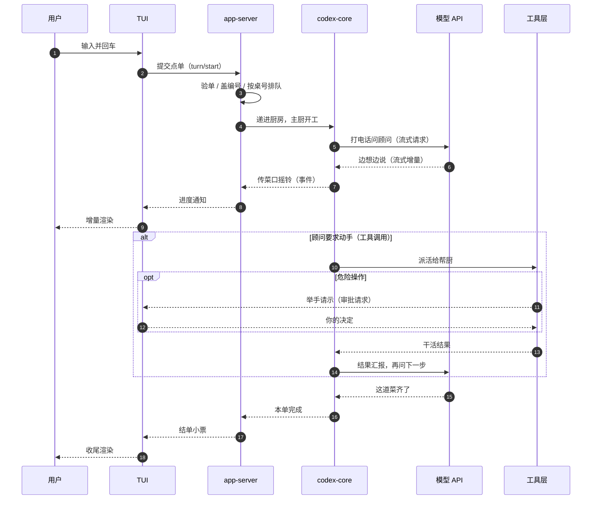

# 主时序：一次请求全链路

## 本章导读

前面几章认识的是零件：第 1 章画出了「前端 → app-server → codex-core → 模型 API」的
主干，第 4 章讲了进程怎么起、传输怎么走。本章把零件拧成一条线——跟着一次普通的
用户输入，从 TUI 的回车键一路走到模型 API，再跟着事件流走回屏幕。读完你将能够：

1. 默画出一次请求的完整时序：每一跳在哪个进程、跨哪条通道、经手哪些关键函数；
2. 说出 turn id 如何在六层组件之间保持一致，错误与中断如何沿链路传播；
3. 解释 Codex 为什么把"一次提问"建模成「立即返回的 RPC + 长尾事件流」，而不是
   一次同步调用。

**前置章节**：第 1 章「总览」、第 4 章「进程与传输」。core 内部的 turn 主循环本章
只踩点，展开在「Agent 核心」一章。

## 概念与架构

### 一个类比：餐厅点单

把一次请求想象成在餐厅点一道现做的菜：

- **你**（用户）跟**服务员**（TUI）说"来一份宫保鸡丁"；
- 服务员开单送到**收银台**（app-server）：验单（厨房是否还营业）、盖编号
  （turn id）、按桌号插进该桌的流水夹（串行化），再递进厨房；
- **主厨**（codex-core）接单开工。菜谱他记不全，每做一步都要打电话问**外聘顾问**
  （模型 API）："下一步呢？"顾问说"先下豆瓣酱"；
- **帮厨**（工具层）负责动手：开火、下料、装盘。危险操作（比如开燃气总阀）要先
  举手请示你（审批）；
- 每完成一步，**传菜口**（事件流）摇铃，服务员立刻把进度报给你——不是等整桌菜
  齐了才露面；
- 直到顾问说"这道菜齐了"，主厨挂勺，收银台把"本单完成"的小票递给你。

注意主厨与顾问之间的往返可能发生很多次：一次"点单"对应一轮"问顾问 → 动手 →
再问"的循环，这正是 agent 的最小循环。

三个结构性事实决定了这条链路的气质：

1. **提交与产出分离**。`turn/start` 只承诺"已受理"并立刻返回 turn id，真正的
   产出走另一条事件通道。
2. **链路中段有一个循环**。core 与模型 API 之间不是一问一答，而是
   「采样 → 工具 → 再采样」，直到模型不再要求动手。
3. **回程是广播，不是应答**。事件从 core 流出后被路由给所有订阅该线程的前端
   连接，TUI 只是其中一个听众。

## 源码深挖

以 TUI 为例（它经进程内 channel 走同一套 JSON-RPC 语义；IDE/SDK 仅前两段的
传输不同）。全链路拆成七个阶段。

### 阶段 1：TUI 提交 turn

回车后，输入被归约为 `AppCommand::UserTurn`
（codex-rs/tui/src/app/thread_routing.rs#L736），处理分支在
（codex-rs/tui/src/app/thread_routing.rs#L863）调用 `app_server.turn_start(...)`。
`AppServerSession::turn_start`（codex-rs/tui/src/app_server_session.rs#L1314）
把线程 id、输入、模型、审批策略等打包成 `ClientRequest::TurnStart`
（codex-rs/tui/src/app_server_session.rs#L1336），经进程内 client 发出。

### 阶段 2：app-server 门控与分发

`MessageProcessor::process_request`
（codex-rs/app-server/src/message_processor.rs#L619）反序列化后进入
`handle_client_request`（L881）与 `dispatch_initialized_client_request`（L926），
连过三道闸：

- **初始化闸**：未完成 initialize 握手的连接直接报 `Not initialized`（L933-L935）；
- **准入闸**：turn 类请求先取 `turn_admission.admit()`（L949-L965；定义在
  codex-rs/app-server/src/turn_admission.rs#L48），server 关停排空中时拒绝新 turn；
- **串行闸**：带 `serialization_scope`
  （codex-rs/app-server-protocol/src/protocol/common.rs#L256）的请求进入
  per-thread 串行队列（message_processor.rs#L1008-L1017），保证同一线程的请求
  按序执行。

过闸后由 `handle_initialized_client_request`（L1021）的大 `match` 把
`ClientRequest::TurnStart` 分发给 `turn_processor.turn_start`（L1570）。

### 阶段 3：turn_processor 翻译与提交

`turn_start`（codex-rs/app-server/src/request_processors/turn_processor.rs#L174）
委托 `turn_start_inner`（L521）：校验输入长度上限（L566-L574）、经
`load_thread`（L373）向 `ThreadManager.get_thread`（L383）取回 `CodexThread`，
组装 `TurnInputRequest` 后调用 `thread.start_or_steer_turn(...)`（L645-L665）。
返回值三分：`Started { turn_id }` / `Steered { turn_id }` / `NotSubmitted { reason }`
（类型定义在 codex-rs/protocol/src/turn_input.rs#L184）——"新起一轮"与"插队进
进行中的一轮"在这里分流。

### 阶段 4：core 收件、spawn 任务

`CodexThread::start_or_steer_turn`（codex-rs/core/src/codex_thread.rs#L321）经
`submit_turn_input_with_mode`（L461）落到 `SessionIo::submit_turn_input`
（codex-rs/core/src/session/mod.rs#L908）：请求被包成 `Op::TurnInput`（L918）
投入 `tx_sub` 邮箱，并挂一个 oneshot 等待 core 的受理决定。

`submission_loop`（codex-rs/core/src/session/handlers.rs#L529）逐条消费，
`Op::TurnInput` 分支（L589）交给 `turn_input::handle`
（codex-rs/core/src/session/turn_input.rs#L202）→ `start_or_steer`（L242）→
`session.spawn_task(turn_context, task_input, RegularTask::new())`（L328）。
注意返回给上层的 `turn_id` 就是 `submission_id`（L330-L332）——这个细节是
「技术难点」一节的主角。任务体最终执行 `run_turn`
（codex-rs/core/src/session/turn.rs#L163）。

### 阶段 5：模型采样

`run_turn` 的主循环里，每次采样由 `run_sampling_request`
（codex-rs/core/src/session/turn.rs#L1422）发起，它调用
`client_session.stream(...)`（L2308）进入 `ModelClientSession::stream`
（codex-rs/core/src/client.rs#L2027）。传输按 provider 能力与开关选择 WebSocket
或 SSE（client.rs#L1014-L1021）——流式细节与重试策略在「采样与流式处理」一章
展开。

### 阶段 6：工具调用循环

流式 item 完成时，`handle_output_item_done`
（codex-rs/core/src/stream_events_utils.rs#L293）用 `ToolRouter::build_tool_call`
（L301）识别模型发出的 function_call 并入队执行；危险动作在此转入审批链路
（见「审批与沙箱」一章）。工具结果追加回历史后回到阶段 5 再采样，直到模型不再
要求工具。

### 阶段 7：事件回程

core 侧，`Session::send_event`（codex-rs/core/src/session/mod.rs#L2135）把
`EventMsg` 包成 `Event`，其 `id` 字段填 `turn_context.sub_id`（L2156）——也就是
turn id——先记入线程轨迹（L2149-L2154），再经 `send_event_raw`（L2415）广播。

app-server 为每条线程跑一个监听器：`conversation.next_event()`
（codex-rs/app-server/src/request_processors/thread_lifecycle.rs#L306）收到事件后，
按订阅该线程的连接构造发送端（L339-L346），交给
`apply_bespoke_event_handling`（L348；定义在
codex-rs/app-server/src/bespoke_event_handling.rs#L149）翻译与路由：
`TurnStarted`（L165）建立 turn 快照，`TurnComplete`（L195）经
`handle_turn_complete` 发出 `turn/completed`，item 级事件由
`item_event_to_server_notification`
（codex-rs/app-server-protocol/src/protocol/event_mapping.rs#L30）映射成
`ServerNotification`。

TUI 侧，`ThreadEventStore::push_notification`
（codex-rs/tui/src/app/thread_events.rs#L174）把通知入账：`TurnStarted`（L198）
记下 active turn id，`TurnCompleted`（L208）触发收尾，delta 类通知驱动增量渲染
（渲染管线见「TUI 内部架构」一章）。

## 技术难点与设计取舍

**难点一：turn id 跨六层保持一致。** 一次 turn 的身份要穿过 TUI、JSON-RPC、
app-server、core 的 Op 邮箱、事件流，再回到 TUI 渲染。Codex 的解法是**让
turn id 与 submission id 同源**：core 受理时直接把 `submission_id` 作为
`turn_id` 返回（turn_input.rs#L330-L332），此后 `TurnContext.sub_id` 即 turn id——
发事件时 `Event.id` 填它（session/mod.rs#L2156），steer 时 `expected_turn_id` 经
`steer_input` 与活动 turn 比对（turn_input.rs#L492-L500；`sub_id` 与 turn id 的等同
关系在 `active_turn_root` 里更直白：codex_thread.rs#L497），审批与中断也凭它对齐。app-server 侧把在途请求与
turn id 绑定（turn_processor.rs#L1614 的 `record_request_turn_id`），
`turn/interrupt` 才知道自己该等哪一轮的 `TurnAborted`（L1618-L1624 的注释明确：
turn 中断在 `TurnAborted` 时才应答）。整条链路没有第二个编号体系，这是"跨层
透传不漂移"的根本原因。

**难点二：错误与中断沿什么通道传播。** 三类失败走三条不同的路：

- **门控失败**（未初始化、排空中、输入超长）在 RPC 层直接变成 JSON-RPC error
  应答（message_processor.rs#L934、turn_admission.rs#L48-L49、
  turn_processor.rs#L566-L574）——此时 turn 尚不存在，谈不上事件；
- **turn 内失败**以事件带状态：`EventMsg::Error` 带 `affects_turn_status` 标记时
  被记入 `TurnContext.terminal_error`（session/mod.rs#L2137-L2148），最终体现在
  `turn/completed` 的 error 字段里；
- **中断是反向注入的 Op**：`turn/interrupt` 被翻译成 `Op::Interrupt`
  （turn_processor.rs#L1621）投入同一邮箱，`submission_loop` 的中断分支
  （handlers.rs#L545）调 `interrupt_task`（session/mod.rs#L4662）→
  `abort_all_tasks(TurnAbortReason::Interrupted)`（codex-rs/core/src/tasks/mod.rs#L509），
  取消沿 run_turn → 采样 → 工具执行一路生效，turn 以中止事件收尾。

值得玩味的是取舍：中断不走带外通道，而是**排队走同一个邮箱**。这让"中断"与
"输入"天然有序——你先收到的先处理，不会出现中断比它要中断的任务更早到达的
竞态。

**难点三：并发秩序靠闸门收敛，而不是靠锁扩散。** app-server 是多连接服务，两个
前端可以同时驱动同一条线程。Codex 把秩序收敛在 app-server 一处：准入闸管"全局
是否还接活"，串行闸管"同一线程的请求按序执行"，再加上 core 侧一个 Session 一个
ActiveTurn 的模型，最终效果是链路各段都允许并发，但**同一条线程的 turn 语义严格
串行**。代价是 turn/start 的调用方必须容忍"请求被排队"这件事——这也是为什么
受理响应要设计成立即返回。

## 对照通用 agent 范式

**同步 RPC vs 事件流。** 把"一次提问"建模为一次同步 request/response 是最直觉的
形态——库内嵌框架（如 LangChain）的 `agent.run(input)`、早期 chat 包装器都是
如此：调用方阻塞到答案完整返回。这个形态在 agent 场景必然破产：一个 turn 可能跑
几分钟、中途要反问用户（审批）、产出是渐进的（流式文本与工具轨迹）。Codex 的
选择是「提交-订阅」两段式：RPC 只负责受理并签发 turn id，产出走事件流。这对应
服务端系统里的 async job 模式（POST 拿 job id，再订阅进度），也暗合命令与事件
分离的 CQRS 直觉。

**反向 RPC。** 审批在 Codex 里不是"事件"，而是 server 主动向 client 发起的
`ServerRequest`（如 `item/commandExecution/requestApproval`）——JSON-RPC 的双向
调用，与 LSP 中 server 反问 client 的 `workspace/configuration` 同理。agent 框架
能否"中途问人"，差别就在有没有这条反向通道；只有事件流的框架只能让人"旁观"，
不能让人"插手"。

**一份事件流，多个消费者。** core 的 `Event` 流同时喂给线程轨迹记录、app-server
路由和前端渲染（session/mod.rs#L2149-L2156 同框可见）。一份 append-only 的事件
日志既驱动 UI 又支撑恢复——这是事件溯源在 agent 产品里的实用形态，「持久化与
恢复」一章会展开。

## 小结与下一章预告

- 一条链路七个阶段：TUI 提交 → app-server 门控分发 → turn_processor 翻译 → core
  邮箱与 spawn → 模型采样 → 工具循环 → 事件回程；
- turn id 与 submission id 同源，是贯穿所有层的身份主线；门控错误走 RPC 应答、
  turn 内错误走事件状态、中断走反向 Op，各有各的通道；
- 「立即返回的 RPC + 长尾事件流」是 Codex 把 agent 长任务装进 JSON-RPC 框架的
  核心手法；审批则是 server → client 的反向 RPC；
- 并发秩序收敛在 app-server 的准入闸与串行闸：全链路可并发，单线程的 turn 严格
  串行。

下一章「协议层」：把这条链路上飞的所有信封拆开——`Op` 与 `EventMsg` 的全貌、
`ClientRequest` / `ServerNotification` / `ServerRequest` 三类 JSON-RPC 载荷的
字段细节。
