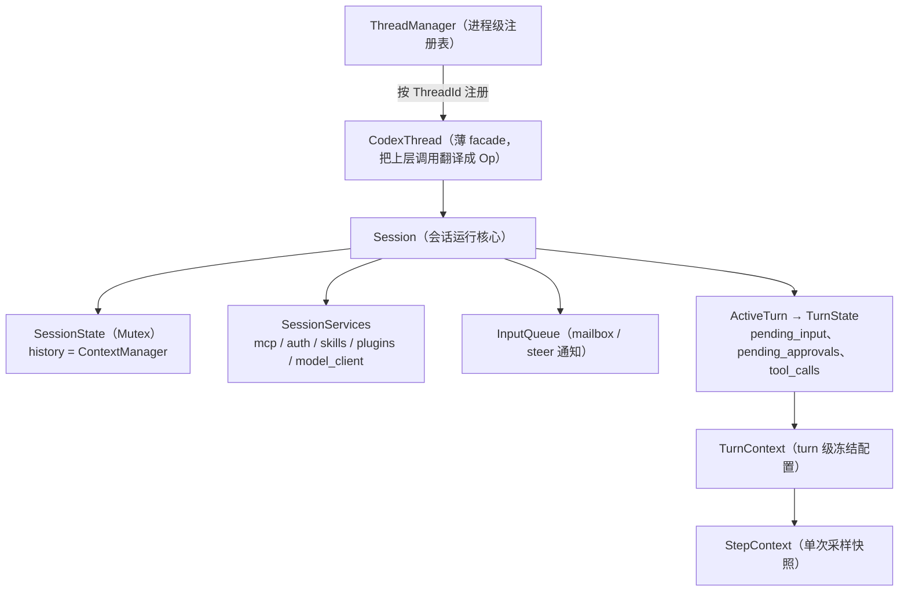
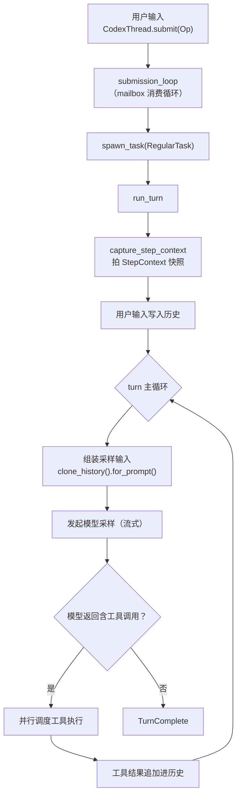
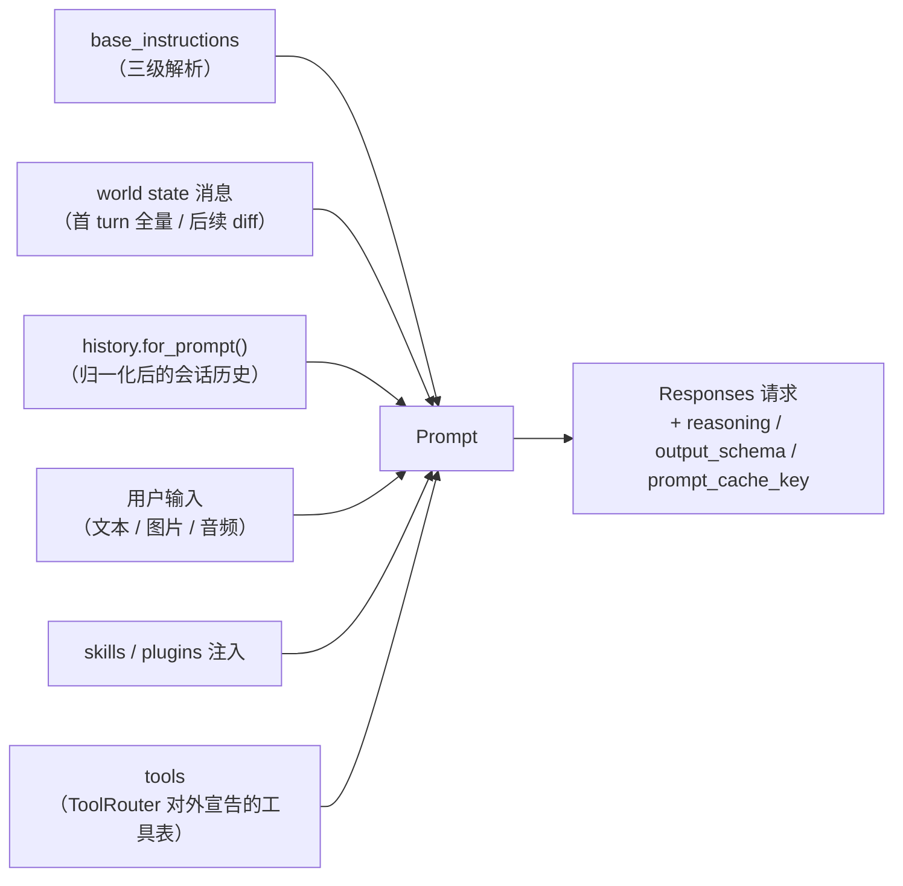

# Agent 核心：线程模型与上下文

## 本章导读

本章进入 codex-core——Codex 的 agent 引擎本体。读完你将能够：

1. 说出 ThreadManager / CodexThread / Session / TurnContext / StepContext 五层
   对象各自的职责与生命周期；
2. 描述一次用户输入从 `submit` 到 `run_turn` 再到模型采样的完整路径；
3. 解释发给模型的 input 由哪些部分组成，以及"只增不改"的历史设计为何重要。

**前置章节**：第 1 章「总览」。如果只想走主线，记住"Session 是会话核心、
TurnContext 是本轮冻结配置、StepContext 是单次采样快照"这三句话即可。

## 概念与架构

### 一个类比：外包团队的工单系统

延续第 1 章的"外包工程师团队"类比，codex-core 内部是一套工单系统：

- **ThreadManager** 是部门经理——管着所有会话的台账和共享资源
  （认证、模型信息、MCP 连接池），开工、复工、派生 subagent 都找它；
- **CodexThread** 是工单的对客窗口——上层（app-server）只跟它打交道；
- **Session** 是工单本体——一次对话的全部运行状态都挂在它身上；
- **TurnContext** 是本轮工作单——一个 turn 开始时把配置冻结下来：用哪个模型、
  在哪个目录、什么沙箱权限，本轮内不再变；
- **StepContext** 是每次"打电话问顾问"前拍的快照——一个 turn 里可能多次采样，
  每次采样前重新捕获一次，保证这次请求里上下文、工具表、权限三者互相一致。

### 线程模型

### 一个 turn 的生命周期

注意主循环的形状：**采样 → 若有工具调用就执行并把结果追加回历史 → 再采样**，
直到模型不再要求调用工具。这就是 agent 的最小循环。

## 源码深挖

### 五层对象的定义位置

| 类型 | 定义位置 | 一句话职责 |
| ---- | -------- | ---------- |
| `ThreadManager` | codex-rs/core/src/thread_manager.rs#L226 | 线程注册表 + 共享服务；`start_thread` / `resume_thread_from_rollout` / `fork_thread*` / `spawn_subagent` 入口 |
| `Session` | codex-rs/core/src/session/session.rs#L45 | 会话运行核心：`state`（Mutex）、`services`、`input_queue`、`active_turn` |
| `SessionIo` | codex-rs/core/src/session/mod.rs#L396 | Session 的 IO 端点：`tx_sub` channel 接收 Op |
| `TurnContext` | codex-rs/core/src/session/turn_context.rs#L282 | turn 级冻结配置：model、environments、sandbox_context 等 |
| `StepContext` | codex-rs/core/src/session/step_context.rs#L18-L37 | 单次采样快照：settings、tool_router、mcp binding、loaded_agents_md、token_budget |

值得停下来看一眼 `StepContext` 的字段注释（step_context.rs#L18-L37）：几乎每个
字段都强调"this exact step"——`tool_router` 是"本次采样请求对外宣告并执行的工具
计划"，`mcp` 是"本次 step 捕获的 MCP 连接、配置与目录"。这种措辞不是文档癖，
而是在声明一个不变量：**同一次采样请求里，模型看到的工具表和实际执行工具时
用的工具表，必须是同一份**。

### 从 submit 到 run_turn

上层调用 `CodexThread.submit(Op)` 后，Op 经 `SessionIo.tx_sub` channel 进入
mailbox，由 `submission_loop`（codex-rs/core/src/session/handlers.rs#L529）逐个
消费分发：`Op::TurnInput` 走 turn 输入处理并 spawn 出 `RegularTask`，审批、控制、
维护类 Op 走各自的 handler。任务最终进到 `run_turn`
（codex-rs/core/src/session/turn.rs#L163）。

spawn 的任务分三种 `TaskKind`：`Regular`（常规 turn）、`Review`（评审子线程）、
`Compact`（手动压缩）——这解释了为什么 `/review` 和 `/compact` 不会干扰主对话
的主循环。

### 上下文组装：发给模型的 input 由什么构成

关键机制：

- **快照捕获**：`capture_step_context`
  （codex-rs/core/src/session/mod.rs#L3520）在每次采样前重新执行，把当前
  历史、工具路由、MCP 绑定、AGENTS.md 缓存打包成 StepContext。
- **历史管理**：`ContextManager`
  （codex-rs/core/src/context_manager/history.rs#L69）持有对话历史，底层是
  `Arc<Vec<ResponseItem>>` 的写时复制结构，克隆代价极低；`for_prompt()` 在发给
  模型前做归一化（补缺失的工具输出、删孤儿输出、按模型输入模态剥离图片音频）。
- **注入片段的统一抽象**：所有要注入上下文的块（AGENTS.md、环境信息、权限
  说明……）都实现 `ContextualUserFragment` trait
  （codex-rs/context-fragments/src/fragment.rs#L64），提供 role / content_kind /
  markers / body 四要素。markers 让系统能在历史里定位和去重这些注入块。
- **首 turn 全量、后续 diff**：world state（环境、权限、工具清单等）首次全量
  注入并记录 baseline，之后每个 turn 只注入变化的部分，保持 prompt 前缀稳定。

### 事件如何流出

与 Op 流入相对，Session 通过事件流（`EventMsg`）向外广播进展：文本 delta、
工具调用开始/结束、审批请求、turn 完成。app-server 层把这些事件路由给对应的
前端连接——这条回程通道的细节在「协议层」和「app-server 深入」两章展开。

## 技术难点与设计取舍

**难点一：上下文、工具表、工具调用的一致性。** 一个 turn 里用户可能改配置、
MCP server 可能掉线、AGENTS.md 可能被编辑。如果采样用的是 A 版工具表、执行时
用 B 版，模型就会"调用一个此刻不存在的工具"。Codex 的解法是 StepContext：每次
采样前把三者拍进同一张快照，本次请求的承诺与执行严格对齐。代价是每步都要重新
捕获，但换来了一致性这个更重要的性质。

**难点二：prompt 缓存友好性。** LLM API 的 prompt cache 按前缀命中，历史一旦被
改写，缓存全部失效、延迟和成本暴涨。Codex 的取舍是**历史只增不改**（append-only）：
工具结果追加而不修改，world state 用 diff 注入而不重写。这直接约束了上下文系统
的每一行代码——也是 AGENTS.md 里"No history rewrite"军规的由来。

**难点三：历史的内存形态。** 会话历史要同时满足"频繁克隆给采样用"和"持续追加"。
`Arc<Vec<ResponseItem>>` 的 COW 结构让克隆是 O(1) 的指针复制，只有真正写入时才
复制底层 Vec——读多写少场景的经典选择。

## 对照通用 agent 范式

**Agent loop。** 学术与工程界的 agent loop 抽象（ReAct 的
Thought-Action-Observation 循环）在 Codex 里落地为：采样（Thought）→ 工具调用
（Action）→ 结果回灌历史（Observation）→ 再采样。Codex 的特化在于循环的每一步
都被显式建模成类型：TurnContext、StepContext、TaskKind，而不是散落在过程式代码里。

**上下文工程（context engineering）。** 2024 年后业界逐渐共识：agent 质量的核心
变量是"每次采样时上下文里有什么"。Codex 是这个共识的工业级样本——注入片段统一
抽象（ContextualUserFragment）、全量/diff 两阶段注入、append-only 历史配 prompt
缓存，三者合起来就是一套完整的上下文工程方法论。

**状态机而非聊天历史。** 普通聊天应用把"会话"建模为消息列表；Codex 把会话建模为
带并发控制的状态机（Mutex 保护的 SessionState、mailbox 输入、ActiveTurn 生命周期）。
这是"能聊天的 demo"和"能被多前端并发驱动的 agent 服务"之间的本质差别。

## 小结与下一章预告

- 五层对象：ThreadManager（注册表）→ CodexThread（facade）→ Session（会话核心）
  → TurnContext（本轮冻结配置）→ StepContext（单次采样快照）；
- 用户输入经 mailbox 进入 submission_loop，spawn 成任务后进入 run_turn 主循环：
  采样 → 工具调用 → 结果回灌 → 再采样，直到没有工具调用；
- 上下文三原则：StepContext 保证一致性、append-only 保证缓存友好、COW 历史保证
  克隆廉价。

下一章「采样与流式处理」：run_turn 里那次"发起模型采样"具体怎么发生——
WebSocket 与 SSE 两条传输路径、重试策略、流式 item 如何被逐块分发处理。
