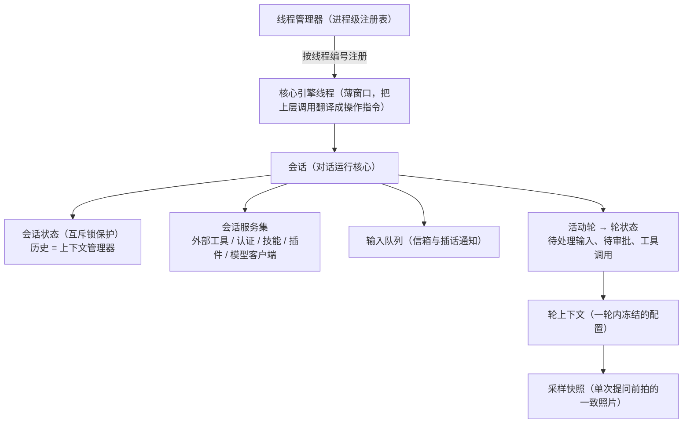
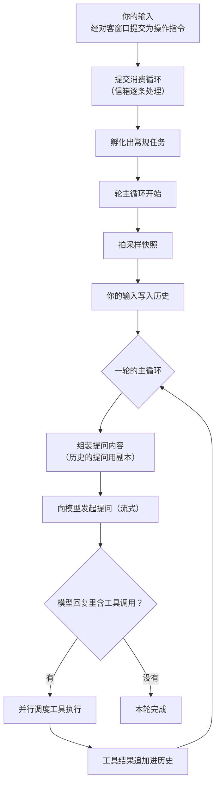
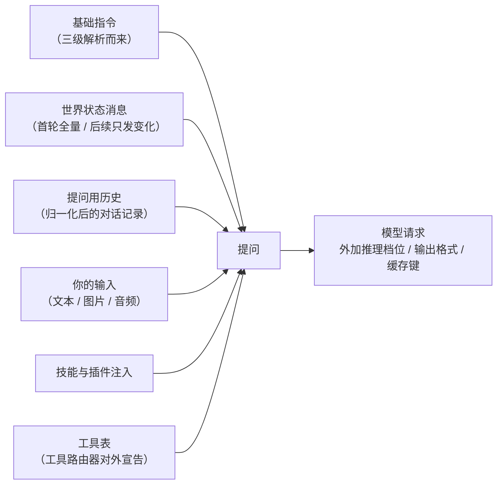

# Agent 核心：线程模型与上下文

## 本章导读

想象这样一个场景：你让 Codex"把登录页的校验补上"。它回了你一句话，然后
自己跑了一条命令、读了两个文件、又跑了一条命令，来回好几趟，最后才说
"改完了"。在这几十秒里，它跑的这些命令、读到的内容、你中途改过的设置，
全都得被记住、被对齐，一样都不能错——否则它就会"调用一个此刻已经不存
在的工具"，或者拿着过期的配置继续干活。

这一章要回答的就是：**Codex 的大脑内部，是用怎样一套对象把"一次对话"
管起来的？** 为什么它要把配置一层层"冻结"成快照，而不是用到时现查？

读完本章，你将能够：

1. 说出"线程管理器、核心引擎线程、会话、轮上下文、采样快照"这五层对象
   各自管什么、活多久；
2. 描述你的一句话从提交进去，到模型开始思考，中间走过的完整路径；
3. 解释发给模型的内容是怎么拼出来的，以及"历史只增不改"这条军规为什么
   重要。

**前置章节**：第 1 章「总览」。如果只想走主线，记住三句话即可：会话是
对话的运行核心，轮上下文是这一轮冻结下来的配置，采样快照是每次问模型
之前拍的一张一致的照片。

## 概念与架构

### 一个类比：外包团队的工单系统

延续第 1 章的"外包工程师团队"类比。如果说整个 Codex 是一家外包公司，
那么核心引擎内部就是这家公司的工单系统，从上到下分五层：

- **线程管理器**是部门经理——管着所有对话的台账和共享家当（登录凭据、
  模型清单、外部工具的连接池）。开新单、恢复旧单、派生下属子对话，都
  找它；
- **核心引擎线程**是工单的对客窗口——上层（应用服务）只跟它打交道，
  它把上层的要求翻译成内部操作指令，投进信箱；
- **会话**是工单本体——一次对话的全部运行状态都挂在它身上：历史记录、
  正在进行的活、等待审批的事；
- **轮上下文**是本轮工作单——每一轮（你发一句话到它答完，算一轮）开始
  时，把配置冻结下来：用哪个模型、在哪个目录干活、有什么权限。这一轮
  之内不再变；
- **采样快照**是每次"打电话问顾问"前拍的一张照片——一轮里可能多次向
  模型提问，每次提问前重新拍一张，保证这次提问里，对话上下文、可用
  工具表、权限设定三者互相对得上。

为什么要这么麻烦？因为对话进行中世界一直在变：你可能改了配置，外部
工具可能掉线，项目说明文件可能被编辑。如果提问时按 A 版工具表问、执行
时按 B 版工具表做，就会出事故。快照制度就是为了堵住这个口子。

### 线程模型

下面这张图画出这五层对象以及会话身上的主要零件。重点看归属关系：谁
挂在谁身上，谁被谁持有。

读法很简单：左边三层（管理器、窗口、会话）寿命长，跟着对话走；右边
两层（轮上下文、采样快照）寿命短，一轮一建、一问一拍。

### 一轮的生命周期

再看你的一句话是怎么被消化的。这张图跟踪一条输入从进来到结束的全过程，
注意中间那个循环的形状。

主循环的形状只有一句话：**问模型 → 如果它要调用工具就执行、把结果追加
回历史 → 再问**，直到它不再要求调用工具为止。这就是"智能体"最朴素
的骨架，后面第 8 章会把"问模型"这一步放大，第 11 章会把"执行工具"
这一步放大。

## 出场角色

进入源码之前，先认识本章出场的全部角色。下表的"所在文件"都是仓库内
相对路径，现在记不住没关系，读到正文时翻回来对照即可。

| 中文名 | 英文名 | 职责 | 所在文件 |
| ------ | ------ | ---- | -------- |
| 线程管理器 | ThreadManager | 线程注册表加共享服务：开工、复工、派生子对话的入口 | codex-rs/core/src/thread_manager.rs |
| 核心引擎线程 | CodexThread | 对客窗口：上层只跟它打交道，它把调用翻译成操作指令 | codex-rs/core/src/codex_thread.rs |
| 会话 | Session | 对话运行核心：持有状态、服务集、输入队列、活动轮 | codex-rs/core/src/session/session.rs |
| 会话服务端点 | SessionIo | 会话的收发端点：提交通道接收操作指令，事件通道向外广播 | codex-rs/core/src/session/mod.rs |
| 输入队列 | InputQueue | 信箱：暂存输入并支持"插话"式追加 | codex-rs/core/src/session/input_queue.rs |
| 轮上下文 | TurnContext | 一轮内冻结的配置：模型、环境、沙箱权限等 | codex-rs/core/src/session/turn_context.rs |
| 采样快照 | StepContext | 单次提问前拍的一致快照：设置、工具路由器、外部工具绑定等 | codex-rs/core/src/session/step_context.rs |
| 任务种类 | TaskKind | 区分三种后台任务：常规、评审、手动压缩 | codex-rs/core/src/state/turn.rs |
| 提交消费循环 | submission_loop | 逐个取出信箱里的操作指令并分发的循环（函数） | codex-rs/core/src/session/handlers.rs |
| 轮主循环 | run_turn | 一轮的主循环本体（函数）：拍快照、问模型、执行工具 | codex-rs/core/src/session/turn.rs |
| 快照捕获函数 | capture_step_context | 每次提问前重新打包采样快照的函数 | codex-rs/core/src/session/mod.rs |
| 上下文管理器 | ContextManager | 持有对话历史，底层是写时复制结构，克隆极廉价 | codex-rs/core/src/context_manager/history.rs |
| 提问用历史函数 | for_prompt | 把历史归一化成可发给模型的形态（函数） | codex-rs/core/src/context_manager/history.rs |
| 上下文注入片段 | ContextualUserFragment | 所有注入块的统一接口：角色、类别、标记、正文四要素 | codex-rs/context-fragments/src/fragment.rs |
| 工具路由器 | ToolRouter | 对外宣告并执行本轮工具计划（第 11 章展开） | codex-rs/core/src/tools |
| 模型客户端会话 | ModelClientSession | 与模型服务的一次流式会话（第 8 章展开） | codex-rs/core/src/client.rs |
| 操作指令 | Op | 上层发给会话的指令信封：输入、审批、控制、维护 | codex-rs/protocol/src/protocol.rs |
| 事件通知 | EventMsg | 会话向外广播进展的消息类型 | codex-rs/protocol/src/protocol.rs |

## 源码深挖

### 五层对象的定义位置

这一小节先把概念段里的五层对象逐一落到代码上，确认它们真实存在、各
自的定义在哪一行。读完你会拿到一张"按图索骥"的坐标表，后面几小节都
以它为起点。

| 类型 | 定义位置 | 一句话职责 |
| ---- | -------- | ---------- |
| `ThreadManager` | codex-rs/core/src/thread_manager.rs#L226 | 线程注册表加共享服务；开工、按存档流水复工、派生、孵化子对话的入口都在这里 |
| `CodexThread` | codex-rs/core/src/codex_thread.rs#L178 | 薄窗口：内部就是会话加收发端点，外加生命周期钩子 |
| `Session` | codex-rs/core/src/session/session.rs#L45 | 会话运行核心：`state`（互斥锁保护）、`services`、`input_queue`、`active_turn` |
| `SessionIo` | codex-rs/core/src/session/mod.rs#L395 | 会话的收发端点：`tx_sub` 通道接收操作指令 |
| `TurnContext` | codex-rs/core/src/session/turn_context.rs#L282 | 轮级冻结配置：模型、环境、沙箱上下文等 |
| `StepContext` | codex-rs/core/src/session/step_context.rs#L18-L37 | 单次采样快照：设置、工具路由器、外部工具绑定、说明文件缓存、令牌预算 |

值得停下来看一眼采样快照的字段注释（codex-rs/core/src/session/step_context.rs#L18-L37）：
几乎每个字段都强调"这一次"——工具路由器是"本次采样请求对外宣告并执行的
工具计划"，外部工具绑定是"本次捕获的连接、配置与目录"。这种措辞不是文档
癖，而是在声明一个不变量：**同一次提问里，模型看到的工具表和实际执行工
具时用的工具表，必须是同一份**。

### 从提交到轮主循环

这一小节跟踪一条输入的旅程：它怎样从对客窗口进入信箱，又怎样被孵化成
一个后台任务、走进主循环。读完你就明白为什么"评审""压缩"这类特殊任务
不会干扰主对话。

上层调用核心引擎线程的提交方法后，操作指令（Op）经会话服务端点的
`tx_sub` 通道进入信箱，由提交消费循环（codex-rs/core/src/session/handlers.rs#L529）
逐个取出分发：输入类指令走轮输入处理并孵化出常规任务，审批、控制、维护
类指令走各自的处理函数。任务最终进入轮主循环 run_turn
（codex-rs/core/src/session/turn.rs#L163）。

孵化出的任务分三种，由任务种类（codex-rs/core/src/state/turn.rs#L69）
区分：常规、评审、手动压缩。评审子线程和手动压缩各占各的任务槽，这解释
了为什么它们不会干扰主对话的主循环。另外，轮主循环的签名里还接收一个
模型客户端会话——与模型服务的一次流式连接，它的创建与复用是第 8 章
「采样与流式处理」的主题。

### 上下文组装：发给模型的内容由什么构成

这一小节回答导读里的第二个问题：每次"问模型"，Codex 到底把哪些东西
塞进了提问？先给一张组装全景图，再逐块解释。

关键机制有四个：

- **快照捕获**：快照捕获函数（codex-rs/core/src/session/mod.rs#L3520）
  在每次提问前重新执行，把当前历史、工具路由、外部工具绑定、项目说明
  文件（AGENTS.md，仓库里写给智能体看的说明书）缓存打包成一份新的
  采样快照。
- **历史管理**：上下文管理器（codex-rs/core/src/context_manager/history.rs#L69）
  持有对话历史，底层是共享指针包裹的数组，采用写时复制（多个读者共享
  同一份数据，只有真正要改时才复制）结构，克隆代价极低。提问用历史
  函数（codex-rs/core/src/context_manager/history.rs#L392）在发送前
  做归一化：补齐缺失的工具输出、删掉没有着落的孤儿输出、按模型支持
  的输入模态剥离图片和音频。
- **注入片段的统一抽象**：所有要注入上下文的块（说明文件、环境信息、
  权限说明……）都实现上下文注入片段接口
  （codex-rs/context-fragments/src/fragment.rs#L64），提供角色、内容
  类别、标记、正文四要素。标记让系统能在历史里定位并去重这些注入块。
- **首轮全量、后续只发变化**：世界状态（环境、权限、工具清单等）首次
  全量注入并记下基准，之后每一轮只注入变化的部分，保持提问前缀稳定
  ——这一点的重要性在下一节展开。

### 事件如何流出

这一小节看回程方向：输入是流进去的，进展是流出来的。读完你会知道终端
界面里那些逐字蹦出的回复、工具调用的开始与结束提示，源头在哪里。

与操作指令流入相对，会话通过事件通知（codex-rs/protocol/src/protocol.rs#L1360）
向外广播进展：文本增量、工具调用开始与结束、审批请求、本轮完成。应用
服务层把这些事件路由给对应的前端连接——这条回程通道的细节在第 6 章
「协议层」和第 16 章「应用服务深入」展开。

## 技术难点与设计取舍

**难点一：上下文、工具表、工具执行的一致性。** 一轮之中，你可能改配置、
外部工具可能掉线、项目说明文件可能被编辑。如果提问用 A 版工具表、执行
用 B 版，模型就会"调用一个此刻不存在的工具"。Codex 的解法是采样快照：
每次提问前把三者拍进同一张照片，本次请求的承诺与执行严格对齐。代价是
每步都要重新捕获，但换来了一致性这个更重要的性质。

**难点二：提示词缓存的友好性。** 模型服务的提示词缓存按前缀命中——
提问开头和上次一样，就能复用上次的计算，又快又便宜；历史一旦被改写，
缓存全部失效，延迟和成本暴涨。Codex 的取舍是**历史只增不改**：工具结果
只追加、不修改，世界状态只发变化、不重写。这条取舍直接约束了上下文
系统的每一行代码——它也是仓库里"禁止重写历史"军规的由来（副作用与
例外见第 9 章「上下文压缩」）。

**难点三：历史的内存形态。** 对话历史要同时满足两个互相打架的要求：
"频繁克隆给提问用"和"持续追加新内容"。共享指针加写时复制的结构让克隆
只是一次指针复制，只有真正写入时才复制底层数组——这是读多写少场景的
经典选择。

## 对照通用 agent 范式

**智能体循环。** 学术与工程界常用的智能体循环抽象（ReAct 框架的
"思考—行动—观察"三段循环）在 Codex 里落地为：采样（思考）→ 工具调用
（行动）→ 结果回灌历史（观察）→ 再采样。Codex 的特化在于：循环的每一
步都被显式建模成类型——轮上下文、采样快照、任务种类，而不是散落在
过程式代码里。

**上下文工程。** 2024 年后业界逐渐形成共识：智能体质量的核心变量是
"每次采样时上下文里放了什么"。Codex 是这个共识的工业级样本——注入
片段统一抽象、全量加增量两阶段注入、只增不改的历史配合提示词缓存，
三者合起来就是一套完整的上下文工程方法论。

**状态机而非聊天列表。** 普通聊天应用把"会话"建模为消息列表；Codex 把
会话建模为带并发控制的状态机：互斥锁保护的会话状态、信箱式输入、活动
轮的生命周期管理。这是"能聊天的演示程序"和"能被多前端并发驱动的智能
体服务"之间的本质差别。

## 小结与下一章预告

- 五层对象：线程管理器（注册表）→ 核心引擎线程（对客窗口）→ 会话
  （运行核心）→ 轮上下文（本轮冻结配置）→ 采样快照（单次提问的一致
  照片）；
- 你的输入经信箱进入提交消费循环，孵化成任务后进入轮主循环：采样 →
  工具调用 → 结果回灌 → 再采样，直到模型不再要求调用工具；
- 上下文三原则：采样快照保证一致性、只增不改保证缓存友好、写时复制
  历史保证克隆廉价。

下一章（第 8 章）「采样与流式处理」：轮主循环里那次"向模型发起提问"
具体怎么发生——两条网络传输路径、重试策略、流式回复如何被逐块分发
处理。
