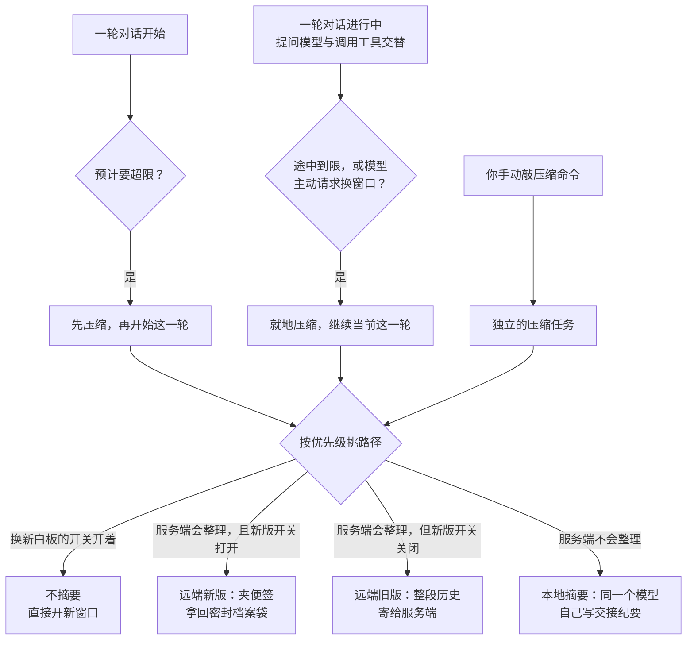

# 上下文压缩

## 本章导读

从一个你可能真的遇到过的场景开始：**你和 Codex 结对改了一下午的 bug，对话越拉越长。突然，它输出了一份"截至目前的进展与待办"，然后接着干活，仿佛刚才把整段对话"温习"了一遍。**

它刚才对自己做了一次压缩。为什么要压缩？因为模型的记性是有容量上限的：它能同时"看到"的对话内容有一个固定额度，这个额度叫上下文窗口。对话一路变长，总有快装满的一天。到那时，最省事的办法是把最早的对话直接扔掉——可最早的部分往往写着最初的目标和约束，扔了等于白干。本章回答的问题就是：**对话长到装不下时，Codex 怎么办？**

读完本章，你将能够：

1. 说出压缩在哪些时机发生——一轮对话开始之前、一轮对话进行之中、你手动发起，共三种，各自的判定条件是什么；
2. 画出 Codex 挑选压缩方式的优先级：什么时候直接换一块新白板，什么时候请模型服务端代劳整理，什么时候让模型自己写交接纪要；
3. 解释压缩为什么不违背"档案只增不改"的规矩：内存里的工作记录可以整体换掉，磁盘上的完整对话档案只会往后追加、从不改写。

**前置章节**：第 7 章「Agent 核心」（会话与一轮对话怎么跑、"历史只增不改"的规矩）、第 8 章「采样与流式处理」（一次模型请求如何发出与重试）。

## 概念与架构

### 一个类比：交接班的会议记录员

先引入一个贯穿本章的词：词元——模型计量文本的单位，英文里大约四分之三个单词算一个词元，中文里大致一个汉字上下。上下文窗口的容量、用量、阈值，全都按词元数来算。

现在，把一场长对话想成开了三小时的会议，白板快写满了。压缩就是会议记录员的交接动作，有三种做法：

- **自己写交接纪要（本地摘要）**：记录员自己把三小时讨论浓缩成一页交接纪要——进展、已做的决定、约束、待办；然后把白板擦掉，只留最近几段原始发言和这页纪要，会议继续。好处是记录不出院子，坏处是纪要终究不如原话全。
- **请总部整理（远端压缩）**：把整本会议记录快递给总部的专业整理员，拿回一份整理好的版本钉回白板。整理员更专业，但记录要出院子，你得信任对方。这种方式有新旧两版：旧版把整本记录寄过去；新版更省事——只在记录末尾夹一张"请整理"的便签，总部顺着记录看完，递回一个密封的档案袋。袋子你不拆开看，下次开会原样带上即可。
- **直接换新白板（词元预算模式）**：最激进——不整理了，旧白板拍照存档，换一块新白板从头开始写。

三种做法共享一条铁律：**档案室里的原始记录一页都不会少**。白板上擦掉的是工作记忆；档案室里只会追加一条"第 N 块白板已归档、新白板内容如下"的新记录。这正是第 7 章"历史只增不改"军规与压缩的分工：模型可见的工作记录可以整体换，磁盘上的审计档案只追加。

### 什么时候触发、走哪条路

下面这张图画两件事：压缩在什么时机被触发（图的上半），触发之后按什么优先级挑选做法（图的下半）。节点上的短语后文都会逐一对应到代码。

看完这张图，记住两个不在图上的细节。第一，"一轮开始前"的判定不止用量到限：中途换了窗口更小的模型、或者模型认得的"压缩指纹"变了（指纹是服务端用来辨认压缩结果格式的标记，变了说明新旧理解方式对不上），都会先压一次再开会。第二，手动压缩与自动压缩共用同一套挑路径的逻辑，只是作为独立的后台任务运行，不打断主对话。

## 出场角色

进入源码之前，先认识本章要出场的角色。下表的"所在文件"都是仓库内的相对路径，现在记不住没关系，读到正文时翻回来对照即可。

| 中文名 | 英文名 | 职责（一句话） | 所在文件 |
| ------ | ------ | -------------- | -------- |
| 轮主循环 | run_turn | 执行"一轮对话"的主函数，压缩的轮前与轮中触发点都挂在它身上 | codex-rs/core/src/session/turn.rs |
| 采样前压缩检查 | run_pre_sampling_compact | 每轮向模型提问前，检查是否该先压缩 | codex-rs/core/src/session/turn.rs |
| 换模型压缩检查 | maybe_run_previous_model_inline_compact | 换模型或压缩指纹变化时，先用上一模型压一次 | codex-rs/core/src/session/turn.rs |
| 自动压缩分派器 | run_auto_compact | 按优先级在四条实现路径中选择一条执行 | codex-rs/core/src/session/turn.rs |
| 压缩原因 | CompactionReason | 标记这次压缩为什么发生（四个变体） | codex-rs/analytics/src/facts.rs |
| 压缩阶段 | CompactionPhase | 标记压缩发生在轮前还是轮中 | codex-rs/analytics/src/facts.rs |
| 操作指令·压缩 | Op::Compact | 用户手动要求压缩的命令变体 | codex-rs/protocol/src/protocol.rs |
| 手动压缩任务 | CompactTask | 手动压缩的执行体，作为后台任务独立运行 | codex-rs/core/src/tasks/compact.rs |
| 任务种类 | TaskKind | 区分后台任务的类型，压缩是其中一种 | codex-rs/core/src/state/turn.rs |
| 窗口用量判定器 | context_window_token_status_with_config | 算出当前词元用量是否到限 | codex-rs/core/src/session/context_window.rs |
| 统计口径 | AutoCompactTokenLimitScope | 决定数全部活跃词元，还是只数本窗口内新增 | codex-rs/protocol/src/config_types.rs |
| 模型默认阈值 | auto_compact_token_limit | 模型级的默认触发线：窗口的九成与配置上限取小 | codex-rs/protocol/src/openai_models.rs |
| 摘要提示词 | SUMMARIZATION_PROMPT | 教模型写交接纪要的提示词模板 | codex-rs/prompts/src/compact.rs |
| 摘要前缀 | SUMMARY_PREFIX | 摘要开头的固定标记，声明"这是另一个模型的交接" | codex-rs/prompts/src/compact.rs |
| 初始上下文注入策略 | InitialContextInjection | 决定压缩后的新历史里，初始上下文放不放、放哪 | codex-rs/core/src/compact.rs |
| 流式收尾器 | drain_to_completed | 把一次流式响应从头到尾读完 | codex-rs/core/src/compact.rs |
| 本地摘要模块 | compact.rs | 路径四"模型自己写交接纪要"的实现 | codex-rs/core/src/compact.rs |
| 词元预算模块 | compact_token_budget.rs | 路径一"不摘要、直接开新窗口"的实现 | codex-rs/core/src/compact_token_budget.rs |
| 远端旧版模块 | compact_remote.rs | 路径三"整段历史寄给服务端"的实现 | codex-rs/core/src/compact_remote.rs |
| 远端新版模块 | compact_remote_v2.rs | 路径二"夹便签、拿回密封档案袋"的实现 | codex-rs/core/src/compact_remote_v2.rs |
| 远端压缩请求构造器 | compact_conversation_history | 把整理请求打包发给服务端的整理接口 | codex-rs/core/src/compact_remote_request.rs |
| 压缩触发器条目 | ResponseItem::CompactionTrigger | 追加在历史末尾的"请整理"便签 | codex-rs/core/src/compact_remote_v2_attempt.rs |
| 历史过滤器 | should_keep_compacted_history_item | 过滤服务端整理回来的历史，防注入回流 | codex-rs/core/src/compact_remote.rs |
| 发送前瘦身器 | trim_function_call_history_to_fit_context_window | 发请求前把超长工具输出改写成占位文本 | codex-rs/core/src/compact_remote.rs |
| 回退判定器 | should_retry_with_current_model | 上一模型压缩失败时，判断是否换当前模型重试 | codex-rs/core/src/compact_model_fallback.rs |
| 开新窗口 | start_new_context_window | 在会话里换一块新白板 | codex-rs/core/src/session/mod.rs |
| 落地总入口 | Session::replace_compacted_history | 内存替换、磁盘追加、事件外发的汇合点 | codex-rs/core/src/session/mod.rs |
| 历史替换器 | ContextManager::replace_annotated | 真正换掉模型可见历史的底层方法 | codex-rs/core/src/context_manager/history.rs |
| 存档检查点 | RolloutItem::Compacted | 追加进存档流水的"第 N 块白板已归档"记录 | codex-rs/history/src/lib.rs |
| 压缩完成条目 | TurnItem::ContextCompaction | 通知前端"压缩完成"的条目 | codex-rs/protocol/src/items.rs |
| 压缩完成事件 | EventMsg::ContextCompacted | 旧版事件格式里的压缩完成通知 | codex-rs/protocol/src/legacy_events.rs |
| 特性开关 | Feature | 控制词元预算模式与远端新版是否启用的开关总表 | codex-rs/features/src/lib.rs |
| 远端压缩能力 | RemoteCompactionSupport | 描述模型服务商支持哪种远端压缩 | codex-rs/model-provider/src/provider.rs |
| 压缩前后钩子 | run_pre_compact_hooks / run_post_compact_hooks | 让外部扩展在压缩前后插手，可叫停 | codex-rs/core/src/hook_runtime.rs |

## 源码深挖

### 三类触发点：轮前、轮中、手动

这一小节把概念图上半部分的三个触发框落成代码：轮主循环在哪一行检查"该压了吗"，手动命令怎么绕开主对话单独跑。出场的有轮主循环、采样前压缩检查、换模型压缩检查、压缩原因、压缩阶段、操作指令与手动压缩任务。读完你将能说出三类触发点各自的判定条件与代码位置。

先看总表，再逐行展开：

| 触发时机 | 代码位置 | 条件与备注 |
| -------- | -------- | ---------- |
| 轮前（PreTurn） | 采样前压缩检查（codex-rs/core/src/session/turn.rs#L1093），由轮主循环开头调用（turn.rs#L180） | 用量到限标志为真，则以"到限"为理由压缩（turn.rs#L1105-L1119） |
| 轮前（换模型） | 换模型压缩检查（turn.rs#L1161） | 压缩指纹变了 → 理由"指纹变化"（turn.rs#L1198）；旧窗口活跃词元超新模型阈值且窗口变小 → 理由"降级换模型"（turn.rs#L1246） |
| 轮中（MidTurn） | 轮主循环内部（turn.rs#L522-L535） | 本轮还需继续，且（模型请求新窗口或词元到限）（turn.rs#L510-L511）；压缩完继续当前这一轮 |
| 手动 | 操作指令 Op::Compact → compact()（codex-rs/core/src/session/handlers.rs#L679）→ 派生手动压缩任务（handlers.rs#L251） | 任务种类为压缩（codex-rs/core/src/tasks/compact.rs#L20-L22），与主对话互不干扰 |

几个细节值得展开。压缩原因（CompactionReason）的四个变体——用户请求（UserRequested）、到限（ContextLimit）、降级换模型（ModelDownshift）、指纹变化（CompHashChanged）——定义在数据分析代码包（analytics，全书的埋点都汇总在那里）的 codex-rs/analytics/src/facts.rs#L425-L430；与它配对的压缩阶段（CompactionPhase，facts.rs#L442）标记这次压缩是轮前还是轮中。也就是说，每一次压缩从触发起就有完整的埋点档案。

手动触发这条链路也值得看一眼全貌：你在界面里敲压缩命令，前端发出操作指令（Op）里的压缩变体（codex-rs/protocol/src/protocol.rs#L734）；会话的处理器收到后调用 compact()，后者并不就地干活，而是派生一个手动压缩任务挂到后台。任务种类（TaskKind，codex-rs/core/src/state/turn.rs#L69）里压缩是独立的一种，所以它能与主对话互不干扰地跑完。

### 四条路径的优先级选择

这一小节把概念图下半部分的"挑路径"落成代码：一个分派器、一份优先级表。出场的是自动压缩分派器、特性开关、远端压缩能力和四个实现模块。读完你将能默写这张优先级表，并知道手动与自动压缩的选择逻辑是同一份。

自动压缩统一由自动压缩分派器（turn.rs#L1259-L1339）分派；手动任务在手动压缩任务的执行方法（codex-rs/core/src/tasks/compact.rs#L28-L85）里有一份同构的选择逻辑——读懂其中一份，另一份不用再读。优先级表如下：

| 优先级 | 条件 | 实现模块（分派处） | 本质 |
| ------ | ---- | ------------------ | ---- |
| 1 | 词元预算开关（特性开关的一员，枚举定义在 codex-rs/features/src/lib.rs#L93）打开 | 词元预算模块（turn.rs#L1270-L1279） | 不摘要，直接开新窗口（codex-rs/core/src/session/mod.rs#L4265） |
| 2 | 服务商支持远端压缩，且新版开关打开 | 远端新版模块（turn.rs#L1283-L1304） | 历史末尾追加触发器条目，走普通流式请求 |
| 3 | 服务商支持远端压缩，但新版开关关闭 | 远端旧版模块（turn.rs#L1305-L1321） | 打到服务端的整理接口（路径常量 "/responses/compact" 在 codex-rs/core/src/client.rs#L171），整段历史交给服务端 |
| 4 | 服务商不支持远端压缩 | 本地摘要模块（turn.rs#L1322-L1336） | 本地用同一模型写交接纪要 |

服务商"会不会整理"由远端压缩能力（RemoteCompactionSupport，codex-rs/model-provider/src/provider.rs#L46）描述，它来自模型服务商配置（第 3 章「配置与认证」讲过配置体系）。换句话说，走哪条路由两件事共同决定：服务商的能力，加上你手里的开关。

### 词元预算怎么定

这一小节回答一个朴素的问题："快装满了"到底是怎么算的？出场的只有窗口用量判定器、统计口径和模型默认阈值三个角色。读完你会知道判定里有两种数法、一条默认线、一个硬顶。

判定集中在窗口用量判定器（codex-rs/core/src/session/context_window.rs#L52），它做三件事：

- **选口径**（context_window.rs#L60-L80）：统计口径（AutoCompactTokenLimitScope，枚举定义在 codex-rs/protocol/src/config_types.rs#L49）有两个变体。数全部（Total）口径数当前全部活跃词元；数新增（BodyAfterPrefix）口径扣除当前压缩窗口的预填基线，只数本窗口内新增的部分。
- **对阈值**：数全部口径用模型默认阈值（auto_compact_token_limit()）——上下文窗口的九成与模型配置上限取小（codex-rs/protocol/src/openai_models.rs#L515-L523）；数新增口径允许你的配置项直接覆盖默认值（context_window.rs#L71-L73）。
- **设硬顶**（context_window.rs#L83-L85）：窗口容量乘以一个有效百分比再除以一百，与口径无关；口径超限或硬顶触达，都会让用量到限标志为真（context_window.rs#L104-L109）。

硬顶的意义在于兜底：哪怕口径配置得再宽松，物理窗口快满时也必须压。

### 路径四：本地摘要，模型自己写交接纪要

这一小节走读最自给自足的一条路径：不依赖服务端任何特殊能力，只用一次普通的模型请求就完成压缩。它也是理解压缩语义的最好样本。出场角色：摘要提示词、摘要前缀、流式收尾器、初始上下文注入策略、压缩前后钩子。读完你会知道一份"交接纪要"从发起到落盘的每一步。

整个过程六步：

1. **摘要提示词入历史**：取你的配置项 compact_prompt，缺省用摘要提示词（codex-rs/prompts/src/compact.rs#L1；模板要求产出交接纪要：进展、决策、约束、待办、关键数据），作为一条用户消息追加到历史尾部（codex-rs/core/src/compact.rs#L259-L265）。
2. **发一次无工具请求**：向同一个模型发起请求，不带任何工具，由流式收尾器（compact.rs#L763）把响应从头读到尾。
3. **重建历史**：从最新往最旧挑真实用户消息，预算是用户消息保留上限（COMPACT_USER_MESSAGE_MAX_TOKENS，两万词元，compact.rs#L64；挑选与截断在 compact.rs#L684-L716）；最后追加摘要。摘要文本带固定前缀（摘要前缀，使用处在 compact.rs#L360），向模型明示"这是另一个模型留下的交接"。
4. **决定初始上下文怎么放**：由初始上下文注入策略（compact.rs#L66-L81）裁定。轮中压缩时，初始上下文插到最后一条真实用户消息之前、摘要保持垫底——代码注释直言：模型就是按这种版面训练的。轮前与手动压缩则不注入，等下一轮全量重注。
5. **失败重试**：摘要请求自身撞上窗口超限错误（ContextWindowExceeded，服务商说"你这次给的也太多了"）时，从最旧一项开始删再重试（compact.rs#L318-L326），注释写明理由——保住前缀缓存。
6. **可中止**：压缩前钩子与压缩后钩子（运行入口在 codex-rs/core/src/hook_runtime.rs#L528）任一返回"停止"，压缩就以"本轮中止"错误（CodexErr::TurnAborted）收场（compact.rs#L198-L213、L224-L237）。

### 路径二、三：远端新版与旧版

这一小节对比两种"请总部整理"的方式：旧版寄整本记录，新版只夹一张便签。出场角色：远端压缩请求构造器、压缩触发器条目、历史过滤器、发送前瘦身器、回退判定器。读完你会知道两种方式的请求、返回与新历史各有什么不同，以及它们共享的两处工程细节。

| 对比项 | 旧版（compact_remote.rs） | 新版（compact_remote_v2.rs） |
| ---- | ---- | ---- |
| 请求 | 带工具的完整提示词，调远端压缩请求构造器（codex-rs/core/src/compact_remote_request.rs#L79-L104；客户端方法本体在 codex-rs/core/src/client.rs#L580） | 历史末尾追加压缩触发器条目（codex-rs/core/src/compact_remote_v2_attempt.rs#L76），走普通流式请求 |
| 返回 | 服务端整理好的整段历史 | 要求响应里恰含一个压缩条目，否则报致命错误（codex-rs/core/src/compact_remote_v2.rs#L475-L479）；条目内容加密，客户端不读 |
| 新历史 | 经历史过滤器过滤（compact_remote.rs#L374-L401）：丢掉开发者消息与工具调用类条目，保留真实用户与助手消息 | 本地自挑保留集（compact_remote_v2.rs#L504-L520）：保留判定放行用户、开发者、系统消息与不超过一万词元的代理消息（判定函数在 compact_remote_v2.rs#L545-L576，上限常量在 L78）；预算六万四千词元（常量 RETAINED_MESSAGE_TOKEN_BUDGET，compact_remote_v2.rs#L77）从最新往前选，末尾追加压缩条目 |
| 响应编号 | 不记录（compact_remote.rs#L303） | 记录压缩响应编号（compact_remote_v2.rs#L354），供服务端后续辨认 |

两条远端路径共享两个细节：

- **请求前先瘦身**：发送前瘦身器（compact_remote.rs#L403-L459）在发请求前，把超长工具输出改写为占位文本"输出超出可用上下文、已被截断"（原文常量在 compact_remote.rs#L50-L51）。
- **模型回退**：换模型触发的压缩先用上一模型尝试（历史是按它的格式攒的），失败再回退到当前模型重试并埋点（compact_remote.rs#L224-L264；回退判定器在 codex-rs/core/src/compact_model_fallback.rs#L9-L20）。

### 落地：内存替换、磁盘追加、事件外发

这一小节看四条路径的共同终点：新历史算出来之后，怎么换掉内存里的旧历史、怎么在磁盘上留下证据、怎么通知前端。出场角色：落地总入口、历史替换器、存档检查点、压缩完成条目与压缩完成事件。读完你就补完了"白板擦掉、档案追加"这句话的全部技术含义。

所有路径最后都汇到落地总入口（Session::replace_compacted_history，codex-rs/core/src/session/mod.rs#L3818），它做三件事：

- **内存替换**：调用会话状态的替换方法（session/mod.rs#L3864），底层是历史替换器（codex-rs/core/src/context_manager/history.rs#L486），整体换掉模型可见历史；
- **磁盘追加**：把存档检查点（装着替换后的历史、窗口编号等，枚举变体在 codex-rs/history/src/lib.rs#L125）追加进存档流水（session/mod.rs#L3879-L3891）——存档流水依然只增不改；
- **事件外发**：重算词元用量，发出压缩完成条目（codex-rs/protocol/src/items.rs#L76）的完成态；旧版事件格式映射为压缩完成事件（codex-rs/protocol/src/legacy_events.rs#L71-L73）。本地路径还会额外发一条警告，提醒"长对话与多次压缩会降低精度，能开新对话就开新对话"（compact.rs#L405-L408）。

## 技术难点与设计取舍

**难点一：压缩必然打破前缀缓存，问题只剩"打破几次"。** 第 7 章的"历史只增不改"军规，是为了让提示缓存（prompt cache，模型服务商对"相同前缀"的重复计算给出的加速与折扣）按前缀命中。而压缩的本质就是改写历史，缓存失效无法避免，只能控制频率。Codex 把失效收敛到窗口边界：新历史等于"保留的尾部消息加摘要"，之后的轮在这个新前缀上重新积累缓存；摘要请求自身失败时按"从最旧删起"重试，同样是为了保住剩余前缀（compact.rs#L320 的注释）。词元预算模式最彻底——它把压缩变成"开新窗口"，缓存失效从事故变成设计内动作。成本模型从"每次采样都贵"变为"每个窗口边界贵一次"。

**难点二：摘要质量与信息损失的拉锯。** 摘要是有损压缩，Codex 的缓解是三明治式的：保留最近用户消息原文（两万词元预算、最新优先），加结构化交接提示词（把摘要约束成"交接文档"而非"全文缩写"），再加诚实告知（完成后发精度警告，建议开新对话）。远端新版走了另一个极端：摘要加密为不透明的一坨，客户端完全不读——信任全部交给服务端，换来服务端可以采用最适合模型的内部表示，未来改格式也不必动客户端。

**难点三：远端压缩的信任与一致性。** 服务端返回的历史不能照单全收：旧版路径把开发者消息和工具调用类条目全部滤掉，防的是陈旧指令与注入内容回流；新版反过来用"恰含一个压缩条目"的硬校验拒绝异常响应。回退的方向也耐人寻味：换模型触发的压缩先用上一模型压（历史是按它的格式攒的），失败才回退当前模型——一致性优先于省事。

**难点四：同一次压缩，两种版面。** 轮中压缩时模型"正在思考"，初始上下文必须插到最后一条真实用户消息之前、摘要保持垫底，因为模型按这种版面训练；轮前与手动压缩则不注入，等下一轮全量重注，保持语义干净。初始上下文注入策略的两个变体（compact.rs#L75-L81），是"迁就模型习惯"与"保持概念清晰"的分别妥协。

## 对照通用 agent 范式

上下文窗口管理是上下文工程（context engineering，给模型"喂什么内容"的整套学问）的核心课题，业界大致三条路线，Codex 占了前两条：

- **滑动窗口与截断**：丢掉最旧消息，实现最简、丢信息最狠——最早丢掉的往往是最初的目标与约束。Codex 的词元预算模式是它的极致形态：不丢一半，整窗换掉，但藏在特性开关后面，不是默认行为。
- **摘要压缩**：模型自己浓缩旧历史，是编码智能体（如 Claude Code）的主流，也是 Codex 的默认路线。Codex 的增量在工程化程度：三类触发点、四条降级路径、钩子可中止、全程埋点，以及把摘要显式标记为"另一个模型的交接"。
- **检索式外部记忆（RAG，按需检索相关资料喂给模型）**：历史不进上下文、用时再查，解决跨会话问题，与压缩正交。Codex 只增不改的存档流水恰好为这条路留好了数据基础——这是下一章的故事。

压缩（compact）这个名字本身就来自存储系统：Kafka 的日志压实（log compaction）让每个键只留最新值、被覆盖的旧值可回收。存档检查点里"替换后的历史加窗口编号"这条追加记录，就是日志压实在对话历史上的翻版——窗口号即代际，替换历史即压实后的最新值。

## 小结与下一章预告

- 三类触发点：轮前（到限、换模型降窗、压缩指纹变化）、轮中（途中到限或模型请求新窗口）、手动压缩命令（操作指令到任务种类为压缩的后台任务）；
- 四条路径按优先级降级：词元预算直开新窗、远端新版、远端旧版、本地摘要，由特性开关与服务商能力共同决定；
- 预算等于口径（数全部还是数新增）乘阈值（默认窗口的九成），另有窗口百分比硬顶兜底；
- 与"只增不改"共处的答案：内存历史整体替换，存档流水只追加一条压缩检查点，缓存失效控制在窗口边界一次；
- 压缩是有损的：尾部原文、交接式提示词、精度警告，是承认损失之后的工程缓解。

下一章「持久化与恢复」（第 10 章）：这条追加进存档流水的压缩检查点，如何在恢复会话时被读回——对话怎样从磁盘重建内存历史、窗口编号如何接力、分叉与回滚如何与压缩检查点交互。
