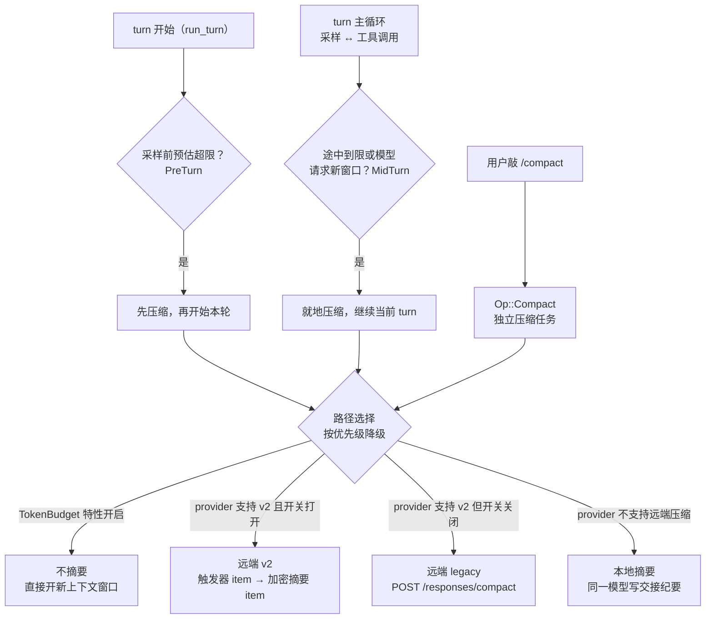

# 上下文压缩

## 本章导读

本章回答一个问题：当对话长到装不进上下文窗口时，Codex 怎么办。读完你将能够：

1. 说出压缩的三类触发点——PreTurn、MidTurn、手动 `/compact`——各自的判定条件；
2. 画出四条实现路径（token 预算直开新窗、远端 v2、远端 legacy、本地摘要）的
   优先级选择逻辑；
3. 解释压缩与第 7 章"历史只增不改"军规的张力：内存历史可整体替换、rollout
   只增不改，prompt 缓存的失效被控制在每个窗口边界一次。

**前置章节**：第 7 章「Agent 核心」（Session / TurnContext / StepContext 与
append-only 历史）、第 8 章「采样与流式处理」（一次采样请求如何发出与重试）。

## 概念与架构

### 一个类比：交接班的会议记录员

把长会话想成一场开了三小时的会议，白板快写满了。Codex 的压缩就是记录员的
交接动作，有三种做法：

- **本地摘要**：记录员自己把三小时讨论浓缩成一页交接纪要——进展、已做的
  决定、约束、待办；然后把白板擦掉，只留最近几段原始发言和这页纪要，会议继续；
- **远端压缩**：把整本会议记录快递给总部的专业整理员，拿回一份整理好的版本
  钉回白板。整理员更专业，但记录要出院子，你得信任对方；
- **token 预算模式**：最激进——不整理了，直接换一块新白板从头开始，旧白板
  拍照存档。

三种做法共享一条铁律：**档案室里的原始记录（rollout）一页都不会少**。白板上
擦掉的是工作记忆，档案里追加一条"第 N 块白板已归档、新白板内容如下"的记录。
这正是"历史只增不改"与压缩的分工：内存里的模型可见历史可以换，磁盘上的审计
历史只追加。

### 什么时候触发、走哪条路

PreTurn 的判定不止"token 到限"：换了一个上下文窗口更小的模型、模型的压缩
兼容哈希变了，都会在采样前先压一次。手动 `/compact` 与自动压缩共用同一套
路径选择，只是作为独立任务运行，不打断主对话循环。

## 源码深挖

### 三类触发点

| 触发 | 代码位置 | 条件与备注 |
| ---- | -------- | ---------- |
| PreTurn | `run_pre_sampling_compact`（codex-rs/core/src/session/turn.rs#L1093），由 `run_turn` 开头调用（turn.rs#L180） | `token_limit_reached` 为真则以 `CompactionReason::ContextLimit` 压缩（turn.rs#L1105-L1119） |
| PreTurn（换模型） | `maybe_run_previous_model_inline_compact`（turn.rs#L1161） | comp hash 变化 → `CompHashChanged`（turn.rs#L1198）；旧窗口活跃 token 超新模型阈值且窗口变小 → `ModelDownshift`（turn.rs#L1246） |
| MidTurn | turn 主循环内（turn.rs#L522-L535） | `needs_follow_up` 且（模型请求新窗口或 token 到限）（turn.rs#L510-L511）；压缩后继续当前 turn |
| 手动 | `Op::Compact` → `compact()`（codex-rs/core/src/session/handlers.rs#L679）→ spawn `CompactTask` | 任务类型 `TaskKind::Compact`（codex-rs/core/src/tasks/compact.rs#L20-L22），与主对话互不干扰 |

`CompactionReason` 四个变体（`UserRequested` / `ContextLimit` /
`ModelDownshift` / `CompHashChanged`）定义在
codex-rs/analytics/src/facts.rs#L425-L430——压缩全程有 analytics 埋点。

### 四条路径的优先级选择

自动压缩由 `run_auto_compact`（turn.rs#L1259-L1339）统一分派；手动任务在
`CompactTask::run`（codex-rs/core/src/tasks/compact.rs#L36-L77）里有一份
同构的选择逻辑：

| 优先级 | 条件 | 实现 | 本质 |
| ------ | ---- | ---- | ---- |
| 1 | `Feature::TokenBudget` 开启 | compact_token_budget.rs（turn.rs#L1270-L1279） | 不摘要，直接 `start_new_context_window`（codex-rs/core/src/session/mod.rs#L4265）开新窗口 |
| 2 | provider 支持 v2 且 `Feature::RemoteCompactionV2` 开启 | compact_remote_v2.rs（turn.rs#L1283-L1304） | 历史末尾追加触发器 item，走普通 stream |
| 3 | provider 支持 v2 但开关关闭 | compact_remote.rs（turn.rs#L1305-L1321） | 打到 `/responses/compact`（codex-rs/core/src/client.rs#L171），整段历史交给服务端 |
| 4 | provider 不支持远端压缩 | compact.rs（turn.rs#L1322-L1336） | 本地用同一模型写交接摘要 |

### token 预算怎么定

判定集中在 `context_window_token_status_with_config`
（codex-rs/core/src/session/context_window.rs#L52）：

- **两种口径**（`AutoCompactTokenLimitScope`，context_window.rs#L60-L80）：
  `Total` 数全部活跃 token；`BodyAfterPrefix` 扣除当前 auto-compact 窗口的
  prefill 基线，只数窗口内新增。
- **阈值**：`Total` 口径用模型默认 `auto_compact_token_limit()`——窗口的
  9/10 与模型配置上限取小（codex-rs/protocol/src/openai_models.rs#L515-L523）；
  `BodyAfterPrefix` 口径允许 `config.model_auto_compact_token_limit` 覆盖
  （context_window.rs#L71-L73）。
- **硬顶**：`context_window × effective_context_window_percent / 100`
  （context_window.rs#L83-L85），与口径无关；口径超限或硬顶触达都会使
  `token_limit_reached` 为真（context_window.rs#L104-L109）。

### 路径四：本地摘要（compact.rs）

这是最自给自足的一条路，也是理解压缩语义的最好样本：

1. **摘要 prompt 入历史**：取 `config.compact_prompt`，缺省用
   `SUMMARIZATION_PROMPT`（codex-rs/prompts/src/compact.rs#L1；模板要求产出
   交接摘要：进展、决策、约束、待办、关键数据），作为一条 user 消息追加到
   历史尾部（codex-rs/core/src/compact.rs#L259-L265）。
2. **发一次无 tools 请求**：同一模型，`drain_to_completed`（compact.rs#L763）
   流式读完整个响应。
3. **重建历史**：从最新往最旧挑真实 user 消息，预算
   `COMPACT_USER_MESSAGE_MAX_TOKENS = 20_000`（compact.rs#L64，挑选与截断在
   L684-L716）；最后追加摘要，文本带固定前缀 "Another language model started
   to solve this problem…"（`SUMMARY_PREFIX`，compact.rs#L360），向模型明示
   "这是另一个模型留下的交接"。
4. **初始上下文怎么放**由 `InitialContextInjection` 决定（compact.rs#L66-L81）：
   mid-turn 压缩把初始上下文插到最后一条真实 user 消息之前、保持摘要垫底
   （注释直言：模型就是按这种布局训练的）；pre-turn 与手动压缩不注入，等
   下一 turn 全量重注。
5. **失败重试**：摘要请求撞上 `ContextWindowExceeded` 时从最旧一项开始删再
   重试（compact.rs#L318-L326），注释写明理由——保住前缀缓存。
6. **可中止**：PreCompact / PostCompact hooks 任一返回 Stopped，压缩以
   `CodexErr::TurnAborted` 中止（compact.rs#L198-L213、L224-L237）。

### 路径二、三：远端 legacy 与 v2

| | legacy（compact_remote.rs） | v2（compact_remote_v2.rs） |
| ---- | ---- | ---- |
| 请求 | 带 tools 的完整 `Prompt` 调 `compact_conversation_history`（codex-rs/core/src/compact_remote_request.rs#L79-L104） | 历史末尾 push `ResponseItem::CompactionTrigger`（codex-rs/core/src/compact_remote_v2_attempt.rs#L76），走普通 stream |
| 返回 | 服务端整理好的整段历史 | 要求恰含 1 个 `Compaction` item，否则 Fatal（codex-rs/core/src/compact_remote_v2.rs#L475-L479）；内容加密（`encrypted_content`），客户端不读 |
| 新历史 | 经 `should_keep_compacted_history_item` 过滤（compact_remote.rs#L374-L401）：丢 developer 与工具调用类 item，保留真实 user / assistant 消息 | 本地自挑保留集：user / developer / system 消息与不超过 10k token 的 agent 消息（compact_remote_v2.rs#L545-L576），预算 `RETAINED_MESSAGE_TOKEN_BUDGET = 64_000`（L77）从最新往前选，末尾加 Compaction item |
| response id | 不记录（compact_remote.rs#L303） | 记录 `compaction_response_id`（compact_remote_v2.rs#L354） |

两条远端路径共享两个细节：

- **请求前先瘦身**：`trim_function_call_history_to_fit_context_window`
  （compact_remote.rs#L403-L459）在发请求前把超长工具输出改写为占位文本
  "Output exceeded the available model context and was truncated"
  （compact_remote.rs#L50-L51）。
- **模型 fallback**：换模型触发的压缩先用上一模型尝试，失败回退到当前模型
  重试并埋点（compact_remote.rs#L224-L264；
  `should_retry_with_current_model`，codex-rs/core/src/compact_model_fallback.rs#L9-L20）。

### 落地：内存替换、磁盘追加、事件外发

所有路径最后都汇到 `Session::replace_compacted_history`
（codex-rs/core/src/session/mod.rs#L3818）：内存里 `replace_annotated_history`
（session/mod.rs#L3864，底层是 `ContextManager::replace_annotated`，
codex-rs/core/src/context_manager/history.rs#L486）整体换掉模型可见历史；
磁盘上把 `Compacted { replacement_history, window_number, … }` 作为
`RolloutItem::Compacted` **追加**落盘（session/mod.rs#L3879-L3891）——rollout
依然只增不改。随后重算 token 用量，发出 `TurnItem::ContextCompaction`
completed（legacy 事件映射为 `EventMsg::ContextCompacted`，
codex-rs/protocol/src/legacy_events.rs#L71-L73）；本地路径还会额外发一条
"长线程与多次压缩会降低精度"的 Warning（compact.rs#L405-L408）。

## 技术难点与设计取舍

**难点一：压缩必然打破前缀缓存，问题只剩"打破几次"。** 第 7 章的 append-only
军规是为了让 prompt cache 按前缀命中；而压缩的本质就是改写历史，缓存失效
无法避免，只能控制频率。Codex 把失效收敛到窗口边界：新历史 = 保留的尾部
消息 + 摘要，之后的 turn 在这个新前缀上重新积累缓存；摘要请求自身失败时
按"从最旧删起"重试，同样是为了保住剩余前缀（compact.rs#L320 的注释）。
token 预算模式最彻底——它把压缩变成"开新窗口"，缓存失效从事故变成设计内
动作。成本模型从"每次采样都贵"变为"每个窗口边界贵一次"。

**难点二：摘要质量 vs 信息损失。** 摘要是有损压缩，Codex 的缓解是三明治式的：
保留最近 user 消息原文（20k token 预算、最新优先）+ 结构化交接 prompt（把
摘要约束成"交接文档"而非"全文缩写"）+ 诚实告知（完成后发精度 Warning，建议
开新线程）。v2 走了另一个极端：摘要加密为不透明 blob，客户端完全不读——
信任全部交给服务端，换来服务端可以采用最适合模型的内部表示，未来改格式
也不必动客户端。

**难点三：远端压缩的信任与一致性。** 服务端返回的历史不能照单全收：legacy
路径把 developer 消息和工具调用类 item 全部滤掉，防的是陈旧指令与注入内容
回流；v2 反过来用"恰含 1 个 Compaction item"的硬校验拒绝异常响应。fallback
的方向也耐人寻味：换模型触发的压缩先用上一模型压（历史是按它的格式攒的），
失败才回退当前模型——一致性优先于省事。

**难点四：同一次压缩，两种版面。** mid-turn 时模型"正在思考"，初始上下文必须
插到最后一条真实 user 消息之前、摘要保持垫底，因为模型按这种布局训练；
pre-turn / 手动压缩则不注入，等下一 turn 全量重注，保持语义干净。
`InitialContextInjection` 的两个变体（compact.rs#L75-L81）是"迁就模型习惯"
与"保持概念清晰"的分别妥协。

## 对照通用 agent 范式

上下文窗口管理在业界大致三条路线，Codex 占了前两条：

- **滑动窗口 / 截断**：丢掉最旧消息，实现最简、丢信息最狠——最早丢掉的往往
  是最初的目标与约束。Codex 的 token 预算模式是它的极致形态：不丢一半，整窗
  换掉，但藏在特性开关后面，不是默认行为。
- **摘要压缩**：模型自己浓缩旧历史，是编码 agent（如 Claude Code）的主流，
  也是 Codex 的默认路线。Codex 的增量在工程化程度：三类触发点、四条降级
  路径、hooks 可中止、全程 analytics，以及把摘要显式标记为"另一个模型的
  交接"。
- **RAG / 外部记忆**：历史不进上下文、按需检索，解决跨会话问题，与压缩正交。
  Codex 只增不改的 rollout 恰好为这条路留好了数据基础——这是下一章的故事。

compact 这个名字本身就来自存储系统：Kafka 的 log compaction 让每个 key 只留
最新值、被覆盖的旧值可回收。`Compacted { replacement_history, window_number }`
这条追加记录就是 log compaction 在对话历史上的翻版——窗口号即代际，
replacement 即压实后的最新值。

## 小结与下一章预告

- 三类触发点：PreTurn（到限 / 换模型降窗 / comp hash 变化）、MidTurn（途中
  到限或模型请求新窗口）、手动 `/compact`（`Op::Compact` → `TaskKind::Compact`）；
- 四条路径按优先级降级：token 预算直开新窗 → 远端 v2 → 远端 legacy → 本地
  摘要，由特性开关与 provider 能力共同决定；
- 预算 = 口径（`Total` / `BodyAfterPrefix`）× 阈值（默认窗口的 9/10），另有
  窗口百分比硬顶兜底；
- 与 append-only 共处的答案：内存历史整体替换，rollout 只追加 `Compacted`
  检查点，缓存失效控制在窗口边界一次；
- 压缩是有损的：尾部原文 + 交接式 prompt + 精度警告，是承认损失之后的工程
  缓解。

下一章「持久化与恢复」：这条追加进 rollout 的 `Compacted` 记录如何在 resume
时被读回——线程怎样从磁盘重建内存历史、窗口编号如何接力、fork 与回滚如何
与压缩检查点交互。
