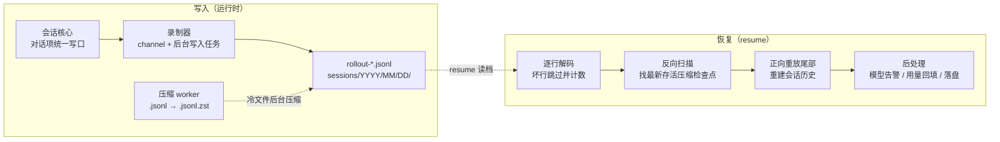

# 持久化与恢复

## 本章导读

本章回答一个朴素的问题：Codex 进程关掉再打开，对话是怎么"回来"的？读完你将能够：

1. 说出 rollout JSONL 文件的存放位置与行格式，以及哪些事件落盘、哪些不落；
2. 描述 resume 时"反向扫描找检查点、正向重放建状态"的重建算法；
3. 解释 ThreadRollback 为什么可以用"追加一条 marker"实现，而不必改写历史文件。

**前置章节**：第 7 章「Agent 核心」——本章重建的正是那里介绍的 Session 与
ContextManager 状态；如果对 `Compacted` 记录的来源感到陌生，可先翻第 9 章
「上下文压缩」。

## 概念与架构

### 一个类比：游戏的录像带

把一次 Codex 会话想象成一场可以存档的游戏，但 Codex 用的不是"存档快照"，而是
"全程录像"：

- **rollout 文件是录像带**——你说的每句话、模型的每次回答、每次工具调用及其
  结果，按时间顺序逐行追加，从不回头修改；
- **resume 是按录像重建现场**——读档不是加载一张存档照片，而是把录像重放一遍，
  让内存里的会话状态重新长成录像结尾时的样子；
- **压缩（compaction）是录像里的"前情提要"**——录像带太长时插入一段剧情回顾，
  重放时找到最后一段前情提要，从那里接着看就好；
- **回滚（ThreadRollback）是录像带上的一条批注**——"最后两轮不算数"。录像本身
  一秒不剪，重放时看到批注就跳过对应片段。

为什么用录像带而不是快照？因为快照写到一半崩溃，留下的就是半个损坏的状态；而
append-only 日志最多损失最后半行——重启后跳过它就好。这是本章主线：**日志是唯一
事实来源，内存状态只是日志的投影**。

### 写入与恢复流程

三个要点决定这套机制的气质：

1. **写入永远追加**。回滚、压缩、revert 全都表达为"写一条新记录"，已有行从不
   改写；
2. **读端宽容**。逐行解析，坏行告警后跳过，只有整个文件为空才报错；
3. **重建先反后正**。先从后往前找最近的可靠检查点，再从检查点正向重放——恢复
   成本与"距上次压缩多远"成正比，而非与文件总长成正比。

## 源码深挖

### 写口与写入时机

所有 rollout 写入都汇聚到 `Session::persist_rollout_items`
（codex-rs/core/src/session/mod.rs#L4214），它委托给 `LiveThread::append_items`
（codex-rs/thread-store/src/live_thread.rs#L203），后者先按策略过滤
（`persisted_rollout_items`，live_thread.rs#L242）再交给录制器。对外的统一入口
按内容分两类：

- **对话项**走 `record_conversation_items`（session/mod.rs#L3406），顺序固定——
  先更新内存历史（L3439），再写 rollout（L3451），最后广播 UI 事件（L3459）。
  内存、磁盘、UI 三者因此永远一致；
- **元数据**（`TurnContext` 快照、`WorldState` 快照/patch、`TokenUsageRecord`、
  `Compacted`）由各自产生点直接调 `persist_rollout_items`——例如压缩完成时一次
  写入 Compacted + WorldState 全量 + TurnContext + ThreadSettingsApplied
  （session/mod.rs#L3879-L3891）。

什么落盘、什么不落，由 `is_persisted_rollout_item`
（codex-rs/rollout/src/policy.rs#L10）决定：对话消息、推理、工具调用与输出落盘；
delta、begin、审批请求等瞬时事件不落盘；而 `TurnStarted` / `TurnComplete` /
`TurnAborted` / `TokenCount` / `ThreadRolledBack` / `ThreadSettingsApplied` 这类
模型不可见的"里程碑事件"也会落盘（policy.rs#L113-L119）——它们是重放时切分
turn、恢复计数与设置的骨架。

### RolloutRecorder：channel + 后台写入任务

`RolloutRecorder`（codex-rs/rollout/src/recorder.rs#L86）本体只是三样东西：一个
`mpsc::Sender<RolloutCmd>`、后台 writer task 的句柄、rollout 路径。channel 容量
256（recorder.rs#L954），命令只有四种（recorder.rs#L126-L139）：

| 命令 | 语义 |
| ---- | ---- |
| `AddItems` | 追加一批 item；文件已建好就立刻落盘 |
| `Persist` | 把缓冲的 item 全部写盘并 ack（新文件此时才真正创建） |
| `Flush` | 屏障：等此前所有写入完成 |
| `Shutdown` | drain 完缓冲再停 writer task（recorder.rs#L1129） |

写入循环 `rollout_writer`（recorder.rs#L1866）把每个 item 序列化成
`RolloutLine { timestamp, ordinal?, item }`（codex-rs/history/src/lib.rs#L258）：
UTC 时间戳、可选序号、`#[serde(flatten)]` 打平的 item（行格式见 recorder.rs
#L1986-L1993 的 `RolloutLineRef`），每行写完即 flush（recorder.rs#L2014-L2021）。
文件首行永远是 `SessionMeta`——新会话采用"延迟建文件"策略（recorder.rs#L926），
第一次 persist 时才建文件，并写入携带 git 信息的 SessionMeta 首行
（recorder.rs#L1898）。

反序列化不走 serde 默认路径：`RolloutLine` 故意不实现 `Deserialize`
（history/src/lib.rs#L253-L256 的注释），读取必须经 `decode_rollout_line`
（codex-rs/rollout/src/lib.rs#L49）——serde 的 flatten 遇上 arbitrary_precision
会丢浮点精度，这段 workaround 的注释（lib.rs#L39-L48）值得原文一读。

### 文件布局

- 路径由 `precompute_new_rollout_path`（recorder.rs#L1653）生成：
  `$CODEX_HOME/sessions/YYYY/MM/DD/rollout-<时间戳>-<thread_id>.jsonl`；归档目录
  是 `archived_sessions`（codex-rs/rollout/src/lib.rs#L83-L84）。
- 冷文件由后台 worker 用 zstd 压成 `.jsonl.zst`
  （`spawn_rollout_compression_worker`，codex-rs/rollout/src/compression.rs#L29）；
  追加写之前 `materialize_rollout_for_append`（compression.rs#L73）先解压回
  `.jsonl`（临时文件 + 硬链接 + 删除压缩包），读端 `open_rollout_line_reader`
  （compression.rs#L45）对两种后缀透明。
- `thread/revert` 保留 thread id 但换新 rollout id，文件名变为
  `rollout-<时间戳>-<thread_id>_<rollout_id>.jsonl`（`RolloutFileName::render`，
  codex-rs/rollout/src/rollout_file_name.rs#L62-L74）。旧文件保持不可变，唯一
  可写的切换是 SQLite 里指向新文件的路径指针
  （codex-rs/thread-store/src/local/revert_thread.rs#L16-L18 的注释）。

### resume：反向扫描 + 正向重放

入口链条：`ThreadManager::resume_thread_from_rollout`
（codex-rs/core/src/thread_manager.rs#L1082）→ 经 thread-store 按路径读文件
（codex-rs/thread-store/src/local/read_thread.rs#L134，内部调
`RolloutRecorder::load_rollout_items`，recorder.rs#L1044——逐行解码、首个
SessionMeta 定 thread id、坏行告警跳过并计数、空文件才报错）→ Session 启动时走
`InitialHistory::Resumed` 分支（session/mod.rs#L1460）→
`apply_rollout_reconstruction`（session/mod.rs#L1592）→ 核心算法
`reconstruct_history_from_rollout`
（codex-rs/core/src/session/rollout_reconstruction.rs#L134）。算法分三步：

1. **反向扫描**（L172）：把记录按 turn 分段（`TurnStarted` 是一段的最老边界，
   L271-L290），找最新存活的、带 `replacement_history` 的 `Compacted` 作为
   `ReplayCheckpoint`（L199-L206）；途中每遇到一个 `ThreadRolledBack` marker 就
   累加待跳过数（L208-L211），段收尾时若它是真实 user turn 且还有待跳过数，就
   整段丢弃（L84-L89）。检查点与设置元数据一旦收齐立刻 break（L311-L319），
   不再往前读；
2. **正向重放尾部**（L360-L424）：先把检查点的 `replacement_history` 整体装进
   ContextManager（L347-L355），再依次重放其后的 `RetainedContext` /
   `ResponseItem` / `InterAgentCommunication`；遇 `ThreadRolledBack` 调
   `drop_last_n_user_turns`（L413-L415，实现见
   codex-rs/core/src/context_manager/history.rs#L535）；没有
   `replacement_history` 的旧式 Compacted 走兼容重建分支（L383-L411）；
3. **WorldState 单独重放**（L440-L468）：full 快照建 baseline、merge patch 逐条
   叠加、遇 Compacted 清空基线——与第 7 章"首 turn 全量、后续 diff"的注入策略
   互为镜像。

恢复后处理在 Session 启动分支里完成：上次记录模型与当前模型不一致时发 Warning
（session/mod.rs#L1488）；token 用量反向取最近一条记录回填
（`last_token_usage_record_from_rollout`，session/mod.rs#L1703——命中 Compacted
时直接用其 `latest_token_usage_record` 字段，避免全量扫描，字段注释见
history/src/lib.rs#L198-L202）；持久化一条 `ThreadSettingsApplied`
（session/mod.rs#L1506-L1510）；非 subagent 时 flush（L1513-L1515）。

### ThreadRollback：追加一条 marker

`Op::ThreadRollback { num_turns }` 在 submission_loop 里分派到 `thread_rollback`
（codex-rs/core/src/session/handlers.rs#L683 → L254）。流程：

1. 校验：`num_turns >= 1`（L255）、当前无进行中 turn（L268-L280）、线程必须有
   持久化历史（L285-L299）；
2. 先 `flush` 保证磁盘是最新的（L300），再从磁盘重新读历史（L313）；
3. 在内存里重放「历史 + 追加一条 `EventMsg::ThreadRolledBack`」——复用的正是
   resume 的 `apply_rollout_reconstruction`（L329-L336），效果是内存历史丢掉
   最后 N 个 user turn；
4. 把 marker 本身追加写进 rollout 并 flush（L348-L350），再把事件广播给前端
   （L362-L366）。

**已有 JSONL 一行不改**——回滚通过追加 marker 表达，resume 与 TUI 的 resume
picker 按 marker 跳过被回滚的段。这与日志的 append-only 军规自洽：状态可变，
历史不可变。

### 文件格式演进

| 机制 | 位置 | 作用 |
| ---- | ---- | ---- |
| `ThreadHistoryMode`（Legacy / Paginated） | codex-rs/rollout/src/ordinal.rs#L18 | Paginated 行带单调递增 `ordinal`，Legacy 行没有 |
| `reject_unknown_thread_history_mode` | codex-rs/rollout/src/recorder.rs#L1154 | 读到不认识的 history_mode 直接报错而非瞎猜 |
| `strip_legacy_ghost_snapshot_rollout_line` | codex-rs/rollout/src/recorder.rs#L1169 | 读取时剥离旧版 ghost snapshot 行 |
| 无 `replacement_history` 的 Compacted | codex-rs/core/src/session/rollout_reconstruction.rs#L383-L411 | 旧压缩记录的兼容重建 |
| `rollout_migration` 模块 | codex-rs/thread-store/src/local/rollout_migration/ | 旧格式集中迁移（如 legacy rollback 语义矫正） |

## 技术难点与设计取舍

**难点一：只追加日志 vs 状态快照。** 快照诱人——一个文件就是全部状态——但会话状态
大且随每个 turn 变化，快照要么写不起、要么写到一半崩溃留下半个状态。Codex 选
append-only JSONL：写入成本与事件大小成正比、崩溃最多损失最后半行、历史天然可
审计回放。代价全转移到了读端：resume 得重放。补救是经典的快照优化，但快照被嵌
进了事件流本身——`Compacted.replacement_history` 就是"日志内的检查点"，配合反向
扫描的提前 break（rollout_reconstruction.rs#L311-L319），恢复成本只与"距上次
压缩多远"成正比。日志与快照因此不是二选一，而是同一条流上的两种记录。

**难点二：崩溃恢复的一致性分层。** 三层防线各管一段：

- *行级*：每行写完即 flush；崩溃留下的半行由读端"坏行跳过并计数"吸收
  （recorder.rs#L1061、L1080）；重新 append 前
  `ensure_rollout_is_newline_terminated`（recorder.rs#L1966）先补齐换行，防止
  新行接在残行尾巴上；
- *写者级*：I/O 失败进入 recovery 模式——丢弃文件句柄、保留未写出的
  `pending_items`，下一个屏障重开文件重试（recorder.rs#L1700-L1703 的注释与
  `enter_recovery_mode`，L1779）；writer task 彻底退出则记录 terminal failure，
  让后续调用立即报错而不是静默丢数据（recorder.rs#L165-L181）；
- *会话级*：`Op::Shutdown` 优雅 drain（recorder.rs#L1129）；即便 channel 意外
  关闭，teardown 路径也会关停 writer（handlers.rs#L730-L737）。

**难点三：旧 rollout 新代码。** rollout 是长期资产，代码周周在变。Codex 的组合拳：
SessionMeta 记录 `cli_version`（构造处 recorder.rs#L891）供事后诊断；解析对未知
字段宽容、对不认识的 `history_mode` 严厉报错——能安全忽略的就忽略，可能改变语义
的绝不允许猜；真正的格式迁移收进 thread-store 的 `rollout_migration` 模块集中
处理，不散落在读路径上。读旧文件的经验法则：**宁可跳过半行，不可曲解一行**。

## 对照通用 agent 范式

**事件溯源（event sourcing）。** Codex 的持久化是事件溯源在 agent 领域的教科书式
落地：append-only 日志是唯一事实来源；内存状态（ContextManager、token 计数、
world state baseline）是日志 fold 出来的投影；`Compacted` 对应快照优化；
`ThreadRolledBack` 是补偿事件（compensating event）——不改写历史，用新事件抵消
旧事件的语义。与传统事件溯源的一个有趣差异是：这里的"事件"直接就是喂给模型的
`ResponseItem`，投影出来的不只是业务状态，还是下一次采样的 prompt 前缀——所以
投影必须字节级忠实。第 7 章的"历史只增不改"军规与本章的日志军规，其实是同一条。

**与"消息表"式框架的对照。** 多数 agent 框架把会话记忆建模为数据库里的消息表，
重启恢复靠重新 SELECT，读改写随意。这在 demo 规模没问题，但丢掉两个性质：可审计
性（发生了什么、顺序如何）与崩溃安全（写到一半怎么办）。Codex 用文件日志 + 重放
换回这两个性质，代价是读端复杂度——反向扫描、分段、marker 跳过，全是为"不重写
历史"付的税。这是一个清醒的取舍：写路径追求极简（append 一行），复杂度集中在
少数几条读路径上，并用测试固化（recorder_tests.rs 与
rollout_reconstruction_tests.rs 合计四千余行）。

## 小结与下一章预告

- rollout 是 append-only 的 JSONL 日志：`sessions/YYYY/MM/DD/rollout-*.jsonl`，
  每行 `RolloutLine { timestamp, ordinal?, item }`，日志是唯一事实来源；
- 写入经 `record_conversation_items` / `persist_rollout_items` 汇聚到
  RolloutRecorder 的后台 writer，内存历史、磁盘、UI 三方一致；
- resume = 逐行解码（坏行跳过）→ 反向扫描找最新存活 Compacted 检查点 → 正向
  重放尾部重建 ContextManager，WorldState 单独重放；
- ThreadRollback 不改历史，只追加 `ThreadRolledBack` marker，读端按 marker 跳过；
- 格式演进靠"宽容解析 + 严厉拒绝 + 集中迁移"三板斧，旧 rollout 永远可读。

至此第三部分收尾：大脑（Agent 核心）、感知（采样与流式）、记忆（压缩与持久化）
都已就位。第四部分给 agent 装上"手和脚"——首章「工具系统」：工具如何注册、如何
被路由与并行执行，以及工具结果如何回流进历史。
