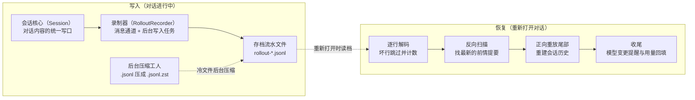

# 持久化与恢复

## 本章导读

想象这样一个场景：你和 Codex 讨论了整整一个下午的技术方案，它顺手帮你改了
十几个文件。晚上你关掉终端去吃饭，回来重新打开——上次的对话一字不差地回来
了。你甚至可以让它"忘掉刚才那两步，我们换个方向"，它也照办了。

它是怎么记住的？更奇怪的是：为什么说"忘掉"的时候，它其实并没有真的删除
任何东西？

读完本章，你将能够：

1. 说出对话记录保存在硬盘的什么位置、每一行长什么样子，以及哪些内容会被
   记下、哪些不会；
2. 描述重新打开对话时，Codex 如何"先倒着找锚点、再顺着放录像"，把现场一
   步步还原出来；
3. 解释"撤销最近几轮"为什么只需补写一条新记录，而不必改动已有的历史文件。

**前置章节**：第 7 章「Agent 核心」——本章要还原的正是那一章介绍的会话状
态；如果读到"压缩"时感到陌生，可以先翻第 9 章「上下文压缩」。

## 概念与架构

### 一个类比：游戏的全程录像

把一次 Codex 会话想象成一场可以存档的游戏。但 Codex 不用"存档快照"，用的
是"全程录像"：

- **存档流水是录像带**——你说的每句话、模型的每次回答、每次工具调用及其
  结果，按时间顺序逐条追加在带子末尾；已经写下的内容，从不回头修改；
- **恢复对话是按录像重建现场**——重新打开不是加载一张存档照片，而是把录像
  重放一遍，让内存里的会话状态重新长成录像结尾时的样子；
- **压缩是录像里的"前情提要"**——带子太长时，插播一段剧情回顾；重放时找到
  最后一段回顾，从那里接着看就好（压缩本身如何产生，见第 9 章）；
- **回滚是录像带上的一条批注**——"最后两轮不算数"。录像一秒不剪，重放时看
  到批注，就跳过对应片段。

为什么用录像带而不是快照？快照写到一半断电，留下的是半个损坏的状态，既不
能用也不能修。而只往后追加的录像带，最多损失最后没写完的一小段——重启后
跳过它就好。这就是本章主线：**录像带是唯一的事实来源，内存里的状态只是录
像的投影**。

### 写入与恢复流程

下面这张图看两件事：左半边是"对话进行中怎么记"，右半边是"重新打开时怎么
还原"。中间那条虚线，把同一盘录像带的两种命运连在一起。

记住这张图，只需记住三个要点：

1. **写入永远追加**。回滚、压缩、还原，统统表达为"在带子末尾补一条新记录"
   ，已有内容从不改写；
2. **读端宽容**。恢复时逐行解析，读到坏行就记个数、跳过去；只有整盘带子都
   是空的，才算真的失败；
3. **重建先反后正**。先从后往前倒，找到最近的一段"前情提要"当锚点，再从锚
   点顺着往后放。还原要花多少时间，取决于"离上次压缩有多远"，而不是"带子
   总共有多长"。

## 出场角色

进入源码之前，先认识本章要出场的角色。下表的"所在文件"都是仓库内的相对路
径，现在记不住没关系，读到正文时翻回来对照即可。标注"（见第 N 章）"的角
色，在对应章节有完整介绍。

| 中文名 | 英文名 | 职责（一句话） | 所在文件 |
| ------ | ------ | -------------- | -------- |
| 统一写口 | Session::persist_rollout_items | 会话内所有存档落盘的汇聚点 | codex-rs/core/src/session/mod.rs |
| 对话项记录入口 | Session::record_conversation_items | 按"内存、磁盘、界面"的固定顺序记录对话内容 | codex-rs/core/src/session/mod.rs |
| 在线线程 | LiveThread | 活跃线程的持久化句柄，先过滤再交给录制器 | codex-rs/thread-store/src/live_thread.rs |
| 落盘策略 | is_persisted_rollout_item / persisted_rollout_items | 裁决哪类条目落盘，并在写入前执行过滤 | codex-rs/rollout/src/policy.rs、codex-rs/thread-store/src/live_thread.rs |
| 录制器 | RolloutRecorder | 用消息通道加后台写入任务，把所有落盘串行化 | codex-rs/rollout/src/recorder.rs |
| 录制命令 | RolloutCmd | 发给录制器的四种指令 | codex-rs/rollout/src/recorder.rs |
| 写入循环 | rollout_writer | 后台任务本体：逐行序列化，每行写完立即冲刷 | codex-rs/rollout/src/recorder.rs |
| 存档行 | RolloutLine / RolloutLineRef | 一行存档的结构：时间戳、可选序号、条目本体 | codex-rs/history/src/lib.rs、codex-rs/rollout/src/recorder.rs |
| 会话元数据 | SessionMeta / SessionMetaLine | 文件首行：线程身份、工作目录、版本号与仓库信息 | codex-rs/protocol/src/protocol.rs |
| 存档行解码器 | decode_rollout_line | 绕过序列化框架精度陷阱的手写解码入口 | codex-rs/rollout/src/lib.rs |
| 路径预计算 | precompute_new_rollout_path | 生成按年月日分层的新存档文件路径 | codex-rs/rollout/src/recorder.rs |
| 压缩模块三件套 | spawn_rollout_compression_worker / materialize_rollout_for_append / open_rollout_line_reader | 冷文件后台压缩、追加前解压还原、对两种文件透明读取 | codex-rs/rollout/src/compression.rs |
| 存档文件名 | RolloutFileName | 文件名的解析与渲染；还原操作后追加新存档编号 | codex-rs/rollout/src/rollout_file_name.rs |
| 线程管理器 | ThreadManager | 线程级操作的总入口，恢复会话从这里发起 | codex-rs/core/src/thread_manager.rs |
| 按路径读线程 | read_thread_by_rollout_path | 线程仓库一侧按存档路径加载全部条目 | codex-rs/thread-store/src/local/read_thread.rs |
| 存档加载 | RolloutRecorder::load_rollout_items | 逐行解码整个文件，坏行跳过并计数 | codex-rs/rollout/src/recorder.rs |
| 初始历史 | InitialHistory | 会话启动时历史来源的三选一：全新、恢复、分叉 | codex-rs/history/src/lib.rs |
| 重建应用 | Session::apply_rollout_reconstruction | 把重建出来的历史装进会话状态 | codex-rs/core/src/session/mod.rs |
| 历史重建算法 | reconstruct_history_from_rollout | 反向扫描加正向重放的核心算法 | codex-rs/core/src/session/rollout_reconstruction.rs |
| 重放检查点 | ReplayCheckpoint | 反向扫描找到的压缩记录锚点 | codex-rs/core/src/session/rollout_reconstruction.rs |
| 上下文管理器 | ContextManager | 内存中的对话历史持有者（见第 7 章） | codex-rs/core/src/context_manager |
| 尾部丢弃 | drop_last_n_user_turns | 从内存历史尾部删掉最近若干用户轮 | codex-rs/core/src/context_manager/history.rs |
| 用量回填 | last_token_usage_record_from_rollout | 从存档尾部找回最近的令牌用量记录 | codex-rs/core/src/session/mod.rs |
| 提交循环 | submission_loop | 会话内分派操作指令的主循环（见第 7 章） | codex-rs/core/src/session/handlers.rs |
| 回滚处理器 | thread_rollback | 处理线程回滚指令的函数 | codex-rs/core/src/session/handlers.rs |
| 历史模式与序号状态 | ThreadHistoryMode / RolloutOrdinalState | 行格式的世代标记，以及下一行该用的序号 | codex-rs/protocol/src/protocol.rs、codex-rs/rollout/src/ordinal.rs |
| 读取守门与清洗 | reject_unknown_thread_history_mode / strip_legacy_ghost_snapshot_rollout_line | 不认识的模式直接报错；旧版幽灵快照行读取时剥掉 | codex-rs/rollout/src/recorder.rs |
| 存档迁移模块 | rollout_migration | 旧格式问题的集中迁移地 | codex-rs/thread-store/src/local/rollout_migration/ |
| 换行补齐 | ensure_rollout_is_newline_terminated | 追加写入前，给残行补上换行符 | codex-rs/rollout/src/recorder.rs |
| 恢复模式 | enter_recovery_mode | 写入失败后录制器的自我保护状态 | codex-rs/rollout/src/recorder.rs |
| 元数据写入 | write_session_meta | 把携带仓库信息的会话元数据写成文件首行 | codex-rs/rollout/src/recorder.rs |
| 设置事件构造 | thread_settings::applied_event | 生成"线程设置已应用"事件 | codex-rs/core/src/session/thread_settings.rs |

## 源码深挖

### 写口与写入时机

这一小节回答"对话内容是在什么时刻、经过哪几道工序被写进录像带的"。出场的
有统一写口、对话项记录入口、在线线程和落盘策略。读完你会知道：为什么内存
、磁盘和界面三者永远不会对不上，以及哪些内容根本不会被记下。

会话里所有要写进存档流水的内容——统称存档条目（RolloutItem）——最后都汇
聚到统一写口 `Session::persist_rollout_items`
（codex-rs/core/src/session/mod.rs#L4214）。它不直接碰文件，而是委托给在
线线程的追加方法（codex-rs/thread-store/src/live_thread.rs#L203）。在线
线程先按落盘策略过滤一遍
（codex-rs/thread-store/src/live_thread.rs#L242），再把幸存者交给录制器
。

对外的入口按内容分两类：

- **对话内容**走对话项记录入口 `Session::record_conversation_items`
  （codex-rs/core/src/session/mod.rs#L3406）。它的顺序是铁律：先更新内存
  历史（codex-rs/core/src/session/mod.rs#L3439），再写存档
  （codex-rs/core/src/session/mod.rs#L3451），最后广播给界面
  （codex-rs/core/src/session/mod.rs#L3459）。内存、磁盘、界面，三者因此
  永远一致。
- **元数据**由各自的产生点直接调用统一写口。这类条目包括轮上下文
  （TurnContext——当前这一轮对话的设置快照）、世界状态（WorldState——工
  作区文件状态的结构化描述，见第 7 章）、令牌用量记录
  （TokenUsageRecord——这一轮消耗了多少令牌的账单）、压缩记录
  （Compacted——一次压缩完成后落盘的存档条目）。例如压缩完成时，会一次性
  写入压缩记录、世界状态全量、轮上下文、线程设置已应用事件，共四条
  （codex-rs/core/src/session/mod.rs#L3879-L3891）。

什么落盘、什么不落，由落盘策略 `is_persisted_rollout_item`
（codex-rs/rollout/src/policy.rs#L10）裁决。对话消息、模型推理、工具调用
及其输出，落盘；流式传输中的增量片段、开始标记、审批请求这类"过眼云烟"
的事件，不落盘。还有第三类值得单独说：轮开始（TurnStarted）、轮完成
（TurnComplete）、轮中止（TurnAborted）、令牌计数（TokenCount）、线程已
回滚（ThreadRolledBack）、线程设置已应用（ThreadSettingsApplied）——它
们在代码里都属于事件通知（EventMsg——会话向前端广播消息的信封家族），是
模型看不见的"里程碑事件"，却一样落盘
（codex-rs/rollout/src/policy.rs#L113-L119）。模型不需要它们，但重放需要
：它们是切分轮次、恢复计数与设置的骨架。

### 录制器：消息通道加后台写入任务

这一小节把镜头推进录制器内部，看一条内容从"交给录制器"到"落在磁盘上"的
全过程。出场的是录制命令、写入循环、存档行与存档行解码器。读完你会明白文
件第一行写了什么、每一行长什么样，以及一个关于小数精度的"暗坑"。

录制器（codex-rs/rollout/src/recorder.rs#L86）本体只有三样东西：一个有界
消息通道的发送端（Rust 并发里常见的 mpsc，多生产者、单消费者）、后台写入
任务的句柄、存档文件的路径。通道容量 256
（codex-rs/rollout/src/recorder.rs#L954）——生产端偶尔快一点没关系，积压
超过这个数就得排队等。

发给录制器的录制命令只有四种
（codex-rs/rollout/src/recorder.rs#L126-L139）：追加条目（AddItems）、落
盘确认（Persist）、屏障（Flush）、关停（Shutdown）。语义如下：

| 命令 | 语义 |
| ---- | ---- |
| 追加条目（AddItems） | 追加一批条目；文件已建好就立刻落盘 |
| 落盘确认（Persist） | 把缓冲的条目全部写盘并回执；新文件此时才真正创建 |
| 屏障（Flush） | 等此前所有写入完成才返回，相当于一道栅栏 |
| 关停（Shutdown） | 排空缓冲再停掉后台任务（codex-rs/rollout/src/recorder.rs#L1126-L1129） |

后台的写入循环（codex-rs/rollout/src/recorder.rs#L1866）把每个条目序列化
成存档行：一个协调世界时（UTC）时间戳、一个可选的单调递增序号、加上被打
平到行首的条目本体。行的结构定义在 codex-rs/history/src/lib.rs#L258；真
正决定行长什么样的，是序列化时用的零拷贝视图
（codex-rs/rollout/src/recorder.rs#L1986-L1993）。"打平"是序列化框架
serde（Rust 事实标准的序列化库）的一个标注：内层结构的字段直接摊平到外层
，行里看不到嵌套。每行写完立即冲刷
（codex-rs/rollout/src/recorder.rs#L2014-L2021）——宁可慢一点，也不让已
完成的对话躺在内存缓冲里冒险。

文件首行永远是会话元数据。新会话采用"延迟建文件"策略
（codex-rs/rollout/src/recorder.rs#L926）：第一次落盘确认时才真正创建文
件，并由元数据写入把携带仓库信息（git 提交的哈希、分支等）的会话元数据行
写成首行（codex-rs/rollout/src/recorder.rs#L1913-L1918，结构定义见
codex-rs/protocol/src/protocol.rs#L3155）。

还有一个暗坑值得单独一提：存档行故意不实现自动反序列化（原因写在
codex-rs/history/src/lib.rs#L253-L256 的注释里），读取必须走手写的存档行
解码器（codex-rs/rollout/src/lib.rs#L49）。原因是序列化库的"任意精度"开
关（arbitrary_precision）遇上"打平"标注时会丢小数精度——这段来龙去脉的
注释（codex-rs/rollout/src/lib.rs#L39-L48）值得原文一读。

### 文件布局：录像带放在哪

这一小节回答"录像带放在硬盘的哪个角落、叫什么名字"。出场的是路径预计算、
压缩模块三件套与存档文件名。读完你能自己在磁盘上找到任何一次对话的存档，
也知道冷文件何时会被压缩、还原操作为什么要换文件名。

新存档的路径由路径预计算（codex-rs/rollout/src/recorder.rs#L1653）生成：
配置目录下的 sessions 文件夹，按年、月、日分三层子目录；文件名是前缀加时
间戳加线程编号，后缀为 jsonl——JSONL 是一种文本格式，每行是一个独立的
JSON 对象。归档目录叫 archived_sessions
（codex-rs/rollout/src/lib.rs#L83-L84）。

冷文件会被后台压缩，压缩模块三件套分工明确：压缩工人
（`spawn_rollout_compression_worker`，
codex-rs/rollout/src/compression.rs#L29）用 zstd（一种高压缩比的通用压缩
算法）把不活跃的存档压成带 zst 后缀的压缩包；要追加写入前，追加前还原
（`materialize_rollout_for_append`，
codex-rs/rollout/src/compression.rs#L73）先解回普通文件——先写临时文件、
再硬链接就位、最后删掉压缩包；读取侧的透明行读取器
（`open_rollout_line_reader`，codex-rs/rollout/src/compression.rs#L45）
对两种后缀一视同仁，调用方根本不用关心文件压没压。

线程还原（thread/revert——保留线程身份、从历史的某个前缀重新开始的操作）
会保留线程编号，但换一个新的存档编号：文件名因此多出一截（渲染逻辑在存档
文件名，codex-rs/rollout/src/rollout_file_name.rs#L62-L74）。旧文件保持
不可变——唯一被改写的，是 SQLite（一个嵌入式数据库）里指向新文件的路径指
针（codex-rs/thread-store/src/local/revert_thread.rs#L16-L18 的注释）。

### 恢复：反向扫描加正向重放

这是全章最长也最关键的一小节：重新打开对话时，Codex 如何把成百上千行的录
像重新变成内存里的会话状态。出场的是线程管理器、存档加载、初始历史、历史
重建算法与重放检查点。读完你会掌握"先倒着找锚点、再顺着放录像"的完整算法
，以及还原完成后的收尾动作。

入口链条先过一遍：线程管理器的恢复入口
（codex-rs/core/src/thread_manager.rs#L1082）→ 线程仓库按存档路径读文件
（codex-rs/thread-store/src/local/read_thread.rs#L134，内部调用存档加载
，codex-rs/rollout/src/recorder.rs#L1044——逐行解码、用首个会话元数据确
定线程编号、坏行告警后跳过并计数、整文件为空才报错，
codex-rs/rollout/src/recorder.rs#L1096-L1097）→ 会话启动时走初始历史的
"恢复"分支（codex-rs/core/src/session/mod.rs#L1460）→ 重建应用
（codex-rs/core/src/session/mod.rs#L1592）→ 核心算法历史重建算法
（codex-rs/core/src/session/rollout_reconstruction.rs#L134）。算法分三步
：

1. **反向扫描**（codex-rs/core/src/session/rollout_reconstruction.rs#L172
   ）。先把记录按轮分段——轮开始事件是一段的最老边界
   （codex-rs/core/src/session/rollout_reconstruction.rs#L271-L290）。从
   后往前找最新存活的、带替代历史（replacement_history——压缩记录里携带
   的整段新历史）的压缩记录，作为重放检查点
   （codex-rs/core/src/session/rollout_reconstruction.rs#L199-L206）。途
   中每遇到一条回滚批注就累加"待跳过数"
   （codex-rs/core/src/session/rollout_reconstruction.rs#L208-L211）；一
   段收尾时，若它是真正由用户发起的一轮、且还有待跳过数，整段丢弃
   （codex-rs/core/src/session/rollout_reconstruction.rs#L84-L89）。检查
   点和设置元数据一旦收齐，立刻停止，不再往前读
   （codex-rs/core/src/session/rollout_reconstruction.rs#L311-L319）。
2. **正向重放尾部**
   （codex-rs/core/src/session/rollout_reconstruction.rs#L360-L424）。先
   把检查点的替代历史整体装进上下文管理器
   （codex-rs/core/src/session/rollout_reconstruction.rs#L347-L355），再
   依次重放其后的保留上下文（RetainedContext）、响应条目
   （ResponseItem——直接喂给模型的最小信息单元）、智能体间通信
   （InterAgentCommunication）。遇到回滚批注就调用尾部丢弃
   （codex-rs/core/src/session/rollout_reconstruction.rs#L413-L415，实现
   见 codex-rs/core/src/context_manager/history.rs#L535）。没有替代历史
   的旧式压缩记录，走单独的兼容重建分支
   （codex-rs/core/src/session/rollout_reconstruction.rs#L383-L411）。
3. **世界状态单独重放**
   （codex-rs/core/src/session/rollout_reconstruction.rs#L440-L468）。全
   量快照建基线、增量补丁逐条叠加、遇压缩记录清空基线——与第 7 章"首轮
   全量、后续增量"的注入策略互为镜像。

恢复完成后还有收尾：上次记录用的模型和当前模型不一致时，向前端发警告
（codex-rs/core/src/session/mod.rs#L1486）；令牌用量从存档尾部反向找最近
一条记录回填（用量回填，codex-rs/core/src/session/mod.rs#L1703——如果撞
上压缩记录，直接用它携带的最近用量字段 latest_token_usage_record，避免全
量扫描，字段注释见 codex-rs/history/src/lib.rs#L198-L202）；再持久化一条
线程设置已应用事件（codex-rs/core/src/session/mod.rs#L1506-L1509，事件由
设置事件构造生成，codex-rs/core/src/session/thread_settings.rs#L137）；
最后，非子智能体（subagent——被主智能体派生出来的帮手会话，见第 7 章）
时冲刷一次（codex-rs/core/src/session/mod.rs#L1513-L1515）。

### 线程回滚：只追加一条批注

这一小节回答导读里的第三个问题：撤销最近几轮，为什么一行历史都不用改。出
场的是提交循环与回滚处理器，还有一个出人意料的"配角"——上一小节的重建算
法被原样复用。读完你会理解"状态可变，历史不可变"这条军规如何贯彻到底。

操作指令（Op——前端发给会话的命令信封）里的线程回滚（ThreadRollback）变
体，带着"要撤销几轮"的参数，在提交循环
（codex-rs/core/src/session/handlers.rs#L529）里被分派到回滚处理器
（codex-rs/core/src/session/handlers.rs#L683 →
codex-rs/core/src/session/handlers.rs#L254）。整个流程四步：

1. 校验：轮数必须至少为一（codex-rs/core/src/session/handlers.rs#L255）
   ；当前不能有进行中的轮
   （codex-rs/core/src/session/handlers.rs#L268-L280）；线程必须有持久化
   历史（codex-rs/core/src/session/handlers.rs#L285-L299）。
2. 先冲刷，保证磁盘是最新的
   （codex-rs/core/src/session/handlers.rs#L300），再从磁盘重新读历史
   （codex-rs/core/src/session/handlers.rs#L313）。
3. 在内存里做一遍"演习"：把读出来的历史加上一条假想的回滚批注，复用恢复
   时的重建应用跑一遍
   （codex-rs/core/src/session/handlers.rs#L329-L336）。效果是内存历史丢
   掉最后几个用户轮。
4. 演习成功才动真格：把回滚批注本身追加写进存档并冲刷
   （codex-rs/core/src/session/handlers.rs#L348-L350），再把事件广播给前
   端（codex-rs/core/src/session/handlers.rs#L362-L366）。

注意第四步：**已有的存档一行没改**。回滚通过"追加一条批注"表达；恢复时，
以及终端界面（TUI，见第 14 章）的恢复选择器看到批注，就跳过被撤销的段。
这与录像带的只追加军规完全自洽：状态可变，历史不可变。

### 文件格式演进：旧录像带遇上新播放器

存档是长期资产——上个月录的带子，这个月的新版本还得能放。这一小节看
Codex 为新旧格式共处安排的六个机制。读完你会记住一条经验法则：宁可跳过半
行，不可曲解一行。

| 机制 | 英文名 | 位置 | 作用 |
| ---- | ------ | ---- | ---- |
| 历史模式 | ThreadHistoryMode | codex-rs/protocol/src/protocol.rs#L780 | 两个世代：旧版（Legacy）行不带序号，分页版（Paginated）行带单调递增序号 |
| 序号状态 | RolloutOrdinalState | codex-rs/rollout/src/ordinal.rs#L17 | 记录下一行该用的序号；旧版文件则为空 |
| 模式守门员 | reject_unknown_thread_history_mode | codex-rs/rollout/src/recorder.rs#L1154 | 读到不认识的历史模式直接报错，绝不瞎猜 |
| 幽灵快照剥离器 | strip_legacy_ghost_snapshot_rollout_line | codex-rs/rollout/src/recorder.rs#L1169 | 读取时剥掉旧版幽灵快照（ghost snapshot——早期版本落盘的内部快照行） |
| 旧式压缩记录兼容 | 历史重建算法的兼容分支 | codex-rs/core/src/session/rollout_reconstruction.rs#L383-L411 | 没有替代历史的旧压缩记录，走单独重建路径 |
| 存档迁移模块 | rollout_migration | codex-rs/thread-store/src/local/rollout_migration/（整个目录） | 旧格式问题集中迁移，例如旧版回滚语义矫正 |

## 技术难点与设计取舍

**难点一：只追加日志，还是状态快照。** 问题是怎么保存会话状态。快照很诱人
——一个文件就是全部状态——但会话状态大、每一轮都在变：快照要么写不起，要
么写到一半崩溃，留下半个损坏的状态。Codex 选择只追加的 JSONL 日志：写入
成本与单条事件的大小成正比，崩溃最多损失最后半行，历史还天然可审计、可回
放。代价全转移到了读端：恢复得重放。补救办法是经典的快照优化，但快照被嵌
进了事件流本身——压缩记录里的替代历史，就是"长在日志内部的检查点"。再配
合反向扫描的提前停止
（codex-rs/core/src/session/rollout_reconstruction.rs#L311-L319），恢复
成本只与"离上次压缩多远"成正比。日志与快照因此不是二选一，而是同一条流上
的两种记录。

**难点二：崩溃恢复的一致性分层。** 问题是崩溃可能发生在任意时刻。难在要保
护的对象有三个层次：一行、一个写入者、一个会话。Codex 的防线也分三层：

- *行级*：每行写完立即冲刷；崩溃留下的半行，由读端"告警、计数、跳过"吸收
  （codex-rs/rollout/src/recorder.rs#L1061、
  codex-rs/rollout/src/recorder.rs#L1062、
  codex-rs/rollout/src/recorder.rs#L1080）；重新追加前，换行补齐先给残行
  补上换行符（codex-rs/rollout/src/recorder.rs#L1966），防止新内容接在残
  行尾巴上、污染下一行。
- *写入者级*：读写失败时进入恢复模式
  （codex-rs/rollout/src/recorder.rs#L1779）——丢掉文件句柄、保留没写出
  去的缓冲条目，下一道屏障时重开文件重试（设计意图写在
  codex-rs/rollout/src/recorder.rs#L1700-L1703 的注释里）；后台任务彻底
  退出，则记录"终局失败"，让后续调用立即报错，而不是静默丢数据
  （codex-rs/rollout/src/recorder.rs#L165-L181）。
- *会话级*：正常关停时排空缓冲再停
  （codex-rs/rollout/src/recorder.rs#L1126-L1129）；即便消息通道意外关闭
  ，提交循环的收尾路径也会关停写入端
  （codex-rs/core/src/session/handlers.rs#L730-L737）。

**难点三：旧存档遇上新代码。** 问题是存档要活很久，代码却每周都在变。难在
"宽容"与"严厉"的边界：哪些差异可以安全忽略，哪些必须拒绝。Codex 的组合拳
是：会话元数据里记录版本号字段（cli_version，构造处
codex-rs/rollout/src/recorder.rs#L901），供事后诊断；解析时对未知字段宽
容、对不认识的历史模式严厉报错——能安全忽略的就忽略，可能改变语义的绝不
允许猜；真正的格式迁移收进存档迁移模块集中处理，不散落在读取路径上。读旧
文件的经验法则：**宁可跳过半行，不可曲解一行**。

## 对照通用 agent 范式

**事件溯源。** Codex 的持久化是事件溯源（event sourcing——只存事件序列、
状态由事件重放得出的架构模式）在智能体领域的教科书式落地：只追加的日志是
唯一事实来源；内存状态（上下文管理器、令牌计数、世界状态基线）是日志折叠
出来的投影；压缩记录对应快照优化；回滚批注是补偿事件（compensating
event——不改写历史，用新事件抵消旧事件的语义）。与传统事件溯源有一个有趣
的差异：这里的"事件"直接就是喂给模型的响应条目，投影出来的不只是业务状态
，还是下一次采样的提示词前缀——所以投影必须字节级忠实。用上下文工程的视
角看：持久化层保存的其实不是"聊天记录"，而是"下一次请求模型的输入"。第 7
章"历史只增不改"的军规，与本章的日志军规，其实是同一条。

**与"消息表"式框架的对照。** 多数智能体框架把会话记忆建模为数据库里的一张
消息表，重启恢复靠重新查询，读改写随意。这在演示规模没问题，但丢掉两个性
质：可审计性（发生了什么、顺序如何）与崩溃安全（写到一半怎么办）。Codex
用文件日志加重放换回这两个性质，代价是读端复杂度——反向扫描、分段、批注
跳过，全是为"不重写历史"付的税。这是一个清醒的取舍：写路径追求极简（追加
一行），复杂度集中在少数几条读路径上，并用测试固化——录制器与重建算法的
测试文件合计四千余行。

## 小结与下一章预告

- 存档流水是只追加的 JSONL 日志：按年月日分层存放、每行一条记录，日志是
  唯一事实来源；
- 写入经统一写口与对话项记录入口汇聚到录制器的后台任务，内存、磁盘、界面
  三方一致；
- 恢复 = 逐行解码（坏行跳过）→ 反向扫描找最新存活的压缩记录当锚点 → 正
  向重放尾部重建上下文管理器，世界状态单独重放；
- 线程回滚不改历史，只追加一条回滚批注，读端按批注跳过；
- 格式演进靠"宽容解析、严厉拒绝、集中迁移"三板斧，旧存档永远可读。

至此第三部分收尾：大脑（第 7 章 Agent 核心）、感知（第 8 章采样与流式处
理）、记忆（第 9、10 章压缩与持久化）都已就位。第四部分给智能体装上"手和
脚"——下一章，第 11 章「工具系统」：工具如何注册、如何被路由与并行执行
，以及工具结果如何回流进历史。
