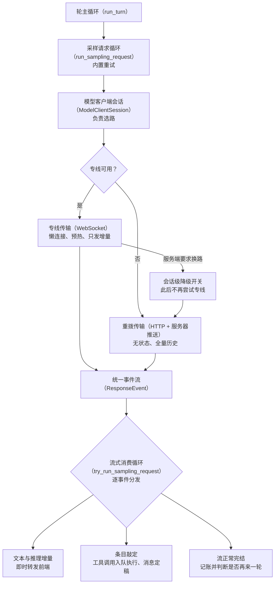

# 采样与流式处理

## 本章导读

从一个你一定见过的画面开始：你向 Codex 提了一个大问题，按下回车，回答不是憋半天
再整段砸下来，而是一个词一个词地"长"出来；长到一半网络抖了一下，界面提示"正在
重连"，几秒钟后回答接着生长，仿佛什么都没发生；你趁它没答完又追加了一句话，它
却不慌不忙地把当前这段说完，下一轮才回应你的插话。

这三个画面背后是三套机制：回答为什么会逐字生长？断线为什么能被藏起来？插话为什
么不当场生效？本章把这三件事一次讲透。

读完本章，你将能够：

1. 说出一次"问模型"从发起到出字经历哪几站，两条网络通路怎么选、怎么切换；
2. 解释断线重试为什么能把网络抖动对你隐藏起来；
3. 描述一轮对话正常结束、被你打断、被你插话时各自的处理路径。

**前置章节**：第 7 章「Agent 核心」。你只需带走两个约定：每轮对话被切成若干次
"问模型"，每次问之前都会给现场拍一张快照；对话历史只增不改。这两个约定是本章所
有设计的地基。

## 概念与架构

### 一个类比：打电话咨询顾问

延续全书"外包团队"的类比：核心引擎是大脑，模型是住在远端的外脑，大脑思考时要打
电话咨询它。这个电话有两种打法。

- **专线**：一次拨通、保持在线，双方随时可以开口（技术上叫 WebSocket，一种在单
  个长连接上双向收发消息的网络协议）。第二轮咨询不用重新自我介绍，直接说"接着
  上次的话题"，再补几句新情况即可，省话费也省时间。代价是要维护这条线：正式开
  聊前可以先热身，线路可能被运营商掐断，断了要会换打法。
- **每次重拨**：每轮咨询都是一个全新的网络请求，把完整卷宗重新念一遍，对方把答
  案分成一条一条陆续推回来（技术上叫服务器推送事件，一种让服务端逐条推送消息的
  长响应约定）。无状态、实现简单、穿过任何代理都不怕；代价是重复传输。这正好解
  释了第 7 章"历史只增不改、前缀稳定"为什么重要：前缀稳定，服务端的缓存才能把
  重复念诵的成本省回来。

**流式**则是顾问"边说边记"：不等整段回复写完，每蹦出一个词、每敲定一个工具调用，
就立刻作为一个事件推过来。你因此能逐字看到回答在生长；引擎因此能在第一个工具调
用敲定的那一刻就开工，而不是等整场电话打完。

下面这张图画出一次"问模型"的完整旅程：从主循环出发，经过选路，两条通路汇入同一
股事件流，最后被逐个分发。看图时重点盯中间的汇合点。

这张图最值得带走的一点：**两条通路收敛到同一股事件流**。上层分发逻辑完全不需要
知道脚下踩的是专线还是重拨——这个抽象让"换路"永远只是优化、不是依赖。

## 出场角色

进入源码之前，先认识本章要出场的角色。"所在文件"都是仓库内的相对路径，现在记不
住没关系，读到正文时翻回来对照即可。

| 中文名 | 英文名 | 职责（一句话） | 所在文件 |
| ------ | ------ | -------------- | -------- |
| 轮主循环 | run_turn | 一轮对话的主循环，在每次采样前排空待定输入、决定是否再来一轮 | codex-rs/core/src/session/turn.rs |
| 采样请求循环 | run_sampling_request | 组装提示词、发起单次流式采样、失败后交给重试策略 | codex-rs/core/src/session/turn.rs |
| 流式消费循环 | try_run_sampling_request | 逐个消费统一事件并分发给前端和工具执行器 | codex-rs/core/src/session/turn.rs |
| 助手消息流解析器 | AssistantMessageStreamParsers | 按条目分槽累积文本增量，剥离引用与计划块 | codex-rs/core/src/session/turn.rs |
| 在途工具队列 | FuturesOrdered | 让工具并发执行、但按入队顺序吐出结果 | codex-rs/core/src/session/turn.rs |
| 在途结果排空 | drain_in_flight | 流结束后按序落盘所有在途工具结果 | codex-rs/core/src/session/turn.rs |
| 步上下文 | StepContext | 单次采样前拍下的现场快照（第 7 章定义） | codex-rs/core/src/session/step_context.rs |
| 轮上下文 | TurnContext | 一轮对话的共享状态与配置（第 7 章定义） | codex-rs/core/src/session/turn_context.rs |
| 模型客户端会话 | ModelClientSession | 轮级对象，缓存专线连接与轮状态令牌，提供选路入口 | codex-rs/core/src/client.rs |
| 专线流式路径 | stream_responses_websocket | 专线一侧的发送与接收：懒连接、预热、增量输入 | codex-rs/core/src/client.rs |
| 重拨流式路径 | stream_responses_api | 重拨一侧的请求构造与认证恢复 | codex-rs/core/src/client.rs |
| 专线开关判定 | responses_websocket_enabled | 判断当前是否允许走专线 | codex-rs/core/src/client.rs |
| 降级切换 | try_switch_fallback_transport | 尝试把专线降级为重拨，返回是否首次切换 | codex-rs/core/src/client.rs |
| 强制重拨 | force_http_fallback | 把"禁用专线"做会话级原子置位 | codex-rs/core/src/client.rs |
| 连接预热 | prewarm_websocket | 首个正式请求前先发一个空转请求热身专线 | codex-rs/core/src/client.rs |
| 请求构造器 | build_responses_request | 组装发往模型服务的请求体 | codex-rs/core/src/client.rs |
| 认证恢复 | handle_unauthorized | 遇到 401 拒绝时刷新凭据并重试 | codex-rs/core/src/client.rs |
| 统一事件枚举 | ResponseEvent | 两条传输路径共同产出的事件类型 | codex-rs/codex-api/src/common.rs |
| 请求体类型 | ResponsesApiRequest | 发往模型服务的请求体结构 | codex-rs/codex-api/src/common.rs |
| 推送流解析入口 | spawn_response_stream | 从响应头捞元数据，并起后台任务逐条解析推送 | codex-rs/codex-api/src/sse/responses.rs |
| 推送事件映射器 | process_responses_event | 把每种服务器推送事件翻译成统一事件 | codex-rs/codex-api/src/sse/responses.rs |
| 重试协调器 | handle_retryable_response_stream_error | 按优先级执行三级重试策略 | codex-rs/core/src/responses_retry.rs |
| 流式错误通知 | notify_stream_error | 重连时向前端发"正在重连"事件 | codex-rs/core/src/session/mod.rs |
| 输出项定稿分发 | handle_output_item_done | 把流式敲定的条目三分：工具、消息、回喂错误 | codex-rs/core/src/stream_events_utils.rs |
| 工具调用执行器 | ToolCallRuntime | 接收敲定的工具调用并执行（第 11 章展开） | codex-rs/core/src/tools/parallel.rs |
| 会话 | Session | 一次对话的运行实体，持有活动轮状态 | codex-rs/core/src/session/mod.rs |
| 中断入口 | interrupt_task | 响应用户打断，发起任务中止 | codex-rs/core/src/session/mod.rs |
| 任务全量中止 | abort_all_tasks | 中止会话下所有运行中的任务 | codex-rs/core/src/tasks/mod.rs |
| 任务中止处理 | handle_task_abort | 优雅退出、超时强杀、落盘中断标记 | codex-rs/core/src/tasks/mod.rs |
| 优雅中断时长 | GRACEFULL_INTERRUPTION_TIMEOUT_MS | 强杀之前给任务的 100 毫秒优雅期 | codex-rs/core/src/tasks/mod.rs |
| 任务收尾 | on_task_finished | 一轮结束时发出完成事件与指标 | codex-rs/core/src/tasks/mod.rs |
| 插话输入模式 | TurnInputMode::Steer | 标记"这是一条插话"及其目标轮次 | codex-rs/core/src/session/turn_input.rs |
| 插话校验 | steer_input | 校验插话合法性并写入待定输入 | codex-rs/core/src/session/turn_input.rs |

## 源码深挖

### 调用链与传输决策点

这一小节回答导读里的第一个问题：一次"问模型"从发起到出字，到底经过哪几站？出场
的是轮主循环、采样请求循环、流式消费循环和模型客户端会话。读完你会拿到一张调用
链地图，并知道"走专线还是重拨"这个决定在哪里做出、何时反悔。

先看调用链全景，再逐站放大：

| 环节 | 位置 | 职责 |
| ---- | ---- | ---- |
| 采样请求循环 | codex-rs/core/src/session/turn.rs#L1422 | 重试循环：组装提示词、调单次流式、失败后交给重试策略 |
| 流式消费循环 | codex-rs/core/src/session/turn.rs#L2277 | 单次流式消费主循环：逐个统一事件分发 |
| 模型客户端会话的选路入口 | codex-rs/core/src/client.rs#L2027 | 传输选择：专线优先，降级后走重拨 |
| 专线流式路径 | codex-rs/core/src/client.rs#L1725 | 专线一侧：懒连接、预热、增量输入 |
| 重拨流式路径 | codex-rs/core/src/client.rs#L1562 | 重拨一侧：构造请求、处理 401 认证恢复 |
| 推送流解析入口 | codex-rs/codex-api/src/sse/responses.rs#L36 | 服务器推送解析：响应头加事件流，产出统一事件 |

模型客户端会话是**轮级**对象：模块注释（codex-rs/core/src/client.rs#L11-L13）说
明它每轮创建，缓存专线连接和轮状态令牌（`x-codex-turn-state`，服务端用来做粘性
路由——把同一轮的请求导到同一台机器）；轮主循环里的注释
（codex-rs/core/src/session/turn.rs#L327-L328）重申它在轮内跨重试复用。这解释了
"轮状态令牌在轮内回放、跨轮禁止复用"：令牌的生命周期被对象生命周期天然锁住。

选路的决策非常直白（codex-rs/core/src/client.rs#L2038-L2077）：先查专线开关判定
（codex-rs/core/src/client.rs#L1013，要求服务商支持且会话级"禁用专线"未置位），
是则走专线；专线建立连接时服务端回 **426 要求升级**（服务端明确说"我不说这种
协议"的状态码）就返回降级信号（codex-rs/core/src/client.rs#L1809-L1812），随后
降级切换（codex-rs/core/src/client.rs#L2086）调用强制重拨
（codex-rs/core/src/client.rs#L551）把"禁用专线"原子置位——**会话级粘性，此后不
再尝试专线**。至于 401 未授权，两条路径各自走认证恢复后重试
（codex-rs/core/src/client.rs#L2424）。

专线一侧有两个省带宽机制：连接预热（codex-rs/core/src/client.rs#L1966）在首个正
式请求前，先发一个"只建档、不生成"的空转请求做热身
（codex-rs/core/src/client.rs#L1870），让建连开销不挤占首词元延迟；后续请求换成
"上一回应编号 + 增量条目"（codex-rs/core/src/client.rs#L1849-L1852），不必重传全
量历史。

### 请求构造：无状态客户端的自我修养

这一小节放大"重拨"那一站：每一次重新拨号，请求体里都装了什么？为什么有些字段看
似吃亏却是刻意为之？出场的只有请求构造器一个角色，读完你就明白"无状态"三个字落
在代码里长什么样。

请求构造器（codex-rs/core/src/client.rs#L891）产出请求体，几个字段值得记住：
`store: false`（codex-rs/core/src/client.rs#L986，服务端不留存响应，客户端自己管
历史）、`stream: true`（codex-rs/core/src/client.rs#L987，要求流式回推）、
`parallel_tool_calls`（codex-rs/core/src/client.rs#L984，允许模型一次给多个工具
调用）、`include: ["reasoning.encrypted_content"]`
（codex-rs/core/src/client.rs#L959，把加密的推理内容带回，以便下一轮原样回传）、
`prompt_cache_key`（codex-rs/core/src/client.rs#L976，提示词缓存的命中键）。重拨
路径没有"上一回应编号"——无状态意味着每次全量历史，这正是历史只增不改的收益兑
现处：前缀稳定，服务端的提示词缓存才命的中。

### 服务器推送事件如何变成统一事件

这一小节回答：重拨路径上，服务端陆续推来的一条条原始消息，怎样被翻译成上层认识
的统一事件？出场的是推送流解析入口和推送事件映射器。读完你会看到一张完整的翻译
对照表，以及一条"残缺必须大声失败"的硬规矩。

推送流解析入口先从响应头里捞元数据：限流快照、模型清单版本、实际服务的模型名、
推理内容标记、轮状态令牌（codex-rs/codex-api/src/sse/responses.rs#L42-L73），再
起一个后台任务逐条解析推送。推送事件映射器
（codex-rs/codex-api/src/sse/responses.rs#L353）是核心翻译表：

| 服务器推送事件 | 统一事件 | 位置 |
| -------------- | -------- | ---- |
| `response.created` | `Created` | codex-rs/codex-api/src/sse/responses.rs#L408 |
| `response.output_item.added` | `OutputItemAdded` | codex-rs/codex-api/src/sse/responses.rs#L509 |
| `response.output_item.done` | `OutputItemDone` | codex-rs/codex-api/src/sse/responses.rs#L357 |
| `response.output_text.delta` | `OutputTextDelta` | codex-rs/codex-api/src/sse/responses.rs#L365 |
| `response.custom_tool_call_input.delta` | `ToolCallInputDelta` | codex-rs/codex-api/src/sse/responses.rs#L370 |
| `response.reasoning_summary_text.delta` | `ReasoningSummaryDelta` | codex-rs/codex-api/src/sse/responses.rs#L381 |
| `response.reasoning_summary_text.done` | `ReasoningSummaryDone` | codex-rs/codex-api/src/sse/responses.rs#L389 |
| `response.reasoning_text.delta` | `ReasoningContentDelta` | codex-rs/codex-api/src/sse/responses.rs#L400 |
| `response.completed` | `Completed { token_usage, end_turn }` | codex-rs/codex-api/src/sse/responses.rs#L483 |
| `response.failed` | 按错误码分类（如上下文窗口超限） | codex-rs/codex-api/src/sse/responses.rs#L417 |

如果流在"正常完结"之前就断了，会被显式报错
（codex-rs/codex-api/src/sse/responses.rs#L598）——"静默截断"不被允许，残缺的流
必须大声失败，交给上层重试策略裁决。

### 重试三级策略

这一小节回答导读里的第二个问题：断线为什么能被藏起来？出场的是重试协调器和流式
错误通知。读完你会知道三级策略按什么优先级出手、各自适用于什么故障，以及为什么
"换路成功"要清零重试计数。

采样请求循环拿到可重试的错误后，统一交给重试协调器
（codex-rs/core/src/responses_retry.rs#L44），它按优先级试三招：

1. **无限连接重试**（codex-rs/core/src/responses_retry.rs#L58-L83）：特性开关开
   启、仅采样请求、且属于连接类失败时，以 5 秒起步、翻倍封顶 60 秒
   （codex-rs/core/src/responses_retry.rs#L17-L18）的退避无限重试；同时通过流式
   错误通知（codex-rs/core/src/session/mod.rs#L4633）发出流错误事件
   （`StreamError`）告诉你"正在重连"，而不是让界面假死。
2. **传输降级**（codex-rs/core/src/responses_retry.rs#L85-L100）：普通重试次数耗
   尽、且专线切重拨成功时，发一条警告事件（`Warning`），**把重试计数清零**继
   续——换了条路，之前的路障不再作数。
3. **普通退避**（codex-rs/core/src/responses_retry.rs#L102-L126）：尊重服务端给
   的"稍后再试"时长，否则指数退避；正式发布版本还会刻意隐藏专线的首次重试通知
   （codex-rs/core/src/responses_retry.rs#L110-L112），减少瞬断时的噪音。

### 流式条目的分发

这一小节是本章最热闹的一段：统一事件流抵达流式消费循环后，每种事件被送往哪里？
出场的有助手消息流解析器、输出项定稿分发、在途工具队列和在途结果排空。读完你会
理解"模型还在说、工具已经在跑"是如何做到的，以及为什么历史写入顺序永远等于模型
输出顺序。

流式消费循环的主循环（codex-rs/core/src/session/turn.rs#L2355 起）是一个大匹配：
文本增量经按条目分槽的助手消息流解析器
（codex-rs/core/src/session/turn.rs#L1703）剥离引用和计划块后，转成消息增量事件
（`AgentMessageContentDelta`）发给前端；各类推理增量同理。真正重头的是"条目敲
定"——交给输出项定稿分发（codex-rs/core/src/stream_events_utils.rs#L293）做三
分：

- **工具调用**：先落盘历史，再交工具调用执行器执行，返回的异步任务推入在途工具
  队列（codex-rs/core/src/session/turn.rs#L2326），并置"需要续轮"标记；
- **非工具条目**（消息、推理等）：定稿成轮条目、发出条目完成事件
  （`ItemCompleted`）、提取"智能体最后一条发言"；
- **回喂模型**：工具被拒绝或参数错误时，直接把错误合成一条工具结果
  （`FunctionCallOutput`）写回历史，喂给模型自我纠正。

流结束后统一做在途结果排空（codex-rs/core/src/session/turn.rs#L2861）：在途工具
队列按入队顺序吐出结果——**工具执行可以并发，历史写入顺序严格等于模型输出顺
序**，只增不改历史的确定性由此保住。流正常完结时冲刷解析器、记词元用量；若模型
明确说"我还没说完"，就置上"需要续轮"标记再采一轮
（codex-rs/core/src/session/turn.rs#L2689-L2691）。词元计数事件
（`TokenCount`）刻意延迟到在途工具全部落账后才发
（codex-rs/core/src/session/turn.rs#L2864-L2870），避免你在等待审批时看到进度数
字乱跳（审批机制见第 12 章「审批与沙箱」）。

### 一轮的结束、中断与插话

这一小节回答导读里的第三个问题，并顺带收束前两个：一轮对话如何体面地落幕？你按
下打断键后系统按什么顺序收场？插话为什么不当场生效？出场的是任务收尾、中断入口、
任务全量中止、任务中止处理和插话校验。

- **正常结束**：回到轮主循环，"需要续轮"等于"模型要求继续或有待定输入"
  （codex-rs/core/src/session/turn.rs#L475）；两者皆否才跑轮结束钩子
  （codex-rs/core/src/session/turn.rs#L552-L554），再由任务收尾
  （codex-rs/core/src/tasks/mod.rs#L588）发出轮完成事件（`TurnComplete`，
  codex-rs/core/src/tasks/mod.rs#L826，含最后发言与首词元延迟等指标）。一般性错
  误也是先发错误事件再发轮完成事件，让会话可以继续。
- **中断链**：打断指令（`Op::Interrupt`）进入中断入口
  （codex-rs/core/src/session/mod.rs#L4662），再经任务全量中止
  （codex-rs/core/src/tasks/mod.rs#L509）走到任务中止处理
  （codex-rs/core/src/tasks/mod.rs#L900）：先触发取消令牌，让流循环和工具优雅退
  出；给 100 毫秒优雅期（codex-rs/core/src/tasks/mod.rs#L70）后强杀任务句柄；然
  后写入中断标记并冲刷存档流水——注释特意说明要先落盘再发轮中止事件
  （`TurnAborted`），因为有的客户端收到事件后会立刻同步重读存档流水
  （codex-rs/core/src/tasks/mod.rs#L957-L961）。新任务启动时，旧任务以"被替换"
  的原因中止（codex-rs/core/src/tasks/mod.rs#L277）。
- **插话**：插话输入模式（codex-rs/core/src/session/turn_input.rs#L221）经插话校
  验（codex-rs/core/src/session/turn_input.rs#L576）把关：必须存在进行中的轮、
  目标轮次编号匹配（codex-rs/core/src/session/turn_input.rs#L594-L600）、任务类
  型必须是普通任务（评审与压缩任务不可插话，
  codex-rs/core/src/session/turn_input.rs#L603-L615）。通过后**只写入待定输入，
  不打断当前流式响应**；轮主循环在下一次采样前排空待定输入
  （codex-rs/core/src/session/turn.rs#L339-L346），写入历史并重新拍摄步上下文
  （codex-rs/core/src/session/turn.rs#L379-L398）——插话内容以下一轮采样的完整
  快照生效，与第 7 章的一致性约定严丝合缝。

## 技术难点与设计取舍

**长连接 vs 无状态推送。** 专线的收益是连接复用、预热隐藏首词元延迟、增量输入省
带宽；代价是要管理一整个状态机：懒连接、预热完成确认、426 降级、会话级粘性置位。
重拨的哲学相反——无状态换来实现简单和代理友好，代价是每次全量历史。Codex 的取
舍是"两者都要，但只暴露一个抽象"：统一事件流让上层无感，降级路径让专线永远是优
化而非依赖。

**断线重试的幂等性。** 重试安全的前提是"重发同一请求不产生副作用"。重拨路径天然
满足（无状态全量重放）；专线路径靠"上一回应编号 + 增量条目"让服务端把续传接到
正确的响应上，而精简响应模式下注入前缀的条目编号用线程命名空间的 UUIDv5 生成
（codex-rs/core/src/client.rs#L905-L908），保证重试和恢复时身份稳定。重试策略内
部还有一层小心思：传输降级成功后清零重试计数——把"路不通"和"请求本身失败"两本
账分开算。

**插话的一致性。** 流式中途用户插话，最直觉的做法是立刻打断当前响应，但那会留下
半截助手输出和悬空的工具调用。Codex 选择"不打断、下轮生效"：插话只进待定输入，
当前响应完整走完、历史完整落盘，下一轮采样前才把插话并入历史、重拍步上下文。代
价是插话生效有一轮延迟，换来的是历史在任何时刻都自洽——模型永远看不到被腰斩的
自己。

## 对照通用 agent 范式

**推送事件源 + 增量解析**是业界流式采样的通用模式：服务端逐事件推送，客户端维护
一个增量解析器把碎片累积成完整结构。Codex 完全遵循这个模式，但做了三处特化：一
是**双传输协商**——通用框架通常绑死一种推送方式，Codex 让专线与重拨竞争上岗、
可逆降级；二是**把残流当显式错误**——"完结前断流即报错"让静默截断无处遁形，而
多数框架对此语焉不详；三是**工具执行与流式分发同循环**——条目敲定即刻入队执行、
按序落盘，而不是等响应完结再统一派发，把"模型还在说"和"工具已经在跑"重叠起来，
压掉整段串行等待。

设计自己的智能体时，可以照搬这个骨架：统一事件枚举做传输抽象，增量解析器做展示
层缓冲，显式终态事件（完结/失败）做重试判据。

## 小结与下一章预告

- 调用链：采样请求循环（重试循环）→ 流式消费循环（逐事件分发）→ 模型客户端会话
  选路（专线优先，426 会话级降级重拨）；
- 统一事件枚举收敛两条传输路径；推送残流显式报错；重试三级策略（无限连接重试、
  传输降级清零计数、普通退避）把断线对你隐藏；
- 输出项定稿分发三分流式条目：工具调用并发执行、按序落盘，消息定稿并提取最后发
  言，错误直接回喂模型；
- 中断走取消令牌优雅退出加 100 毫秒优雅期；插话不打断当前响应，下一轮采样前随步
  上下文快照生效。

下一章：第 9 章「上下文压缩」。当只增不改的历史终于撞上上下文窗口的天花板，
Codex 如何在不破坏前缀缓存的前提下压缩对话——自动压缩的触发时机、压缩请求的构
造，以及压缩后历史如何无缝衔接。
