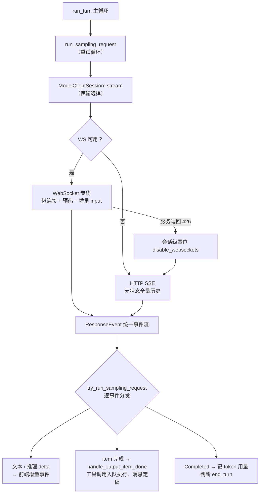

# 采样与流式处理

## 本章导读

上一章讲了 run_turn 主循环的形状，本章钻进循环里那次"发起模型采样"，看它具体
怎么发生。读完你将能够：

1. 说出一次采样从 `run_sampling_request` 到 `ModelClientSession::stream` 再到
   WebSocket / SSE 两条传输路径的完整调用链，以及传输降级的决策点；
2. 解释重试三级策略如何把"断线"对用户隐藏起来，以及流式事件如何被逐块分发给
   工具执行器和前端；
3. 描述一个 turn 正常结束、被中断、被 steer（插话）时各自的处理路径。

**前置章节**：第 7 章「Agent 核心」。本章默认你已经知道 StepContext 是单次采样
的快照、历史是 append-only 的——这两个约定正是本章所有设计的地基。

## 概念与架构

### 一个类比：打电话咨询顾问

延续"外包团队"的类比：大脑（codex-core）思考时要打电话咨询外部顾问（模型
API）。这个电话有两种打法：

- **专线（WebSocket）**：一次拨通、保持在线。第二轮咨询不用重新自我介绍，直接
  说"接着上次的话题"（`previous_response_id`）加几句新情况（增量 input）即可，
  省话费（带宽）也省时间。代价是要维护这条线：拨号前要预热，线路可能被运营商
  掐断，断了要会换打法。
- **每次重拨（HTTP SSE）**：每轮咨询都是一个全新的 HTTP 请求，把完整卷宗
  （全量历史）重新念一遍。无状态、实现简单、穿过任何代理都不怕，代价是重复
  传输——这也解释了上一章"历史只增不改、前缀稳定"为什么重要：前缀稳定才能让
  服务端的 prompt 缓存把重复部分的成本省回来。

**流式**则是顾问"边说边记"：不等整段回复写完，每蹦出一个词、每敲定一个工具
调用，就立刻作为一个事件推过来。前端因此能逐字看到回答在生长；引擎因此能在
第一个工具调用敲定的那一刻就开工，而不是等整场电话打完。

要点是：**两条传输路径收敛到同一个 `ResponseEvent` 事件流**。上层分发逻辑完全
不需要知道脚下踩的是专线还是重拨——这个抽象是本章最值得带走的设计。

## 源码深挖

### 调用链与传输决策点

| 环节 | 位置 | 职责 |
| ---- | ---- | ---- |
| `run_sampling_request` | codex-rs/core/src/session/turn.rs#L1422 | 重试循环：组装 prompt、调单次流式、失败后交给重试策略 |
| `try_run_sampling_request` | codex-rs/core/src/session/turn.rs#L2277 | 单次流式消费主循环：逐个 `ResponseEvent` 分发 |
| `ModelClientSession::stream` | codex-rs/core/src/client.rs#L2027 | 传输选择：WS 优先，降级后走 HTTP |
| `stream_responses_websocket` | codex-rs/core/src/client.rs#L1725 | WS 路径：懒连接、预热、增量 input |
| `stream_responses_api` | codex-rs/core/src/client.rs#L1562 | HTTP SSE 路径：构造请求、处理 401 认证恢复 |
| `spawn_response_stream` | codex-rs/codex-api/src/sse/responses.rs#L36 | SSE 解析：响应头 + 事件流 → `ResponseEvent` |

`ModelClientSession` 是 **turn 级**对象：模块注释（client.rs#L11-L13）说明它每
个 turn 创建、缓存 WS 连接和 `x-codex-turn-state` sticky routing token；run_turn
里的注释（turn.rs#L327-L328）重申它在 turn 内跨重试复用。这解释了"turn-state
在 turn 内回放、跨 turn 禁止复用"——token 的生命周期被对象生命周期天然锁住。

`stream` 的决策非常直白（client.rs#L2038-L2077）：先查
`responses_websocket_enabled`（client.rs#L1013，要求 provider 支持且会话级
`disable_websockets` 未置位），是则走 WS；WS 连接建立时服务端回 **426
Upgrade Required** 就返回 `FallbackToHttp`（client.rs#L1809-L1812），随后
`try_switch_fallback_transport`（client.rs#L2086）调 `force_http_fallback`
（client.rs#L551）把 `disable_websockets` 原子置位——**会话级 sticky，此后
不再尝试 WS**。401 则在两条路径里各自走 `handle_unauthorized` 认证恢复后重试
（client.rs#L2424）。

WS 路径的两个省带宽机制：`prewarm_websocket`（client.rs#L1966）在首个正式请求
前发一个 `generate=false` 的 `response.create` 做预热（client.rs#L1870），让连接
建立的开销不挤占首 token 延迟；后续请求经 `prepare_websocket_request` 换成
`previous_response_id` + 增量 items（client.rs#L1849-L1852），不必重传全量历史。

### 请求构造：无状态客户端的自我修养

`build_responses_request`（client.rs#L891）产出 `ResponsesApiRequest`，几个字段
值得记住：`store: false`（L986，服务端不留存响应，客户端自己管历史）、
`stream: true`（L987）、`parallel_tool_calls`（L984）、
`include: ["reasoning.encrypted_content"]`（L959，把加密推理内容带回以下一轮
回传）、`prompt_cache_key`（L976，prompt 缓存命中键）。HTTP 路径没有
`previous_response_id`——无状态意味着每次全量历史，这正是 append-only 历史的
收益兑现处。

### SSE 事件如何变成 ResponseEvent

`spawn_response_stream` 先从响应头里捞元数据：rate limits、`X-Models-Etag`、
`openai-model`、`x-reasoning-included`、`x-codex-turn-state`
（sse/responses.rs#L42-L73），再 spawn 一个任务逐条解析 SSE。
`process_responses_event`（sse/responses.rs#L353）是核心映射表：

| SSE 事件 | ResponseEvent | 位置 |
| -------- | ------------- | ---- |
| `response.created` | `Created` | sse/responses.rs#L408 |
| `response.output_item.added` / `.done` | `OutputItemAdded` / `OutputItemDone` | L509 / L357 |
| `response.output_text.delta` | `OutputTextDelta` | L365 |
| `response.custom_tool_call_input.delta` | `ToolCallInputDelta` | L370 |
| `response.reasoning_summary_text.delta` / `.done` | `ReasoningSummaryDelta` / `ReasoningSummaryDone` | L381 / L389 |
| `response.reasoning_text.delta` | `ReasoningContentDelta` | L400 |
| `response.completed` | `Completed { token_usage, end_turn }` | L483 |
| `response.failed` | 按错误码分类（如 `ContextWindowExceeded`） | L417 |

流在 `response.completed` 之前断开会被显式报错（sse/responses.rs#L598）——
"静默截断"不被允许，残缺的流必须大声失败，交给上层重试策略裁决。

### 重试三级策略

`run_sampling_request` 拿到可重试错误后统一交给
`handle_retryable_response_stream_error`
（codex-rs/core/src/responses_retry.rs#L44），它按优先级试三招：

1. **无限连接重试**（L58-L83）：feature 门控 + 仅采样请求 + 连接类失败时，以
   5 秒起步、翻倍封顶 60 秒（L17-L18）的退避无限重试，并通过
   `notify_stream_error`（session/mod.rs#L4633）发 `StreamError` 事件告诉用户
   "正在重连"，而不是让界面假死。
2. **传输降级**（L85-L100）：普通重试次数耗尽且 WS→HTTP 切换成功时，发一条
   `Warning` 事件，**把重试计数清零**继续——换了条路，之前的路障不再作数。
3. **普通退避**（L102-L126）：尊重服务端的 `retry-after`，否则指数退避；release
   构建还会刻意隐藏 WS 首次重试的通知（L110-L112），减少瞬断时的噪音。

### 流式 item 的分发

`try_run_sampling_request` 的主循环（turn.rs#L2355 起）是一个大 match：
文本 delta 经按 item 分槽的 `AssistantMessageStreamParsers`（turn.rs#L1703）剥离
citations 和 plan 块后，转成 `AgentMessageContentDelta` 发给前端；各类 reasoning
delta 同理。真正重头的在 `OutputItemDone`——交给 `handle_output_item_done`
（codex-rs/core/src/stream_events_utils.rs#L293）做三分：

- **工具调用**：先落盘历史，再交 `ToolCallRuntime` 执行，返回的 future 推入
  `FuturesOrdered`（turn.rs#L2326），置 `needs_follow_up = true`；
- **非工具项**（消息、推理等）：finalize 成 TurnItem、发 `ItemCompleted`、提取
  `last_agent_message`；
- **RespondToModel**：工具被拒绝或参数错误时，直接把错误合成
  `FunctionCallOutput` 写回历史喂给模型。

流结束后统一 `drain_in_flight`（turn.rs#L2861）：`FuturesOrdered` 按入队顺序
吐出结果——**工具执行可以并发，历史写入顺序严格等于模型输出顺序**，append-only
历史的确定性由此保住。`Completed` 时 flush parser、记 token 用量，若
`end_turn == Some(false)` 说明模型主动要求继续，置 `needs_follow_up` 再采一轮
（turn.rs#L2689-L2691）；`TokenCount` 事件刻意延迟到在途工具全部落账后才发
（turn.rs#L2864-L2870），避免用户在等待审批时看到进度数字乱跳。

### turn 的结束、中断与 steer

- **正常结束**：回到 run_turn 主循环，`needs_follow_up = 模型要求继续 || 有
  pending 输入`（turn.rs#L475）；两者皆否才跑 `run_turn_stop_hooks`
  （turn.rs#L552-L554），再由 `on_task_finished`（tasks/mod.rs#L588）发出
  `TurnComplete`（L826，含 last_agent_message 与 TTFT 等指标）。一般性错误也是
  先发 `Error` 事件再发 `TurnComplete`，让会话可以继续。
- **中断链**：`Op::Interrupt` → `interrupt_task`（session/mod.rs#L4662）→
  `abort_all_tasks`（tasks/mod.rs#L509）→ `handle_task_abort`（L900）：
  先 `cancellation_token.cancel()` 让流循环（经 `.or_cancel()`）和工具（经
  child token）优雅退出，给 100ms 优雅期（`GRACEFULL_INTERRUPTION_TIMEOUT_MS`，
  tasks/mod.rs#L70）后强杀 task handle；然后写 interrupted marker 并
  flush rollout——注释特意说明要先落盘再发 `TurnAborted`，因为有的客户端收到
  事件后会立刻同步重读 rollout（tasks/mod.rs#L957-L961）。新任务 spawn 时旧任务
  以 `Replaced` 原因中止（tasks/mod.rs#L277）。
- **steer（插话）**：`TurnInputMode::Steer`（turn_input.rs#L221）经
  `Session::steer_input`（L576）校验：必须存在 active turn、`expected_turn_id`
  匹配（L594-L600）、任务类型必须是 `Regular`（Review/Compact 不可插话，
  L603-L615）。通过后**只写入 `TurnState.pending_input`，不打断当前流式响应**；
  run_turn 主循环在下一次采样前排空 pending 输入（turn.rs#L339-L346），写入历史
  并重新 `capture_step_context`（L379-L398）——插话内容以下一轮采样的完整快照
  生效，与第 7 章的一致性约定严丝合缝。

## 技术难点与设计取舍

**长连接 vs 无状态 SSE。** WS 专线的收益是连接复用、预热隐藏首 token 延迟、
增量 input 省带宽；代价是要管理一整个状态机：懒连接、预热完成确认、426 降级、
会话级 sticky 置位。SSE 的哲学相反——无状态换来实现简单和代理友好，代价是每次
全量历史。Codex 的取舍是"两者都要，但只暴露一个抽象"：`ResponseEvent` 统一
事件流让上层无感，降级路径让 WS 永远是优化而非依赖。

**断线重试的幂等性。** 重试安全的前提是"重发同一请求不产生副作用"。HTTP 路径
天然满足（无状态全量重放）；WS 路径靠 `previous_response_id` + 增量 items 让
服务端把续传接到正确的响应上，而 `use_responses_lite` 模式下注入前缀的 id 用
thread 命名空间的 UUIDv5 生成（client.rs#L905-L908），保证重试和恢复时身份稳定。
重试策略内部还有一层小心思：传输降级成功后清零重试计数——把"路不通"和
"请求本身失败"两本账分开算。

**steer 的一致性。** 流式中途用户插话，最直觉的做法是立刻打断当前响应，但那会
留下半截 assistant 输出和悬空工具调用。Codex 选择"不打断、下轮生效"：插话只进
pending_input，当前响应完整走完、历史完整落盘，下一轮采样前才把插话并入历史、
重拍 StepContext。代价是插话生效有一轮延迟，换来的是历史在任何时刻都是
自洽的——模型永远看不到被腰斩的自己。

## 对照通用 agent 范式

**SSE 事件源 + 增量解析**是业界流式采样的通用模式：服务端逐事件推送，客户端
维护一个增量解析器把 delta 累积成完整结构。Codex 完全遵循这个模式，但做了三处
特化：一是**双传输协商**——通用框架通常绑死 SSE，Codex 让 WS 与 SSE 竞争上岗、
可逆降级；二是**把"残流"当显式错误**——`stream closed before response.completed`
让静默截断无处遁形，而多数框架对此语焉不详；三是**工具执行与流式分发同循环**——
item 敲定即刻入队执行、按序落盘，而不是等响应完结再统一派发，把"模型还在说"
和"工具已经在跑"重叠起来，压掉整段串行等待。

设计自己的 agent 时，可以照搬这个骨架：统一事件枚举做传输抽象，增量解析器做
展示层缓冲，显式终态事件（completed/failed）做重试判据。

## 小结与下一章预告

- 调用链：`run_sampling_request`（重试循环）→ `try_run_sampling_request`
  （流式分发）→ `ModelClientSession::stream`（WS 优先，426 会话级降级 SSE）；
- `ResponseEvent` 统一两条传输路径，SSE 残流显式报错，重试三级策略把断线对
  用户隐藏；
- `handle_output_item_done` 三分流式 item：工具调用并发执行、按序落盘，
  消息定稿提取 last_agent_message，错误直接回喂模型；
- 中断走 cancellation token 优雅退出 + 100ms 优雅期；steer 不打断当前响应，
  下一轮采样前随 StepContext 快照生效。

下一章「上下文压缩」：当 append-only 的历史终于撞上 context window 的天花板，
Codex 如何在不破坏前缀缓存的前提下压缩对话——自动压缩的触发时机、压缩请求的
构造，以及压缩后历史如何无缝衔接。
