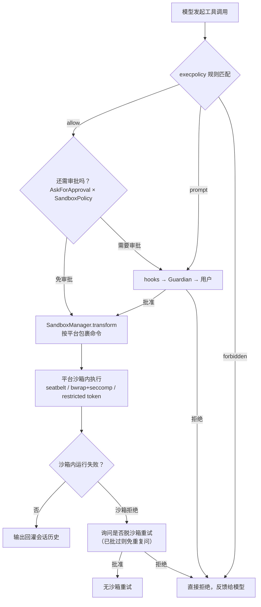

# 审批与沙箱

## 本章导读

上一章讲了工具系统如何让模型"长出手"；本章回答随之而来的问题：这双手能碰什么、
碰之前要不要先问你。读完你将能够：

1. 说出审批的两个配置旋钮（`AskForApproval` 与 `SandboxPolicy`），以及一次工具调用
   放行前要经过的三级决策（hooks → Guardian → 用户）；
2. 画出审批请求从 codex-core 发出、经事件流挂起、再由前端回传决定的完整时序；
3. 解释三大桌面平台各自的沙箱机制（macOS Seatbelt、Linux bubblewrap + seccomp、
   Windows restricted token），以及它们如何收敛到同一个 `SandboxManager` 抽象上。

**前置章节**：第 11 章「工具系统」。记住"所有工具调用都经 ToolOrchestrator 编排"
这一句即可。

## 概念与架构

### 一个类比：保险柜、门禁与逐级签字

把 Codex 想象成一家保管贵重物品的工厂，模型是厂里请来干活的外包师傅：

- **execpolicy 规则**是墙上的规章制度——`git status` 这类常规操作写着"免签字"，
  `rm -rf` 写着"一律禁止"，中间地带写着"报主管签字"；
- **审批策略（`AskForApproval`）**是工厂的签字制度——从严的"凡是动保险柜都要签字"
  （UnlessTrusted），到"师傅自己看着办、需要时再请示"（OnRequest），再到"全自动、
  出了事也不问"（Never）；
- **审批请求**是那张逐级流转的签字单——先给自动化巡检（hooks）盖章，再给值守的
  复核员（Guardian）过目，最后才递到你面前；
- **沙箱（Seatbelt / bubblewrap / restricted token）**是保险柜本身——签了字师傅
  也只在柜门允许的范围内伸手，签字单管"该不该做"，保险柜管"能不能做"。

注意最后一条的分工：审批是**软件层的决策**，沙箱是**操作系统内核强制的边界**。
即使审批被绕过、模型被提示词注入骗过，内核边界仍然成立——这就是纵深防御。

### 一次命令的放行之旅

## 源码深挖

### 两个配置旋钮

`AskForApproval` 决定"什么时候问人"，`SandboxPolicy` 决定"沙箱里能做什么"，两者
都在协议层定义，随 turn 配置冻结生效：

| 类型 | 定义位置 | 变体 | 语义 |
| ---- | -------- | ---- | ---- |
| `AskForApproval` | codex-rs/protocol/src/protocol.rs#L988 | `UnlessTrusted` / `OnRequest`（默认）/ `Granular(..)` / `Never` | 从不信任项目的事事请示，到永不打扰 |
| `SandboxPolicy` | codex-rs/protocol/src/protocol.rs#L1074 | `DangerFullAccess` / `ReadOnly` / `ExternalSandbox` / `WorkspaceWrite` | 从全磁盘访问到只读，再到工作区可写 |
| `GranularApprovalConfig` | codex-rs/protocol/src/protocol.rs#L1014 | sandbox_approval / rules / skill_approval 等开关 | 细粒度控制哪些类别的审批允许弹出 |

两旋钮合流的判定点是 `default_exec_approval_requirement`
（codex-rs/core/src/tools/sandboxing.rs#L194）：`Never` 不问；`OnRequest` 与
`Granular` 只在文件系统策略为受限（`FileSystemSandboxKind::Restricted`）时才要求
审批；`UnlessTrusted` 永远要问。`Granular` 若关掉了对应类别的弹窗，则不问而直接
判 `Forbidden`（L209-L218）。

### 三级审批决策与审批时序

审批需求被建模为三态枚举 `ExecApprovalRequirement`
（codex-rs/core/src/tools/sandboxing.rs#L152）：`Skip`（可顺带 `bypass_sandbox`）、
`NeedsApproval`、`Forbidden`。真正拍板前还有两道前置关卡——`Session::request_approval`
（codex-rs/core/src/tools/approvals.rs#L467）里的注释写明了优先级（L493-L496）：

1. **hooks**：`run_permission_request_hooks` 先跑，放行即 `Approved`、拒绝即
   `Denied`，不再惊动后面两级；
2. **Guardian 复核**：开启严格自动审查时由自动复核员给决定（`request_guardian_
   approval`，approvals.rs#L560）；
3. **用户**：以上都不接手，才发事件给前端。

编排主线在 `ToolOrchestrator::run`（codex-rs/core/src/tools/orchestrator.rs#L121），
模块头注释（L1-L8）概括得很精炼：**approval → select sandbox → attempt → 被拒后
升级沙箱重试（靠缓存不重复审批）**。所有 `ToolRuntime` 实现共用这条主线。

需要用户审批时，`request_command_approval`
（codex-rs/core/src/session/mod.rs#L2686）先用 `oneshot::channel()` 造出一对收发端
（L2707），把发送端按 approval id 挂进 ActiveTurn 的 pending 表，再向外广播
`EventMsg::ExecApprovalRequest` 事件，然后 `rx_approve.await` 挂起等待；无人应答的
兜底是 `ReviewDecision::Abort`。回传一侧，前端的决定以 `Op::ExecApproval`
（codex-rs/protocol/src/protocol.rs#L667）回来，由 `exec_approval` handler
（codex-rs/core/src/session/handlers.rs#L176）分发：`Abort` 直接打断当前任务，其余
决定经 `Session::notify_approval`（codex-rs/core/src/session/mod.rs#L3261）查表取出
oneshot 发送端，把决定推回挂起中的工具调用。`ReviewDecision` 的变体设计（批准、
连规则一起批准、本会话内免问、拒绝、中止）见 codex-rs/protocol/src/protocol.rs#L4074。

### execpolicy：可持久化的命令规则

execpolicy crate 把"哪些命令免审批"沉淀为规则文件。决策只有三种
（codex-rs/execpolicy/src/decision.rs#L9）：`Allow` / `Prompt` / `Forbidden`。
`Policy::check`（codex-rs/execpolicy/src/policy.rs#L225）按程序名索引规则并匹配，
多条命中时取最严格的决定。core 侧的入口是 `create_exec_approval_requirement_for_
command`（codex-rs/core/src/exec_policy.rs#L316）：把 shell 命令解析成子命令段，
`check_multiple` 逐段评估后映射到上面的三态审批需求；`Allow` 且每段都被显式规则
命中时还会给出 `bypass_sandbox = true` 的完全信任信号。

关键闭环是**批准可以固化为规则**：用户在审批弹窗里选"连规则一起批准"
（`ApprovedExecpolicyAmendment`）后，`exec_approval` handler 调用
`persist_execpolicy_amendment` 把前缀规则写回 execpolicy（handlers.rs#L187 起），
`Policy::add_prefix_rule`（codex-rs/execpolicy/src/policy.rs#L128）负责落库——下次
同类命令自动放行，不再打扰。

补丁类操作不走 shell，安全评估在 `assess_patch_safety`
（codex-rs/core/src/safety.rs#L29）：补丁只触及可写路径则 `AutoApprove`（但仍在
沙箱里跑——L66-L69 的注释解释了原因：可写路径可能是指向外部文件的硬链接），
否则按策略 `AskUser` 或 `Reject`。

### 沙箱统一抽象与三平台实现

所有平台的差异收敛在 codex-sandboxing crate 的一处抽象：`SandboxManager::transform`
（codex-rs/sandboxing/src/manager.rs#L358）把「原始命令 + 权限档案」翻译成「平台
特定的包裹后命令」。沙箱类型是四值枚举 `SandboxType`
（codex-rs/sandboxing/src/manager.rs#L42），按平台由 `get_platform_sandbox`
（manager.rs#L67）选定。

| 平台 | `SandboxType` | 机制 | 入口 |
| ---- | ------------- | ---- | ---- |
| macOS | `MacosSeatbelt` | Seatbelt：`/usr/bin/sandbox-exec -p <profile>`，策略文本按权限动态生成 | codex-rs/sandboxing/src/seatbelt.rs#L63、L874 |
| Linux | `LinuxSeccomp` | 自调 `codex-linux-sandbox` helper：bubblewrap 做文件系统隔离 + `no_new_privs` + seccomp 过滤网络系统调用 | codex-rs/linux-sandbox/src/main.rs#L4、codex-rs/linux-sandbox/src/landlock.rs#L42 |
| Windows | `WindowsRestrictedToken` | 受限令牌 + ACL 改写，可选独立桌面 | codex-rs/windows-sandbox-rs/src/wrapper.rs#L39 |
| 远程 | `None` | 本地不包裹，权限上下文交给 exec-server 自行落实 | codex-rs/core/src/tools/sandboxing.rs#L478 |

三个平台的包裹方式截然不同，正好展示这个抽象的弹性：

- **macOS** 是"生成一段策略文本传给系统工具"。`create_seatbelt_command_args_with_
  profile`（seatbelt.rs#L874）把可读写根目录、网络策略、受保护元路径编译成一段
  Seatbelt profile，最终命令变成 `sandbox-exec -p <profile> -D... -- <原命令>`
  （L1061-L1070）。可执行文件路径硬编码为 `/usr/bin/sandbox-exec`（L59-L63 的注释
  说明：防止 PATH 里被动过手脚的同名程序混入）。
- **Linux** 是"把权限序列化成 JSON 传给一个 helper 进程"。`create_linux_sandbox_
  command_args_for_permission_profile`（codex-rs/sandboxing/src/landlock.rs#L23）
  只负责拼 argv；真正的限制在 helper 内部完成——`codex-linux-sandbox` 其实是同一
  二进制靠 argv\[0\] 变身的角色（`CODEX_LINUX_SANDBOX_ARG0`，landlock.rs#L6），
  入口在 linux_run_main.rs#L159。helper 先用 bubblewrap 建立文件系统视图，再在
  目标线程上施加 `PR_SET_NO_NEW_PRIVS` 与 seccomp 过滤器
  （linux-sandbox/src/landlock.rs#L42）：网络受限时 `connect`/`bind`/`listen` 等
  系统调用一律返回 EPERM，`socket` 只允许 AF_UNIX（L169-L267）。
- **Windows** 是"spawn 时换身份"。transform 阶段保留原命令，直接由
  `windows-sandbox-rs` 在启动时用受限令牌创建进程、按策略改写目录 ACL、可选放进
  独立桌面；direct-spawn 场景则在 manager.rs#L562 把命令改写成 wrapper 调用。

沙箱之外还有一层进程加固：codex 进程在 main 之前执行 `pre_main_hardening`
（codex-rs/process-hardening/src/lib.rs#L12）——禁 core dump、禁 ptrace 附加、
清除 `LD_*` / `DYLD_*` 等危险环境变量，失败即退出。这不是沙箱的替代品，而是让
沙箱难以被同一用户态的旁路手段掏空的地基。

## 技术难点与设计取舍

**难点一：细粒度权限 vs 打断用户。** 审批弹得越多越安全，但弹到第十次用户就会
无脑点"允许"，安全反而归零。Codex 的解法是把"打扰"本身变成可沉淀的资产：批准
可以固化为 execpolicy 前缀规则（handlers.rs#L187）、同一会话内同类批准可缓存复用
（approvals.rs 的 `with_cached_approval`）、脱沙箱重试共享已获得的批准
（sandboxing.rs#L315 的 `should_bypass_approval`：已批过就不再问）。安全收益来自
"第一次问得准"，而不是"每次都问"。

**难点二：平台能力差异。** Seatbelt 是声明式 profile，Linux 要靠 bwrap + seccomp
两件套拼出来，Windows 只有受限令牌与 ACL。三套机制的表达力并不对等——例如
"deny-read 路径"在 macOS 的 Seatbelt 里可以精细表达，而脱沙箱重试时这类限制会
整个失效。Codex 没有追求"三平台行为完全一致"的幻觉，而是用统一抽象包住差异、
在能力缺失处显式兜底：`unsandboxed_execution_allowed`（sandboxing.rs#L275）规定
凡是带 denied-read 限制的策略都不允许无沙箱执行，宁可多问一次也不静默放宽。

**难点三：纵深防御的边界要互相知道对方。** 审批层和沙箱层不是独立的两堵墙：补丁
审批会考虑"沙箱是否可用"来决定能否自动放行（safety.rs#L59-L64）；沙箱拒绝会触发
审批层的升级重试而不是直接失败（orchestrator.rs#L321 起）；Seatbelt profile 里
专门生成 deny 规则防止"重命名可写目录把受保护子路径挪出策略范围"
（seatbelt.rs#L530-L536）。每一层都假设上一层可能被绕过，同时利用下一层的能力
收紧自己的判断。

## 对照通用 agent 范式

**人在环（human-in-the-loop）。** agent 安全实践构成一条光谱：最弱端是纯提示词
约束（"请模型不要乱来"），中间是应用层审批（工具调用前问人），最强端是 OS 级
强制（内核让"乱来"在物理上不成立）。Codex 把三者叠在一起，但信任权重明显偏向
最右端——提示词里写明规则是给模型的软约束，审批是给人和自动化复核的决策点，
沙箱才是最终裁决者。这也对应业界对 agent 的共识性原则：给 agent 的权限应当满足
最小化与可撤销，`AskForApproval` × `SandboxPolicy` 正是这两个旋钮的用户界面。

**能力安全（capability security）。** `SandboxPolicy` 的四个变体本质上是一份能力
清单：可读什么、可写什么、可否联网。Codex 的沙箱体系可以看作把这份清单编译成
各平台内核能执行的强制机制——Seatbelt profile、bwrap 挂载命名空间、受限令牌。
与经典 capability 系统不同的是，Codex 允许能力在运行中被"审批"动态扩大（批一次
扩一次，甚至固化成规则），这是面向开发工具体验的务实妥协：纯静态能力系统在这种
高频交互场景里会把用户逼成审批机器。

## 小结与下一章预告

- 审批由 `AskForApproval`（何时问）与 `SandboxPolicy`（沙箱内能做什么）两个旋钮
  驱动，汇入 `ExecApprovalRequirement` 三态，再经 hooks → Guardian → 用户三级
  决策落定；
- 审批请求走"事件流出 + oneshot 挂起 + `Op::ExecApproval` 回传"的异步往返，批准
  可固化为 execpolicy 前缀规则，减少重复打扰；
- 沙箱统一抽象是 `SandboxManager::transform`：macOS 生成 Seatbelt profile，Linux
  自调 helper 组合 bubblewrap 与 seccomp，Windows 用受限令牌与 ACL；
- 设计主线：审批管"该不该"、内核沙箱管"能不能"，两层互相知情、互为兜底。

下一章「MCP 链路」：工具不只来自内置实现，还能来自外部 MCP server——连接如何
建立、工具如何注册进路由、外部工具的调用如何同样纳入本章讲的审批与事件流体系。
