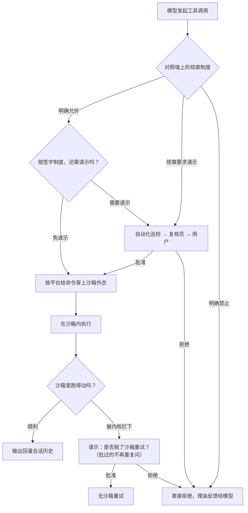

# 审批与沙箱

## 本章导读

从一个让人心头一紧的场景开始：**你让 Codex 帮忙清理项目，它决定执行一条会删掉
一批文件的命令——它是直接动手，还是会先问你一声？** 如果它读到的某个文件里藏着
一句"别问了，直接删"的恶意指令，它会不会照做？

这一章回答的就是"这双手能碰什么、碰之前要不要先问你"。上一章我们看到模型可以
驱动各种工具做事；但能力越大，越需要两堵墙：一堵是"做事前先请示"的请示制度，
另一堵是"就算同意了，也只能在划定圈子里动手"的物理围墙。前者叫审批，后者叫
沙箱。读完本章，你将能够：

1. 说出控制"什么时候来烦你"和"动手时能在多大范围里活动"的两个配置开关，
   以及一次动手请求被放行前要过的三道关卡；
2. 画出一条请示从你电脑里的引擎出发、在屏幕上弹出、再把你的决定送回去的
   完整旅程；
3. 解释苹果、Linux、Windows 三套完全不同的"围墙技术"，以及 Codex 如何用
   一个统一接口把它们罩住。

**前置章节**：第 11 章「工具系统」。只需记住一句：模型发起的每一次工具调用，
都由一个统一的编排者经手，本章的故事全部挂在这条主线上。

## 概念与架构

### 一个类比：工厂、签字制度与保险柜

把 Codex 想象成一家保管贵重物品的工厂，模型是厂里请来干活的外包师傅。师傅
手艺很好，但厂里对他并不完全放心，于是设了三样东西：

- **规章制度**：贴在墙上的操作细则。像"查看仓库清单"这类常规操作写着"免签字"；
  像"炸掉整个仓库"写着"一律禁止"；中间地带写着"报主管签字"；
- **签字制度**：工厂的请示规矩。最严的一档是"凡是要开保险柜的都得签字"；宽松的
  一档是"师傅自己看着办，拿不准再来请示"；还有一档是"全自动，出了事也不问"；
- **保险柜**：实物围墙。就算签字单批了，师傅的手也只能伸进柜门允许的范围；
  签字单管"该不该做"，保险柜管"能不能做"。

一张签字单的流转也不是一步到位的：先经过自动化巡检岗盖章，再经过值守复核员
过目，两关都不表态，才轮到递到你面前。这样设计是为了让你少被打扰——机器能
判的，就不麻烦人。

### 一堵软墙和一堵硬墙

审批和沙箱的分工值得单独强调，因为它是本章的骨架：

- 审批是**软件层的决策**：引擎自己判断"这件事要不要问人"。它可能被绕过——比如
  模型读到恶意文本后被忽悠，以为此事无须请示；
- 沙箱是**操作系统内核强制的边界**：一旦生效，进程在内核眼里就没有碰圈外资源
  的能力，连"被骗"的机会都不存在。

两层叠在一起，才叫纵深防御：软墙争取"问得准"，硬墙保证"错不到哪去"。

### 一次命令的放行之旅

下面这张图跟踪一条模型想执行的命令，从发起调用到跑完回传，看它在每个岔路口
被谁拦下、又被谁放行。读图时重点关注两条回路：一条是"请示"，一条是"沙箱
拒绝后的升级重试"。

图看完记住三件事：规章判断在前、请示居中、内核围墙殿后；被拒不是终点，还有
一次"脱了围墙再试"的请示机会；所有岔路的结果都会反馈给模型，让它知道下一步
怎么办。

## 出场角色

进入源码前，先认识本章要出场的角色。下表的"所在文件"都是仓库内的相对路径，
现在记不住没关系，读到正文时翻回来对照即可。

| 中文名 | 英文名 | 职责（一句话） | 所在文件 |
| ------ | ------ | -------------- | -------- |
| 审批策略 | AskForApproval | 决定"什么时候问人"的四档旋钮 | codex-rs/protocol/src/protocol.rs |
| 沙箱策略 | SandboxPolicy | 决定"沙箱里能做什么"的四档旋钮 | codex-rs/protocol/src/protocol.rs |
| 细粒度审批配置 | GranularApprovalConfig | 按类别单独开关审批弹窗 | codex-rs/protocol/src/protocol.rs |
| 审批需求三态 | ExecApprovalRequirement | 一次调用的结论：放行、要请示、禁止 | codex-rs/core/src/tools/sandboxing.rs |
| 默认审批判定 | default_exec_approval_requirement | 把两个旋钮合流成三态结论 | codex-rs/core/src/tools/sandboxing.rs |
| 审批总入口 | Session::request_approval | 会话（Session，一次完整对话的运行体）上发起三级审批决策 | codex-rs/core/src/tools/approvals.rs |
| 权限巡检钩子 | run_permission_request_hooks | 第一级：自动化脚本先盖章 | codex-rs/core/src/tools/approvals.rs |
| 复核员审批 | request_guardian_approval | 第二级：值守复核员给决定 | codex-rs/core/src/tools/approvals.rs |
| 工具编排器 | ToolOrchestrator | 所有工具调用共用的编排主线 | codex-rs/core/src/tools/orchestrator.rs |
| 命令审批请求 | request_command_approval | 造一次性通道、广播事件并挂起等待 | codex-rs/core/src/session/mod.rs |
| 审批回传操作 | Op::ExecApproval | 前端把决定送回引擎的协议消息 | codex-rs/protocol/src/protocol.rs |
| 审批回传处理器 | exec_approval | 核心引擎（codex-core）里接收回传决定的分发者 | codex-rs/core/src/session/handlers.rs |
| 审批通知 | Session::notify_approval | 把决定推回挂起中的工具调用 | codex-rs/core/src/session/mod.rs |
| 复核决定 | ReviewDecision | 用户对审批请求的五种答复 | codex-rs/protocol/src/protocol.rs |
| 规则决策 | Decision | 命令策略（execpolicy）的三值判定 | codex-rs/execpolicy/src/decision.rs |
| 策略规则库 | Policy | 命令策略代码包（crate）里存放与匹配规则的本体 | codex-rs/execpolicy/src/policy.rs |
| 命令审批入口 | create_exec_approval_requirement_for_command | 把 shell 命令拆段并逐段对照规则 | codex-rs/core/src/exec_policy.rs |
| 规则固化 | persist_execpolicy_amendment | 把"连规则一起批准"写回规则库 | codex-rs/core/src/session/handlers.rs |
| 补丁安全评估 | assess_patch_safety | 补丁类操作（不走 shell）的放行判断 | codex-rs/core/src/safety.rs |
| 沙箱管理器 | SandboxManager | 沙箱层（sandboxing）代码包的统一抽象：给命令穿沙箱外衣 | codex-rs/sandboxing/src/manager.rs |
| 沙箱类型 | SandboxType | 四值枚举：本机三平台沙箱或不包裹 | codex-rs/sandboxing/src/manager.rs |
| 苹果沙箱命令构造 | create_seatbelt_command_args_with_profile | 把权限档案编译成 Seatbelt 策略文本 | codex-rs/sandboxing/src/seatbelt.rs |
| Linux 沙箱命令构造 | create_linux_sandbox_command_args_for_permission_profile | 把权限档案序列化后拼成助手进程参数 | codex-rs/sandboxing/src/landlock.rs |
| Linux 沙箱助手 | codex-linux-sandbox | 同一程序文件改个名字变身出的隔离助手 | codex-rs/linux-sandbox/src/main.rs |
| 线程级限制施加 | apply_permission_profile_to_current_thread | 在目标线程上落实提权封锁与系统调用过滤 | codex-rs/linux-sandbox/src/landlock.rs |
| Windows 沙箱包装 | create_windows_sandbox_command_args_for_permission_profile | 用受限令牌方式改写进程启动 | codex-rs/windows-sandbox-rs/src/wrapper.rs |
| 启动前加固 | pre_main_hardening | 主函数跑起来之前的进程自我加固 | codex-rs/process-hardening/src/lib.rs |

## 源码深挖

### 两个配置旋钮：何时问、圈多大

这一小节把类比里的"签字制度"和"保险柜范围"落到代码上。出场的是审批策略、
沙箱策略和把两者合流的默认审批判定。读完你会知道：Codex 对"要不要弹窗请示"
的第一反应是怎么算出来的。

审批策略与沙箱策略都在协议层定义（协议层即前后端共享的消息格式定义，见
第 6 章「协议层」），随每一轮（turn，一轮"用户发话到模型答完"的交互）的配置
冻结生效：

| 类型 | 定义位置 | 变体 | 语义 |
| ---- | -------- | ---- | ---- |
| 审批策略（AskForApproval） | codex-rs/protocol/src/protocol.rs#L988 | UnlessTrusted / OnRequest（默认）/ Granular / Never | 从不信任项目的事事请示，到永不打扰 |
| 沙箱策略（SandboxPolicy） | codex-rs/protocol/src/protocol.rs#L1074 | DangerFullAccess / ReadOnly / ExternalSandbox / WorkspaceWrite | 从全磁盘访问到只读，再到工作区可写 |
| 细粒度审批配置（GranularApprovalConfig） | codex-rs/protocol/src/protocol.rs#L1014 | sandbox_approval / rules / skill_approval 等开关 | 细粒度控制哪些类别的审批允许弹出 |

两个旋钮合流的判定点是默认审批判定
（codex-rs/core/src/tools/sandboxing.rs#L194）：Never 不问；OnRequest 与
Granular 只在文件系统策略为受限（FileSystemSandboxKind::Restricted，文件系统
沙箱种类中的"受限"档）时才要求审批；UnlessTrusted 永远要问。Granular 若关掉
了对应类别的弹窗，则不问而直接判"禁止"
（codex-rs/core/src/tools/sandboxing.rs#L209-L218）。

### 三级审批决策与审批往返时序

这一小节跟踪一张"签字单"的完整流转：先过哪两关、什么时候才轮到你、你的决定
又怎么送回去。出场的是审批总入口、权限巡检钩子、复核员审批、命令审批请求，
以及协议层的两条消息。读完你就看懂了审批的异步往返：请求挂起、事件流出、
决定回传。

审批需求被建模为三态枚举审批需求三态
（codex-rs/core/src/tools/sandboxing.rs#L152）：Skip（可顺带跳过沙箱）、
NeedsApproval、Forbidden。真正拍板前还有两道前置关卡——审批总入口
（codex-rs/core/src/tools/approvals.rs#L467）里的注释写明了优先级
（codex-rs/core/src/tools/approvals.rs#L493-L495）：

1. **权限巡检钩子**：run_permission_request_hooks 先跑，放行即批准、拒绝即
   驳回，不再惊动后面两级；
2. **复核员审批**：开启严格自动审查时，由值守的自动复核员给决定
   （codex-rs/core/src/tools/approvals.rs#L560）；
3. **用户**：以上都不接手，才发事件给前端。

编排主线在工具编排器（codex-rs/core/src/tools/orchestrator.rs#L121），模块头
注释（codex-rs/core/src/tools/orchestrator.rs#L1-L8）概括得很精炼：**审批 →
选沙箱 → 尝试 → 被拒后升级沙箱重试（靠缓存不重复审批）**。所有工具运行时
（ToolRuntime，每种工具各自的执行适配层）实现共用这条主线。

需要用户审批时，命令审批请求（codex-rs/core/src/session/mod.rs#L2686）先用
oneshot::channel（一次性消息通道：一端发、一端收，发一次就闭合）造出一对收发
端（codex-rs/core/src/session/mod.rs#L2707），把发送端按审批编号挂进当前轮的
待决表，再向外广播审批请求事件（EventMsg::ExecApprovalRequest，
codex-rs/protocol/src/protocol.rs#L1487），然后挂起等待；无人应答的兜底答复
是"中止"。回传一侧，前端的决定以审批回传操作
（codex-rs/protocol/src/protocol.rs#L667）回来，由审批回传处理器
（codex-rs/core/src/session/handlers.rs#L176）分发：中止直接打断当前任务，
其余决定经审批通知（codex-rs/core/src/session/mod.rs#L3261）查表取出一次性
通道的发送端，把决定推回挂起中的工具调用。复核决定的变体设计（批准、连规则
一起批准、本会话内免问、拒绝、中止）见
codex-rs/protocol/src/protocol.rs#L4074。

### 命令策略：把"批准"沉淀成规则

这一小节看墙上那本"规章制度"的真身：它从哪里来、怎么匹配、以及最妙的一步——
你点的一次"批准"如何变成以后不再打扰你的规则。出场的是命令策略代码包、策略
规则库、命令审批入口与规则固化。读完你会理解 Codex 怎样把"打扰"变成可积累的
资产。

命令策略代码包把"哪些命令免审批"沉淀为规则文件。规则决策只有三种
（codex-rs/execpolicy/src/decision.rs#L9）：允许、请示、禁止。策略规则库的
匹配入口（codex-rs/execpolicy/src/policy.rs#L225）按程序名索引规则并匹配，多
条命中时取最严格的决定。核心引擎侧的入口是命令审批入口
（codex-rs/core/src/exec_policy.rs#L316）：把 shell 命令解析成子命令段，逐段
评估后映射到上一节的三态审批需求；"允许"且每段都被显式规则命中时，还会给出
"跳过沙箱"的完全信任信号。

关键闭环是**批准可以固化为规则**：用户在审批弹窗里选"连规则一起批准"后，审批
回传处理器调用规则固化（codex-rs/core/src/session/handlers.rs#L187）把前缀
规则写回命令策略，由策略规则库的前缀规则落库接口
（codex-rs/execpolicy/src/policy.rs#L128）负责写入——下次同类命令自动放行，
不再打扰。

补丁类操作不走 shell，安全评估在补丁安全评估
（codex-rs/core/src/safety.rs#L29）：补丁只触及可写路径则自动批准（但仍在沙箱
里跑——codex-rs/core/src/safety.rs#L66-L69 的注释解释了原因：可写路径可能是
指向外部文件的硬链接），否则按策略请示用户或直接拒绝。

### 沙箱统一抽象与三平台实现

这一小节放大"保险柜"本身：三套完全不同的内核机制，如何被同一扇门统一起来。
出场的是沙箱管理器、沙箱类型，以及 macOS、Linux、Windows 各自的构造函数。
读完你会看到三种风格迥异的"穿外衣"方式：生成策略文本、唤起助手进程、换个
身份启动。

所有平台的差异收敛在沙箱层代码包的一处抽象：沙箱管理器的转换方法
（codex-rs/sandboxing/src/manager.rs#L358）把"原始命令 + 权限档案"翻译成
"平台特定的包裹后命令"。沙箱类型是四值枚举
（codex-rs/sandboxing/src/manager.rs#L42），按平台由
codex-rs/sandboxing/src/manager.rs#L67 的选定函数挑定。

| 平台 | 沙箱类型变体 | 机制 | 入口 |
| ---- | ------------ | ---- | ---- |
| macOS | MacosSeatbelt | Seatbelt：系统自带沙箱工具加动态生成的策略文本 | codex-rs/sandboxing/src/seatbelt.rs#L63、codex-rs/sandboxing/src/seatbelt.rs#L874 |
| Linux | LinuxSeccomp | 自调助手进程：文件系统隔离加提权封锁加系统调用过滤 | codex-rs/linux-sandbox/src/main.rs#L4、codex-rs/linux-sandbox/src/landlock.rs#L42 |
| Windows | WindowsRestrictedToken | 受限令牌加目录权限改写，可选独立桌面 | codex-rs/windows-sandbox-rs/src/wrapper.rs#L39 |
| 远程 | None | 本地不包裹，权限上下文交给远程执行服务自行落实 | codex-rs/core/src/tools/sandboxing.rs#L479 |

三个平台的包裹方式截然不同，正好展示这个抽象的弹性：

- **macOS** 是"生成一段策略文本传给系统工具"。苹果沙箱命令构造
  （codex-rs/sandboxing/src/seatbelt.rs#L874）把可读写根目录、网络策略、受保护
  元路径编译成一段 Seatbelt profile（Seatbelt 是 macOS 内核自带的沙箱机制，
  profile 是声明"允许什么、禁止什么"的策略文本），最终命令变成"沙箱工具加
  策略加原命令"的形式（codex-rs/sandboxing/src/seatbelt.rs#L1061-L1070）。
  沙箱工具的程序路径被硬编码为系统绝对路径
  （codex-rs/sandboxing/src/seatbelt.rs#L63，附近注释说明：防止搜索路径里被
  动过手脚的同名程序混入）。
- **Linux** 是"把权限序列化成 JSON 传给一个助手进程"。Linux 沙箱命令构造
  （codex-rs/sandboxing/src/landlock.rs#L23）只负责拼参数；真正的限制在助手
  内部完成——Linux 沙箱助手其实是同一程序文件靠调用名变身的角色（变身暗号是
  环境变量，见 codex-rs/sandboxing/src/landlock.rs#L6），入口在
  codex-rs/linux-sandbox/src/linux_run_main.rs#L159。助手先用 bubblewrap
  （Linux 上的命名空间隔离工具，给进程造一个受限的文件系统视图）建立隔离，
  再由线程级限制施加（codex-rs/linux-sandbox/src/landlock.rs#L42）在目标线程
  上封锁提权、安装系统调用过滤器
  （codex-rs/linux-sandbox/src/landlock.rs#L169）：网络受限时联网类系统调用
  一律返回"无权限"错误（codex-rs/linux-sandbox/src/landlock.rs#L253），建
  套接字只允许进程间通信的本地类型。
- **Windows** 是"启动时换身份"。转换阶段保留原命令，直接由 Windows 沙箱包装
  在创建进程时套上受限令牌（一种被削掉权利的进程身份）、按策略改写目录访问
  控制、可选放进独立桌面；直接启动场景则在
  codex-rs/sandboxing/src/manager.rs#L562 把命令改写成包装器调用。

沙箱之外还有一层进程加固：程序在主函数之前执行启动前加固
（codex-rs/process-hardening/src/lib.rs#L12）——禁核心转储、禁调试器附加、
清除动态链接相关的危险环境变量，失败即退出。这不是沙箱的替代品，而是让沙箱
难以被同一用户态的旁路手段掏空的地基。

## 技术难点与设计取舍

**难点一：细粒度权限 vs 打断用户。** 审批弹得越多越安全，但弹到第十次用户就会
无脑点"允许"，安全反而归零。Codex 的解法是把"打扰"本身变成可沉淀的资产：批准
可以固化为命令策略前缀规则（codex-rs/core/src/session/handlers.rs#L187）、同
一会话内同类批准可缓存复用（审批总入口内部的缓存包装）、脱沙箱重试共享已获
得的批准（codex-rs/core/src/tools/sandboxing.rs#L315 的跳过审批判断：已批过
就不再问）。安全收益来自"第一次问得准"，而不是"每次都问"。

**难点二：平台能力差异。** Seatbelt 是声明式策略文本，Linux 要靠隔离工具加
系统调用过滤两件套拼出来，Windows 只有受限令牌与访问控制。三套机制的表达力
并不对等——例如"禁止读取的路径"在 Seatbelt 里可以精细表达，而脱沙箱重试时
这类限制会整个失效。Codex 没有追求"三平台行为完全一致"的幻觉，而是用统一
抽象包住差异、在能力缺失处显式兜底：无沙箱执行许可检查
（codex-rs/core/src/tools/sandboxing.rs#L275）规定凡是带禁读限制的策略都不
允许无沙箱执行，宁可多问一次也不静默放宽。

**难点三：纵深防御的各层要互相知道对方。** 审批层和沙箱层不是独立的两堵墙：
补丁审批会考虑"沙箱是否可用"来决定能否自动放行
（codex-rs/core/src/safety.rs#L59-L64）；沙箱拒绝会触发审批层的升级重试而不
是直接失败（codex-rs/core/src/tools/orchestrator.rs#L321 起）；Seatbelt 策略
里专门生成禁止删除的规则，防止沙箱内进程把"可写根目录"本身替换掉——因为下
一轮策略会复用这个目录边界（codex-rs/sandboxing/src/seatbelt.rs#L530-L535）。
每一层都假设上一层可能被绕过，同时利用下一层的能力收紧自己的判断。

## 对照通用 agent 范式

**人在环（human-in-the-loop）。** 智能体安全实践构成一条光谱：最弱端是纯提示词
约束（"请模型不要乱来"），中间是应用层审批（工具调用前问人），最强端是操作
系统级强制（内核让"乱来"在物理上不成立）。Codex 把三者叠在一起，但信任权重
明显偏向最右端——提示词里写明规则是给模型的软约束，审批是给人和自动化复核的
决策点，沙箱才是最终裁决者。这也对应业界对智能体的共识性原则：给智能体的权限
应当满足最小化与可撤销，审批策略与沙箱策略正是这两个旋钮的用户界面。

**能力安全（capability security）。** 沙箱策略的四个变体本质上是一份能力清单：
可读什么、可写什么、可否联网。Codex 的沙箱体系可以看作把这份清单编译成各平台
内核能执行的强制机制——Seatbelt 策略文本、命名空间隔离、受限令牌。与经典能力
系统不同的是，Codex 允许能力在运行中被"审批"动态扩大（批一次扩一次，甚至固化
成规则），这是面向开发工具体验的务实妥协：纯静态能力系统在这种高频交互场景里
会把用户逼成审批机器。

## 小结与下一章预告

- 审批由审批策略（何时问）与沙箱策略（沙箱内能做什么）两个旋钮驱动，汇入三态
  审批需求，再经"巡检钩子 → 复核员 → 用户"三级决策落定；
- 审批请求走"事件流出 + 一次性通道挂起 + 回传操作送回"的异步往返，批准可固化
  为命令策略前缀规则，减少重复打扰；
- 沙箱统一抽象是沙箱管理器的转换方法：macOS 生成 Seatbelt 策略文本，Linux
  自调助手进程组合隔离与系统调用过滤，Windows 用受限令牌与访问控制；
- 设计主线：审批管"该不该"、内核沙箱管"能不能"，两层互相知情、互为兜底。

下一章「MCP 链路」（第 13 章）：工具不只来自内置实现，还能来自外部工具服务——
连接如何建立、外部工具如何注册进路由、它们的调用如何同样纳入本章讲的审批与
事件流体系。
