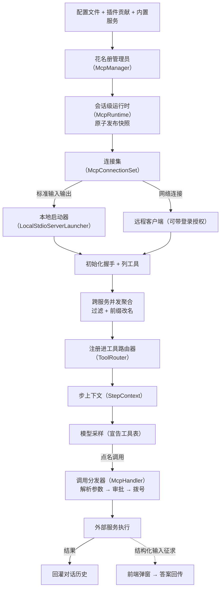

# MCP 链路

## 本章导读

从一个具体场景开始：你们公司有一套内部系统，查库存、下工单都要走它。你想让
Codex 干活时顺手查一下，但 Codex 出厂只带了读文件、跑命令这几件内置工具，
总不能为了你家系统去改它的源码。怎么办？

答案是一种公开的外部工具协议（MCP，Model Context Protocol，模型上下文协议），
由 Anthropic 公司在 2024 年底开放。它规定了两件事：助手程序怎么找到外部
服务、怎么调用里面的工具。任何人都可以按它写一个独立的小服务——查数据库的、
操作浏览器的、读企业内部系统的——插进任何一个支持该协议的助手程序，就像
外设插上 USB-C 口。在 Codex 里，你只需在配置文件里登记几行服务地址，下一轮
对话，模型就可能拿着这些新工具干活。

本章沿这条链路走一遍：配置怎么合并、服务怎么启动、工具清单怎么送到模型眼前、
模型点名之后电话怎么拨出去，以及工具在执行途中反过来向你提问时消息走哪条路。

读完本章，你将能够：

1. 说出一个外部工具服务从"写在配置里"到"可以干活"之间经历的所有步骤，以及
   某个服务启动失败为什么不会拖垮整个会话；
2. 解释模型看到的工具清单是怎么拼出来的，以及为什么"模型看到的"和"实际执行
   的"永远是同一份；
3. 描述外部工具反过来向你提问时，问题与答案各走哪条路。

**前置章节**：第 11 章「工具系统」（本章会用到其中的工具注册表、工具路由器
等概念）；第 7 章「Agent 核心」（每次向模型提问前的那份上下文快照会反复
出现）。

## 概念与架构

### 一个类比：外聘专家市场

延续第 1 章「总览」的"外包工程师团队"类比：内置工具是正式员工，外部工具
服务是从市场上临时聘请的外部专家。整条链路像一次完整的外聘流程：

- **招聘启事**是配置：写明每位专家的联系方式（一条本地命令，或一个网址）、
  到岗时限，以及只准动用哪些技能；
- **人事部门**是花名册管理员：把配置文件、插件推荐、平台内置专家三份名单
  合并成一张花名册，撞名时负责仲裁；
- **远程办公室**是会话级运行时：按花名册逐个联系专家——本地专家拉起一个
  子进程，远程专家走网络；联系不上不耽误团队开工，只在花名册上记一笔
  "缺席"；
- **技能汇总表**是工具聚合：把所有在岗专家的技能同时收齐、去重、改名
  （避免两位专家的技能撞名），翻译成模型看得懂的格式；
- **工牌**是工具路由器：每次向模型提问前拍一张快照，模型只能按工牌上的
  名字叫人；
- **分机电话**是调用分发器：模型点名后，参数核对、审批、拨号、限时通话
  都走它；
- 专家偶尔还会**反问你**——"这个操作要确认吗？请提供访问令牌"——这就是
  结构化输入征求，一条从服务指向人的反向通道。

### 调用链路总览

下面这张图是本章的地图：从配置到拨号的每一步都在上面，后面的源码深挖就是
把它逐段放大。

记住这张图，只需记住三个要点：

1. **配置是投影而非真相**。文件、插件、内置三方来源合并后才得到运行时
   花名册，合并时带撞名仲裁。
2. **连接是发布而非直连**。每次刷新产出一套不可变的连接集，整体原子替换
   旧快照；读取方永远拿到一个自洽的整体，不存在"换到一半的连接池"。
3. **调用凭快照拨号**。模型在一次提问里看到的工具表，来自当轮冻结的快照；
   真正执行前还会再核对一次工具目录的版本——承诺与执行严格对齐。

## 出场角色

进入源码之前，先认识本章要出场的角色。本章代码主要分布在两个代码包里：
外部工具服务侧（codex-mcp）——管理连接的生命周期与工具聚合；外部工具
客户端（rmcp-client）——封装与单个服务的协议对话。下表的"所在文件"都是
仓库内的相对路径，现在记不住没关系，读到正文时翻回来对照即可。

| 中文名 | 英文名 | 职责（一句话） | 所在文件 |
| ------ | ------ | -------------- | -------- |
| 花名册管理员 | McpManager | 把配置文件、插件、内置三方来源合并成运行时花名册并仲裁撞名 | codex-rs/core/src/mcp.rs |
| 会话级运行时 | McpRuntime | 持有当前发布的连接快照，协调配置变更 | codex-rs/codex-mcp/src/runtime.rs |
| 连接集 | McpConnectionSet | 一组运行中外部工具连接的不可变发布视图 | codex-rs/codex-mcp/src/connection_manager.rs |
| 客户端工厂 | make_rmcp_client | 按传输方式分派，为单个服务创建客户端 | codex-rs/codex-mcp/src/rmcp_client.rs |
| 本地启动器 | LocalStdioServerLauncher | 拉起本地子进程并接管其标准输入输出 | codex-rs/rmcp-client/src/stdio_server_launcher.rs |
| 远程执行启动器 | ExecutorStdioServerLauncher | 在远程执行环境里拉起服务进程 | codex-rs/rmcp-client/src/stdio_server_launcher.rs |
| 启动进度事件 | McpStartupUpdateEvent | 把每个服务的启动进度上报给前端 | codex-rs/codex-mcp/src/connection_manager/startup.rs |
| 启动失败诊断 | mcp_init_error_display | 把启动失败翻译成面向用户的修复建议 | codex-rs/codex-mcp/src/connection_manager/startup.rs |
| 工具聚合入口 | list_all_tools | 并发向所有服务收工具并统一改名 | codex-rs/codex-mcp/src/connection_manager/tool_catalog.rs |
| 名称规范化器 | normalize_tools_for_model_with_prefix | 去重、哈希改名、压进长度上限 | codex-rs/codex-mcp/src/tools.rs |
| 工具档案 | ToolInfo | 同时携带路由名、模型可见名与回传原名 | codex-rs/codex-mcp/src/tools.rs |
| 绑定捕获器 | capture_binding_with_metadata | 为当轮采样捕获一份连接与工具目录绑定 | codex-rs/codex-mcp/src/connection_manager/tool_catalog.rs |
| 工具表构建函数 | build_tool_router | 把内置与外部工具一起注册成工具路由器 | codex-rs/core/src/tools/spec_plan.rs |
| 暴露面政策 | apply_mcp_tool_exposure_policy | 按服务的忽略清单收缩对模型的暴露面 | codex-rs/core/src/tools/spec_plan.rs |
| 处理器缓存 | McpHandlerCache | 把每条外部工具包成调用分发器并登记 | codex-rs/core/src/mcp_tool_exposure.rs |
| 调用分发器 | McpHandler | 模型点名后负责解析、审批、拨号的处理器 | codex-rs/core/src/tools/handlers/mcp.rs |
| 快照捕获函数 | capture_step_context_inner | 每次采样前冻结当轮上下文 | codex-rs/core/src/session/mod.rs |
| 步上下文 | StepContext | 一次采样冻结的完整上下文（含连接绑定与工具计划） | codex-rs/core/src/session/step_context.rs |
| 连接绑定 | McpBinding | 当轮采样捕获的精确连接、配置与目录 | codex-rs/codex-mcp/src/binding.rs |
| 备好的调用 | PreparedMcpCall | 带目录版本租约的一次待发调用 | codex-rs/codex-mcp/src/binding.rs |
| 调用协调函数 | handle_mcp_tool_call | 解析参数、决定审批策略、驱动执行 | codex-rs/core/src/mcp_tool_call.rs |
| 审批询问函数 | maybe_request_mcp_tool_approval | 需要审批时向前端发问（含守卫复核） | codex-rs/core/src/mcp_tool_call.rs |
| 已批准执行入口 | handle_approved_mcp_tool_call | 审批通过后在目录租约内执行 | codex-rs/core/src/mcp_tool_call.rs |
| 回灌条目 | ResponseInputItem::McpToolCallOutput | 把外部工具结果写回对话历史的协议条目 | codex-rs/protocol/src/models.rs |
| 征求应答服务 | ElicitationClientService | 在外部工具客户端层接住反向提问 | codex-rs/rmcp-client/src/elicitation_client_service.rs |
| 征求路由器 | ElicitationRequestRouter | 把反向提问路由到正确的挂起应答方 | codex-rs/codex-mcp/src/elicitation.rs |
| 征求发起函数 | request_mcp_server_elicitation | 登记挂起请求、发事件、等待答案 | codex-rs/core/src/session/mcp.rs |
| 征求解决函数 | resolve_elicitation | 把前端的答案送回挂起的请求 | codex-rs/core/src/session/mcp.rs |
| 守卫复核函数 | review_guardian_mcp_elicitation | 对反向提问做安全复核 | codex-rs/core/src/session/mcp.rs |
| 变更通知处理器 | on_tool_list_changed | 收到"工具列表已变更"通知时记日志 | codex-rs/rmcp-client/src/logging_client_handler.rs |
| 预热工人 | mcp_prewarm | 后台尽力预热连接，不做正确性保证 | codex-rs/core/src/session/mcp_prewarm.rs |

## 源码深挖

### 配置汇总：三份名单合成一张花名册

这一小节回答：花名册从哪来？出场的是花名册管理员。读完你会知道配置文件、
插件、内置服务三方名单如何合并，以及撞名时谁说了算。

花名册管理员（McpManager）——把三方来源投影成运行时配置的合并器，定义在
codex-rs/core/src/mcp.rs#L74。它先遍历扩展贡献者给出的四种动作——放置、
托管应用、选中插件、移除（codex-rs/core/src/mcp.rs#L169-L241），再叠加
已加载插件的贡献（codex-rs/core/src/mcp.rs#L243-L250），最后按总开关注册
或移除平台自带的内置应用集（codex_apps）——一组开箱即用的内置外部服务
（codex-rs/core/src/mcp.rs#L252-L267）。多方争抢同一个名字时，由目录仲裁
定胜负并留下警告日志（codex-rs/core/src/mcp.rs#L312-L319）。

### 连接建立：拉起子进程与网络握手

这一小节看连接怎么落地：会话级运行时如何原子换快照、单个服务的客户端按
什么传输启动、失败如何被隔离。读完你会理解"缺席不阻塞"的基调从哪来。

会话级运行时（McpRuntime）——持有当前快照并协调配置变更——用一个原子可换
容器（ArcSwap，一种读不加锁、整体替换的共享容器）持有当前发布的快照。换
快照的入口（codex-rs/codex-mcp/src/runtime.rs#L262）协调配置变更；发布时
先构造整套新连接集，再一次原子切换
（codex-rs/codex-mcp/src/runtime.rs#L312-L321）；另有全新启动入口
（codex-rs/codex-mcp/src/runtime.rs#L277），不复用任何旧连接。

连接集（McpConnectionSet）自述是"一组运行中连接的发布视图"
（codex-rs/codex-mcp/src/connection_manager.rs#L184）。构造时先按启用与否、
必需与否过滤分桶（codex-rs/codex-mcp/src/connection_manager.rs#L237-L250）；
身份未变的连接直接复用（含仍在启动中的），其余丢进并发任务集（JoinSet，
一种并发等待多任务完成的工具）同时启动。

单个服务的客户端由客户端工厂（make_rmcp_client）按传输方式分派
（codex-rs/codex-mcp/src/rmcp_client.rs#L1115）：标准输入输出（stdio，
程序最原始的输入输出通道）分支在本地用本地启动器
（codex-rs/codex-mcp/src/rmcp_client.rs#L1157-L1160；定义在
codex-rs/rmcp-client/src/stdio_server_launcher.rs#L184），远程环境则换成
远程执行启动器（codex-rs/rmcp-client/src/stdio_server_launcher.rs#L559）；
HTTP 分支构造可流式 HTTP 客户端（HTTP 是网页使用的网络传输协议，"可流式"
指支持持续推送），支持 OAuth（一种业界标准的授权登录机制）与令牌环境变量
（bearer_token_env_var，从指定环境变量读取访问令牌的配置项）
（codex-rs/rmcp-client/src/rmcp_client.rs#L503）。之后是初始化握手
（codex-rs/rmcp-client/src/rmcp_client.rs#L608）与列工具
（codex-rs/rmcp-client/src/rmcp_client.rs#L673）。两个默认超时值得记住：
启动 30 秒（codex-rs/codex-mcp/src/rmcp_client.rs#L102），单次调用 300 秒
（codex-rs/codex-mcp/src/rmcp_client.rs#L103）。

启动过程全程对前端可见：启动进度事件沿事件流上报
（codex-rs/codex-mcp/src/connection_manager/startup.rs#L41-L52）；失败时
启动失败诊断生成修复建议
（codex-rs/codex-mcp/src/connection_manager/startup.rs#L75）——包括 GitHub
服务不支持 OAuth 的特例、未登录时提示登录命令、超时时提示调大到岗时限。

### 工具聚合与名称规范化

这一小节看技能汇总表怎么拼：谁先收、谁负责改名、改名的三条规矩是什么。
读完你会知道为什么同一个工具在 Codex 内部和模型眼里有两个名字。

聚合入口是工具聚合入口（list_all_tools）
（codex-rs/codex-mcp/src/connection_manager/tool_catalog.rs#L100）：并发地
向每个服务收工具
（codex-rs/codex-mcp/src/connection_manager/tool_catalog.rs#L110-L144），
单个服务失败只记进错误清单、不拖垮整体
（codex-rs/codex-mcp/src/connection_manager/tool_catalog.rs#L145-L156），
最后统一交给名称规范化器
（codex-rs/codex-mcp/src/connection_manager/tool_catalog.rs#L157-L161）。
规范化（codex-rs/codex-mcp/src/tools.rs#L113）做三件事：按原始身份去重；
给撞名的命名空间或工具名追加一段由 SHA-1（一种哈希算法）算出的短后缀
（codex-rs/codex-mcp/src/tools.rs#L164-L195）；把模型可见名压进 128 字节
上限（codex-rs/codex-mcp/src/tools.rs#L226）。历史前缀 mcp__ 定义在
codex-rs/codex-mcp/src/tools.rs#L22，可按配置或服务白名单省略。

工具档案（ToolInfo）同时携带三样东西：路由用的原始服务名、模型可见的可
调用名、回传给服务的原始工具名（codex-rs/codex-mcp/src/tools.rs#L25-L45）
——两个名字从此各走各的路。

### 暴露给模型与步上下文

这一小节看工牌怎么发：工具如何注册进路由器、何时直接可见、何时延迟加载，
以及每次提问前那张快照包含什么。读完你会理解"宣告与执行同源"靠什么保证。

供模型使用的绑定由绑定捕获器（capture_binding_with_metadata）捕获
（codex-rs/codex-mcp/src/connection_manager/tool_catalog.rs#L171）：可选
服务还没启动完时不硬等——有缓存工具表就先用
（codex-rs/codex-mcp/src/connection_manager/tool_catalog.rs#L204-L205），
否则给一段启动宽限期，到期仍未就绪就本轮略过（日志里写着"略过尚未就绪的
可选服务"，codex-rs/codex-mcp/src/connection_manager/tool_catalog.rs#L240）；
必需服务和显式要求的插件才必须等到位
（codex-rs/codex-mcp/src/connection_manager/tool_catalog.rs#L194-L203）。

聚合结果进入工具系统的路径在工具表构建函数（build_tool_router）
（codex-rs/core/src/tools/spec_plan.rs#L125）：处理器缓存把每条外部工具
包成调用分发器登记进工具注册表
（codex-rs/core/src/tools/spec_plan.rs#L159-L166；定义在
codex-rs/core/src/mcp_tool_exposure.rs#L37），按模型能力决定直接暴露还是
延迟加载（codex-rs/core/src/mcp_tool_exposure.rs#L90-L94）；插件类工具另有
单条 8 KB、总量 64 KB 的描述字节预算
（codex-rs/core/src/mcp_tool_exposure.rs#L19-L20）。随后暴露面政策按服务的
忽略清单收缩（codex-rs/core/src/tools/spec_plan.rs#L197；收缩逻辑在
codex-rs/core/src/tools/spec_plan.rs#L213-L225）。每个调用分发器对模型呈现
为命名空间型工具规格（ToolSpec::Namespace，把同属于一个服务的工具归为一组
的规格形式，详见第 11 章「工具系统」）：服务名归并为一个命名空间
（codex-rs/core/src/tools/handlers/mcp.rs#L464-L495）。

最后一步是快照。每次采样（向模型发起一次提问并收取回答的过程，详见第 8 章
「采样与流式处理」）前，会话调用快照捕获函数
（codex-rs/core/src/session/mod.rs#L3570），先取当轮的连接绑定
（codex-rs/core/src/session/mod.rs#L3649），再以它构建工具路由器
（codex-rs/core/src/session/mod.rs#L3683）。两者一起写进步上下文——字段
注释强调"本轮捕获的精确连接、配置与目录"
（codex-rs/core/src/session/step_context.rs#L31-L32）和"本次采样对外宣告
并执行的工具计划"（codex-rs/core/src/session/step_context.rs#L33-L34）。

### 调用分发与目录租约

这一小节跟一通"分机电话"走完全程：模型点名之后，参数怎么核对、审批怎么
插进来、拨号前为什么还要再对一次版本号。读完你会知道那条"目录变了就拒拨"
的租约是什么。

模型点名后，调用分发器的接线函数（handle_call）
（codex-rs/core/src/tools/handlers/mcp.rs#L175）先通过会话侧的准备函数
（prepare_mcp_call）换领这次调用的备好凭据
（codex-rs/core/src/tools/handlers/mcp.rs#L180-L186），然后进入调用协调
函数（codex-rs/core/src/mcp_tool_call.rs#L121）：解析 JSON 参数（JSON，
一种常见的文本数据格式）——空串合法、非法 JSON 直接回错
（codex-rs/core/src/mcp_tool_call.rs#L137-L153）；按服务归属决定审批策略
（codex-rs/core/src/mcp_tool_call.rs#L267-L285），需要审批时走审批询问
函数（含守卫（Guardian）——对高风险操作做二次复核的安全组件——的复核，
定义在 codex-rs/core/src/mcp_tool_call.rs#L1393）；批准后由已批准执行入口
（codex-rs/core/src/mcp_tool_call.rs#L430）执行——注释写明"审批必须在备好
调用的目录租约内生效"（codex-rs/core/src/mcp_tool_call.rs#L428-L429）。

拨号的最后一站在备好调用的执行方法（call_with_preparation）
（codex-rs/codex-mcp/src/binding.rs#L304）：整个准备加执行包在版本守护
函数（run_with_revision）里（codex-rs/codex-mcp/src/binding.rs#L322）。
若服务的工具目录在准备期间变了版本，这次调用被直接拒绝——"目录在备好
之后已变化"（codex-rs/codex-mcp/src/binding.rs#L361-L364）。真正的调用
报文由外部工具客户端发出
（codex-rs/rmcp-client/src/rmcp_client.rs#L855），结果以回灌条目写进对话
历史（codex-rs/protocol/src/models.rs#L852），等待下一次采样被模型读到。

不经快照的旁路（比如界面上手动点一下）走连接集的直接调用入口（call_tool）
（codex-rs/codex-mcp/src/connection_manager.rs#L926）：服务存在、环境匹配、
工具未被禁用、可选地等待启动
（codex-rs/codex-mcp/src/connection_manager.rs#L938-L972）。

### 结构化输入征求：反向询问通道

这一小节看专家"反问你"时消息怎么走路：谁接住问题、谁找到该回答的人、
答案怎么送回去。读完你会理解为什么这条通道与审批复用同一套事件机制。

协议允许服务在调用途中反过来向客户端要信息。Codex 侧的应答方是外部工具
客户端层的征求应答服务
（codex-rs/rmcp-client/src/elicitation_client_service.rs#L60），请求被
路由到会话级共享的征求路由器——它刻意被同一线程内所有运行时共享，响应
令牌由 Codex 自己生成，避免运行时更替时撞号
（codex-rs/codex-mcp/src/elicitation.rs#L95-L101）。

交互链路在会话一侧：征求发起函数
（codex-rs/core/src/session/mcp.rs#L554）先把挂起请求登记进本轮状态，再
发出征求请求事件（EventMsg::ElicitationRequest）
（codex-rs/core/src/session/mcp.rs#L601-L611；事件定义在
codex-rs/protocol/src/protocol.rs#L1497），然后阻塞在一个一次性通道
（oneshot，只能送一次消息的通道）上等待答案
（codex-rs/core/src/session/mcp.rs#L622）。前端弹窗收集答案后提交解决
操作（Op::ResolveElicitation）（codex-rs/protocol/src/protocol.rs#L685），
征求解决函数（codex-rs/core/src/session/mcp.rs#L631）从本轮状态里取出
通道把答案送回；本轮已结束则回落到运行时的路由器
（codex-rs/core/src/session/mcp.rs#L654-L657）。守卫复核与自动拒绝也挂在
这条路上（分别在 codex-rs/core/src/session/mcp.rs#L728 与
codex-rs/core/src/session/mcp.rs#L561-L570）。

## 技术难点与设计取舍

**难点一：外部进程天然不可靠。** 外部工具服务是别人写的进程：可能启动超时、
握手失败、中途掉线。Codex 的基调是"缺席不阻塞"——可选服务未就绪就先略过，
列工具失败只记错误不拖垮聚合
（codex-rs/codex-mcp/src/connection_manager/tool_catalog.rs#L145-L156），
失败信息翻译成可操作的修复建议
（codex-rs/codex-mcp/src/connection_manager/startup.rs#L75）；刷新也不是
全量重建，身份未变的连接直接复用。代价是各服务就绪度参差不齐，这正是难点
二要兜底一致性的原因。

**难点二：工具表动态变化 vs 步上下文。** 服务可以在任意时刻改变工具列表
（协议里有"工具列表已变更"通知，Codex 目前只记日志——
codex-rs/rmcp-client/src/logging_client_handler.rs#L86）。如果采样按 A 版
工具表宣告、执行按 B 版找工具，模型就会"调用一个此刻不存在的工具"。Codex
上了双保险：步上下文把连接绑定与工具路由器冻结进同一张快照
（codex-rs/core/src/session/step_context.rs#L31-L34），保证宣告与执行同源；
执行侧再用目录版本租约兜底，准备期间变了就宁可拒绝
（codex-rs/codex-mcp/src/binding.rs#L361-L364）。会话侧的变更管理靠脏标记：
能力根变化、OAuth 凭证恢复都会标脏，下次采样前重建
（codex-rs/core/src/session/mcp.rs#L349-L376）。

**难点三：按需激活 vs 全量预热。** 每轮都等全部服务就绪，首个回应的延迟会
被最慢的一家拖垮；完全不预热又可能错过"模型本来想用的工具"。Codex 的答案
是分层：就绪路径上可选服务有缓存就先用、没缓存给宽限期
（codex-rs/codex-mcp/src/connection_manager/tool_catalog.rs#L194-L240），
同时后台跑一个尽力而为的预热工人，用有界通道合并刷新请求、监听认证变化
（codex-rs/core/src/session/mcp_prewarm.rs#L14-L59）。模块注释说得坦白：
工人只准备最新的线程状态，"精确的模型步进才是正确性路径"
（codex-rs/core/src/session/mcp_prewarm.rs#L1-L4）——预热是性能优化，快照
才是语义保证。

## 对照通用 agent 范式

**开放协议 vs 私有工具生态。** 在外部工具协议出现前，每家智能体框架都有
自己的工具约定（LangChain 的工具抽象、各类函数调用的私有格式），工具写
一遍只能伺候一个宿主。外部工具协议把"工具供给"从"工具消费"里解耦出来，
做成工具生态的 USB-C：服务写一次，插进任何兼容宿主。Codex 选择的是深度
兼容而非表面支持——OAuth、结构化输入征求、插件贡献合并、暴露面政策、目录
缓存，协议文本只是起点，真正的工程量在生命周期管理。

**不可信供给方的代价。** 内置工具是自己人，外部服务是外人：它的工具描述
要进提示词（令牌预算要防），它的调用要审批（守卫复核），它的名字要隔离
（历史前缀加哈希去重）。第 12 章「审批与沙箱」的体系在这里延伸到了协议
边界。

**反向通道是协议成熟的标志。** 结构化输入征求让服务能发起人机交互，等于
承认"工具执行可能需要人的判断"。Codex 把它接进了与审批相同的事件与操作
通道（codex-rs/protocol/src/protocol.rs#L685 与
codex-rs/protocol/src/protocol.rs#L1497），而不是发明第二套界面协议——
与第 1 章「总览」"契约统一性优先"的主线一脉相承。

## 小结与下一章预告

- 外部工具链路 = 三方来源合并花名册（花名册管理员）→ 会话级连接集（运行时
  与连接集，原子发布）→ 并发聚合与名称规范化 → 工具路由器暴露 → 调用分发
  器分发 → 目录版本租约下拨号；
- 一致性靠双保险：步上下文冻结"宣告与执行同源"，版本租约兜底"准备期间变了
  就拒绝"；
- 可靠性基调是"缺席不阻塞"：可选服务按需激活、失败隔离，预热工人只做尽力
  加速，正确性永远落在采样前的精确快照上；
- 结构化输入征求打通了服务到人的反向通道，复用审批的事件与操作契约。

下一章进入第 14 章「TUI 内部架构」：看终端界面如何消费本书前十三章铺垫的
事件流——征求请求、审批请求、流式文本——把引擎的内部状态渲染成你眼前的
交互界面。
