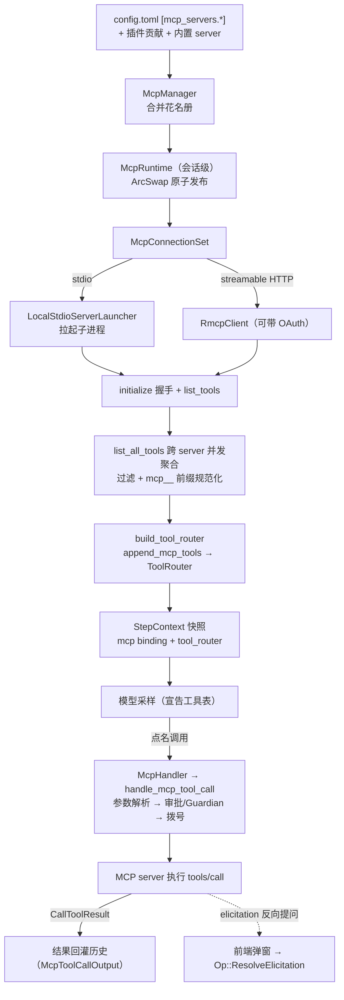

# MCP 链路

## 本章导读

MCP（Model Context Protocol）是 Anthropic 在 2024 年底开放的协议：它规定了
LLM 应用与外部"工具/数据源进程"之间如何握手、列工具、调工具、传资源。有了它，
任何人写的 server——查数据库的、操作浏览器的、读企业内部系统的——都能插进
任何一个支持 MCP 的 agent，就像外设插上 USB-C 口。在 Codex 里，MCP 是第三方
能力进入 agent 的主通道：你在 `config.toml` 里写下 `[mcp_servers.*]`，下一轮
对话模型就可能拿着这些工具干活。

读完本章，你将能够：

1. 说出 MCP server 从配置到就绪的启动路径——stdio 子进程与 streamable HTTP
   两种传输、超时与失败如何被隔离；
2. 画出"跨 server 聚合工具 → 名称规范化 → ToolRouter 暴露 → 调用分发"的完整
   链路，并解释 StepContext 快照与 catalog revision 租约如何保证模型看到的
   工具表与实际执行的是同一份；
3. 描述 elicitation——server 反向向人提问的通道——如何穿过 agent 核心到达
   前端再回到 server。

**前置章节**：第 11 章「工具系统」——本章大量引用其中的 ToolRegistry /
ToolRouter / ToolSpec；第 7 章「Agent 核心」中 StepContext 的概念也会反复
出现。

## 概念与架构

### 一个类比：外聘专家市场

延续第 1 章"外包工程师团队"的类比：内置工具是正式员工，MCP server 是从市场
上临时聘请的外部专家，整条链路像一次完整的外聘流程：

- **招聘启事**是配置：`[mcp_servers.*]` 写明每个专家的联系方式（本地命令
  或 HTTP 地址）、到岗时限（`startup_timeout_sec`）和可用工具范围
  （`enabled_tools` / `disabled_tools`）；
- **人事部门**是 `McpManager`：把配置文件、插件/extension 推荐、平台内置的
  专家（codex_apps）三方名单合并成一份花名册，并仲裁撞名冲突；
- **远程办公室**是 `McpRuntime`：按花名册逐个联系专家——本地专家拉起子进程，
  远程专家走 HTTP；联系不上不影响整个团队开工，只在花名册上记一笔"缺席"；
- **技能汇总表**是工具聚合：把所有在岗专家的技能并发收齐、去重、改名（避免
  两位专家的技能撞名），翻译成模型看得懂的 ToolSpec；
- **工牌**是 ToolRouter：每次采样前拍一张快照，模型只能按工牌上的名字叫人；
- **分机电话**是 `McpHandler`：模型点名后，参数解析、审批、拨号、限时通话
  都走它；
- 专家偶尔还会**反问你**——"这个操作要确认吗？请提供 API key"——这就是
  elicitation，一条从 server 指向人的反向通道。

### 调用链路总览

三个要点决定这条链路的气质：

1. **配置是投影而非真相**。三方来源（文件、插件、内置）合并后才得到运行时
   花名册，合并时带冲突仲裁。
2. **连接是发布而非直连**。每次刷新产出一套不可变的 `McpConnectionSet`，
   原子替换旧快照；读路径永远拿到一个自洽的整体，不存在"换到一半的连接池"。
3. **调用凭快照拨号**。模型在一次采样里看到的工具表，来自 StepContext 冻结的
   那份 binding；执行时再校验工具目录的 revision 没变过——承诺与执行严格对齐。

## 源码深挖

### 配置汇总与连接建立

`McpManager`（codex-rs/core/src/mcp.rs#L74）负责把三类来源投影成运行时配置：
遍历 extension 贡献者的 `McpServerContribution::Set / HostedApps / SelectedPlugin /
Remove` 等动作（codex-rs/core/src/mcp.rs#L169-L241），叠加已加载插件
（codex-rs/core/src/mcp.rs#L243-L250），再按开关注册或移除内置的 codex_apps
server（codex-rs/core/src/mcp.rs#L252-L267）；多方争抢同一个 server 名时按
catalog 仲裁并打 warn 日志（codex-rs/core/src/mcp.rs#L312-L319）。

会话级的 `McpRuntime` 用 ArcSwap 持有当前发布的快照。`replace`
（codex-rs/codex-mcp/src/runtime.rs#L262）协调配置变更并发布不可变快照，
`publish` 里先构造新的 `McpConnectionSet` 再一次 `store` 切换
（codex-rs/codex-mcp/src/runtime.rs#L312-L321）；`replace_fresh`
（codex-rs/codex-mcp/src/runtime.rs#L277）则不复用任何旧连接、全新启动。
`McpConnectionSet` 自述是"一组运行中连接的发布视图"
（codex-rs/codex-mcp/src/connection_manager.rs#L184），构造时先按
enabled/required 过滤分桶（codex-rs/codex-mcp/src/connection_manager.rs#L237-L250），
身份未变的连接直接复用（含仍在进行中的启动），其余丢进 JoinSet 并发启动。

单个 server 的客户端由 `make_rmcp_client`
（codex-rs/codex-mcp/src/rmcp_client.rs#L1115）按传输分派：stdio 分支本地用
`LocalStdioServerLauncher`（codex-rs/codex-mcp/src/rmcp_client.rs#L1157-L1160；
定义在 codex-rs/rmcp-client/src/stdio_server_launcher.rs#L184，负责拉起子进程），
远程环境则换成 `ExecutorStdioServerLauncher`（stdio_server_launcher.rs#L559）；
HTTP 分支构造 streamable HTTP 客户端，支持 OAuth 与 `bearer_token_env_var`
（codex-rs/rmcp-client/src/rmcp_client.rs#L504）。之后是 `initialize` 握手
（codex-rs/rmcp-client/src/rmcp_client.rs#L608）与 `list_tools`
（codex-rs/rmcp-client/src/rmcp_client.rs#L673）。两个默认超时值得记住：启动 30 秒
（codex-rs/codex-mcp/src/rmcp_client.rs#L102），单次工具调用 300 秒
（codex-rs/codex-mcp/src/rmcp_client.rs#L103）。

启动过程全程对前端可见：`McpStartupUpdateEvent` 事件沿事件流上报
（codex-rs/codex-mcp/src/connection_manager/startup.rs#L41-L52）；失败时
`mcp_init_error_display`（startup.rs#L75）生成面向用户的修复建议——包括
GitHub MCP 不支持 OAuth 的特例、未登录时提示 `codex mcp login`、超时时提示调大
`startup_timeout_sec`。

### 工具聚合与暴露给模型

聚合的入口是 `list_all_tools`
（codex-rs/codex-mcp/src/connection_manager/tool_catalog.rs#L100）：
`join_all` 并发地向每个 server 收工具（tool_catalog.rs#L110-L144），单个
server 失败只记进 errors、不拖垮整体（tool_catalog.rs#L145-L156），最后统一走
`normalize_tools_for_model_with_prefix`（tool_catalog.rs#L157-L161）。规范化
（codex-rs/codex-mcp/src/tools.rs#L113）做三件事：按原始身份去重、给冲突的
namespace/工具名追加 SHA-1 哈希后缀（tools.rs#L164-L195）、把模型可见名压进
128 字节上限（tools.rs#L226）；`mcp__` 历史前缀在 tools.rs#L22，可按配置或
server 白名单省略。`ToolInfo` 同时携带路由用的原始 `server_name`、模型可见的
`callable_name` 和回传给 server 的原始 `tool.name`
（codex-rs/codex-mcp/src/tools.rs#L25-L45）——两个名字从此各走各的路。

供模型使用的绑定由 `capture_binding_with_metadata`
（tool_catalog.rs#L171）捕获：**可选 server 还没启动完时不硬等**——有缓存工具表
就先用（tool_catalog.rs#L204-L205），否则给一个 startup grace 期限，到期仍
未就绪就本轮略过（"omitting pending optional MCP server"，tool_catalog.rs#L240）；
required server 和显式要求的插件才必须等到位（tool_catalog.rs#L194-L203）。

聚合结果进入工具系统的路径在 `build_tool_router`
（codex-rs/core/src/tools/spec_plan.rs#L125）：`append_mcp_tools`
（spec_plan.rs#L159-L166）把每个 `ToolInfo` 包成 `McpHandler` 注册进
ToolRegistry（codex-rs/core/src/mcp_tool_exposure.rs#L37），按模型能力决定
Direct 还是 Deferred 暴露（mcp_tool_exposure.rs#L90-L94），agent 插件工具另有
8 KB 单条 / 64 KB 总量的 spec 字节预算（mcp_tool_exposure.rs#L19-L20）；随后
`apply_mcp_tool_exposure_policy`（spec_plan.rs#L197）按 server 的
`omit_tools_from` 收缩暴露面（spec_plan.rs#L213-L225）。每个 `McpHandler` 的
ToolSpec 是 `ToolSpec::Namespace`：server 名归并为 namespace
（codex-rs/core/src/tools/handlers/mcp.rs#L464-L495）。

最后一步是快照。`capture_step_context_inner`
（codex-rs/core/src/session/mod.rs#L3570）在每次采样前调用
`mcp_runtime_for_step`（session/mod.rs#L3649）拿到 `McpBinding`，再以它构建
ToolRouter（session/mod.rs#L3683）；两者一起写进 StepContext——字段注释强调
"本次 step 捕获的精确 MCP 连接、配置与目录"（step_context.rs#L31-L32）和
"本次采样请求对外宣告并执行的工具计划"（step_context.rs#L33-L34）。

### 调用分发

模型点名后，`McpHandler::handle_call`
（codex-rs/core/src/tools/handlers/mcp.rs#L176）先向会话换领这次调用的
`PreparedMcpCall`（handlers/mcp.rs#L180-L186），然后进入 `handle_mcp_tool_call`
（codex-rs/core/src/mcp_tool_call.rs#L121）：解析 JSON 参数（空串合法、非法 JSON
直接回错，mcp_tool_call.rs#L137-L153），按 server 归属决定审批策略
（mcp_tool_call.rs#L267-L285），需要审批时走 `maybe_request_mcp_tool_approval`
（含 Guardian 复核），批准后由 `handle_approved_mcp_tool_call`
（mcp_tool_call.rs#L430）执行——注释写明"审批必须在 prepared call 的 catalog
租约内生效"（mcp_tool_call.rs#L428-L429）。

拨号的最后一站在 `PreparedMcpCall::call_with_preparation`
（codex-rs/codex-mcp/src/binding.rs#L304）：整个准备+执行包在
`run_with_revision` 里（binding.rs#L322），若 server 的工具目录在准备期间变了
版本，这次调用会被直接拒绝——"catalog changed after ... was prepared"
（binding.rs#L361-L364）。真正的 `tools/call` 由 rmcp 客户端发出
（codex-rs/rmcp-client/src/rmcp_client.rs#L855）。结果以
`ResponseInputItem::McpToolCallOutput`（codex-rs/protocol/src/models.rs#L852）
回灌进对话历史，等待下一次采样被模型读到。

不经 StepContext 的旁路（如 UI 手动触发）走 `McpConnectionSet::call_tool`
（codex-rs/codex-mcp/src/connection_manager.rs#L926）：server 存在、环境匹配、
工具未被禁用、可选等待启动（connection_manager.rs#L938-L972）。

### elicitation：反向询问

MCP 允许 server 在调用途中反过来向客户端要信息。Codex 侧的应答方是 rmcp 层的
`ElicitationClientService`
（codex-rs/rmcp-client/src/elicitation_client_service.rs#L60），请求被路由到
会话级共享的 `ElicitationRequestRouter`——它刻意被线程内所有 MCP runtime 共享，
响应令牌由 Codex 生成，避免 runtime 更替时撞 ID
（codex-rs/codex-mcp/src/elicitation.rs#L95-L101）。

交互链路在 Session 一侧：`request_mcp_server_elicitation`
（codex-rs/core/src/session/mcp.rs#L554）先把挂起请求登记进 turn state，再发出
`EventMsg::ElicitationRequest`（session/mcp.rs#L601-L611；事件定义在
codex-rs/protocol/src/protocol.rs#L1497），然后阻塞在一个 oneshot 上等待
（session/mcp.rs#L622）。前端弹窗收集答案后提交 `Op::ResolveElicitation`
（protocol.rs#L685），`resolve_elicitation`（session/mcp.rs#L631）从
turn state 里取出通道把答案送回；turn 已结束则回落到 runtime 的路由器
（session/mcp.rs#L654-L657）。Guardian 复核与 auto-deny 也挂在这条路上
（session/mcp.rs#L730、L561-L570）。

## 技术难点与设计取舍

**难点一：外部进程天然不可靠。** MCP server 是别人写的进程：可能启动超时、
握手失败、中途掉线。Codex 的基调是"缺席不阻塞"——可选 server 未就绪就先略过、
列工具失败只记错误不拖垮聚合（tool_catalog.rs#L145-L156）、失败信息翻译成可
操作的修复建议（startup.rs#L75）；刷新也不是全量重建，身份未变的连接直接复用。
代价是不同 server 就绪度参差不齐，这正是难点二要兜底一致性的原因。

**难点二：工具表动态变化 vs 采样快照。** server 可以在任意时刻改变工具列表
（MCP 有 tools/listChanged 通知，Codex 目前只记日志——
codex-rs/rmcp-client/src/logging_client_handler.rs#L86）。如果采样按 A 版工具表
宣告、执行按 B 版找工具，模型就会"调用一个此刻不存在的工具"。Codex 上了双保险：
StepContext 把 binding 与 tool_router 冻结进同一张快照（step_context.rs#L31-L34），
保证宣告与执行同源；执行侧再用 catalog revision 租约兜底，版本在准备期间变了就
宁可拒绝这次调用（binding.rs#L361-L364）。会话侧的变更管理靠 dirty 标记：
capability roots 变化、OAuth 凭证恢复都会标脏，下次采样前重建
（codex-rs/core/src/session/mcp.rs#L351-L375）。

**难点三：按需激活 vs 全量预热。** 每个 turn 都等全部 server 就绪，首 token
延迟会被最慢的一家拖垮；完全不预热又可能错过"模型本来想用的工具"。Codex 的
答案是分层：就绪路径上可选 server 有缓存就先用、没缓存给 grace 期限
（tool_catalog.rs#L194-L243），同时后台跑一个 best-effort 的预热 worker，
用有界 channel 合并刷新请求、监听认证变化（mcp_prewarm.rs#L14-L59）。模块注释
说得坦白：worker 只准备最新线程状态，"exact model steps 才是正确性路径"
（codex-rs/core/src/session/mcp_prewarm.rs#L1-L4）——预热是性能优化，快照才是
语义保证。

## 对照通用 agent 范式

**开放协议 vs 私有工具生态。** 在 MCP 出现前，每家 agent 框架都有自己的工具
约定（LangChain 的 Tool、各类 function-calling 私有格式），工具写一遍只能伺候
一个宿主。MCP 把"工具供给"从"工具消费"里解耦出来，做成工具生态的 USB-C：
server 写一次，插进任何兼容宿主。Codex 选择的是深度兼容而非表面支持——OAuth、
elicitation、插件贡献合并、exposure 政策、目录缓存，协议文本只是起点，真正的
工程量在生命周期管理。

**不可信供给方的代价。** 内置工具是自己人，MCP server 是外人：它的工具描述会
进你的 prompt（token 预算要防），它的调用要审批（Guardian 复核），它的名字要
隔离（mcp__ 前缀 + 哈希去重）。第 12 章的审批与沙箱体系在这里延伸到了协议边界。

**反向通道是协议的成熟标志。** elicitation 让 server 能发起人机交互，等于承认
"工具执行可能需要人的判断"。Codex 把它接进了与审批相同的事件/Op 通道
（protocol.rs#L685、L1497），而不是发明第二套 UI 协议——与第 1 章"契约统一性
优先"的主线一脉相承。

## 小结与下一章预告

- MCP 链路 = 三方来源合并配置（McpManager）→ 会话级连接集（McpRuntime /
  McpConnectionSet，ArcSwap 原子发布）→ 并发聚合与名称规范化 → ToolRouter
  暴露 → McpHandler 分发 → catalog revision 租约下拨号；
- 一致性靠双保险：StepContext 冻结"宣告与执行同源"，revision 租约兜底"准备
  期间变了就拒绝"；
- 可靠性基调是"缺席不阻塞"：可选 server 按需激活、失败隔离，预热 worker 只做
  best-effort 加速，正确性永远落在采样前的精确快照上；
- elicitation 打通了 server → 人的反向通道，复用审批的事件/Op 契约。

下一章进入第五部分「TUI 内部架构」：看 ratatui 终端界面如何消费本书前十三章
铺垫的事件流——ElicitationRequest、审批请求、流式文本——把 agent 引擎的内部
状态渲染成你眼前的交互界面。
