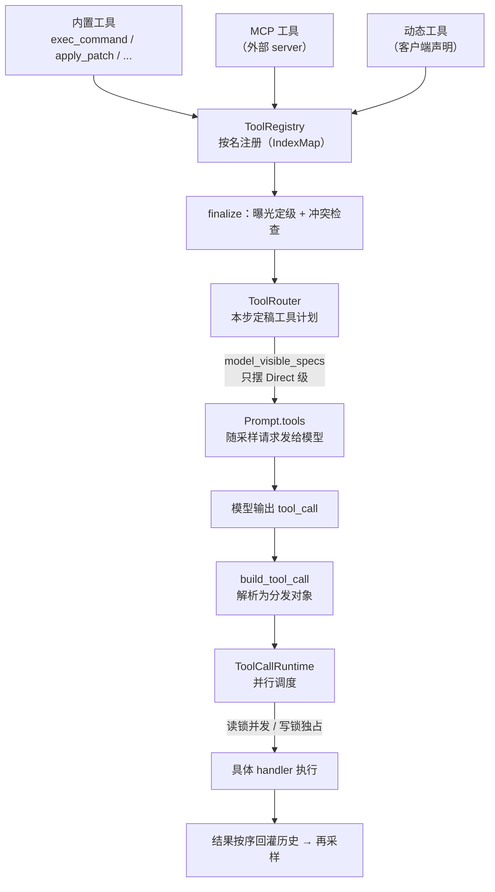

# 工具系统

## 本章导读

本章拆开 Codex 的"双手"——工具系统：模型每步采样能看见哪些工具、调用如何被
分发执行、结果如何安全地回到历史。读完你将能够：

1. 说出 ToolRegistry / ToolRouter / ToolCallRuntime 三层对象的分工
   （注册 → 宣告 → 调度）；
2. 描述一次工具调用从流式事件到并行执行、再到结果回灌的完整路径；
3. 解释 MCP 工具与客户端动态工具如何进入同一张工具表。

**前置章节**：第 7 章「Agent 核心」。本章的故事都发生在 run_turn 主循环的
"采样 → 工具调用 → 结果回灌 → 再采样"环节里，StepContext 快照是反复出现的
前提。

## 概念与架构

### 一个类比：手术器械台

把一次采样想象成一台手术：模型是主刀医生，工具系统是器械团队。

- **ToolRegistry** 是器械柜——所有器械在此登记造册、按名索引，两件器械共用
  一个名字要记事故（collision）；
- **ToolRouter** 是本台手术的器械清单——不是柜里所有东西都摆上台面：哪些直接
  递到医生手边、哪些收在抽屉里等点名、哪些根本不进这间手术室，开刀前就已
  定稿；
- **ToolCallRuntime** 是器械护士——医生可能一次伸手要好几件器械，护士决定
  哪些可以同时递、哪些必须等上一件用完；
- **StepContext** 是术前快照——清单、灯光、病人状态一次拍齐，保证"医生看到的
  清单"和"护士手里的清单"是同一份。

### 从注册到执行的流向



三个要点：

1. **注册 ≠ 宣告**。进了器械柜不代表摆上手术台：曝光级别决定模型这一步能否
   看见它。
2. **宣告与执行同源**。发给模型的工具表和用来分发执行的工具表出自同一个
   ToolRouter，不存在"看见了却执行不了"。
3. **并行是默认，串行是保护**。发给模型的请求固定打开并行调用，执行层再用
   读写锁把不宜并发的工具挡回串行。

## 源码深挖

### 三层对象与两种规格的落点

| 类型 | 定义位置 | 一句话职责 |
| ---- | -------- | ---------- |
| `ToolRegistry` | codex-rs/core/src/tools/registry.rs#L287-L290 | 注册中心：`IndexMap<ToolName, RegisteredTool>` 按名索引，记录首个重名冲突 |
| `ToolRouter` | codex-rs/core/src/tools/router.rs#L74 | 定稿工具计划：registry + 模型可见 spec，负责宣告与分发 |
| `ToolCallRuntime` | codex-rs/core/src/tools/parallel.rs#L42-L48 | 单次采样的执行调度器：读写锁并行门 + 中止合成输出 |
| `ToolSpec` | codex-rs/tools/src/tool_spec.rs#L22 | 对外宣告的五种形态：Function / Namespace / Freeform / ToolSearch / WebSearch |
| `ToolExposure` | codex-rs/tools/src/tool_executor.rs#L51 | 六级曝光：Direct / Deferred / DeferredModelOnly / DirectModelOnly / CodeModeOnly / Hidden |

### 工具表的构建管线

每个 step 的工具表由 `build_tool_router`
（codex-rs/core/src/tools/spec_plan.rs#L125）现场构建，管线顺序固定
（spec_plan.rs#L153-L195）：

1. 内置工具进注册表（`add_core_tool_sources`，spec_plan.rs#L154）；
2. MCP 工具进注册表并应用曝光策略（spec_plan.rs#L159-L173）；
3. 扩展工具（`web/run`、`image_gen` 等，spec_plan.rs#L174）；
4. 客户端动态工具（spec_plan.rs#L180）；
5. hosted 工具（`web_search`，spec_plan.rs#L181）；
6. `finalize_tool_router`（spec_plan.rs#L188）：补注册 `tool_search`、
   code mode 执行器，冲突检查后组装 ToolRouter。

内置工具按注册条件裁剪（feature flag、模型能力、环境三者共同决定）：

| 工具 | 用途 | 注册位置（摘） |
| ---- | ---- | -------------- |
| `exec_command` / `write_stdin` | shell 执行 / 写会话 stdin | spec_plan.rs#L1079 |
| `list_mcp_resources` 等 | 枚举/读取 MCP 资源 | spec_plan.rs#L1128 |
| `update_plan`、`request_user_input`、`request_permissions`、时钟类等 | 计划、提问、权限、时间 | spec_plan.rs#L1137 起（如 L1143、L1203） |
| `apply_patch` | 补丁编辑（freeform 工具） | spec_plan.rs#L1257（按模型能力注册） |
| `view_image` | 查看本地图片 | spec_plan.rs#L1271 |
| `spawn_agent` 等协作工具 | 多 agent（V1/V2 两族） | spec_plan.rs#L1285 |

外部工具（MCP/扩展/动态）走 `register_external_with_exposure`
（registry.rs#L357），与内置注册分离；重名记入 `first_collision`
（registry.rs#L289），开启冲突检查时 finalize 直接报 `ToolCollision`
（spec_plan.rs#L421）。

### ToolRouter 如何决定本步宣告什么

宣告决策浓缩在一个过滤条件里：`build_model_visible_specs`
（spec_plan.rs#L531）遍历注册表，`if !exposure.is_direct() { continue; }`
（spec_plan.rs#L541）——**只有 Direct 级工具进入发给模型的 spec**。其余级别
各有出路：Deferred 工具留给 `tool_search` 延迟发现（注册于
spec_plan.rs#L406），CodeModeOnly 只出现在代码模式命名空间，Hidden 彻底
隐身。

曝光策略的典型应用是 MCP 工具：开启 tool_search 时统一降为 Deferred，否则
Direct（codex-rs/core/src/mcp_tool_exposure.rs#L90-L94）；agent 插件来源的
MCP 工具还受字节预算约束（单个 spec ≤ 8 KB、总量 ≤ 64 KB，
mcp_tool_exposure.rs#L19-L20），超预算直接 Hidden
（mcp_tool_exposure.rs#L137-L141）。

定稿的 ToolRouter 在组装 Prompt 时被消费：

```rust
tools: step_context.tool_router.model_visible_specs(),
parallel_tool_calls: true,
```

（codex-rs/core/src/session/turn.rs#L1401-L1402；`Prompt` 定义见
codex-rs/core/src/client_common.rs#L19-L28）——并行调用在协议层始终打开。

### 分发与并行调度

流式侧收到完整的工具调用 item 后，`handle_output_item_done`
（codex-rs/core/src/stream_events_utils.rs#L293）先用
`ToolRouter::build_tool_call`（router.rs#L246）把 FunctionCall /
CustomToolCall / tool_search 调用解析成统一的分发对象，再交给本次采样创建的
`ToolCallRuntime`（turn.rs#L1435）生成 tool future
（stream_events_utils.rs#L327）。

并行调度的核心是一把 `Arc<RwLock<()>>` 门（parallel.rs#L47）：

- **可并行性由工具自报**：`ToolExecutor::supports_parallel_tool_calls` 默认
  false（tool_executor.rs#L122）；`exec_command`、`write_stdin`、`view_image`、
  `tool_search` 声明 true（如 exec_command.rs#L142）；MCP 工具由 server
  opt-in 或 `read_only_hint` 注解推得（handlers/mcp.rs#L128-L137）。注册表
  查询时 Hidden 工具除外（registry.rs#L486）。
- **读写锁分流**：可并行者取读锁并发，其余取写锁独占
  （parallel.rs#L148-L152）。
- **执行与历史顺序解耦**：tool future 按到达顺序进 `FuturesOrdered`
  （turn.rs#L2326、L2504），收尾时 `drain_in_flight`（turn.rs#L2229，调用点
  L2861）按序取出写历史——历史写入顺序严格等于模型输出顺序。
- **中止不留洞**：未完成调用被 abort，并合成 "aborted by user" 输出回灌
  （parallel.rs#L239、L250），保证每个 call_id 都有对应结果。

分发本体是 `ToolRouter::dispatch_tool_call_with_terminal_outcome`
（router.rs#L325）→ `ToolRegistry::dispatch_any_with_terminal_outcome`
（registry.rs#L495）：先跑 PreToolUse hooks（registry.rs#L567），通过后
`handle_any_tool`（registry.rs#L653），成功后跑 PostToolUse hooks
（registry.rs#L682）。注意 registry.rs#L707 的注释：PostToolUse 的 block
拒绝的是**结果**，而不是撤销已完成的执行。

### 动态工具：执行权在客户端

客户端（如 IDE）在会话配置中声明 `DynamicToolSpec`
（codex-rs/protocol/src/dynamic_tools.rs#L13），`defer_loading`（L26）决定
以 Deferred 还是 Direct 曝光（handlers/dynamic.rs#L77-L79），经
`append_dynamic_tool_runtimes` 进注册表（spec_plan.rs#L1374）。

调用是一次跨进程的挂起-回包：

1. core 的 `request_dynamic_tool`（handlers/dynamic.rs#L174）：建 oneshot
   （L183）、登记进 turn_state（L190）、发事件后挂起等待（L216）；
2. app-server 把 `TurnItem::DynamicToolCall` 包装成 JSON-RPC 请求
   `item/tool/call` 发给客户端（bespoke_event_handling.rs#L1109-L1136；
   方法名见 app-server-protocol/src/protocol/common.rs#L1772）；
3. 客户端执行后回包，app-server 转成 `Op::DynamicToolResponse` 提交回 core
   （app-server/src/dynamic_tools.rs#L18、L49）；
4. core 按 call_id 找到挂起的 oneshot 并解挂（session/handlers.rs#L667 →
   session/mod.rs#L3236），结果作为 FunctionCallOutput 回灌模型。

core 全程不碰执行——它只负责挂起、等待、回写。

## 技术难点与设计取舍

**难点一：工具表与上下文快照的一致性。** 一个 turn 里 MCP server 可能掉线、
客户端可能改配置；如果宣告用 A 版工具表、执行用 B 版，模型就会"调用一个此刻
不存在的工具"。解法是第 7 章的 StepContext：`tool_router` 字段注释明言它是
"本次采样请求对外宣告并执行的定稿工具计划"（step_context.rs#L33-L34）；
ToolCallRuntime 干脆把整个 StepContext 存下来——注释写道"工具调用可能更晚
才执行，所以要保留宣告过它们的那个 step"（parallel.rs#L44-L45）。代价是每步
采样都重建工具表，换来宣告与执行同源。

**难点二：并行调度的安全性。** 并行收益可观（一次采样发多个独立调用，延迟
显著下降），但写操作交错会破坏文件系统的一致性。Codex 的取舍是**把判断权
交给工具自己**：可并行性默认关闭（tool_executor.rs#L122），只有明确声明无
副作用的工具（只读命令、看图、只读 MCP 工具）才拿得到读锁。这是"默认安全、
显式放行"，而不是"默认并行、出事再修"。

**难点三：工具输出的尺寸控制。** shell 输出可能达到 MB 级，全量塞进历史会
撑爆上下文窗口。Codex 在多处收口：`ExecCommandToolOutput`
（tools/context.rs#L346）按 `max_output_tokens` 与模型的 `truncation_policy`
（exec_command.rs#L410-L411）在生成回灌文本时截断（context.rs#L516），并
预留 1.2 倍余量避免历史层二次截断（context.rs#L518）；截断会留下显式标记，
让模型知道输出不全（utils/output-truncation/src/lib.rs#L23）。日志侧则故意
有损——`ToolOutput::log_output` 与回灌模型的版本分离，由 logger 自己的字节
预算控制（tools/src/tool_output.rs#L11-L28）。

## 对照通用 agent 范式

**Function calling。** 通用模式是"启动时给模型一张静态工具表 → 模型产出
结构化调用 → 宿主执行 → 结果回灌"。Codex 走完整个模式，但把"静态"二字
拿掉了：工具表每步采样前重建（`built_tools`，
codex-rs/core/src/session/turn.rs#L1578），曝光级别让同一张注册表按步呈现
不同子集——function calling 从"配置"变成了"运行时状态"。

**并行工具调用。** Responses API 提供 `parallel_tool_calls` 开关，多数框架
只是打开它然后照常串行。Codex 多走了一步：执行层用读写锁实现真正的并发，
又用 FuturesOrdered 保住历史顺序——并发是执行细节，顺序是协议承诺，两者
互不妥协。

**动态工具表。** MCP 已把"工具来自外部进程"变成常态；Codex 再进一步，把
客户端（IDE）也变成工具来源：声明-挂起-回包机制让工具执行发生在 agent
进程之外，而 core 的分发协议面无感。对比"工具 = 进程内函数"的经典假设，
这相当于把工具的**位置**也抽象掉了。

## 小结与下一章预告

- 三层分工：ToolRegistry 注册（IndexMap 按名索引）→ ToolRouter 定稿（宣告
  与执行同源）→ ToolCallRuntime 调度（读写锁并行门）；
- 宣告决策只有一个条件：`is_direct()`；六级曝光加 `tool_search` 构成"延迟
  发现"体系，MCP 与动态工具都经此进表；
- 并行两条军规：可并行性由工具自报（默认 false），历史顺序由
  FuturesOrdered 保证（严格等于模型输出顺序）；
- 输出尺寸控制贯穿三层：执行时按预算截断、预留余量防二次截断、日志版故意
  有损。

下一章「审批与沙箱」：本章刻意绕开的另一半——`exec_command` 拿到命令之后，
审批策略如何决定是否放行、沙箱如何把破坏力关进笼子。
