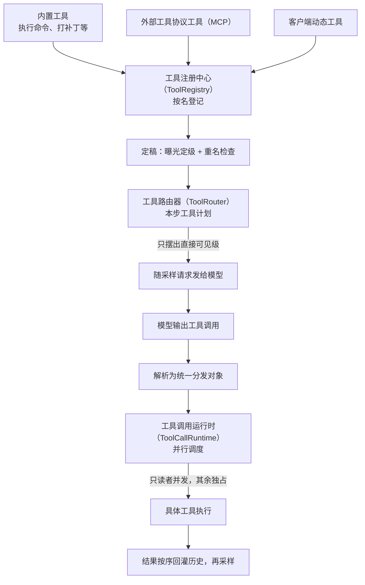

# 工具系统

## 本章导读

从一个具体场景开始：你让 Codex「把测试跑一下，顺便修掉失败的那项」。它真的
打开了终端、跑了命令、读了输出、改了代码，又把测试重跑了一遍。可模型本身
只会一件事——读入文字、输出文字。它既不能按回车，也不会敲键盘。那么，
**一个只会打字的模型，是怎么长出一双会干活的手的？**

答案就是本章的主角：工具系统。模型想干活时并不直接碰你的电脑，而是写下
一张「工单」：要用哪个工具、参数是什么。Codex 收到工单后核对、执行，再把
结果喂回给模型。围绕这张工单，有一整套负责登记、筛选、派发、回收的机器。

读完本章，你将能够：

1. 说出工具系统的三层分工：谁登记工具、谁决定这一步向模型亮出哪些工具、
   谁负责把调用调度执行；
2. 描述一次工具调用的完整旅程：从模型输出，到并行执行，再到结果按序回到
   对话历史；
3. 解释两类「外来工具」——从外部服务接入的工具，以及客户端临时声明的
   工具——如何进入同一张工具表。

**前置章节**：第 7 章「Agent 核心」。本章的故事都发生在主循环的「采样 →
工具调用 → 结果回灌 → 再采样」环节里；建议先理解「每一轮开始前会为模型拍
一张快照」这个设定，它是本章反复出现的前提。

## 概念与架构

### 一个类比：手术器械台

把一次采样想象成一台手术：模型是主刀医生，工具系统是器械团队。

- **工具注册中心**是器械柜——所有器械在此登记造册、按名字上架。两件器械
  共用一个名字，要记一次事故；
- **工具路由器**是本台手术的器械清单——柜里登记过，不代表摆得上台面。哪些
  直接递到医生手边，哪些收进抽屉等点名，哪些根本不进这间手术室，开刀前就
  已定稿；
- **工具调用运行时**是器械护士——医生可能一次伸手要好几件器械。护士决定
  哪些可以同时递，哪些必须等上一件用完；
- **步上下文**是术前照片——清单、灯光、病人状态一次拍齐，保证「医生看到的
  清单」和「护士手里的清单」永远是同一份。

器械从三条路入库：Codex 自带的内置工具；经外部工具协议（Model Context
Protocol，简称 MCP）接入的外来工具——这是一套让模型用上本机以外工具服务
的标准协议，第 13 章会专门讲；以及客户端临时声明的动态工具——由编辑器插件
这类客户端提供、连执行也发生在客户端那边的工具。

### 从注册到执行的流向

下面这张图看一件事：一件器械从「入库」到「递到医生手里、用完回收」，中间
要经过哪些关卡。



看完图只需记住三个要点：

1. **注册不等于宣告。** 进了器械柜，不代表摆上手术台。每件工具都有一个
   「曝光级别」，决定模型这一步能不能看见它。
2. **宣告与执行同源。** 发给模型的工具表，和用来分发执行的工具表，出自
   同一个工具路由器。不存在「看见了却执行不了」的工具。
3. **并行是默认，串行是保护。** 发给模型的请求固定允许多工具并发；执行层
   再用一把读写锁，把不宜并发的工具挡回串行。

## 出场角色

进入源码之前，先认识本章要出场的角色。下表的「所在文件」都是仓库内的相对
路径；现在记不住没关系，读到正文时翻回来对照即可。

| 中文名 | 英文名 | 职责（一句话） | 所在文件 |
| ------ | ------ | -------------- | -------- |
| 工具注册中心 | ToolRegistry | 所有工具的登记处：按名索引、记录首个重名事故 | codex-rs/core/src/tools/registry.rs |
| 有序索引表 | IndexMap | 保持插入顺序的键值表，工具按登记顺序存放 | codex-rs/core/src/tools/registry.rs |
| 已注册工具 | RegisteredTool | 注册表里的一条记录：执行体加曝光级别 | codex-rs/core/src/tools/registry.rs |
| 工具名 | ToolName | 工具的唯一标识，可带命名空间前缀 | codex-rs/core/src/tools/registry.rs |
| 工具路由器 | ToolRouter | 本步定稿的工具计划：既管宣告也管分发 | codex-rs/core/src/tools/router.rs |
| 工具调用运行时 | ToolCallRuntime | 单次采样内全部工具调用的并行调度器 | codex-rs/core/src/tools/parallel.rs |
| 工具规格 | ToolSpec | 对外宣告工具时的五种序列化形态 | codex-rs/tools/src/tool_spec.rs |
| 工具曝光级别 | ToolExposure | 决定工具对模型可见程度的六级开关 | codex-rs/tools/src/tool_executor.rs |
| 工具执行器 | ToolExecutor | 每个工具必须实现的执行接口 | codex-rs/tools/src/tool_executor.rs |
| 工具表构建函数 | build_tool_router | 每一步采样前现场构建工具表的管线 | codex-rs/core/src/tools/spec_plan.rs |
| 定稿函数 | finalize_tool_router | 补注册、查重名，把注册表组装成路由器 | codex-rs/core/src/tools/spec_plan.rs |
| 可见规格构建器 | build_model_visible_specs | 从注册表筛出本步发给模型的工具规格 | codex-rs/core/src/tools/spec_plan.rs |
| 步上下文 | StepContext | 一次采样请求的完整快照，含定稿工具计划 | codex-rs/core/src/session/step_context.rs |
| 提示词 | Prompt | 发往模型的请求体，含输入与工具表 | codex-rs/core/src/client_common.rs |
| 输出项定稿分发 | handle_output_item_done | 流式事件里收到完整输出项后的分发入口 | codex-rs/core/src/stream_events_utils.rs |
| 调用解析器 | build_tool_call | 把模型输出的调用项解析为统一分发对象 | codex-rs/core/src/tools/router.rs |
| 分发入口 | dispatch_tool_call_with_terminal_outcome | 路由器上带终态上报的分发函数 | codex-rs/core/src/tools/router.rs |
| 注册表分发器 | dispatch_any_with_terminal_outcome | 注册表上真正跑钩子与执行体的分发函数 | codex-rs/core/src/tools/registry.rs |
| 统一执行入口 | handle_any_tool | 按工具类型调用对应执行体的总开关 | codex-rs/core/src/tools/registry.rs |
| 前置/后置钩子 | PreToolUse / PostToolUse | 执行前后拦截调用与结果的扩展点 | codex-rs/core/src/tools/registry.rs |
| 重名碰撞错误 | ToolCollision | 定稿时发现两个工具共用一个名字的报错 | codex-rs/core/src/tools/spec_plan.rs |
| 外部注册入口 | register_external_with_exposure | 外部工具进注册表的专用通道 | codex-rs/core/src/tools/registry.rs |
| 曝光策略模块 | mcp_tool_exposure | 决定外部工具协议工具以什么级别进表 | codex-rs/core/src/mcp_tool_exposure.rs |
| 动态工具追加器 | append_dynamic_tool_runtimes | 把客户端声明的动态工具装进注册表 | codex-rs/core/src/tools/spec_plan.rs |
| 有序并发收集器 | FuturesOrdered | 并发执行、按到达顺序取结果的队列（第三方库提供） | codex-rs/core/src/session/turn.rs |
| 读写锁 | RwLock | 多读单写的并发门锁，即并行闸门本体 | codex-rs/core/src/tools/parallel.rs |
| 在途结果排空 | drain_in_flight | 收尾时按序取回所有在途调用的结果 | codex-rs/core/src/session/turn.rs |
| 工具构建入口 | built_tools | 组装提示词前准备本步工具表的函数 | codex-rs/core/src/session/turn.rs |
| 动态工具规格 | DynamicToolSpec | 客户端声明动态工具时用的描述结构 | codex-rs/protocol/src/dynamic_tools.rs |
| 动态工具请求函数 | request_dynamic_tool | 核心引擎侧发起动态工具调用并挂起等待 | codex-rs/core/src/tools/handlers/dynamic.rs |
| 一次性通道 | oneshot | 只能送一次消息的通道，用于挂起-回包 | codex-rs/core/src/tools/handlers/dynamic.rs |
| 动态工具回包处理器 | on_call_response | 应用服务侧把客户端回包转交核心引擎 | codex-rs/app-server/src/dynamic_tools.rs |
| 动态工具响应操作 | Op::DynamicToolResponse | 把客户端结果递回核心引擎的操作类型 | codex-rs/app-server/src/dynamic_tools.rs |
| 命令执行输出 | ExecCommandToolOutput | 命令类工具的输出结构，负责按预算截断 | codex-rs/core/src/tools/context.rs |
| 工具输出接口 | ToolOutput | 工具输出对模型与对日志的双面契约 | codex-rs/tools/src/tool_output.rs |
| 输出截断库 | output-truncation | 给超长输出做截断并留下显式标记的工具库 | codex-rs/utils/output-truncation/src/lib.rs |

## 源码深挖

### 三层对象与两种规格的落点

这一小节把概念段的四个角色落到真实代码上：器械柜、器械清单、器械护士分别
由哪个类型扮演，对外宣告用的「规格」与决定可见性的「曝光级别」又定义在
哪里。读完你会得到一张「名词 → 文件」的对照表，后面三节都靠它导航。

| 类型 | 定义位置 | 一句话职责 |
| ---- | -------- | ---------- |
| 工具注册中心 | codex-rs/core/src/tools/registry.rs#L287-L290 | 注册中心：有序索引表按名索引，另记首个重名冲突 |
| 工具路由器 | codex-rs/core/src/tools/router.rs#L74 | 定稿工具计划：注册表加模型可见规格，负责宣告与分发 |
| 工具调用运行时 | codex-rs/core/src/tools/parallel.rs#L42-L48 | 单次采样的执行调度器：读写锁并行门加中止合成输出 |
| 工具规格 | codex-rs/tools/src/tool_spec.rs#L22 | 对外宣告的五种形态：函数、命名空间、自由文本、工具搜索、网页搜索 |
| 工具曝光级别 | codex-rs/tools/src/tool_executor.rs#L51 | 六级曝光：直接可见、延迟发现、仅模型延迟、仅模型直接、仅代码模式、完全隐身 |

两处实现细节值得多看一眼。工具注册中心的本体就是一张「工具名 → 已注册
工具」的有序索引表，另附一个记录首个重名工具名的字段
（codex-rs/core/src/tools/registry.rs#L287-L290）。而工具路由器的注释自述
「一份定稿的工具计划：对外宣告的面与配套的可执行体」，其字段把注册表与
模型可见规格捆在一起（codex-rs/core/src/tools/router.rs#L74-L76）——宣告
与执行同源，在数据结构层面就被锁死了。

### 工具表的构建管线

这一小节回答：手术台前那张器械清单，是每一台手术开始前怎么现场摆出来的。
出场的是工具表构建函数与定稿函数。读完你会知道工具进表的固定顺序，以及
内置工具如何按配置裁剪。

每一步采样前，工具表构建函数都会现场重搭一张工具表
（codex-rs/core/src/tools/spec_plan.rs#L125）。管线顺序固定
（spec_plan.rs#L153-L195）：

1. 新建一张空注册表（spec_plan.rs#L153），内置工具先进场
   （spec_plan.rs#L154）；
2. 外部工具协议工具进注册表，并应用曝光策略（spec_plan.rs#L159-L173）；
3. 扩展工具进场，例如网页运行、图像生成（spec_plan.rs#L174-L179）；
4. 客户端动态工具进场（spec_plan.rs#L180）；
5. 托管工具（由模型服务方在云端代执行的工具，如网页搜索）单独收集
   （spec_plan.rs#L181-L185）；
6. 定稿函数收尾（spec_plan.rs#L188）：补注册工具搜索工具、注册代码模式
   执行器，做重名检查后组装出工具路由器。

内置工具并非全员到齐，而是按「特性开关（feature flag，配置里的功能总闸）、
模型能力、运行环境」三者共同裁剪。摘几行注册点感受一下：

| 工具 | 用途 | 注册位置（摘） |
| ---- | ---- | -------------- |
| 命令执行（exec_command）/ 写标准输入（write_stdin） | 跑命令行 / 向交互式会话送输入 | spec_plan.rs#L1079 |
| 资源枚举（list_mcp_resources）等 | 枚举、读取外部工具协议资源 | spec_plan.rs#L1128 |
| 更新计划（update_plan）、请求用户输入（request_user_input）、请求权限（request_permissions）、时钟类等 | 计划、提问、权限、时间 | spec_plan.rs#L1137 起（如 L1143、L1203） |
| 补丁编辑（apply_patch） | 以自由文本形式打补丁 | spec_plan.rs#L1257（按模型能力注册） |
| 查看图片（view_image） | 把本地图片喂给模型看 | spec_plan.rs#L1271 |
| 派生子代理（spawn_agent）等协作工具 | 多智能体协作（两族并存） | spec_plan.rs#L1285 |

外部工具（外部工具协议、扩展、动态三类）走专用的外部注册入口
（codex-rs/core/src/tools/registry.rs#L357），与内置注册分离；重名会记入
注册表的「首个重名」字段（registry.rs#L289），开启冲突检查时，定稿函数
直接报重名碰撞错误（spec_plan.rs#L418-L421），绝不让两件同名器械上台。

### 工具路由器如何决定本步宣告什么

这一小节回答：器械柜里几十件工具，凭什么只有一部分能摆到模型眼前？出场的
是可见规格构建器和曝光策略模块。读完你会理解「延迟发现」体系是怎么省出
上下文预算的。

宣告决策浓缩在一个过滤条件里：可见规格构建器
（codex-rs/core/src/tools/spec_plan.rs#L531）遍历注册表，遇到不是直接可见
级的工具直接跳过——判定靠曝光级别上的 `is_direct` 方法（回答「这个级别
算不算直接可见」，spec_plan.rs#L541）。**只有直接可见级（Direct）的工具
会进入发给模型的规格。** 其余级别各有出路：延迟发现级（Deferred）留给
工具搜索（tool_search，一个让模型按名字查工具说明的内置工具）去延迟发现，
它注册于 spec_plan.rs#L406；仅代码模式级（CodeModeOnly）只出现在代码模式
（code mode，让模型写一小段代码来编排多个工具的模式）的命名空间里；完全
隐身级（Hidden）彻底不出场。

曝光策略的典型客户是外部工具协议工具：开启工具搜索时统一降为延迟发现级，
否则保持直接可见级（codex-rs/core/src/mcp_tool_exposure.rs#L90-L94）。来自
智能体插件的外部工具还受字节预算约束——单条规格不超过 8 KB、总量不超过
64 KB（mcp_tool_exposure.rs#L19-L20），超预算的直接降为隐身
（mcp_tool_exposure.rs#L137-L141）。

定稿的工具路由器在组装提示词时被消费：

```rust
tools: step_context.tool_router.model_visible_specs(),
parallel_tool_calls: true,
```

（codex-rs/core/src/session/turn.rs#L1401-L1402；提示词结构定义见
codex-rs/core/src/client_common.rs#L19-L28）——并行调用在协议层始终打开。

### 分发与并行调度

这一小节跟踪一张「工单」的下半场：模型写下调用之后，谁解析它、谁决定它能
不能和别的调用同时跑、结果又怎样按顺序回到历史。出场的是输出项定稿分发、
调用解析器、工具调用运行时，以及那把读写锁门。读完你会看懂并行两条军规。

流式侧收到一个完整的工具调用项后，输出项定稿分发
（codex-rs/core/src/stream_events_utils.rs#L293）先用调用解析器
（router.rs#L246）把函数调用（FunctionCall）、自定义工具调用
（CustomToolCall）与工具搜索调用解析成统一的分发对象，再交给本次采样创建
的工具调用运行时（turn.rs#L1435）生成调用任务
（stream_events_utils.rs#L324-L327）。

并行调度的核心是一把读写锁门（parallel.rs#L47）：

- **可并行性由工具自报**：工具执行器接口上的并行声明方法默认返回「不可
  并行」（tool_executor.rs#L121-L123）；命令执行、写标准输入、查看图片、
  工具搜索显式声明可并行（如
  codex-rs/core/src/tools/handlers/unified_exec/exec_command.rs#L142-L143）；
  外部工具协议工具由服务端主动声明，或由只读注解（read_only_hint）推得
  （codex-rs/core/src/tools/handlers/mcp.rs#L128-L139）。注册表回答查询时
  会把隐身工具排除在外（registry.rs#L486-L488）。
- **读写锁分流**：可并行者取读锁并发，其余取写锁独占
  （parallel.rs#L148-L152）。
- **执行与历史顺序解耦**：调用任务按到达顺序进有序并发收集器
  （turn.rs#L2326、L2504），收尾时在途结果排空（turn.rs#L2229，调用点
  L2861）按序取出写历史——历史写入顺序严格等于模型输出顺序。
- **中止不留洞**：未完成的调用被中止，并合成一条「被用户中止」的输出回灌
  （parallel.rs#L239、L250），保证每个调用编号都有对应结果。

分发本体是一条两级链路：路由器的分发入口（router.rs#L325）转给注册表
分发器（registry.rs#L495）。后者先跑前置钩子（registry.rs#L567），通过后
交统一执行入口真正执行（registry.rs#L653），成功后跑后置钩子
（registry.rs#L682）。注意 registry.rs#L707 的注释：后置钩子的「拒绝」
否决的是**结果**，而不是撤销已经完成的执行。

### 动态工具：执行权在客户端

这一小节看最特殊的一类工具：声明来自客户端，执行也发生在客户端，核心引擎
全程只当一个「传话的」。出场的是动态工具规格、动态工具请求函数，以及应用
服务一侧的回包处理器。读完你会理解工具的位置是如何被抽象掉的。

客户端（比如编辑器插件）在会话配置里声明动态工具规格
（codex-rs/protocol/src/dynamic_tools.rs#L13），其中的延迟加载开关
（defer_loading，决定是否推迟到工具搜索时才亮出，L26）决定它以延迟发现级
还是直接可见级曝光（codex-rs/core/src/tools/handlers/dynamic.rs#L76-L79），
再经动态工具追加器进注册表（spec_plan.rs#L1374）。

调用是一次跨进程的「挂起-回包」：

1. 核心引擎侧的动态工具请求函数
   （codex-rs/core/src/tools/handlers/dynamic.rs#L174）建一条一次性通道
   （L183），把发送端登记进本轮状态（L190），发出事件后挂起等待（L216）；
2. 应用服务把动态工具调用事项包装成远程调用请求发给客户端
   （codex-rs/app-server/src/bespoke_event_handling.rs#L1109-L1136），方法
   名为「item/tool/call」
   （codex-rs/app-server-protocol/src/protocol/common.rs#L1772）；
3. 客户端执行完回包，应用服务的回包处理器把它转成动态工具响应操作，提交
   回核心引擎（codex-rs/app-server/src/dynamic_tools.rs#L18、L49）；
4. 核心引擎按调用编号找到挂起的一次性通道并解挂
   （codex-rs/core/src/session/handlers.rs#L667 →
   codex-rs/core/src/session/mod.rs#L3236），结果作为函数调用输出
   （FunctionCallOutput，回灌给模型的标准结果载体）回到模型。

核心引擎全程不碰执行——它只负责挂起、等待、回写。

## 技术难点与设计取舍

**难点一：工具表与上下文快照的一致性。** 一轮之中，外部工具服务可能掉线、
客户端可能改配置；如果宣告用 A 版工具表、执行用 B 版，模型就会「调用一个
此刻不存在的工具」。解法是第 7 章的步上下文：工具路由器字段的注释明言它是
「这一次采样请求对外宣告并执行的定稿工具计划」
（codex-rs/core/src/session/step_context.rs#L33-L34）；工具调用运行时干脆
把整个步上下文存下来——注释写道「工具调用可能更晚才执行，所以要保留宣告
过它们的那一步」（parallel.rs#L44-L45）。代价是每步采样都重建工具表，
换来宣告与执行同源。

**难点二：并行调度的安全性。** 并行收益可观：一次采样发多个独立调用，延迟
显著下降。但写操作交错会破坏文件系统的一致性。Codex 的取舍是**把判断权交
给工具自己**：可并行性默认关闭（tool_executor.rs#L122），只有明确声明无
副作用的工具（只读命令、看图、只读的外部工具协议工具）才拿得到读锁。这是
「默认安全、显式放行」，而不是「默认并行、出事再修」。

**难点三：工具输出的尺寸控制。** 命令行输出可能达到 MB 级，全量塞进历史会
撑爆上下文窗口。Codex 在多处收口：命令执行输出
（codex-rs/core/src/tools/context.rs#L346）按输出预算参数
（max_output_tokens）与模型的截断策略（truncation_policy）装包
（codex-rs/core/src/tools/handlers/unified_exec/exec_command.rs#L410-L411），
在生成回灌文本时才真正截断（context.rs#L516-L518），并预留 1.2 倍余量
避免历史层二次截断（context.rs#L518）；截断会留下显式标记，让模型知道
输出不全（codex-rs/utils/output-truncation/src/lib.rs#L23）。日志侧则故意
有损——工具输出接口上给日志看的版本与回灌模型的版本分离，由记录器自己的
字节预算控制（codex-rs/tools/src/tool_output.rs#L11-L16）。

## 对照通用 agent 范式

**函数调用（function calling）。** 通用模式是「启动时给模型一张静态工具表
→ 模型产出结构化调用 → 宿主执行 → 结果回灌」。Codex 走完整个模式，但把
「静态」二字拿掉了：工具表每步采样前重建（工具构建入口，
codex-rs/core/src/session/turn.rs#L1578），曝光级别让同一张注册表按步呈现
不同子集——函数调用从「配置」变成了「运行时状态」。

**并行工具调用。** 模型协议提供并行调用开关，多数框架只是打开它然后照常
串行。Codex 多走了一步：执行层用读写锁实现真正的并发，又用有序并发收集器
保住历史顺序——并发是执行细节，顺序是协议承诺，两者互不妥协。

**动态工具表。** 外部工具协议已把「工具来自外部进程」变成常态；Codex 再进
一步，把客户端（编辑器插件）也变成工具来源：声明-挂起-回包机制让工具执行
发生在智能体进程之外，而核心引擎的分发协议面无感。对比「工具 = 进程内
函数」的经典假设，这相当于把工具的**位置**也抽象掉了。

## 小结与下一章预告

- 三层分工：工具注册中心负责注册（有序索引表按名索引），工具路由器负责
  定稿（宣告与执行同源），工具调用运行时负责调度（读写锁并行门）；
- 宣告决策只有一个条件：直接可见级；六级曝光加工具搜索构成「延迟发现」
  体系，外部工具协议工具与动态工具都经此进表；
- 并行两条军规：可并行性由工具自报（默认不可并行），历史顺序由有序并发
  收集器保证（严格等于模型输出顺序）；
- 输出尺寸控制贯穿三层：执行时按预算截断、预留余量防二次截断、日志版
  故意有损。

下一章「审批与沙箱」（第 12 章）：本章刻意绕开的另一半——命令执行工具
拿到命令之后，审批策略如何决定是否放行、沙箱如何把破坏力关进笼子。
