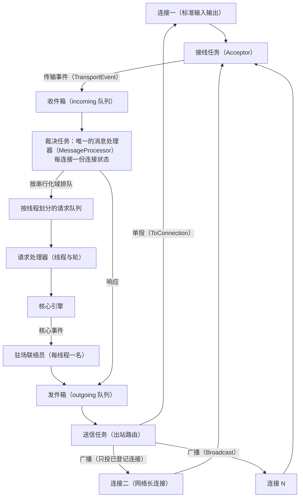

# app-server 深入

## 本章导读

从一个具体的早晨开始：你在终端界面里让 Codex 重写一个函数，它正逐字往外吐代码。这时编辑器插件连上同一个后台服务，问"改到哪一步了"。自动化流水线里的脚本也想凑热闹，催一句"好了没有"。三个客户端同时敲门，而干活的引擎只有一个——谁先谁后？进度通报发给谁？你下班要关机，这个服务怎么才能不伤筋动骨地收工？

前面十五章大多把 Codex 当作"一个程序"来看：一次启动、一次请求、一次退出。本章换一个视角，把它当作"一个服务"来看：一个长驻的进程，同时接待多个客户端，还要保证秩序不乱。这个服务形态就是应用服务，也就是本章的主角。

读完本章，你将能够：

1. 画出应用服务的三任务结构（接线、裁决、送信），说清一条消息从进来到出去的完整旅程；
2. 讲清两道秩序机制——登记握手与串行化域：多连接并发下，"谁先谁后"是如何裁决的；
3. 理解守护进程模式与准入闸：一个长驻进程如何做到重复启动不打架、随时接受健康检查、停机时先关门再收摊。

**前置章节**：第 4 章「进程与传输」、第 5 章「主时序」、第 6 章「协议层」。本章会反复提到"请求、响应、通知"三种消息形态，它们来自 Codex 前后端之间的远程消息约定——一种以纯文本描述"请调用某个功能"的通信格式（JSON-RPC）。如果对这三种形态生疏了，建议先回第 6 章热身。

## 概念与架构

把应用服务想象成一家工程公司的"总机加调度室"。这家公司有点特别：客户不止一个，工地不止一处，客户还会随时打电话来催进度。

- **总机（接线员）**：外线电话有三种线路——标准输入输出管道（stdio，父子进程之间直连的电话线）、本机套接字（Unix socket，同一台机器上进程之间的内线）、网络长连接（WebSocket，能跨机器的电话线）。接线员的纪律只有一条：把客户说的话记下来投进收件箱，绝不在电话里处理业务。这样无论客户从哪条线打进来，后面的人看到的都是同一格信箱。
- **调度室（裁决者）**：全公司只有一间调度室，桌上摆着每个客户的档案夹。调度员从收件箱取件，决定这件事是立即分派，还是排进某个工地的专属队列——同一个工地上，"改方案"和"查进度"不能同时进行，必须排队。
- **门房（登记握手）**：新客户必须先登记身份信息、领取门禁卡。没登记的电话一律不办业务；重复登记的会被礼貌拒绝。
- **驻场联络员（每处工地一名）**：工地上一有进展——大脑（核心引擎）又产出了新事件——联络员立刻打电话回报调度室。工地长时间无人关注且无活可干，联络员就撤回来，腾出人力。
- **送信员（出口路由）**：所有产出——批复、进度通报、审批请求——都不由业务员直接寄出，而是统一交给送信员。送信员看信封：写着具体客户的就单投，写着"全员周知"的就广播给所有已登记的客户。哪位客户的信箱塞爆了，就果断挂断那条线，而不是让整栋楼陪着等。
- **门店运营（守护进程与打烊）**：守护进程模式让这家公司一周七天、一天二十四小时营业。第二拨人来开店时发现门已开着，就直接进店——重复启动不会开出第二家店。打烊时先挂出"暂停接单"的牌子——准入闸关闭，新活一律不接——等手头的活全部做完、等位的号全部清空，才关灯锁门。

把六个角色串起来，一条"请帮我改这个函数"的请求的旅程是：总机接线、登记入箱；调度室查验门禁卡、按工地排队；业务员领单动工；驻场联络员不断回报进展；送信员把每封通报单投或广播出去。任何一个环节堵车，都不会倒灌回接线员——收件箱满了，总机只对"新订单"说"请稍后再试"，绝不让整栋楼的电话占线。

下面这张图把六个角色画在一起。看图时顺着两条流向走：上半部分是请求的旅程，左进右出、必过调度室；下半部分是事件的旅程，从大脑经联络员绕回送信员。

两条路在调度室交汇，却共用同一套通道纪律。记住这张图，只需记住四个要点：

1. **一个裁决者，多个连接**：无论多少连接，裁决者只有一个，秩序因此天然存在；
2. **请求要排队，事件可丢弃**：请求关系状态一致性，必须有序且不可丢；事件是状态快照的广播，丢了可以靠重连重放补回来；
3. **每一环都有界**：所有信箱都有容量上限，满了就明确拒绝或断开。压力以协议允许的形式向上游传递，绝不在内部静默堆积；
4. **服务化等于长驻加准入**：守护进程让进程长期在线，准入闸让它能体面地退出。

## 出场角色

进入源码之前，先认识本章要出场的角色。下表的"所在文件"都是仓库内的相对路径，现在记不住没关系，读到正文时翻回来对照即可。

| 中文名 | 英文名 | 职责（一句话） | 所在文件 |
| ------ | ------ | -------------- | -------- |
| 应用服务 | app-server | 所有前端的统一入口，托管核心引擎的服务进程 | codex-rs/app-server |
| 服务传输层 | app-server-transport | 把各形态连接的字节流解析成统一消息 | codex-rs/app-server-transport |
| 连接编号 | ConnectionId | 每条连接的唯一编号 | codex-rs/app-server-transport/src/outgoing_message.rs |
| 传输事件 | TransportEvent | 接线员交给裁决者的三种信：新连接、新消息、连接关闭 | codex-rs/app-server-transport/src/transport/mod.rs |
| 通道容量 | CHANNEL_CAPACITY | 所有内部信箱的统一容量上限，固定为 128 | codex-rs/app-server-transport/src/transport/mod.rs |
| 消息处理器 | MessageProcessor | 全局唯一的裁决者，处理每条请求、维护全部连接档案 | codex-rs/app-server/src/message_processor.rs |
| 连接会话状态 | ConnectionSessionState | 每条连接的档案：登记状态、闸门、订阅信息 | codex-rs/app-server/src/message_processor.rs |
| 连接状态 | ConnectionState | 裁决者连接表里每条连接的运行时条目 | codex-rs/app-server/src/transport.rs |
| 连接闸门 | ConnectionRpcGate | 连接级的执行闸门，关闭后不再受理新活并等在途排空 | codex-rs/app-server/src/connection_rpc_gate.rs |
| 初始化处理器 | initialize_processor | 完成登记握手、解析客户端能力的请求处理器 | codex-rs/app-server/src/request_processors/initialize_processor.rs |
| 客户端请求 | ClientRequest | 客户端可调用的全部请求的协议枚举 | codex-rs/app-server-protocol/src/protocol/common.rs |
| 客户端请求串行化域 | ClientRequestSerializationScope | 协议层为每个请求声明的排序范围，共九个变体 | codex-rs/app-server-protocol/src/protocol/common.rs |
| 串行化队列键 | RequestSerializationQueueKey | 服务端把串行化域落成的具体排队键 | codex-rs/app-server/src/request_serialization.rs |
| 串行化访问模式 | RequestSerializationAccess | 独占写或共享读两种排队模式 | codex-rs/app-server/src/request_serialization.rs |
| 出站信封 | OutgoingEnvelope | 出站消息的信封：单投或广播 | codex-rs/app-server/src/outgoing_message.rs |
| 出站路由函数 | route_outgoing_envelope | 按登记状态与免打扰清单过滤并投递出站信封 | codex-rs/app-server/src/transport.rs |
| 服务器通知 | ServerNotification | 服务端主动推送给客户端的进度通报 | codex-rs/app-server-protocol/src/protocol/common.rs |
| 服务器请求 | ServerRequest | 服务端反向问客户端的请求，例如审批 | codex-rs/app-server-protocol/src/protocol/common.rs |
| 线程生命周期模块 | thread_lifecycle | 管理每线程监听器的挂载、指令与空闲回收 | codex-rs/app-server/src/request_processors/thread_lifecycle.rs |
| 空闲回收器 | UnloadingState | 对无订阅且长期不活跃的线程做自动卸载的计时状态 | codex-rs/app-server/src/request_processors/thread_lifecycle.rs |
| 线程处理器 | thread_processor | 处理线程的创建、恢复、回滚等请求 | codex-rs/app-server/src/request_processors/thread_processor.rs |
| 轮处理器 | turn_processor | 处理轮的启动、转向、打断等真正驱动模型的请求 | codex-rs/app-server/src/request_processors/turn_processor.rs |
| 守护进程模块 | app-server-daemon | 让应用服务常驻并支持幂等启停 | codex-rs/app-server-daemon |
| 准入闸 | TurnAdmission | 优雅停机的闸门：关门后拒绝新轮 | codex-rs/app-server/src/turn_admission.rs |
| 准入票 | TurnPermit | 准入闸发还的守卫票据，丢弃时自动归还名额 | codex-rs/app-server/src/turn_admission.rs |
| 关停状态机 | ShutdownState | 记录停机进度，双归零才真正退出 | codex-rs/app-server/src/lib.rs |
| 进程内传输模块 | in_process | 同进程前端使用的本地化传输，协议不打折 | codex-rs/app-server/src/in_process.rs |

## 源码深挖

### 三任务结构：监听、处理、出口

这一段把应用服务的运行时拆成三类任务，回答"一条消息从进来到出去，总共经过几双手"。出场的是服务传输层、消息处理器和出站路由函数。读完你就能画出概念段那张图的每一个箭头在源码里的落点。

应用服务的运行时由三类任务构成，它们之间用三条有界消息通道解耦——有界消息通道（mpsc 通道）是多生产者、单消费者的异步队列，容量固定，满了发送方就得等或报错。三条通道的创建在 `codex-rs/app-server/src/lib.rs#L492-L496`：

| 任务 | 数量 | 职责 | 关键位置 |
| --- | --- | --- | --- |
| 接线任务（Acceptor，传输层） | 每连接一套 | 读字节流、解析远程消息、投入收件箱 | `codex-rs/app-server-transport/src/transport/mod.rs#L222-L261` |
| 裁决任务（Processor） | 全局唯一 | 维护连接表、分发请求 / 响应 / 通知 | `codex-rs/app-server/src/lib.rs#L927` |
| 送信任务（出站路由） | 全局唯一 | 把出站信封路由到具体连接或广播 | `codex-rs/app-server/src/lib.rs#L872-L925` |

裁决任务持有唯一的消息处理器实例（`codex-rs/app-server/src/lib.rs#L937`）和那张关键的连接表——以连接编号为键、连接状态为值的哈希表（`codex-rs/app-server/src/lib.rs#L966`；连接编号本身只是个递增整数，定义在 `codex-rs/app-server-transport/src/outgoing_message.rs#L13`）。裁决任务的主循环是一个大多路等待——多路等待（tokio::select!）是同时守候多个异步事件、谁先就绪就先处理谁的机制（`codex-rs/app-server/src/lib.rs#L990`）。收到入站消息后按远程消息的形态分流：请求走 `process_request`（`codex-rs/app-server/src/lib.rs#L1093`），响应走 `process_response`（`codex-rs/app-server/src/lib.rs#L1156`），通知走 `process_notification`（`codex-rs/app-server/src/lib.rs#L1163`），错误走 `process_error`（`codex-rs/app-server/src/lib.rs#L1170`）。

连接关闭也不是简单地从表里删掉。连接关闭分支会先关闭该连接的闸门，再清理串行化队列里属于它的残余请求（`codex-rs/app-server/src/lib.rs#L1059-L1083`）；标准输入输出连接一关，整个进程随之退出（`codex-rs/app-server/src/lib.rs#L1078-L1082`）——因为这条线一断，就意味着唯一的客户挂了电话。

传输层与裁决者之间的契约是传输事件枚举（`codex-rs/app-server-transport/src/transport/mod.rs#L172-L189`），信箱容量固定为 128（`codex-rs/app-server-transport/src/transport/mod.rs#L25`）。传输形态由监听地址决定，缺省值是标准输入输出（`stdio://`，`codex-rs/app-server-transport/src/transport/mod.rs#L115`）。网络长连接形态额外暴露两个健康检查端点 `/readyz` 与 `/healthz`（`codex-rs/app-server-transport/src/transport/websocket.rs#L149-L150`）；绑定非本机回环地址时强制要求鉴权，否则直接拒绝启动（`codex-rs/app-server-transport/src/transport/websocket.rs#L136-L139`）。

排队裁决之后，真正动工的是一组请求处理器。线程处理器管线程的创建、恢复与回滚，轮处理器管轮的启动与转向——轮处理器（turn_processor）的轮启动入口在 `codex-rs/app-server/src/request_processors/turn_processor.rs#L174`。

### 连接门控：登记握手

这一段看"新客户登记"的全过程：登记信息存在哪、谁来检查、重复登记怎么挡。出场的是连接会话状态、初始化处理器和连接闸门。读完你会明白，为什么健康探测只要做一次登记握手，就能确认门后是不是一个活的应用服务。

每条连接的会话状态里有一个登记标记，装在一次性容器里——一次性容器（OnceLock）是一种只能成功写入一次的单元格，第二次写入必然失败（`codex-rs/app-server/src/message_processor.rs#L173-L178`）。登记请求（initialize）是唯一被特许的"未登记业务"：客户端请求入口函数（`handle_client_request`，`codex-rs/app-server/src/message_processor.rs#L881-L915`）对它单独开绿灯，其余请求一律先过门控——未初始化的连接收到 "Not initialized"（`codex-rs/app-server/src/message_processor.rs#L933-L935`）。

握手本身由初始化处理器完成，有两道防重检查：进门前查一次（`codex-rs/app-server/src/request_processors/initialize_processor.rs#L64-L66`），写入一次性容器时再查一次（`codex-rs/app-server/src/request_processors/initialize_processor.rs#L127-L139`）。后者挡的是两个登记请求并发竞速——两道检查之间，另一个登记可能已经抢先写入。握手时还会解析客户端能力（`codex-rs/app-server/src/request_processors/initialize_processor.rs#L76-L86`）：实验接口开关（experimental_api）决定实验方法是否放行，门控在 `codex-rs/app-server/src/message_processor.rs#L937-L941`；免打扰清单（opt_out_notification_methods）登记该连接不想收的广播类别。响应里附带用户代理串（user_agent）、主目录（codex_home）与平台信息（`codex-rs/app-server/src/request_processors/initialize_processor.rs#L177-L182`）——守护进程的健康探测正是靠它确认"门后是不是一个活的应用服务"，下文守护进程一节会用到。

连接级还有一道执行闸门，就是连接闸门：干活之前先拿锁确认连接仍在受理（`codex-rs/app-server/src/connection_rpc_gate.rs#L25-L39`）；连接关闭时关门（`codex-rs/app-server/src/connection_rpc_gate.rs#L45-L49`）；彻底关停则先关门、再等在途请求全部排空（`codex-rs/app-server/src/connection_rpc_gate.rs#L51-L54`）。断开后的清场给在途请求留了 30 秒宽限——排空超时（CONNECTION_RPC_DRAIN_TIMEOUT，`codex-rs/app-server/src/message_processor.rs#L107`），清场流程见 `codex-rs/app-server/src/message_processor.rs#L822-L855`。

### 串行化域：同一线程的请求如何排序

这一段回答"同一个工地上，改方案和查进度为什么不能同时干"。出场的是客户端请求串行化域、串行化队列键和串行化访问模式。读完你会看到一套读写锁思想在消息队列上的落地：写排队、读并发，而且读不许插写的队。

协议层为每个客户端请求声明了串行化域（serialization_scope），即"这个请求和谁互斥"。客户端请求串行化域共九个变体（`codex-rs/app-server-protocol/src/protocol/common.rs#L129-L139`），由请求定义宏（`client_request_definitions`，声明处在 `codex-rs/app-server-protocol/src/protocol/common.rs#L211`）在生成请求枚举时一并产出取域方法（`serialization_scope()`，`codex-rs/app-server-protocol/src/protocol/common.rs#L256-L267`）。

服务端把它落成两组概念。其一是串行化队列键——协议层的域加上连接编号等上下文，变成具体的排队键（`codex-rs/app-server/src/request_serialization.rs#L24-L51`）。其二是串行化访问模式，只有独占写（Exclusive）与共享读（SharedRead）两种（`codex-rs/app-server/src/request_serialization.rs#L53-L57`）；从域到"键加模式"的映射规则在 `from_scope`（`codex-rs/app-server/src/request_serialization.rs#L59-L110`）。队列本体是"键到队列"的哈希表（`codex-rs/app-server/src/request_serialization.rs#L155-L158`），每个队列内部是一条先进先出的等待队列（VecDeque，`codex-rs/app-server/src/request_serialization.rs#L149-L151`）。某个键的第一个请求入队时，才为它启动一个排空任务（`codex-rs/app-server/src/request_serialization.rs#L193-L231`）。排空循环里，独占写逐个放行（`codex-rs/app-server/src/request_serialization.rs#L263-L267`）；共享读用一个并发任务集批量并发——并发任务集（FuturesUnordered）是同时驱动多个异步任务、谁先完成先收谁的容器（`codex-rs/app-server/src/request_serialization.rs#L270-L273`）。并且后来到达的读请求不允许插队到已排队的写请求前面（`codex-rs/app-server/src/request_serialization.rs#L282-L303`）——这是读写公平的保证：不然源源不断的查询会让"改方案"永远轮不上。

裁决者侧的接合点也很干净：分发函数（`dispatch_initialized_client_request`）取出该请求的串行化域（`codex-rs/app-server/src/message_processor.rs#L976`），有键就入队、没键就直接启动任务执行（`codex-rs/app-server/src/message_processor.rs#L1008-L1017`）。连接断开时，清队列函数（`discard_closed`）把队列里属于它的请求清掉（`codex-rs/app-server/src/request_serialization.rs#L162-L177`）。

### 事件路由与多连接分发

这一段跟着一封通报走出口链路：信封怎么写、广播怎么过滤、慢连接怎么处理，以及最有 agent 特色的一环——服务端反向问客户端。出场的是出站信封、出站路由函数和线程生命周期模块。读完你能解释"为什么卡住的客户端会被挂断，而审批请求却永远等下去"。

出站世界的信封只有两种（`codex-rs/app-server/src/outgoing_message.rs#L113-L122`）：单投（ToConnection）与广播（Broadcast）。出站路由函数（`route_outgoing_envelope`）对广播做一次过滤：只发给已登记且未把该类通知列入免打扰清单的连接（`codex-rs/app-server/src/transport.rs#L216-L227`）；实验性通知还会被过滤函数（`should_skip_notification_for_connection`）拦下（`codex-rs/app-server/src/transport.rs#L101-L124`）。

单投用的是尝试发送——尝试发送（try_send）不等待，信箱满了立刻返回失败：对方队列满了就直接断开这条慢连接（`codex-rs/app-server/src/transport.rs#L158-L165`）。每条服务器通知在出口处盖上出口时间戳（emitted_at_ms，`codex-rs/app-server/src/outgoing_message.rs#L894-L899`），方便客户端测量通报在路上滞留了多久。通知的目标列表由订阅集合算出：订阅了某线程的连接才会收到它的进度通报；列表为空则退化为全员广播（投递函数 `send_server_notification_to_connections`，`codex-rs/app-server/src/outgoing_message.rs#L757-L792`）。

值得注意的是反向请求——审批这类"服务端问客户端"的调用（审批的完整故事见第 12 章「审批与沙箱」）。它用发请求函数（`send_request`）发出，并挂一个一次性通道等回答——一次性通道（oneshot）是只能送一次答复的点对点通道（`codex-rs/app-server/src/outgoing_message.rs#L320-L328`）；答复回来时的回调登记表在 `codex-rs/app-server/src/outgoing_message.rs#L380-L393`。它们没有超时——人会思考多久，服务端就等多久。但轮切换时会被主动中止，中止原因固定为轮切换原因（turnTransition，常量的定义在 `codex-rs/app-server/src/server_request_error.rs#L3`，装配处在 `codex-rs/app-server/src/outgoing_message.rs#L211-L226`）；客户端断线重连后，未答复的审批会被重放（重放函数 `replay_requests_to_connection_for_thread`，`codex-rs/app-server/src/outgoing_message.rs#L450-L469`）。

事件的上游是每线程一名驻场联络员。挂载函数（`ensure_conversation_listener`）先把连接登记进该线程的订阅集合，再确保联络员任务在跑（`codex-rs/app-server/src/request_processors/thread_lifecycle.rs#L141-L190`）；失败时回滚订阅，不留下半截登记（`codex-rs/app-server/src/request_processors/thread_lifecycle.rs#L183-L188`）。联络员的循环同时盯着取消信号、控制命令和核心事件流（`codex-rs/app-server/src/request_processors/thread_lifecycle.rs#L281-L306`），并带一个"无订阅且非活跃超过阈值就自动卸载"的空闲回收器（`codex-rs/app-server/src/request_processors/thread_lifecycle.rs#L22-L124`）。

把这些零件拼起来，线程启动方法（`thread/start`）的完整链路就清晰了：先为非临时线程预留元数据（暂存函数 `stage_pending_thread_metadata`，`codex-rs/app-server/src/request_processors/thread_processor.rs#L36-L57`，调用点在 `codex-rs/app-server/src/request_processors/thread_processor.rs#L1459-L1472`）；再创建线程（`codex-rs/app-server/src/request_processors/thread_processor.rs#L1475-L1500`）；失败则移除预留元数据回滚（`codex-rs/app-server/src/request_processors/thread_processor.rs#L1506-L1518`）；最后挂上驻场联络员（`codex-rs/app-server/src/request_processors/thread_processor.rs#L1551-L1567`）。先预留、再动工、失败回滚——这是典型的两阶段落账，防止"线程已建但账本没记"的半截状态。

### 守护进程模式：幂等启动与文件锁

这一段看门店运营：常驻进程的状态文件放哪、第二拨人来开店如何发现"门已开着"、并发启停怎么互斥。出场的是守护进程模块和终端界面的形态选择逻辑。读完你会理解为什么守护进程"不信纸面信现场"。

守护进程的全部状态放在 Codex 主目录下的守护进程目录里：设置文件（settings.json，记录监听地址）、进程号文件（app-server.pid）、操作锁文件（daemon.lock）——三个文件名常量的定义在 `codex-rs/app-server-daemon/src/lib.rs#L38-L42`。

启动是幂等的。它先按设置里的地址做一次真实探测：在本机套接字上跑网络长连接帧、完成一次货真价实的登记握手，并从用户代理串里解析出版本（探测函数 `probe`，`codex-rs/app-server-daemon/src/client.rs#L34-L61`），全程两秒超时（`codex-rs/app-server-daemon/src/client.rs#L25`）。探测成功就直接返回"已在运行"（AlreadyRunning，生命周期状态枚举见 `codex-rs/app-server-daemon/src/lib.rs#L52-L61`，判定分支在 `codex-rs/app-server-daemon/src/lib.rs#L335-L370`）。注意这里不信进程号文件——文件可能是上次崩溃留下的尸体，只有真实握手才算数。

并发启停靠文件锁互斥——文件锁（flock）是操作系统提供的整文件互斥锁，锁住操作锁文件、非阻塞获取（`codex-rs/app-server-daemon/src/lib.rs#L1010-L1024`），拿不到就轮询等待、超时作罢（带超时的包装在 `codex-rs/app-server-daemon/src/lib.rs#L894-L907`）。新进程拉起后，以 50 毫秒轮询、10 秒封顶等它就绪（两个超时常量见 `codex-rs/app-server-daemon/src/lib.rs#L33-L34`，等待循环在 `codex-rs/app-server-daemon/src/lib.rs#L534-L549`）。

客户端侧的选型也很克制。终端界面（TUI，在终端里用文字绘制的交互界面，第 14 章展开）启动时在三种形态间决策：远程（Remote）、本地守护进程（LocalDaemon）、内嵌（Embedded），决策函数在 `codex-rs/tui/src/lib.rs#L926-L954`。其中内嵌形态走进程内传输模块——模块文档说得明白：传输本地化了，但协议不打折（"transport-local but not protocol-free"，`codex-rs/app-server/src/in_process.rs#L20-L24`）；请求照样过消息处理器的完整语义，出站也照样走同一个出站路由函数（`codex-rs/app-server/src/in_process.rs#L402-L419`）。

平台差异也被妥善封装：类 Unix 系统上，守护进程随控制套接字的消失而退出；Windows 没有等价的句柄语义，于是单独提供一条关闭通道 `/daemon/shutdown`，用进程号回显做握手确认（`codex-rs/app-server-daemon/src/client.rs#L78-L97`）。

### 准入闸：优雅停机的闸门

这一段看打烊的全过程：牌子什么时候挂、挂出去之后谁还进得来、灯什么时候才能关。出场的是准入闸、准入票和关停状态机。读完你会明白"先发票后动工"和"双归零"这两个小细节，各自堵的是哪扇竞态的窗。

优雅停机的核心是一个小小的一等公民：准入闸（TurnAdmission，`codex-rs/app-server/src/turn_admission.rs#L18-L22`）。它的内部状态只有关门标记（closed）与活跃数（active）两个字段（`codex-rs/app-server/src/turn_admission.rs#L11-L14`）。放行方法（`admit()`，`codex-rs/app-server/src/turn_admission.rs#L47-L50`）成功则发还一张准入票——这是一种守卫票据，离开作用域被丢弃时自动归还名额（票据定义在 `codex-rs/app-server/src/turn_admission.rs#L32`，归还逻辑在 `codex-rs/app-server/src/turn_admission.rs#L73-L83`）。关门方法（`begin_drain`，`codex-rs/app-server/src/turn_admission.rs#L34-L40`）挂上"暂停接单"的牌子后，放行一律拒绝。

消息处理器在分发阶段检查准入：命中名单的请求先拿票再排队或执行。名单本身分两类——线程的启动、分叉、恢复、回滚、还原只需进门时拿一次票；轮的启动、转向、评审等真正驱动模型的请求，从串行化队列出队后还要再验一次票（名单在 `codex-rs/app-server/src/message_processor.rs#L949-L965`，复验点在 `codex-rs/app-server/src/message_processor.rs#L987-L990`）。这一验堵的是"排队时还没打烊、轮到时已打烊"的窗口期。关门之后新来的请求收到统一的 "Server is draining; retry after reconnecting"（`codex-rs/app-server/src/error_code.rs#L9-L11`）。

进程什么时候算"可以走了"？关停状态机的收工条件是双归零：正在跑的轮数为零，且已发出去的准入票也全部归还（`codex-rs/app-server/src/lib.rs#L279`）——活儿干完了，等位的号也清空了，才关灯。整个状态机（含请求标记、强制标记与日志节流）只有百余行，值得通读（`codex-rs/app-server/src/lib.rs#L190-L301`）。打烊动作本身由关门方法触发（`codex-rs/app-server/src/lib.rs#L260`）；关机信号到来时先关门，再在每轮循环顶部重新采样准入数与在跑轮数，确保"先发票后启动轮"的间隙也不会漏算。

## 技术难点与设计取舍

应用服务的代码并不难读，难的是读懂每一处设计背后防的是什么。以下三个难点，覆盖了这套系统最主要的三类权衡。

**难点一：多连接多线程并发下的秩序维护。** 应用服务的答案是"能用单线程裁决就不用锁"：全局只有一个裁决任务，连接表是普通哈希表而非并发结构；剩下的并发冲突收敛到两类点——登记握手用一次性容器双检挡住重复登记，同一线程的写请求用串行化域排队。再叠加"入队前拿票、出队后复验"的双检模式，杜绝了"排队时还有效、轮到时已失效"的窗口期。取舍很鲜明：裁决者单点串行的吞吐上限，换实现的可推理性与无锁化。对一个以人机交互为主的服务，这笔账划算——瓶颈永远在模型，不在分发。

**难点二：事件洪峰的路由与丢弃策略。** 入站信箱容量只有 128（`codex-rs/app-server-transport/src/transport/mod.rs#L25`），满了以后分消息性质处理：请求不能被静默吞掉，立刻回过载错误（OVERLOADED，错误码 -32001，错误码定义在 `codex-rs/app-server/src/error_code.rs#L6`，装配与回投在 `codex-rs/app-server-transport/src/transport/mod.rs#L235-L258`）；响应和通知则选择等待入队而非丢弃（`codex-rs/app-server-transport/src/transport/mod.rs#L259`）——前者是契约，后者是状态。出站侧恰好相反：慢连接直接断开（`codex-rs/app-server/src/transport.rs#L158-L165`），因为事件是"最新状态的广播"，丢掉旧快照、客户端重连后靠重放补齐，比让所有连接陪着一个卡死的客户端等更健康。一句话：请求不可丢，事件可丢但要有补偿路径。

**难点三：长驻守护进程的状态一致性。** 长驻进程最大的敌人是"自以为是的真相"：进程号文件可能是上次崩溃留下的尸体，所以守护进程不信文件信探测——用一次真实握手确认对端确实是活的应用服务；启停操作可能并发，所以用文件锁互斥；停机不能一刀切，所以用准入闸先关门、再等双归零，外加 30 秒连接排空宽限兜底。每一处都是同一个原则：持久文件只当线索，运行时真相必须现场验证。

## 对照通用 agent 范式

把应用服务放回服务端架构的坐标系，能看到几张熟悉的面孔。

- **角色模型（actor model）**：一种并发范式——每个角色私有状态、单线程处理自己的邮箱、与外界只靠消息通信。裁决任务就是一个经典角色：私有连接表、单线程消息循环；每线程的驻场联络员则是"会话级角色"，负责把核心引擎的事件流翻译成协议通知。串行化域相当于给角色的邮箱加了按键划分的有序子通道。
- **连接网关（connection gateway）**：游戏服务器与即时通讯长连接网关的标准配方——接线员只搬运不处理、送信员统一出口、广播带订阅过滤。过载回压与慢连接断开，也是网关保护内核的常规手段。
- **背压（backpressure）传播**：每个环节都是有界队列，压力逐级向上游传递，最终在边界处以显式形式暴露——入站侧是过载错误；进程内形态则是尝试发送返回"缓冲区满"信号（WouldBlock），事件洪峰时给客户端补发滞后标记（Lagged，"你被跳过了多少条"，设计意图见 `codex-rs/app-server/src/in_process.rs#L26-L32`，标记定义在 `codex-rs/app-server/src/in_process.rs#L170-L180`）。不静默、不撑爆内存，把"我忙不过来了"变成协议的一部分——这是它比许多内部服务做得更认真的地方。

但 agent 服务化有两处是传统服务端没有的。其一是反向请求——服务端会主动向客户端发起调用（审批），把"人"当成了运行时的依赖，于是需要无超时等待、断线重放、轮切换时主动中止这一整套配套。其二是准入语义——停机不是"拒绝新连接"就够了，还要精确到"拒绝新轮、但允许在途线程的查询继续"，因为客户端的重连成本是以正在生成的代码为代价的。这两点，正是"agent 即服务"区别于"API 即服务"的地方。

## 小结与下一章预告

本章把 Codex 从"一个进程"重新看成了"一个服务"。核心结论三条：

- **三任务结构**：接线任务管进、裁决任务管秩序、送信任务管出，三条有界通道解耦，连接状态单线程持有；
- **两道秩序机制**：登记握手决定"能不能办"，串行化域决定"谁先办"，再用连接闸门和准入双检堵住竞态窗口；
- **长驻两件套**：守护进程用真实握手探测加文件锁实现幂等启停，准入闸用关门加双归零实现优雅停机。

这一章是全书的最后一章，没有"下一章"。回头看，五部分的主线其实是一条不断放大的坐标轴：第一部分「认识 Codex」建立全局图景与配置底座；第二部分「看懂一次请求」把传输、时序、协议三个剖面切开；第三部分「Agent 的大脑」深入线程模型、采样、压缩与持久化；第四部分「Agent 的手和脚」讲工具、审批沙箱与外部工具链路如何与外界交互；第五部分「形态与进阶」则把同一个内核放进终端界面、批处理与应用服务三种形态里对照。如果你想温故知新，推荐三条回读路径：想重建全局图景，回第 1 章「总览」；想再跟一次请求的完整旅程，回第 5 章「主时序」；想重新审视 agent 的思考核心，回第 7 章「Agent 核心」。

源码永远比书写得快。本书所有行号都锚定在执笔时的基线提交上；当你手中的 Codex 已经向前演进，欢迎以基线为参照做一次版本对比，亲自去看看这些机制变成了什么模样。也许你会发现串行化域多了新的变体、守护进程学会了新的技能、某个我们叹为巧妙的设计已经被更简单的方案取代——那正是开源项目活着的证据，也是这本书真正想交给你的能力：不是记住这些行号，而是学会怎样读出一个系统的秩序。
