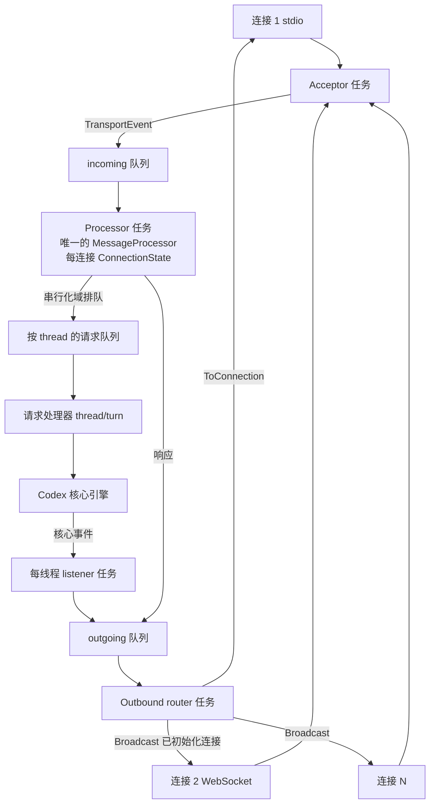

# app-server 深入

## 本章导读

前面十五章里，我们更多把 Codex 当作"一个进程"来看：一次启动、一次请求、一次退出。本章换一个视角——把 Codex 当作"一个服务"来看。当 TUI、IDE 插件、CI 脚本都想同时挂在同一个 agent 上时，就需要一个长驻的、能同时接待多个连接、还能保证秩序不乱的服务进程，这就是 app-server。

学习目标：

1. 画出 app-server 的三任务结构（监听 / 处理 / 出口），说清一条消息从 socket 到响应的完整旅程；
2. 讲清两道秩序机制——`initialize` 握手门控与请求串行化域：多连接并发下，"谁先谁后"是如何裁决的；
3. 理解 daemon 模式与 turn 准入：一个长驻进程如何做到幂等启动、健康探测与优雅停机。

**前置章节**：第 4 章「进程与传输」、第 5 章「主时序：一次请求全链路」、第 6 章「协议层」。如果你对 JSON-RPC 的 Request / Response / Notification 三形态已经生疏，建议先回第 6 章热身。

## 概念与架构

把 app-server 想象成一家工程公司的**总机 + 调度室**：

- **总机（传输层）**：外线电话有很多种——stdio、Unix socket、WebSocket。接线员的纪律只有一条：把客户说的话记下来投进收件箱，**绝不在电话里处理业务**。这样无论客户从哪条线打进来，后面的人看到的都是同一格信箱。
- **调度室（MessageProcessor）**：全公司只有一间调度室，桌上摆着每个客户的档案夹。调度员从收件箱取件，决定这件事是立即分派、还是排进某个工地的专属队列——同一个工地（thread）上，"改方案"和"查进度"不能同时进行，必须排队。
- **门房（initialize 握手）**：新客户必须先登记身份信息，领取门禁卡。没登记的电话一律不办业务；重复登记的会被礼貌地拒绝。
- **驻场联络员（thread listener）**：每个开工的工地配一名联络员，工地上一有进展（核心引擎产出事件），立刻打电话回报调度室。工地长时间无人关注且没有活干，联络员就撤回来，腾出人力。
- **送信员（outbound router）**：所有产出——批复、进度通报、审批请求——都不由业务员直接寄出，而是统一交给送信员。送信员看信封：写着具体客户的就单投，写着"全员周知"的就广播给所有已登记的客户；哪位客户的信箱塞爆了，就果断挂断那条线，而不是让整栋楼等着。
- **门店运营（daemon 与打烊）**：daemon 模式让这家公司 7×24 小时营业，第二拨人来开店时发现门已开着就直接进店（幂等启动）。打烊时先挂出"暂停接单"的牌子（turn 准入关闭），等手头的活全部做完、等位的号全部清空，才关灯锁门。

把六个角色串起来，一条"请帮我改这个函数"的请求的旅程是：总机接线、登记入箱 → 调度室查验门禁卡、按工地排队 → 业务员领单动工 → 驻场联络员不断回报进展 → 送信员把每封通报单投或广播出去。任何一个环节堵车，都不会倒灌回接线员——收件箱满了，总机只对"新订单"说"稍后重试"，绝不让整栋楼的电话占线。

读这张图时注意两条流向：上半部分是请求的旅程（左进右出，过调度室），下半部分是事件的旅程（从核心引擎经联络员绕回送信员）。两条路在调度室交汇，却共用同一套通道纪律。

要点回顾：

1. **一个处理器，多个连接**：无论多少连接，裁决者只有一个，秩序因此天然存在；
2. **请求要排队，事件可丢弃**：请求关系状态一致性，必须有序且不可丢；事件是状态快照的广播，丢了可以靠重连重放补回来；
3. **每一环都有界**：所有信箱都有容量上限，满了就明确拒绝或断开，压力以协议允许的形式向上游传递，绝不在内部静默堆积；
4. **服务化 = 长驻 + 准入**：daemon 让进程长期在线，turn 准入让它能体面地退出。

## 源码深挖

### 三任务结构：监听、处理、出口

app-server 的运行时由三类任务构成，它们之间用三条有界 mpsc 通道解耦（`codex-rs/app-server/src/lib.rs#L491-L495`）：

| 任务 | 数量 | 职责 | 关键位置 |
| --- | --- | --- | --- |
| Acceptor / 传输层 | 每连接一套 | 读字节流、解析 JSON-RPC、投入 incoming 队列 | `codex-rs/app-server-transport/src/transport/mod.rs#L222-L261` |
| Processor | 全局唯一 | 维护连接表、分发请求 / 响应 / 通知 | `codex-rs/app-server/src/lib.rs#L927` |
| Outbound router | 全局唯一 | 把出站信封路由到具体连接或广播 | `codex-rs/app-server/src/lib.rs#L872-L925` |

processor 任务持有唯一的 `Arc<MessageProcessor>`（`codex-rs/app-server/src/lib.rs#L937`）和那张关键的连接表 `HashMap<ConnectionId, ConnectionState>`（`codex-rs/app-server/src/lib.rs#L966`），主循环是一个大的 `tokio::select!`（`codex-rs/app-server/src/lib.rs#L990`）。收到 `IncomingMessage` 后按 JSON-RPC 形态分流：Request 走 `process_request`（`codex-rs/app-server/src/lib.rs#L1093`），Response 走 `process_response`（`codex-rs/app-server/src/lib.rs#L1156`），Notification 走 `process_notification`（`codex-rs/app-server/src/lib.rs#L1163`），Error 走 `process_error`（`codex-rs/app-server/src/lib.rs#L1170`）。

连接关闭也不是简单地从表里删掉：`ConnectionClosed` 分支会先关闭该连接的 RPC 闸门、再清理串行化队列里属于它的残余请求（`codex-rs/app-server/src/lib.rs#L1059-L1083`）；stdio 连接一关，整个进程随之退出（`codex-rs/app-server/src/lib.rs#L1078-L1082`）。

传输层与 processor 之间的契约是 `TransportEvent` 枚举（`codex-rs/app-server-transport/src/transport/mod.rs#L172-L189`），通道容量固定为 128（`codex-rs/app-server-transport/src/transport/mod.rs#L25`）。传输形态由监听 URL 决定，`stdio://` 是缺省值（`codex-rs/app-server-transport/src/transport/mod.rs#L117`）；WebSocket 形态额外暴露 `/readyz` 与 `/healthz` 健康检查端点（`codex-rs/app-server-transport/src/transport/websocket.rs#L149-L150`），绑定非回环地址时强制要求鉴权（`codex-rs/app-server-transport/src/transport/websocket.rs#L136-L139`）。

### 连接门控：initialize 握手

每条连接的会话状态里有一个 `initialized: OnceLock`（`codex-rs/app-server/src/message_processor.rs#L174-L179`）。`initialize` 是唯一被特许的"未登记业务"：`handle_client_request` 对它单独开绿灯（`codex-rs/app-server/src/message_processor.rs#L881-L915`），其余请求一律先过门控——未初始化的连接收到 "Not initialized"（`codex-rs/app-server/src/message_processor.rs#L933-L935`）。

握手本身由 `initialize_processor` 完成，有两道防重检查：进门前查一次（`codex-rs/app-server/src/request_processors/initialize_processor.rs#L64-L66`），写入 `OnceLock` 时再查一次（`codex-rs/app-server/src/request_processors/initialize_processor.rs#L127-L139`）——后者挡的是两个 initialize 并发竞速。握手时还会解析客户端能力：`experimental_api` 决定实验方法是否放行（门控在 `codex-rs/app-server/src/message_processor.rs#L937-L941`），`opt_out_notification_methods` 登记该连接不想收的广播（`codex-rs/app-server/src/request_processors/initialize_processor.rs#L75-L85`）。响应里附带 `user_agent`、`codex_home`、平台信息（`codex-rs/app-server/src/request_processors/initialize_processor.rs#L177-L182`），daemon 的健康探测正是靠它确认"门后是不是一个活的 app-server"。

连接级还有一道执行闸门 `ConnectionRpcGate`：`run` 之前先拿锁确认连接仍在受理（`codex-rs/app-server/src/connection_rpc_gate.rs#L25-L39`），连接关闭时 `close`（`codex-rs/app-server/src/connection_rpc_gate.rs#L45-L49`），彻底关停则 `shutdown` = close + 等待在途请求排空（`codex-rs/app-server/src/connection_rpc_gate.rs#L51-L54`）。断开后的清场给在途请求留了 30 秒宽限（`CONNECTION_RPC_DRAIN_TIMEOUT`，`codex-rs/app-server/src/message_processor.rs#L107`；流程见 `codex-rs/app-server/src/message_processor.rs#L822-L855`）。

### 串行化域：同一 thread 的请求如何排序

协议层为每个客户端请求声明了串行化域，`ClientRequestSerializationScope` 共九个变体（`codex-rs/app-server-protocol/src/protocol/common.rs#L129-L139`），由宏在生成请求枚举时一并产出 `serialization_scope()`（`codex-rs/app-server-protocol/src/protocol/common.rs#L256-L267`，声明处在 `codex-rs/app-server-protocol/src/protocol/common.rs#L212`）。

服务端把它落成两组概念：队列键 `RequestSerializationQueueKey`（`codex-rs/app-server/src/request_serialization.rs#L24-L51`）与访问模式 `RequestSerializationAccess::{Exclusive, SharedRead}`（`codex-rs/app-server/src/request_serialization.rs#L53-L57`），映射规则在 `from_scope`（`codex-rs/app-server/src/request_serialization.rs#L59-L110`）。队列本体是 `HashMap<key, VecDeque<...>>`（`codex-rs/app-server/src/request_serialization.rs#L155-L158`）：某个 key 的第一个请求入队时 spawn 一个 drain 任务（`codex-rs/app-server/src/request_serialization.rs#L194-L231`），drain 循环里 Exclusive 逐个放行（`codex-rs/app-server/src/request_serialization.rs#L263-L267`），SharedRead 用 `FuturesUnordered` 批量并发（`codex-rs/app-server/src/request_serialization.rs#L271-L273`），并且**后来到达的读请求不允许插队到已排队的写请求前面**（`codex-rs/app-server/src/request_serialization.rs#L282-L303`）——这是读写公平的保证。

处理器侧的接合点：`dispatch_initialized_client_request` 取出该请求的 scope（`codex-rs/app-server/src/message_processor.rs#L976`），有 key 就入队、没 key 就直接 spawn（`codex-rs/app-server/src/message_processor.rs#L1008-L1017`）；连接断开时 `discard_closed` 把队列里属于它的请求清掉（`codex-rs/app-server/src/request_serialization.rs#L162-L177`）。

### 事件路由与多连接分发

出站世界的信封只有两种（`codex-rs/app-server/src/outgoing_message.rs#L113-L122`）：`ToConnection`（单投）与 `Broadcast`（广播）。路由函数 `route_outgoing_envelope` 对广播做一次过滤：只发给**已初始化且未 opt-out 该类通知**的连接（`codex-rs/app-server/src/transport.rs#L216-L227`），实验性通知还会被 `should_skip_notification_for_connection` 拦下（`codex-rs/app-server/src/transport.rs#L101-L124`）。

单投用 `try_send`：对方队列满了不等，直接断开这条慢连接（`codex-rs/app-server/src/transport.rs#L158-L165`）。每条服务器通知在出口处盖上 `emitted_at_ms` 时间戳（`codex-rs/app-server/src/outgoing_message.rs#L894-L899`），方便客户端测量滞留。通知的目标列表由订阅集合算出：订阅了某 thread 的连接才会收到它的进度通报，列表为空则退化为全员广播（`send_server_notification_to_connections`，`codex-rs/app-server/src/outgoing_message.rs#L757-L792`）。

值得注意的是**反向请求**：审批这类"服务端问客户端"的调用，用 `send_request` 发出并以 oneshot 收回答（`codex-rs/app-server/src/outgoing_message.rs#L320-L328`），回调登记表在 `codex-rs/app-server/src/outgoing_message.rs#L380-L393`。它们没有超时——人会思考多久，服务端就等多久；但 turn 切换时会被主动中止，reason 是 `turnTransition`（`codex-rs/app-server/src/outgoing_message.rs#L211-L226`）；客户端断线重连后，未答复的审批会被重放（`replay_requests_to_connection_for_thread`，`codex-rs/app-server/src/outgoing_message.rs#L450-L469`）。

事件的上游是每线程 listener 任务：`ensure_conversation_listener` 先把连接登记进该 thread 的订阅集合、再确保 listener 任务在跑（`codex-rs/app-server/src/request_processors/thread_lifecycle.rs#L141-L190`），失败时回滚订阅（`codex-rs/app-server/src/request_processors/thread_lifecycle.rs#L183-L188`）。listener 的循环同时盯着取消信号、控制命令和核心事件流（`codex-rs/app-server/src/request_processors/thread_lifecycle.rs#L281-L306`），并带一个"无订阅且非活跃超过阈值就自动卸载"的空闲回收器 `UnloadingState`（`codex-rs/app-server/src/request_processors/thread_lifecycle.rs#L22-L124`）。

把这些零件拼起来，`thread/start` 的完整链路就清晰了：先为非临时线程预留元数据（`stage_pending_thread_metadata`，`codex-rs/app-server/src/request_processors/thread_processor.rs#L36-L57`，调用点 `codex-rs/app-server/src/request_processors/thread_processor.rs#L1459-L1472`），再 `start_thread`（`codex-rs/app-server/src/request_processors/thread_processor.rs#L1475-L1500`），失败则 `remove_pending_thread_metadata` 回滚（`codex-rs/app-server/src/request_processors/thread_processor.rs#L1506-L1518`），最后挂上 listener（`codex-rs/app-server/src/request_processors/thread_processor.rs#L1551-L1567`）。

### daemon 模式：幂等启动与文件锁

daemon 的全部状态放在 `$CODEX_HOME/app-server-daemon/` 下：`settings.json`（监听地址）、`app-server.pid`、`daemon.lock`（`codex-rs/app-server-daemon/src/lib.rs#L38-L42`）。

`start` 是幂等的：先按 settings 里的地址做一次真实探测——在 UDS 上跑 WebSocket 帧、完成一次货真价实的 `initialize` + `initialized` 握手，并从 `user_agent` 里解析出版本（`codex-rs/app-server-daemon/src/client.rs#L34-L61`），全程 2 秒超时（`codex-rs/app-server-daemon/src/client.rs#L25`）。探测成功就直接返回 `AlreadyRunning`（`codex-rs/app-server-daemon/src/lib.rs#L335-L370`，状态枚举见 `codex-rs/app-server-daemon/src/lib.rs#L52-L61`）。并发启停靠对 `daemon.lock` 加 `flock(LOCK_EX | LOCK_NB)` 互斥（`codex-rs/app-server-daemon/src/lib.rs#L1010-L1024`，带超时包装在 `codex-rs/app-server-daemon/src/lib.rs#L894-L907`）；新进程拉起后，以 50ms 轮询、10 秒封顶等它就绪（`codex-rs/app-server-daemon/src/lib.rs#L534-L549`）。

客户端侧的选型也很克制：TUI 启动时在 Remote / LocalDaemon / Embedded 三者间决策（`codex-rs/tui/src/lib.rs#L926-L954`）。其中 Embedded 走 in-process 通道——模块文档说得明白：传输本地化了，但协议不打折（"transport-local but not protocol-free"，`codex-rs/app-server/src/in_process.rs#L20-L24`），请求照样过 `MessageProcessor` 的完整语义，出站也照样走同一个路由函数（`codex-rs/app-server/src/in_process.rs#L402-L419`）。

平台差异也被妥善封装：Unix 上 daemon 随控制 socket 的消失而退出，Windows 没有等价的句柄语义，于是单独提供一条 `/daemon/shutdown` 控制通道，用 PID 回显做握手确认（`codex-rs/app-server-daemon/src/client.rs#L78-L97`）。

### turn 准入：优雅停机的闸门

优雅停机的核心是一个小小的一等公民 `TurnAdmission`：内部状态只有 `closed` 与 `active` 两个字段（`codex-rs/app-server/src/turn_admission.rs#L11-L15`）。`admit()` 成功则发还一张 `TurnPermit`（RAII 守卫，Drop 时自动归还名额，`codex-rs/app-server/src/turn_admission.rs#L73-L83`）；`begin_drain` 关门后，`admit()` 一律拒绝（`codex-rs/app-server/src/turn_admission.rs#L35-L50`）。

处理器在分发阶段检查准入：命中名单的请求先拿 permit 再排队或执行，名单本身分两类——`ThreadStart/Fork/Resume/Rollback/Revert` 只需进门时拿一次，`TurnStart/TurnSteer/ReviewStart` 等真正驱动模型的请求在**从串行化队列出队后还要再验一次**（名单 `codex-rs/app-server/src/message_processor.rs#L949-L965`，复验点 `codex-rs/app-server/src/message_processor.rs#L987-L990`）。关门之后新来的请求收到统一的 "Server is draining; retry after reconnecting"（`codex-rs/app-server/src/error_code.rs#L10-L12`）。

进程什么时候算"可以走了"？`ShutdownState` 的 Finish 条件是双归零：`running_turn_count == 0 && active_admissions == 0`（`codex-rs/app-server/src/lib.rs#L279`）——正在跑的 turn 跑完，且已发出去的准入票也全部归还，才关灯。整个状态机（`requested` / `forced` / 日志节流）只有百余行，值得通读（`codex-rs/app-server/src/lib.rs#L190-L301`）。drain 动作本身由 `begin_drain` 触发（`codex-rs/app-server/src/lib.rs#L260`），关机信号到来时先关门、再在每轮循环顶部重新采样准入数与在跑 turn 数，确保"先发 permit 后启动 turn"的间隙也不会漏算。

## 技术难点与设计取舍

app-server 的代码并不难读，难的是读懂每一处设计背后防的是什么。以下三个难点，覆盖了这套系统最主要的三类权衡。

**难点一：多连接多线程并发下的秩序维护。** app-server 的答案是"能用单线程裁决就不用锁"：全局只有一个 processor 任务，连接表是普通 `HashMap` 而非并发 map；剩下的并发冲突收敛到两类点——握手用 `OnceLock` 双检挡住重复 initialize，同 thread 的写请求用串行化域排队。再叠加"入队前 admit、出队后 recheck"的双检模式，杜绝了"排队时还有效、轮到时已失效"的窗口期。取舍很鲜明：processor 单点串行的吞吐上限，换实现的可推理性与无锁化。

**难点二：事件洪峰的路由与丢弃策略。** 入站通道容量只有 128（`codex-rs/app-server-transport/src/transport/mod.rs#L25`），满了以后分消息性质处理：Request 不能被静默吞掉，立刻回 `OVERLOADED`（错误码 -32001，`codex-rs/app-server-transport/src/transport/mod.rs#L235-L258`）；Response 和 Notification 则选择等待入队而非丢弃（`codex-rs/app-server-transport/src/transport/mod.rs#L259`）——前者是契约，后者是状态。出站侧恰好相反：慢连接直接断开（`codex-rs/app-server/src/transport.rs#L158-L165`），因为事件是"最新状态的广播"，丢掉旧快照、客户端重连后靠 replay 补齐，比让所有连接陪着一个卡死的客户端等更健康。一句话：**请求不可丢，事件可丢但要有补偿路径**。

**难点三：长驻 daemon 的状态一致性。** 长驻进程最大的敌人是"自以为是的真相"：pid 文件可能是上次崩溃留下的尸体，所以 daemon 不信 pid 信 probe——用一次真实握手确认对端确实是活的 app-server；启停操作可能并发，所以用 flock 互斥；停机时不能一刀切，所以用 turn 准入先关门、再等双归零，外加 30 秒连接排空宽限兜底。每一处都是同一个原则：持久文件只当线索，运行时真相必须现场验证。

## 对照通用 agent 范式

把 app-server 放回服务端架构的坐标系，能看到两张熟悉的面孔：

- **actor model**：processor 任务就是一个经典 actor——私有状态（连接表）、单线程消息循环、与外界只靠邮箱通信；每线程 listener 则是"会话级 actor"，负责把核心引擎的事件流翻译成协议通知。串行化域相当于给 actor 的邮箱加了按 key 划分的有序子通道。
- **连接网关（connection gateway）**：acceptor 只搬运不处理、router 统一出口、广播带订阅过滤——这是游戏服务器与 IM 长连接网关的标准配方；overload 回压与慢连接断开，也是网关保护内核的常规手段。
- **背压（backpressure）传播**：每个环节都是有界队列，压力逐级向上游传递，最终在边界处以显式形式暴露——入站侧是 `OVERLOADED` 错误，in-process 形态则是 `try_send` 返回 `WouldBlock`、事件洪峰时给客户端补发 `Lagged { skipped }` 标记（设计意图见 `codex-rs/app-server/src/in_process.rs#L26-L32`）。不静默、不OOM，把"我忙不过来了"变成协议的一部分，这是它比许多内部服务做得更认真的地方。

但 agent 服务化有两处是传统服务端没有的：**其一是反向请求**——服务端会主动向客户端发起调用（审批），把"人"当成了运行时的依赖，于是需要无超时等待、断线重放、turn 切换时主动中止这一整套配套；**其二是准入语义**——停机不是"拒绝新连接"就够了，还要精确到"拒绝新 turn 但允许在途 thread 的查询继续"，因为客户端的重连成本是以正在生成的代码为代价的。这两点，正是"agent 即服务"区别于"API 即服务"的地方。

## 小结与下一章预告

本章把 Codex 从"一个进程"重新看成了"一个服务"。核心结论三条：

- **三任务结构**：acceptor 管进、processor 管裁决、router 管出，三条有界通道解耦，连接状态单线程持有；
- **两道秩序机制**：`initialize` 握手门控决定"能不能办"，串行化域决定"谁先办"，再用 RPC 闸门和准入双检堵住竞态窗口；
- **长驻两件套**：daemon 用真实握手探测 + flock 实现幂等启停，turn 准入用关门 + 双归零实现优雅停机。

这一章是全书的最后一章，没有"下一章"。回头看，五部分的主线其实是一条不断放大的坐标轴：第一部分「认识 Codex」建立全局图景与配置底座；第二部分「看懂一次请求」把传输、时序、协议三个剖面切开；第三部分「Agent 的大脑」深入线程模型、采样、压缩与持久化；第四部分「Agent 的手和脚」讲工具、审批沙箱与 MCP 如何与外界交互；第五部分「形态与进阶」则把同一个内核放进 TUI、exec 与 app-server 三种形态里对照。如果你想温故知新，推荐三条回读路径：想重建全局图景，回第 1 章「总览」；想再跟一次请求的完整旅程，回第 5 章「主时序」；想重新审视 agent 的思考核心，回第 7 章「Agent 核心」。

源码永远比书写得快。本书所有行号都锚定在执笔时的基线 commit 上；当你手中的 Codex 已经向前演进，欢迎以基线为参照 `git diff`，亲自去看看这些机制变成了什么模样。也许你会发现串行化域多了新的变体、daemon 学会了新的技能、某个我们叹为巧妙的设计已经被更简单的方案取代——那正是开源项目活着的证据，也是这本书真正想交给你的能力：不是记住这些行号，而是学会怎样读出一个系统的秩序。
