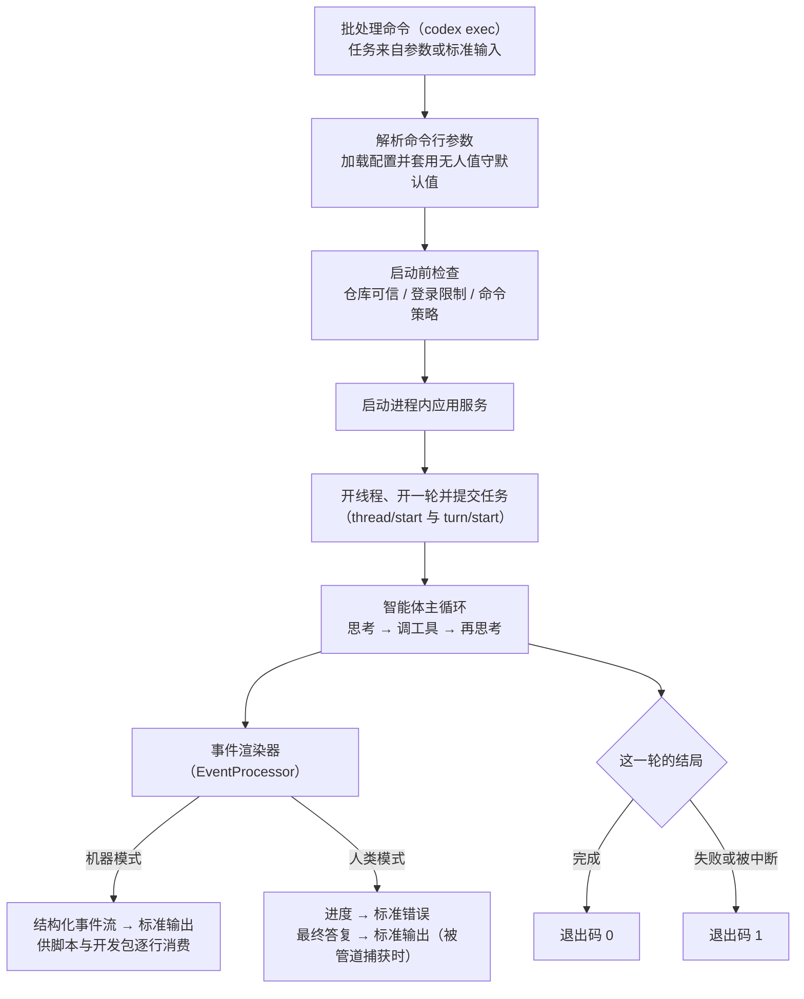

# exec headless 模式

## 本章导读

先设想一个场景：凌晨三点，代码仓库的持续集成流水线（每次提交后自动构建、
自动测试的系统）发现主分支挂了，想叫 Codex 来自动修复。问题是：没有人类
坐在屏幕前，没人会回答「是否允许执行这条命令」；也没有人盯着界面看进度，
流水线只认两样东西——机器可读的输出，和代表成败的退出码。

终端界面是 Codex 面向「人」的形态，本章主角批处理模式（codex exec）则是
它面向「机器」的形态：没有界面、不等输入，跑完一个任务就退出。流水线里的
自动修复、脚本里的批量改写、TypeScript 软件开发工具包（SDK——让别人用代码
调用 Codex 的工具包）的每一次任务调用，底层走的都是这条无人值守路径。

读完本章，你将能够：

1. 指出批处理模式与终端界面在启动链上的分叉点，说出无人值守的默认配置
   （尤其是审批策略）及其理由；
2. 读懂机器模式输出的事件流——每种事件的类型、生命周期与输出去向；
3. 解释退出码的语义，以及无人值守环境下审批请求的两道闸门设计。

**前置章节**：第 4 章「进程与传输」（进程内应用服务的来龙去脉）、第 6 章
「协议层」（开线程、开一轮等远程调用方法）。本章会复用这两章的术语。

## 概念与架构

### 驾驶舱与自动驾驶

如果终端界面是飞机的驾驶舱——仪表盘齐全、操纵杆在手、飞行员随时可以介入
——那么批处理模式就是自动驾驶：起飞前设定好目的地（任务提示）和飞行规则
（能碰什么、不能碰什么的权限边界），按下按钮后全程不碰方向盘，抵达即降落
（进程退出）。机上没有飞行员，「请示机长」这个选项根本不存在：需要人拍板
的操作，要么在起飞前预先授权，要么默认拒绝。全程由黑匣子（事件流）记录，
供地面塔台（脚本、流水线、开发包）回放分析。

这个类比决定了无人值守的三条铁律：

- **一次性**：进程寿命约等于一轮——从接到任务到给出最终答复的一次完整
  工作周期；接续已有线程时也只是再补一轮，完毕即退出，没有「下一轮对话」
  的概念；
- **不提问**：默认永不向用户请求审批，任何需要人拍板的操作直接失败；
- **输出即契约**：程序有两条打印通道——标准输出放结果、标准错误放日志。
  批处理模式下，标准输出上只出现结构化结果（每行一条 JSON 文本的事件流，
  JSON 是一种通用的结构化文本格式），进度与日志全部走标准错误——管道下游
  的消费者拿到的每一行都必须可解析。

### 一次批处理的完整旅程

下面这张图把一次批处理从启动到退出画成一条线：入口在左上，出口在右下，
中间是与终端界面完全共享的部分。



读这张图只需注意「两端」：入口是命令行参数而非键盘，出口是事件流与退出码
而非界面刷新——中间的应用服务、智能体主循环、工具与权限隔离层，与终端界面
完全共享（智能体主循环见第 7 章「Agent 核心」，权限隔离见第 12 章「审批与
沙箱」）。

## 出场角色

进入源码之前，先认识本章要出场的角色。「所在文件」都是仓库内的相对路径，
现在记不住没关系，读到正文时翻回来对照即可。

| 中文名 | 英文名 | 职责（一句话） | 所在文件 |
| ------ | ------ | -------------- | -------- |
| 批处理子命令 | Subcommand::Exec | 命令行入口里把「批处理」分派出去的分支 | codex-rs/cli/src/main.rs |
| 批处理入口函数 | run_main | 批处理模式主函数，从解析参数一路管到进程退出 | codex-rs/exec/src/lib.rs |
| 批处理参数定义 | Cli | 批处理模式全部命令行参数的定义处 | codex-rs/exec/src/cli.rs |
| 共享命令行选项 | SharedCliOptions | 各前端共用的通用选项（模型、权限档位等） | codex-rs/utils/cli |
| 审批策略 | AskForApproval | 决定「何时需要人类批准」的枚举，批处理默认钉死为「永不」 | codex-rs/protocol/src/protocol.rs |
| 配置覆盖 | ConfigOverrides | 启动时强制改写配置的载体，无人值守默认值靠它注入 | codex-rs/exec/src/lib.rs（构造处） |
| 事件处理器接口 | EventProcessor | 输出双轨的抽象：同一批事件、两种渲染方式 | codex-rs/exec/src/event_processor.rs |
| 人类可读渲染器 | EventProcessorWithHumanOutput | 默认模式，把摘要与进度写到标准错误 | codex-rs/exec/src/event_processor_with_human_output.rs |
| 机器可读渲染器 | EventProcessorWithJsonOutput | 机器模式，把每个事件写成一行 JSON | codex-rs/exec/src/event_processor_with_jsonl_output.rs |
| 事件模型 | ThreadEvent | 机器模式下全部事件类型的枚举 | codex-rs/exec/src/exec_events.rs |
| 条目模型 | ThreadItemDetails | 事件里「条目」的类型枚举（消息、命令、文件变更等） | codex-rs/exec/src/exec_events.rs |
| 用量汇总 | Usage | 一轮结束时的词元（token——模型计费与限流的计量单位）统计 | codex-rs/exec/src/exec_events.rs |
| 服务器请求拦截器 | handle_server_request | 把漏网抵达的审批请求一律拒绝 | codex-rs/exec/src/lib.rs |
| 事件过滤器 | should_process_notification | 只放行属于本线程、本轮的通知 | codex-rs/exec/src/lib.rs |
| 条目补齐器 | maybe_backfill_turn_completed_items | 消息被背压丢弃后回读线程、补齐条目 | codex-rs/exec/src/lib.rs |
| 配置构建器 | build_exec_config | 构建批处理配置，并给自动评审留了例外 | codex-rs/exec/src/lib.rs |
| 进程内客户端 | InProcessAppServerClient | 与进程内应用服务通话的统一接口（见第 1 章「总览」） | codex-rs/app-server-client/src/lib.rs |
| TS 开发包封装 | CodexExec | TypeScript 开发包对批处理命令的薄封装 | sdk/typescript/src/exec.ts |

## 源码深挖

### 与终端界面的分叉点

这一小节回答「同一个程序文件，怎么知道自己这次该当没有界面的批处理器」。
出场的是命令行入口里的批处理子命令、批处理入口函数，以及一串启动前检查。
读完你能画出从按下回车到任务提交的完整启动链，并知道哪些失败会让进程直接
以退出码 1 收场。

同一个 Rust 二进制，命运由命令行参数解析库（clap——Rust 生态最常用的参数
解析器）的子命令决定：不带子命令进入终端界面，而批处理子命令
（codex-rs/cli/src/main.rs#L1229）把解析出的参数转交给批处理入口函数
（codex-rs/cli/src/main.rs#L1243）。值得一提，顶层的代码评审命令也被改写
成一次批处理调用后进入同一个入口函数（codex-rs/cli/src/main.rs#L1254-L1264）
——评审只是批处理的一种任务模板。

批处理入口函数（codex-rs/exec/src/lib.rs#L259）做的第一件事是把调用来源
标记（originator——会出现在遥测与请求头里的调用方标识）设为批处理来源
（L260），让服务端能区分流量来自哪个前端。随后的启动序列如下表：

| 步骤 | 位置 | 要点 |
| ---- | ---- | ---- |
| 解析命令行配置覆盖、定位配置主目录（CODEX_HOME——存放 Codex 配置与登录态的目录） | codex-rs/exec/src/lib.rs#L335-L360 | 失败即以退出码 1 收场，不做降级 |
| 构造无人值守默认配置 | codex-rs/exec/src/lib.rs#L563-L568 | 审批策略钉为「永不」 |
| 加载命令策略、检查登录限制 | codex-rs/exec/src/lib.rs#L615-L633 | 规则加载失败或限制不满足同样退出 |
| 启动进程内应用服务 | codex-rs/exec/src/lib.rs#L973 | 与终端界面同一条启动路径（见第 4 章「进程与传输」） |
| 开线程（或接续、分叉已有线程） | codex-rs/exec/src/lib.rs#L1315-L1342 | 把响应当作权威引导数据 |
| 开一轮并提交任务 | codex-rs/exec/src/lib.rs#L1137-L1174 | 拿回任务编号，进入事件循环 |

第五步藏着一个性能细节：批处理并不等待流式下发的会话配置事件
（SessionConfigured——会话就绪后应用服务广播的配置快照），而是把开线程的
响应当作权威引导数据——源码注释写明，这避免了进程内路径上最多 10 秒的启动
延迟（codex-rs/exec/src/lib.rs#L1094-L1096）。

仓库可信检查排在会话启动之前（codex-rs/exec/src/lib.rs#L964-L970）：不在
git 仓库、又没显式跳过检查（参数定义见 codex-rs/exec/src/cli.rs#L31-L33），
就直接退出；而「彻底绕过审批与沙箱」的危险开关会连带跳过该检查——上方注释
解释了理由：用户此时已声明自己运行在外部沙箱环境中
（codex-rs/exec/src/lib.rs#L962-L963）。

命令行参数面上，批处理专有参数包括：机器模式开关
（codex-rs/exec/src/cli.rs#L58-L65）、结构化输出约束（L47-L49）、最终答复
落盘文件（L67-L74）、不落盘开关（L35-L37）等；通用选项（模型、权限档位等）
来自共享命令行选项。任务提示取自位置参数；缺省或为短横线时读标准输入，标准
输入有管道内容且已有提示时，会把输入包成标记块追加在后面
（codex-rs/exec/src/cli.rs#L76-L80；codex-rs/exec/src/lib.rs#L2291-L2302、
L2265-L2272）。

### 事件流：机器可读的输出契约

这一小节看批处理模式如何把内部事件「翻译」成机器友好的输出。出场的是事件
处理器接口和它的两个实现，外加一份事件模型定义。读完你会知道每种输出模式
写哪条通道、事件长什么样，以及为什么 TS 开发包至今还在用一个带「实验」字样
的旧参数名。

输出双轨由事件处理器接口（codex-rs/exec/src/event_processor.rs#L13）抽象，
按机器模式开关二选一（codex-rs/exec/src/lib.rs#L842-L849）：

| 实现 | 触发 | 行为 |
| ---- | ---- | ---- |
| 人类可读渲染器 | 默认 | 配置摘要、工具进度、词元用量全部写到标准错误（codex-rs/exec/src/event_processor_with_human_output.rs#L218-L223）；仅当输出被管道捕获时，最终答复才写标准输出（同文件 L399-L408，判定函数 L515-L521） |
| 机器可读渲染器 | 机器模式 | 每个事件序列化成一行 JSON，写到标准输出（codex-rs/exec/src/event_processor_with_jsonl_output.rs#L103-L115） |

机器模式的参数带着历史别名「实验性 JSON」
（codex-rs/exec/src/cli.rs#L58-L65）——TS 开发包至今仍在使用旧名
（sdk/typescript/src/exec.ts#L92）。

事件类型集中定义在事件模型文件里：事件模型枚举
（codex-rs/exec/src/exec_events.rs#L9-L37）用序列化库（serde——Rust 事实
标准的序列化框架）的标签机制（L10）把变体拍平成「线程开启」「一轮完成」
这样的点分字符串；条目模型（codex-rs/exec/src/exec_events.rs#L105-L133）
枚举了智能体消息、命令执行、文件变更、外部工具调用、联网搜索、待办清单等
条目类型。所有类型都派生了类型导出工具（ts-rs——把 Rust 类型自动生成
TypeScript 定义的库）的导出接口，TS 开发包侧的事件定义文件第一行注释就写明
它基于这份 Rust 定义（sdk/typescript/src/events.ts#L1）。

一次成功运行的典型事件序列如下（真实输出中每行是一条完整 JSON）：

```text
{"type":"thread.started","thread_id":"..."}
{"type":"turn.started"}
{"type":"item.started","item":{"id":"item_0","type":"command_execution",...}}
{"type":"item.completed","item":{"id":"item_0","type":"command_execution","exit_code":0,...}}
{"type":"item.completed","item":{"id":"item_1","type":"agent_message","text":"..."}}
{"type":"turn.completed","usage":{"input_tokens":...,"output_tokens":...}}
```

其中线程开启事件由「打印配置摘要」这一步作为第一个事件发出
（codex-rs/exec/src/event_processor_with_jsonl_output.rs#L598-L606）；一轮
完成事件携带本轮词元用量（用量汇总结构，
codex-rs/exec/src/exec_events.rs#L60-L73），并让渲染器返回「开始关停」状态
（codex-rs/exec/src/event_processor_with_jsonl_output.rs#L506-L529）——事件
循环收到后随即收尾。

### 无人值守下的审批：两道闸门

这一小节回答「没有人类可问，审批请求去哪儿了」。出场的是审批策略与服务器
请求拦截器。读完你会理解「默认拒绝 + 显式拒绝」的双层设计，以及想放权时
唯一正确的姿势。

批处理模式对审批是「默认拒绝 + 显式拒绝」的双层设计：

1. **配置层**：配置覆盖把审批策略钉死为「永不」
   （codex-rs/exec/src/lib.rs#L568），模型根本不会进入「等用户批准」的挂起
   状态。例外是自动评审：配置构建器（codex-rs/exec/src/lib.rs#L745-L778）
   发现解析出的评审者是自动评审员（AutoReview——由另一个模型充当评审者的
   自动评审机制）时，会去掉这个无人值守覆盖重新构建配置。
2. **传输层**：即便有审批请求越过配置抵达批处理前端，服务器请求拦截器
   （codex-rs/exec/src/lib.rs#L1976）也会把它们一律拒绝——命令执行
   （L2000-L2011）、文件变更（L2012-L2023）、补丁工具（L2075-L2086）、
   权限请求（L2099-L2110）……错误信息统一为「审批在批处理模式下不受
   支持」。

要放权，只能由调用方在启动前显式声明：提高权限档位、用命令策略规则放行
特定命令（见第 12 章「审批与沙箱」），或者用那个危险开关彻底裸奔（此时
git 仓库检查也一并跳过）。

### 事件循环与退出码

这一小节看批处理模式的主循环如何收尾，以及自动化系统唯一关心的那个数字
——退出码——是怎么算出来的。出场的是事件过滤器、条目补齐器和一张退出码
速查表。读完你就能在脚本里放心地用退出码判断成败。

主循环（codex-rs/exec/src/lib.rs#L1204-L1302）用并发等待宏
（tokio::select!——同时监听多个异步事件、谁先来就处理谁）同时盯着中断
按键（转发为「中断本轮」请求，L1217-L1231）和应用服务事件流。每个事件先
按线程号、轮号过滤（事件过滤器，L1577），再交给事件处理器。两个细节值得
注意：

- **背压补齐**：进程内传输在背压（下游来不及消费、缓冲区被塞满）下可能
  丢弃非终态的条目通知，但保证「一轮完成」必达。因此持久线程在条目视图
  不完整时会回读线程、补齐条目再输出（条目补齐器，
  codex-rs/exec/src/lib.rs#L1641-L1695）。
- **失败标记**：出现声明「不会重试」的错误通知
  （codex-rs/exec/src/lib.rs#L1247-L1253），或本轮以失败、被中断收场
  （L1254-L1264），就置上失败标记。

循环结束后依次是：关停客户端（L1304）→ 打印最终输出（L1307）→ 若有失败
标记则以退出码 1 收场（L1308-L1310），否则正常返回，即退出码 0（L1312）。

| 场景 | 退出码 | 证据位置 |
| ---- | ------ | -------- |
| 一轮正常完成 | 0 | codex-rs/exec/src/lib.rs#L1312 |
| 不可重试错误 / 本轮失败或被中断 | 1 | codex-rs/exec/src/lib.rs#L1308-L1310 |
| 命令行配置覆盖解析失败 | 1 | codex-rs/exec/src/lib.rs#L339-L340 |
| 找不到配置主目录 | 1 | codex-rs/exec/src/lib.rs#L354-L358 |
| 配置文件加载失败 | 1 | codex-rs/exec/src/lib.rs#L815 |
| 命令策略规则加载失败 | 1 | codex-rs/exec/src/lib.rs#L622 |
| 登录限制不满足 | 1 | codex-rs/exec/src/lib.rs#L628-L633 |
| 不在 git 仓库且未跳过检查 | 1 | codex-rs/exec/src/lib.rs#L964-L970 |
| 标准输入读取失败或无任务内容 | 1 | codex-rs/exec/src/lib.rs#L2239-L2242、L2252-L2258 |

对自动化系统来说，这张表就是契约：脚本里「成功才继续」的判断只认 0 与非 0，
TS 开发包也正是这么做的——子进程退出码非 0 或被信号杀死时抛出异常
（sdk/typescript/src/exec.ts#L243-L246）。

## 技术难点与设计取舍

**难点一：无人值守意味着审批必须默认拒绝。** 交互模式下，「模型想做危险操作
→ 问用户」是安全阀；无人值守模式下没有用户，安全阀就变成死锁——智能体挂起
等一个永远不会到来的回答。Codex 的选择是把「不问」做成两层：配置层默认
「永不」让审批无从发起，传输层再显式拒绝漏网之鱼。代价是能力收缩：想跑
危险命令，必须在启动前用权限档位、命令策略或危险开关预先授权——安全决策从
「运行时每步裁决」前移到「启动时一次性声明」。这正是流水线场景想要的语义：
权限边界写在流水线配置里，可评审、可审计，而不是藏在某次人工点击里。

**难点二：标准输出是契约，标准错误是日志。** 机器模式下标准输出上每行都必须
是合法 JSON，任何一行被日志污染都会打爆下游解析器。所以日志组件的输出层被
显式钉到标准错误（codex-rs/exec/src/lib.rs#L323-L326）；人类可读模式下进度
也全走标准错误，只有「最终答复」在检测到管道时才写标准输出
（codex-rs/exec/src/event_processor_with_human_output.rs#L515-L521）——这让
「管道接下游程序」与「机器模式接 JSON 处理器」各得其所。代价是「同一份输出」
拆成两个渲染器，语义对齐要靠手工维持。

**难点三：事件流要为机器消费者重新设计。** 应用服务内部的通知是面向交互前端
的，直接透传给脚本并不友好（粒度过细、编号不稳定）。批处理因此定义了独立的
事件模型：条目有开始、更新、完成三态生命周期，条目编号用本地递增计数器重
映射（codex-rs/exec/src/event_processor_with_jsonl_output.rs#L99-L101），
词元用量只在「一轮完成」汇总一次。模型对齐靠类型导出工具自动生成 TS 类型，
而不是让开发包手写一份注定漂移的拷贝。代价是多一层映射与聚合，外加背压下的
回读补丁——但这些复杂度被锁在批处理内部，换来下游「逐行解析即可」的极简
消费。

## 对照通用 agent 范式

**智能体即命令行工具。** 把智能体包装成 Unix 管道里的一环——标准输入收任务、
标准输出出结果、标准错误出日志、退出码表成败——是近两年编码智能体的共同
演化方向：Claude Code 的打印模式、Aider 的单条消息模式、GitHub Copilot CLI
的非交互模式，语义都与本章主角同构。Codex 的特点是把这条路做得更「纯」：
批处理不是终端界面的降级模式，而是与终端界面平行的正式前端，共享同一条应用
服务契约。

**事件流即 API。** 智能体的「可编程化」有三层台阶：纯文本输出（靠正则解析，
最脆）、结构化事件流（本章的逐行 JSON，Claude Code 也有类似输出）、全双工
协议（如 Codex 应用服务的 JSON-RPC，见第 6 章「协议层」）。逐行 JSON 是
性价比甜点位：比文本可靠，比全双工简单。Codex 的 TS 开发包干脆就是批处理
命令的薄封装——启动子进程加逐行读取（sdk/typescript/src/exec.ts#L196、
L231-L240），没有私有通道。这把「开发包支持哪些语言」转化成「哪些语言会
启动进程并逐行读 JSON」——答案是所有语言。

**默认安全的自动化。** 业界对流水线中智能体的权限模型尚在摸索：有的工具默认
放行一切（快但危险），有的要求逐条确认（安全但无法无人值守）。Codex 的
「默认永不审批 + 授权前置声明」提供了一个参考解：把权限声明变成流水线配置
的一部分，让代码评审可以覆盖智能体权限——安全与自动化不再非此即彼。

## 小结与下一章预告

- 批处理命令是无人值守前端：同一二进制经批处理子命令分叉，跑完一轮即退出，
  流水线、脚本与 TS 开发包都构建在它之上；
- 无人值守默认审批策略为「永不」，审批请求即使抵达也被显式拒绝；放权只能靠
  启动前的显式声明（权限档位、命令策略、危险开关）；
- 机器模式（别名「实验性 JSON」）产出逐行 JSON 事件流：事件模型以序列化
  标签拍平、类型导出工具自动生成 TS 类型；标准输出只走事件，日志与进度只走
  标准错误；
- 退出码即自动化契约：一轮完成返回 0，不可重试错误与各类启动失败一律返回 1；
- 执行路径与终端界面同源：进程内应用服务、开线程加开一轮、同一套服务器
  通知——无人值守不是旁路，而是同一契约的另一个消费者。

下一章（全书终章）第 16 章「app-server 深入」：终端界面、编辑器插件、批处理
都汇聚到同一个应用服务——它如何管理多条连接、路由请求与事件，并在进程内外
的传输之上保持同一份语义？
