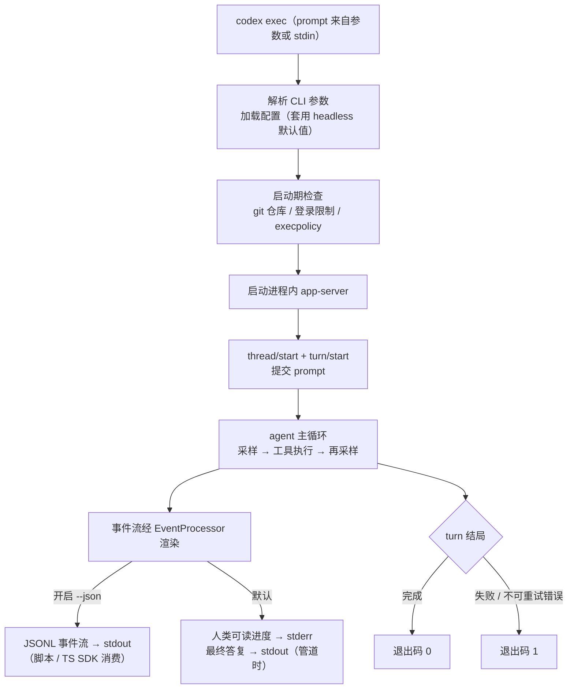

# exec headless 模式

## 本章导读

TUI 是 Codex 面向"人"的形态，本章的主角 `codex exec` 则是它面向"机器"的形态：
没有界面、不等输入，跑完一个任务就退出。CI 流水线里的自动修复、脚本里的批量
改写、TS SDK 的每一次 `run()`，底层走的都是这条 headless 路径。读完本章，你将
能够：

1. 指出 `codex exec` 与 TUI 在启动链上的分叉点，说出 headless 模式的默认配置
   （尤其是审批策略）及其理由；
2. 读懂 `--json` 输出的 JSONL 事件流——每种事件的类型、生命周期与输出去向；
3. 解释退出码语义，以及无人值守环境下审批请求的纵深防御设计。

**前置章节**：第 4 章「进程与传输」（进程内 app-server 的来龙去脉）、第 6 章
「协议层」（thread/start、turn/start 等 JSON-RPC 方法）。本章会大量复用这两章
的术语。

## 概念与架构

### 驾驶舱与自动驾驶

如果 TUI 是飞机的驾驶舱——仪表盘齐全、操纵杆在手、飞行员随时可以介入——那么
`codex exec` 就是自动驾驶模式：起飞前设定好目的地（prompt）和飞行规则（沙箱
与权限），按下按钮后全程不碰方向盘，抵达即降落（进程退出）。机上没有飞行员，
"请示机长"这个选项根本不存在：审批要么在起飞前预先授权，要么默认拒绝。全程由
黑匣子（事件流）记录，供地面塔台（脚本、CI、SDK）回放分析。

这个类比决定了 headless 模式的三条铁律：

- **一次性**：进程的生命周期约等于一个 turn（resume/fork 时接续已有线程再跑
  一个 turn），完毕即退出，没有"下一轮对话"的概念；
- **不提问**：默认永不向用户请求审批，任何需要人拍板的操作直接失败；
- **输出即契约**：stdout 上只出现结构化结果（JSONL 事件流或最终答复），进度
  与日志走 stderr——管道下游的消费者拿到的每一行都必须可解析。

### 一次 exec 的完整旅程



注意这张图与 TUI 的差异只在"两端"：入口是命令行参数而非键盘，出口是事件流与
退出码而非界面刷新——中间的 app-server、agent 主循环、工具与沙箱全部共享。

## 源码深挖

### 与 TUI 的分叉点

同一个 Rust 二进制，命运由 clap 子命令决定：不带子命令进入 TUI，而
`Subcommand::Exec`（codex-rs/cli/src/main.rs#L1229）把解析出的 `ExecCli` 转交
给 `codex_exec::run_main`（codex-rs/cli/src/main.rs#L1243）。值得一提，顶层
`codex review` 也复用这条路——它被改写成 `codex exec review` 后进入同一个
`run_main`（codex-rs/cli/src/main.rs#L1254-L1264）。

`run_main`（codex-rs/exec/src/lib.rs#L259）做的第一件事是把 originator 设为
`codex_exec`（L260），让遥测与请求头能区分调用来源。随后的启动序列：

| 步骤 | 位置 | 要点 |
| ---- | ---- | ---- |
| 解析 `-c` 覆盖、定位 `CODEX_HOME` | lib.rs#L335-L360 | 失败即 `exit(1)`，不做降级 |
| 构造 headless 默认配置 | lib.rs#L563-L568 | `approval_policy: Some(AskForApproval::Never)` |
| 加载 execpolicy、登录限制检查 | lib.rs#L615-L633 | 规则加载失败或登录限制不满足同样 `exit(1)` |
| 启动进程内 app-server | lib.rs#L973 | 与 TUI 同一条 `InProcessAppServerClient::start` 路径 |
| thread/start（或 resume/fork） | lib.rs#L1315-L1342 | 从响应直接构造 `SessionConfigured` |
| turn/start 提交 prompt | lib.rs#L1137-L1174 | 拿回 `task_id`，进入事件循环 |

第 5 步藏着一个性能细节：exec 并不等待流式的 `SessionConfigured` 事件，而是把
`thread/start` 的响应当作权威引导数据——源码注释写明，这避免了进程内路径上最多
10 秒的启动延迟（codex-rs/exec/src/lib.rs#L1094-L1096）。

git 仓库检查在会话启动之前（lib.rs#L964-L970）：不在 git 仓库且没带
`--skip-git-repo-check`（cli.rs#L31-L33）就直接 `exit(1)`；而
`--dangerously-bypass-approvals-and-sandbox` 会连带跳过该检查——上方注释解释了
理由：用户此时已声明自己运行在外部沙箱环境中（L962-L963）。

CLI 面上，exec 专有参数定义在 `codex-rs/exec/src/cli.rs`：`--json`（L58-L65）、
`--output-schema`（L47-L49）、`--output-last-message`/`-o`（L67-L74）、
`--ephemeral`（L35-L37）等；通用选项（`--model`、`--sandbox` 等）来自共享的
`SharedCliOptions`。prompt 取自位置参数；缺省或为 `-` 时读 stdin，stdin 有管道
输入且已有 prompt 时以 `<stdin>` 块追加（cli.rs#L76-L80；lib.rs#L2291-L2302、
L2265-L2272）。

### JSONL 事件流：格式与去向

输出双轨由 `EventProcessor` trait（codex-rs/exec/src/event_processor.rs#L13）
抽象，按 `--json` 标志二选一（codex-rs/exec/src/lib.rs#L842-L849）：

| 实现 | 触发 | 行为 |
| ---- | ---- | ---- |
| `EventProcessorWithHumanOutput` | 默认 | 配置摘要、工具进度、token 用量全部 `eprintln!` 到 **stderr**（event_processor_with_human_output.rs#L218-L223）；仅当输出被管道捕获时，最终答复才写 **stdout**（同文件 L399-L408、判定函数 L515-L521） |
| `EventProcessorWithJsonOutput` | `--json` | 每个事件序列化成一行 JSON，`println!` 到 **stdout**（event_processor_with_jsonl_output.rs#L103-L115） |

`--json` 的 clap 定义带着历史别名 `--experimental-json`
（codex-rs/exec/src/cli.rs#L58-L65）——TS SDK 至今仍在使用旧名
（sdk/typescript/src/exec.ts#L92）。

事件类型集中定义在 `codex-rs/exec/src/exec_events.rs`：`ThreadEvent` 枚举
（L9-L37）用 serde 的 `tag = "type"`（L10）把变体拍平成 `"thread.started"`、
`"turn.completed"` 这样的点分字符串；`ThreadItemDetails`（L105-L133）枚举了
agent_message、command_execution、file_change、mcp_tool_call、web_search、
todo_list 等 item 类型。所有类型都派生 ts-rs 的 `TS` trait，TS SDK 侧的
`sdk/typescript/src/events.ts` 第一行注释就写明它 "based on event types from
codex-rs/exec/src/exec_events.rs"（events.ts#L1）。

一次成功运行的典型事件序列：

```text
{"type":"thread.started","thread_id":"..."}
{"type":"turn.started"}
{"type":"item.started","item":{"id":"item_0","type":"command_execution",...}}
{"type":"item.completed","item":{"id":"item_0","type":"command_execution","exit_code":0,...}}
{"type":"item.completed","item":{"id":"item_1","type":"agent_message","text":"..."}}
{"type":"turn.completed","usage":{"input_tokens":...,"output_tokens":...}}
```

其中 `thread.started` 由 `print_config_summary` 作为第一个事件发出
（event_processor_with_jsonl_output.rs#L598-L606）；`turn.completed` 携带本轮
token 用量（`Usage`，exec_events.rs#L60-L73）并返回 `CodexStatus::InitiateShutdown`
（同文件 L506-L529）——事件循环收到后随即关停。

### 无人值守下的审批：两道闸门

headless 模式对审批是"默认拒绝 + 显式拒绝"的双层设计：

1. **配置层**：`ConfigOverrides` 把 `approval_policy` 钉死为
   `AskForApproval::Never`（codex-rs/exec/src/lib.rs#L568），模型根本不会进入
   "等用户批准"的挂起状态。例外是自动评审：`build_exec_config`（L745-L778）
   发现解析出的 reviewer 是 AutoReview 时，会去掉这个 headless 覆盖重新构建
   配置。
2. **传输层**：即便有审批请求越过配置抵达 exec 前端，`handle_server_request`
   （codex-rs/exec/src/lib.rs#L1976）也会把它们一律 `reject_server_request`
   掉——命令执行（L2000-L2011）、文件变更（L2012-L2023）、apply_patch
   （L2075-L2086）、权限请求（L2099-L2110）……错误信息统一为
   "…approval is not supported in exec mode"。

要放权，只能由调用方在启动前显式声明：`--sandbox` 提高沙箱档位、execpolicy
规则放行特定命令，或 `--dangerously-bypass-approvals-and-sandbox` 彻底裸奔
（此时 git 检查也一并跳过）。

### 事件循环与退出码

主循环（codex-rs/exec/src/lib.rs#L1204-L1302）用 `tokio::select!` 同时监听
Ctrl-C（转发为 `turn/interrupt`，L1217-L1231）和 app-server 事件流。每个事件先
按 thread_id / turn_id 过滤（`should_process_notification`，L1577），再交给
`EventProcessor`。两个细节值得注意：

- **背压补齐**：进程内传输在背压下可能丢弃非终态的 item 通知，但保证
  `turn/completed` 必达。因此非 ephemeral 线程在 `items_view != Full` 时会回读
  `thread/read` 补齐 items 再输出（`maybe_backfill_turn_completed_items`，
  lib.rs#L1641-L1695）。
- **失败标记**：出现不可重试的错误通知（`will_retry == false`，L1247-L1253），
  或 turn 以 Failed / Interrupted 收场（L1254-L1264），就置 `error_seen`。

循环结束后依次是：`client.shutdown()`（L1304）→ `print_final_output`（L1307）
→ 若 `error_seen` 则 `std::process::exit(1)`（L1308-L1310），否则正常返回
`Ok(())`（L1312），即退出码 0。

| 场景 | 退出码 | 证据位置 |
| ---- | ------ | -------- |
| turn 正常完成 | 0 | lib.rs#L1312 |
| 不可重试错误 / turn 失败或被中断 | 1 | lib.rs#L1308-L1310 |
| `-c` 覆盖解析失败 | 1 | lib.rs#L339-L340 |
| 找不到 CODEX_HOME | 1 | lib.rs#L354-L358 |
| config.toml 加载失败 | 1 | lib.rs#L815 |
| execpolicy 规则加载失败 | 1 | lib.rs#L622 |
| 登录限制不满足 | 1 | lib.rs#L628-L633 |
| 不在 git 仓库且未跳过检查 | 1 | lib.rs#L964-L970 |
| stdin 读取失败或无 prompt 内容 | 1 | lib.rs#L2239-L2242、L2252-L2258 |

对自动化系统来说，这张表就是契约：shell 里 `if codex exec ...; then` 的判断只认
0/1，TS SDK 也正是这么做的——子进程退出码非 0 或被信号杀死时抛出异常
（sdk/typescript/src/exec.ts#L243-L246）。

## 技术难点与设计取舍

**难点一：无人值守意味着审批必须默认拒绝。** 交互模式下，"模型想做危险操作 →
问用户"是安全阀；headless 模式下没有用户，安全阀就变成死锁——agent 挂起等一个
永远不会到来的回答。Codex 的选择是把"不问"做成两层：配置层默认 `Never` 让审批
无从发起，传输层再显式拒绝漏网之鱼。代价是能力收缩：想跑危险命令，必须在启动
前用 `--sandbox`、execpolicy 或 `--dangerously-bypass-approvals-and-sandbox`
预先授权——安全决策从"运行时每步裁决"前移到"启动时一次性声明"。这正是 CI 场景
想要的语义：权限边界写在流水线配置里，可评审、可审计，而不是藏在某次人工点击
里。

**难点二：stdout 是契约，stderr 是日志。** JSONL 模式下 stdout 上每行都必须是
合法 JSON，任何一行被日志污染都会打爆下游解析器。所以 tracing 的 fmt layer 被
显式钉到 stderr（codex-rs/exec/src/lib.rs#L323-L326）；人类可读模式下进度也全走
stderr，只有"最终答复"在检测到管道时才写 stdout
（event_processor_with_human_output.rs#L515-L521）——这让 `codex exec ... | 下游`
与 `codex exec --json ... | jq` 各得其所。代价是"同一份输出"拆成两个渲染器，
语义对齐要靠手工维持。

**难点三：事件流要为机器消费者重新设计。** app-server 内部的 `ServerNotification`
是面向交互前端的，直接透传给脚本并不友好（粒度过细、id 不稳定）。exec 因此定义
了独立的 `ThreadEvent` / `ThreadItem` 模型：item 有 started / updated /
completed 三态生命周期，item id 用本地递增计数器重映射
（event_processor_with_jsonl_output.rs#L99-L101），token 用量只在
`turn.completed` 汇总一次。模型对齐靠 ts-rs 自动导出 TS 类型，而不是让 SDK 手写
一份注定漂移的拷贝。代价是多一层映射与聚合，外加背压下的 `thread/read` 回读补丁
——但这些复杂度被锁在 exec 内部，换来下游"逐行 JSON.parse 即可"的极简消费。

## 对照通用 agent 范式

**Agent as a CLI。** 把 agent 包装成 Unix 管道里的一环——stdin 收任务、stdout
出结果、stderr 出日志、退出码表成败——是近两年编码 agent 的共同演化方向：
Claude Code 的 `claude -p`（print 模式）、Aider 的 `--message`、GitHub Copilot
CLI 的非交互模式，语义都与 `codex exec` 同构。Codex 的特点是把这条路做得更"纯"：
exec 不是 TUI 的降级模式，而是与 TUI 平行的正式前端，共享同一条 app-server 契约。

**事件流即 API。** agent 的"可编程化"有三层台阶：纯文本输出（靠正则解析，最
脆）、结构化事件流（JSONL，如 Codex exec 与 Claude Code 的 stream-json 输出）、
全双工协议（JSON-RPC，如 Codex 的 app-server）。JSONL 是性价比甜点位：比文本
可靠，比全双工简单。Codex 的 TS SDK 干脆就是 exec 的薄封装——`spawn` 加逐行
读取（sdk/typescript/src/exec.ts#L196、L231-L240），没有私有通道。这把"SDK
支持哪些语言"转化成"哪些语言会 spawn 进程并逐行读 JSON"——答案是所有语言。

**默认安全的自动化。** 业界对 CI 中 agent 的权限模型尚在摸索：有的工具默认放行
一切（快但危险），有的要求逐条确认（安全但无法无人值守）。Codex 的"默认 Never
+ 授权前置声明"提供了一个参考解：把权限声明变成流水线配置的一部分，让 code
review 可以覆盖 agent 权限——安全与自动化不再非此即彼。

## 小结与下一章预告

- `codex exec` 是 headless 批处理前端：同一二进制经 `Subcommand::Exec` 分叉，
  跑完一个 turn 即退出，CI、脚本与 TS SDK 都构建在它之上；
- headless 默认 `approval_policy = Never`，审批请求即使抵达也被显式拒绝；放权
  只能靠启动前的显式声明（`--sandbox`、execpolicy、
  `--dangerously-bypass-approvals-and-sandbox`）；
- `--json`（别名 `--experimental-json`）产出 JSONL 事件流：`ThreadEvent` 以
  serde tag 序列化、ts-rs 导出 TS 类型；stdout 只走事件，日志与进度只走 stderr；
- 退出码即自动化契约：turn 完成返回 0，不可重试错误与各类启动失败一律返回 1；
- 执行路径与 TUI 同源：进程内 app-server、`thread/start` + `turn/start`、同一套
  `ServerNotification`——headless 不是旁路，而是同一契约的另一个消费者。

下一章（全书终章）「app-server 深入」：TUI、IDE 扩展、exec 都汇聚到同一个
app-server——它如何管理多条连接、路由请求与事件，并在进程内外的传输之上保持
同一份语义？
