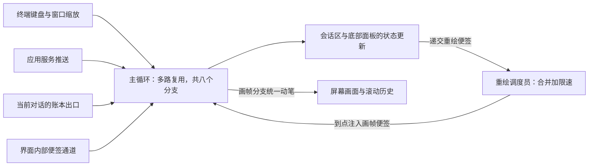

# TUI 内部架构

## 本章导读

先想象你使用 Codex 的三个瞬间。

瞬间一：你提了问题，回答像打字一样逐段往外蹦，画面平滑滚动。为什么它不闪烁、也不卡死？

瞬间二：模型想执行一条有风险的命令，屏幕底部弹出"批准还是拒绝"的选择框。你按下的那个键，是怎样穿过整个程序、最终送回模型手里的？

瞬间三：你同时养着几个后台任务，来回切换查看，每个任务的进度都分毫不差。程序是怎么记住它们的？

这三个瞬间，对应本章要拆开的三个机制：画面渲染、审批交互、多对话管理。它们都发生在终端界面（TUI）——Codex 默认的交互形态，在终端里用字符拼出界面的那个全屏程序。它是全书唯一"住在终端里"的前端：没有浏览器，没有图形窗口。

开始之前，请接受一个前面章节已经论证过的设定：终端界面并不直接指挥真正干活的引擎。它只是应用服务（app-server）——所有前端的统一接待处——的一个客户；核心引擎（codex-core）——真正驱动智能体（agent）——能自己规划步骤、调用工具完成任务的程序——的那部分，住在接待处身后。本章要回答的是：作为一个客户，终端界面自己内部是怎么组织的。

读完本章，你将能够：

1. 说出终端界面主循环的形状：键盘、终端本身、应用服务三类外部消息如何汇进同一个循环，定时器又扮演什么角色；
2. 描述回答文字从应用服务推送到屏幕的完整旅程，以及审批弹窗"你做出选择、选择送回引擎"的回程路线；
3. 解释两个反直觉的决定：终端界面为什么坚持不直接指挥引擎；它为什么把画面钉在屏幕底部一小块区域，让写完的内容向上流入终端自带的滚动历史。

**前置章节**：第 4 章「进程与传输」（终端界面与应用服务之间消息通道的来历）、第 5 章「主时序」（一次提问从发出到回答的全过程）。细节不记得没关系，本章会用自己的话复述需要的前提。

## 概念与架构

### 类比一：游戏引擎的帧循环

终端界面的主循环，和游戏引擎惊人地相似。游戏引擎每一轮做三件事：收集输入（手柄、网络包），推进游戏状态，渲染画面。终端界面也一样：

- 收集输入：键盘按键、粘贴、窗口缩放，连同"网络包"——应用服务推来的回答片段、工具进展、审批请求——全部汇入同一个事件队列；
- 推进状态：每种事件更新各自负责的界面零件；
- 渲染画面：状态变了并不直接画屏，而是递出一张"请重绘"的便签。一位独立的调度员把便签合并起来、按上限限速（每秒最多一百二十帧），再统一安排画帧。

游戏引擎不会因为物理引擎一秒算了五百步就画五百帧。终端界面也不会因为模型一秒吐出五百个文字片段就刷五百次屏。**状态更新和画面刷新是解耦的**——这是理解本章的第一把钥匙。

### 类比二：餐厅的出菜口与各桌账本

终端界面同时盯着的对话可能不止一条：你正在聊的主对话、后台的子任务、评审支线。而应用服务是所有对话消息的唯一来源，就像餐厅唯一的出菜口。终端界面的做法是：

- 出菜口每出一道菜，先按桌号登记进那张桌的账本。账本既是缓冲区，也是回放底稿；
- 只有你正在看的那一桌，菜立刻端上桌：经一条内部传送带送进主循环，即时处理；
- 你换桌时，新桌的账本整本摊开重放，场面瞬间恢复。

于是后台对话的消息既不丢，也不打扰前台。这是第二把钥匙：**按对话分账，当前对话即时上菜，其余先记账、待回放**。

### 组件树与事件汇合

组件层级很浅，像一棵矮树。最顶层是编排员，只负责调度，不亲自画画。画面主体全归会话区组件，它下面挂着三样东西：历史清单（已经写定、不再改变的对话内容）、流式控制器（正在往外蹦的回答）、底部面板（你打字的输入框，以及审批弹窗这类临时浮层）。

事件的流向用一张图就能看清。看图时盯住两点：左边四路入口如何汇进同一个循环；右边那个回环——重绘便签绕了一圈，又回到循环里。

图里最需要记住的是回环：重绘调度员并不自己画屏，它只是往队列里再塞一张"该画帧了"的便签，由主循环在画帧分支里统一动笔。所有绘制集中在一个地方，就没有两块代码同时抢屏幕的问题，界面也就不用上锁。

至于画面落在哪儿：终端界面默认把"正在变化的部分"钉在屏幕底部一块固定区域里；写定的内容向上流入终端自带的滚动历史，从此不可更改。只有历史全览、差异查看这类临时页面，才借用终端的备用全屏。这个安排换来了什么，我们在「技术难点与设计取舍」里细说。

## 出场角色

进入源码之前，先认识本章要出场的角色。"所在文件"一律是仓库内的相对路径；代码包（crate）——Rust 组织代码的单元，相当于一个子项目。现在记不住没关系，读到正文时翻回来对照即可。

| 中文名 | 英文名 | 职责（一句话） | 所在文件 |
| ------ | ------ | -------------- | -------- |
| 终端界面代码包 | codex-tui | 终端界面的全部代码 | codex-rs/tui |
| 启动编排器 | run_main_inner | 启动期总调度：加载配置、登录与信任校验、会话选择 | codex-rs/tui/src/startup_orchestration.rs |
| 启动草稿 | StartupDraft | 尽早接管终端，让启动过程也有画面可看 | codex-rs/tui/src/startup_draft.rs |
| 终端抽象 | Tui | 对真实终端的封装：事件流、画帧、写滚动历史 | codex-rs/tui/src/tui.rs |
| 终端恢复守卫 | TerminalRestoreGuard | 无论正常退出还是崩溃，都把终端还原成借用前的样子 | codex-rs/tui/src/lib.rs |
| 自定义终端 | CustomTerminal | 在绘图库之上维护屏幕底部那块固定画面区域 | codex-rs/tui/src/custom_terminal.rs |
| 应用编排器 | App | 终端界面的总调度：主循环与全部事件分发 | codex-rs/tui/src/app.rs（及 app/ 目录） |
| 应用事件 | AppEvent | 界面内部便签的枚举：组件间异步通信的统一载体 | codex-rs/tui/src/app_event.rs |
| 应用事件发送器 | AppEventSender | 各组件往便签通道投递消息的把手 | codex-rs/tui/src/app_event_sender.rs |
| 应用命令 | AppCommand | 要发给引擎的用户指令枚举：提问、中断、审批决定等 | codex-rs/tui/src/app_command.rs |
| 连接目标 | AppServerTarget | 决定连哪个应用服务：内嵌、本地后台、远程 | codex-rs/tui/src/lib.rs |
| 应用服务客户端 | AppServerClient | 传输层二选一：进程内或远程 | codex-rs/app-server-client/src/lib.rs |
| 进程内客户端 | InProcessAppServerClient | 同进程场景的客户端：走消息通道但守同一协议 | codex-rs/app-server-client/src/lib.rs |
| 应用服务事件 | AppServerEvent | 应用服务推来的事件统一类型：通知、请求、断线、滞后 | codex-rs/app-server-client/src/lib.rs |
| 应用服务会话适配器 | AppServerSession | 把客户端包装成会话化接口，主循环只跟它打交道 | codex-rs/tui/src/app_server_session.rs |
| 会话区组件 | ChatWidget | 会话画面状态机：历史、流式输出、底部面板的总管家 | codex-rs/tui/src/chatwidget.rs（及 chatwidget/ 目录） |
| 底部面板 | BottomPane | 屏幕底部容器：输入框加一摞模态视图栈 | codex-rs/tui/src/bottom_pane/mod.rs |
| 输入框组件 | ChatComposer | 你打字的地方：多行编辑、附件、提及、斜杠命令 | codex-rs/tui/src/bottom_pane/chat_composer.rs |
| 审批弹窗 | ApprovalOverlay | 批准或拒绝的模态选择列表 | codex-rs/tui/src/bottom_pane/approval_overlay.rs |
| 通用选择列表 | ListSelectionView | 审批弹窗底层可过滤、可键盘导航的列表 | codex-rs/tui/src/bottom_pane/list_selection_view.rs |
| 历史单元 | HistoryCell | 一段写定内容的接口：给定宽度，交出若干行 | codex-rs/tui/src/history_cell/mod.rs |
| 命令执行单元 | ExecCell | 渲染"执行命令"这一段历史的专用单元 | codex-rs/tui/src/exec_cell/mod.rs |
| 流式控制器 | StreamController | 给往外蹦的回答把门：攒到内容边界再放行 | codex-rs/tui/src/streaming/controller.rs |
| Markdown 流收集器 | MarkdownStreamCollector | 给模型回答文本划出稳定边界，不做解析 | codex-rs/tui/src/markdown_stream.rs |
| 帧请求器与帧调度员 | FrameRequester / FrameScheduler | 收重绘便签、合并、按帧率上限放行 | codex-rs/tui/src/tui/frame_requester.rs |
| 帧率限制器 | FrameRateLimiter | 记住上一帧时刻，把两帧间隔钳在下限之上 | codex-rs/tui/src/tui/frame_rate_limiter.rs |
| 线程事件账簿 | ThreadEventStore | 每条对话一本账：缓冲事件，支持整本回放 | codex-rs/tui/src/app/thread_events.rs |
| 线程事件通道 | ThreadEventChannel | 账本外接的传送带：有界队列加共享账本 | codex-rs/tui/src/app/thread_events.rs |
| 中断管理器 | InterruptManager | 流式输出期间给审批请求排队，保证先来后到 | codex-rs/tui/src/chatwidget/interrupts.rs |
| 待处理请求登记簿 | PendingAppServerRequests | 记住"哪条对话的哪次审批对应哪个请求编号" | codex-rs/tui/src/app/app_server_requests.rs |
| 覆盖层 | Overlay | 借用整块屏幕的临时页面：历史全览与差异查看 | codex-rs/tui/src/pager_overlay.rs |
| 会话选择结果 | SessionSelection | 恢复会话选择器里你可能做出的几种选择 | codex-rs/tui/src/resume_picker.rs |

## 源码深挖

### 启动链路：从按下回车到主循环

这一小节把"你按下回车"到"主循环开始转动"之间的过程拆成六步。出场的有命令行入口、启动编排器、启动草稿、终端恢复守卫和应用编排器。读完你会知道：终端在什么时候被接管、应用服务在什么时候启动、以及为什么程序哪怕崩溃，你的终端窗口也不会花屏。

| 步骤 | 位置 | 做什么 |
| ---- | ---- | ------ |
| 分派到终端界面 | codex-rs/cli/src/main.rs#L2746 | 不带子命令时，调用终端界面的入口函数 |
| 启动编排 | codex-rs/tui/src/lib.rs#L1007、codex-rs/tui/src/startup_orchestration.rs#L10 | 入口函数转交启动编排器：加载配置、登录与信任校验、决定是否先弹会话选择器 |
| 接管终端 | codex-rs/tui/src/startup_draft.rs#L105、codex-rs/tui/src/tui.rs#L423-L431 | 启动草稿尽早初始化终端：先校验输入输出确为终端，再打开原始输入模式（按键不经缓冲直达程序）、括号粘贴与键盘增强（codex-rs/tui/src/tui.rs#L228-L245），同时挂上终端恢复守卫 |
| 崩溃保险 | codex-rs/tui/src/lib.rs#L1063-L1068 | 崩溃钩子（程序崩溃时最后执行的函数）先恢复终端、再链回原钩子：错误报告不丢，屏幕也不花 |
| 启动应用服务 | codex-rs/tui/src/lib.rs#L1098-L1115 | 界面主函数（run_ratatui_app，codex-rs/tui/src/lib.rs#L1034）里调用应用服务启动函数（start_app_server，codex-rs/tui/src/lib.rs#L496），再把结果包成应用服务会话适配器 |
| 进入主循环 | codex-rs/tui/src/app/startup.rs#L132 | 应用编排器的主循环函数开跑；退出或崩溃时由终端恢复守卫兜底还原（codex-rs/tui/src/lib.rs#L1885-L1889） |

画面形态上，终端界面默认采用内联视口（inline viewport）——画面只占屏幕底部一块固定区域的设计，初始化函数上方的注释写明了这一点（codex-rs/tui/src/tui.rs#L422-L423）。自定义终端维护着这块视口区域（codex-rs/tui/src/custom_terminal.rs#L146）：写定的历史被逐行推到视口上方，进入终端自带的滚动历史区（scrollback）——终端窗口上方可以回滚查看的区域。只有历史全览、差异查看器这类覆盖层，才临时借用备用屏幕（alternate screen）——终端提供的独立全屏缓冲区，退出后原画面原样恢复；覆盖层模块的注释把这条分工写在了开头（codex-rs/tui/src/pager_overlay.rs#L1-L4）。退出或崩溃时终端必然还原——这是"借来的终端"的基本教养。

### 主循环：一个多路复用语句，八个分支

这一小节放大主循环本体——概念节那张图正中间的那个节点。出场的是应用编排器和它同时监听的八件事。读完你能回答两个问题：模型疯狂输出时，你的按键为什么依然灵敏；网络断线时，界面为什么不乱。

主循环的主体，是一个循环套一个多路复用语句（tokio::select!）——同时等在多个异步事件源上、谁先到就先处理谁。循环在 codex-rs/tui/src/app/startup.rs#L971，多路复用在 codex-rs/tui/src/app/startup.rs#L1039，导入见 codex-rs/tui/src/app.rs#L195。八个分支如下：

| 分支 | 位置（codex-rs/tui/src/app/startup.rs） | 处理去向 |
| ---- | ---- | ---- |
| 内部便签通道 | #L1040 | 无界通道（创建于 #L180）里的应用事件，进事件分发函数（codex-rs/tui/src/app/event_dispatch.rs#L27） |
| 当前对话账本出口 | #L1065-L1083 | 活动线程的缓冲事件，进线程事件处理函数（codex-rs/tui/src/app/thread_routing.rs#L2029） |
| 终端输入与画帧 | #L1084-L1116 | 键盘、缩放、画帧便签，进终端事件处理函数（codex-rs/tui/src/app.rs#L848） |
| 应用服务事件 | #L1117-L1128 | 通知与请求，进应用服务事件处理函数（codex-rs/tui/src/app/app_server_events.rs#L58） |
| 断线重连 | #L1129-L1147 | 重连异步任务（future——一个"稍后才就绪"的异步值）完成后的收尾（codex-rs/tui/src/app/reconnect.rs） |
| 定时器一：限额轮询 | #L1148 | 定期刷新用量限额显示 |
| 定时器二：窗口标题 | #L1159 | 定期刷新终端窗口标题 |
| 定时器三：落账节拍 | #L1172 | 流式提交的节拍器，「渲染管线」小节细讲 |

几乎每个分支都带门控条件。比如"当前对话账本出口"要求内部便签已排空且不在断线中（codex-rs/tui/src/app/startup.rs#L1074）；应用服务事件分支在内嵌模式下也有同样约束（codex-rs/tui/src/app/startup.rs#L1118）。效果是：内部事件优先消化，断线时屏蔽大部分输入。背压（下游来不及处理时向上游施加的压力）被直接写进了调度器。

终端界面与核心引擎的接合分三层。连接目标（codex-rs/tui/src/lib.rs#L296-L301）先决定连谁：内嵌、本地后台、远程三选一。应用服务客户端（codex-rs/app-server-client/src/lib.rs#L317-L320）是传输：进程内或远程二选一；进程内那条由进程内客户端实现（codex-rs/app-server-client/src/lib.rs#L300），走消息通道但保持同一协议（来历见第 4 章「进程与传输」）。最外层是应用服务会话适配器（codex-rs/tui/src/app_server_session.rs#L309），把客户端包装成会话化接口：主循环从它身上取下一条事件（codex-rs/tui/src/app_server_session.rs#L784），审批结果经它回发（codex-rs/tui/src/app_server_session.rs#L1684）。应用服务内部的调度细节，留到第 16 章「app-server 深入」。

事件类型也收敛成两种。来自应用服务的统一为应用服务事件（codex-rs/app-server-client/src/lib.rs#L97-L102）：通知、请求、断线、滞后四种。界面内部的统一为应用事件；其中"提交线程操作"（codex-rs/tui/src/app_event.rs#L339-L342）包裹着要发给引擎的应用命令（codex-rs/tui/src/app_command.rs#L100）：中断（#L101）、提问（#L120）、命令审批决定（#L149）、补丁审批决定（#L154）、请求压缩上下文（#L183）等。

### 组件职责

这一小节给概念节那棵"矮树"的每条树枝挂上源码门牌。出场的是会话区组件一家和它的左邻右舍。读完你能拿着任何一个界面元素——输入框、弹窗、一段命令输出——找到负责它的代码。

| 组件 | 位置 | 职责 |
| ---- | ---- | ---- |
| 会话区组件 | codex-rs/tui/src/chatwidget.rs#L567（另有 chatwidget/ 目录八十九个子模块文件） | 会话画面的状态机：历史单元、流式控制器、底部面板都归它。文档注释（codex-rs/tui/src/chatwidget.rs#L555-L566）写得很坦白：负责"反映进展、回发请求"，不运行智能体 |
| 底部面板 | codex-rs/tui/src/bottom_pane/mod.rs#L246 | 底部容器：输入框加模态视图栈（codex-rs/tui/src/bottom_pane/mod.rs#L249-L252）。它只管本地输入路由——哪个视图吃掉这次按键；退出、中断这类进程级决定留给会话区组件（codex-rs/tui/src/bottom_pane/mod.rs#L243-L245） |
| 输入框组件 | codex-rs/tui/src/bottom_pane/chat_composer.rs#L520 | 多行编辑、粘贴附件、@ 提及、斜杠命令、仿 vim 的模态编辑 |
| 审批弹窗 | codex-rs/tui/src/bottom_pane/approval_overlay.rs#L173 | 命令执行、补丁、权限、外部工具提问四类请求的模态选择列表；底层是通用选择列表（codex-rs/tui/src/bottom_pane/list_selection_view.rs#L258） |
| 历史单元 | codex-rs/tui/src/history_cell/mod.rs#L187-L189 | 接口的核心方法只有一个：给定宽度，交出若干显示行。窗口变宽变窄，重排一遍即可 |
| 命令执行单元 | codex-rs/tui/src/exec_cell/mod.rs | 实时输出、数据模型、最终渲染，拆成三个子模块分管 |
| 差异渲染 | codex-rs/tui/src/diff_render.rs#L1-L2 | 把统一差异格式（unified diff——带加减号前缀的补丁文本）画出行号与边栏，并按差异块整体送进语法高亮器（syntect——一个语法高亮库），保住跨行字符串、块注释的解析状态（codex-rs/tui/src/diff_render.rs#L23-L27） |
| 排版渲染 | codex-rs/tui/src/markdown.rs、codex-rs/tui/src/markdown_render.rs#L293、codex-rs/tui/src/markdown_stream.rs#L27-L30 | 模型回答用 Markdown 排版（一种用井号、星号做标记的轻量格式）：先由解析器（pulldown-cmark）拆成事件流，再转成绘图库（ratatui——用字符在终端画界面的库）的行对象。流收集器只定界不解析，渲染归流式控制器（codex-rs/tui/src/streaming/controller.rs#L475） |
| 覆盖层 | codex-rs/tui/src/pager_overlay.rs#L58-L60 | 两种：历史全览与静态查看，都跑在备用屏幕上 |

请注意会话区组件那句"不运行智能体"：它宁可绕路走应用服务，也不直接驱动核心引擎。原因在第 1 章「总览」已经说过——所有前端共用同一份契约，行为才必然一致。本章的每一处细节，都是这个决定的下游。

### 渲染管线：一段回答文字的旅程

这一小节跟踪一个具体角色：模型刚吐出来的一小段回答文字（增量片段，delta）——流式输出中每次推送的一小截文本。它从应用服务出发，穿过主循环、会话区组件、流式控制器，最后落在屏幕上。读完你就把概念节的帧循环类比和真实函数一一对上了。

1. 主循环的"应用服务事件"分支拿到通知，进应用服务事件处理函数的通知分支（codex-rs/tui/src/app/app_server_events.rs#L82-L87），再转到通知处理函数（codex-rs/tui/src/app/app_server_events.rs#L109）。
2. 通知按线程编号路由（codex-rs/tui/src/app/thread_routing.rs#L1131；线程（thread）——一条独立的对话线索，thread_id 是它的编号）：先拿到这条线程的线程事件通道（codex-rs/tui/src/app/thread_routing.rs#L75）——一条有界消息队列（mpsc——多生产者、单消费者的通道）加一本共享的线程事件账簿（codex-rs/tui/src/app/thread_events.rs#L579-L582 与 codex-rs/tui/src/app/thread_events.rs#L63）。当前线程的事件立刻进队列；非当前线程的只记账，等你切过去再整本回放——这正是概念节"出菜口与账本"的实现。
3. 主循环的"账本出口"分支把事件交给会话区组件的通知处理方法（codex-rs/tui/src/chatwidget/protocol.rs#L4），一路走到回答文字增量处理（codex-rs/tui/src/chatwidget/streaming.rs#L182），再交给流式控制器的推送方法（codex-rs/tui/src/streaming/controller.rs#L508）。第一小段到达时，还顺手发出"开始落账动画"的应用事件（codex-rs/tui/src/chatwidget/streaming.rs#L548）。
4. 状态变了，会话区组件递出重绘便签（codex-rs/tui/src/chatwidget.rs#L1412）。帧调度员合并便签、按每秒一百二十帧限速（codex-rs/tui/src/tui/frame_requester.rs#L70-L80；两帧最小间隔约八点三毫秒，见 codex-rs/tui/src/tui/frame_rate_limiter.rs#L13），然后往容量只有一的广播通道里丢一个画帧信号（codex-rs/tui/src/tui.rs#L635）。主循环收到它，走"终端输入与画帧"分支。
5. 画帧分支（codex-rs/tui/src/app.rs#L948-L964）调用整帧渲染函数（codex-rs/tui/src/app.rs#L1017），经"带缩放重排的画帧"（codex-rs/tui/src/tui.rs#L1122）把会话区组件画进内联视口（codex-rs/tui/src/app.rs#L1044-L1047）。你看到的打字机效果，就发生在这一步。
6. 与此同时，落账节拍定时器（codex-rs/tui/src/app/startup.rs#L1172-L1183，节拍间隔见 codex-rs/tui/src/app.rs#L440）周期性触发会话区组件的落账处理（codex-rs/tui/src/chatwidget/streaming.rs#L445）：把已经写定的段落做成历史单元，发"插入历史单元"的应用事件（codex-rs/tui/src/app/event_dispatch.rs#L648-L650），最终写入视口上方的滚动历史区（codex-rs/tui/src/tui.rs#L878）。

一句话总结：**流尾在视口里逐帧重画，写定的段落落成滚动历史里不可修改的过去**。窗口缩放时，历史从各历史单元重建换行（第 5 步那条"带缩放重排"的路径），所以加宽窗口不会留下难看的旧折行。

### 审批交互：一次完整的远程调用往返

这一小节跟踪导读里"瞬间二"的那个按键：从弹窗出现，到你的决定送回引擎。出场的有待处理请求登记簿、审批弹窗、中断管理器和应用服务会话适配器。读完你会发现：审批不过是一次普通的请求-响应，只是响应的内容由你来填。

先补一个名词：终端界面与应用服务之间用远程过程调用（JSON-RPC）——用 JSON 文本描述"请调用某个功能、并把结果带回来"的消息约定——通信，完整时序见第 5 章「主时序」。应用服务不仅收请求，也会反过来发请求；审批就是反方向的那一种。

1. 应用服务请求到达，进应用服务事件处理函数的请求分支（codex-rs/tui/src/app/app_server_events.rs#L93-L96）。待处理请求登记簿先记下一笔映射：哪条线程、哪次审批、对应哪个请求编号（codex-rs/tui/src/app/app_server_requests.rs#L108）。
2. 会话区组件按类型分发（codex-rs/tui/src/chatwidget/protocol_requests.rs#L9）：命令执行（codex-rs/tui/src/chatwidget/protocol_requests.rs#L20）、补丁（codex-rs/tui/src/chatwidget/protocol_requests.rs#L27）、外部工具提问（codex-rs/tui/src/chatwidget/protocol_requests.rs#L33）、权限（codex-rs/tui/src/chatwidget/protocol_requests.rs#L36）。以命令执行为例，它的处理函数（codex-rs/tui/src/chatwidget/tool_requests.rs#L9）先过一道闸门（codex-rs/tui/src/chatwidget/streaming.rs#L500-L514）：**回答还在往外蹦、或队列非空时，审批不直接弹窗，而是进中断管理器排队**（codex-rs/tui/src/chatwidget/interrupts.rs#L31），等流空闲再统一放出（codex-rs/tui/src/chatwidget/interrupts.rs#L106）。先来后到，绝不错乱。
3. 真正弹出时，立即处理函数（codex-rs/tui/src/chatwidget/tool_requests.rs#L283）调用底部面板的"推入审批请求"（codex-rs/tui/src/bottom_pane/mod.rs#L1660）：栈顶视图能消化就消化，否则造一个审批弹窗压进视图栈（codex-rs/tui/src/bottom_pane/mod.rs#L1685-L1693）。你刚敲过键盘的几百毫秒内，弹窗还会稍等片刻再出现，防止误触（codex-rs/tui/src/bottom_pane/mod.rs#L1673-L1682）。
4. 你做出选择，应用事件发送器把决定包成应用事件（命令审批见 codex-rs/tui/src/app_event_sender.rs#L75，补丁审批见 codex-rs/tui/src/app_event_sender.rs#L99），即"提交线程操作"，由主循环的事件分发转交（codex-rs/tui/src/app/event_dispatch.rs#L969-L970）。
5. 分发按登记簿的映射取回请求编号（codex-rs/tui/src/app/thread_routing.rs#L1050），把你的决定序列化成协议响应，经会话适配器回发给应用服务（codex-rs/tui/src/app_server_session.rs#L1684）。审批由此闭环。

### 会话管理（终端界面侧）

最后一小节看三件日常小事的源码：开新对话、恢复旧对话、打断与退出。出场的主要是应用编排器的会话生命周期模块。读完你能解释：为什么恢复一个归档对话会慢半拍，以及第一次按 Ctrl+C 为什么不退出。

- **开新对话**（斜杠命令"新建"）：进会话生命周期模块的开新会话函数（codex-rs/tui/src/app/session_lifecycle.rs#L898）——会话（Session）——引擎一侧一次对话的上下文与状态。它先重读配置（codex-rs/tui/src/app/session_lifecycle.rs#L909），再向应用服务发"开线程"请求（入口在 codex-rs/tui/src/app_server_session.rs#L800，协议请求本体在 codex-rs/tui/src/app_server_session.rs#L234），然后关停并退订旧线程（codex-rs/tui/src/app/session_lifecycle.rs#L944-L951），最后换掉整块会话区组件。
- **恢复旧对话**：启动参数或会话内的斜杠命令都会打开恢复选择器。选择器单独起一条应用服务连接（codex-rs/tui/src/lib.rs#L541），不打扰主连接。你的选择是几种结果之一：开新对话、看任务总览、恢复、分叉等（codex-rs/tui/src/resume_picker.rs#L125-L128）。选中归档对话时要先走一道"取消归档"（codex-rs/tui/src/resume_picker.rs#L1286-L1288）——那半拍延迟就来自这里。
- **打断与退出**：中断键被键盘映射识别后，会话区组件提交"中断"应用命令（codex-rs/tui/src/chatwidget/interaction.rs#L152-L159）；应用编排器把它翻译成协议里的"中断当前轮"请求发给应用服务（codex-rs/tui/src/app/thread_routing.rs#L666-L695）——轮（turn）——你提问、引擎答完，这一来一回。Ctrl+C 第一次按下只中断当前工作、并"武装"双击退出；超时内按第二次才真正退出（codex-rs/tui/src/chatwidget/interaction.rs#L545-L551）。

## 技术难点与设计取舍

**难点一：流式渲染与帧率控制的拉锯。** 问题是：模型吐字的速度远超人眼分辨力，每来一小段就重绘纯属浪费。难在节流不能只砍一刀——砍早了回答显得迟钝，砍晚了终端被刷死。终端界面的解法是三层节流：流式控制器按内容边界（换行、表格）攒批；帧调度员把重绘便签合并、钳在一百二十帧以内；落账节拍把写定的段落定期从流尾搬进滚动历史。代价是三层各有一台状态机，交互复杂——画帧要等落账节拍配合。换来的是硬保证：再快的流也拖不卡终端。

**难点二：事件洪峰下的背压。** 问题是：应用服务事件、各线程事件、终端输入都可能瞬时洪峰。难在界面程序最怕两件事——卡顿和乱序，而它们互相拉扯：想不卡就想丢，想不乱就不敢丢。终端界面的答案是"有界、门控、可丢帧"：每条线程的队列有界（容量三万二千七百六十八，codex-rs/tui/src/app.rs#L279）；多路复用分支带门控，内部便签没排空前暂停消费终端输入与应用服务事件；消费端实在跟不上时，上游发来"滞后"信号（codex-rs/tui/src/app/app_server_events.rs#L64-L81），就丢弃被跳过的中间状态、以最新快照重画。画面可以跳帧，状态不能错。

**难点三：高频改动文件的拆分军规。** 问题是：终端界面是全仓改动最频繁的区域之一，文件容易越长越胖、谁都不敢动。难在业务速度永远比重构快。Codex 的选择是把军规写进仓库根部的贡献规范（AGENTS.md#L49-L61）：模块目标五百行以内；超过约八百行，新功能必须进新模块；并点名几个"中心编排模块"，要求会话区组件文件只留编排。效果看得见：该文件本体约两千一百行，配套目录拆出八十九个子模块文件。代价同样看得见：输入框组件文件（约一万三千行）是军规追不上业务速度的活化石——这类约束需要持续还债。

## 对照通用 agent 范式

**事件模型同构，渲染模型不同。** 单线程事件循环加多事件源复用，与浏览器主线程、图形界面事件泵本质同构；终端界面只是把"引擎推流"当成与键盘平权的事件源。真正的分歧在渲染：网页是保留模式（retained mode——你改文档树，浏览器自己决定何时重排），而终端绘图库是立即模式（immediate mode——每帧重画整块视口缓冲，再与上一帧对比出最小差异发给终端）。所以终端界面没有"局部刷新"，只有"局部重画加帧限速"；一百二十帧的上限，正是浏览器里帧回调（requestAnimationFrame——浏览器在每帧绘制前调用你代码的机制）扮演的角色。

**滚动历史是终端独有的存储语义。** 图形界面里"历史"是数据，想改就改；终端里一旦写入滚动历史，就物理上不可改。Codex 顺势而为：只有写定状态的内容才落历史，进行中的流尾永远留在可重画的视口。终端的限制，反过来成了"历史只增不改"的天然实现——这与第 8 章「采样与流式处理」的增量推送、第 10 章「持久化与恢复」只增不改的会话记录遥相呼应。

**给自家界面的三条启示。** 把引擎事件建模为与用户输入平权的事件源；把状态更新与画面刷新解耦；为每条对话维护一本可回放的账。这三条不依赖终端，搬到网页前端同样成立。至于引擎内部"推理、行动、观察"的循环（ReAct——模型交替进行思考与工具调用的经典范式），终端界面一概不参与——它只让第 7 章「Agent 核心」的那台循环对人可见、且随时可被打断。

## 小结与下一章预告

- 终端界面是应用服务的纯客户：主循环用一个多路复用语句汇合终端输入、应用服务事件、当前对话账本出口与内部便签，外加重连与三个定时器；门控条件把背压写进了调度器。
- 通知按线程编号入账：当前线程即时处理，其余线程存进线程事件账簿，切换时整本回放。
- 渲染是立即模式：状态更新只递重绘便签，帧调度员合并并限速一百二十帧；流尾在视口逐帧重画，写定的段落经落账节拍沉入滚动历史。
- 审批是一次完整的远程调用往返：登记映射、（流式期间先排队的）弹窗、你做出选择、按映射取回编号回发。
- 工程上靠"五百、八百行"军规对抗熵增；坚持不直接指挥核心引擎，换来与所有前端同一份契约。

下一章：第 15 章「exec headless 模式」（headless——无界面、无人值守的运行方式）。把同一套应用服务契约接到没有终端的批处理命令上：没有视口、没有弹窗、没有人按中断键时，审批与流式输出要换一种什么形态存在？
