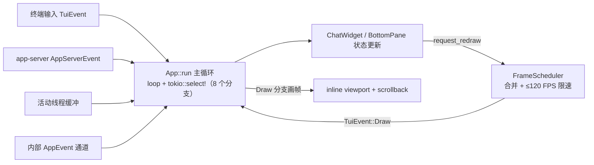

# TUI 内部架构

## 本章导读

本章打开 `codex-rs/tui`——Codex 默认的交互形态，也是全书唯一"住在终端里"
的前端。读完你将能够：

1. 说出 TUI 主循环的形状：键盘、终端、app-server 三类外部事件如何在单个
   `tokio::select!` 里汇合，定时器又扮演什么角色；
2. 描述一条流式 token 从 app-server 通知到终端屏幕的完整渲染管线，以及审批
   弹窗"用户选择 → JSON-RPC 响应"的回程路径；
3. 解释 TUI 为什么坚持"不直接驱动 codex-core"，以及 inline viewport 这个
   反直觉的渲染决策带来了什么。

**前置章节**：第 4 章「进程与传输」（in-process channel 的来历）、第 5 章
「主时序」（一次请求的 JSON-RPC 全貌）。本章默认你已接受"TUI 只是
app-server 的一个客户端"这个设定，从这里往细里走。

## 概念与架构

### 一个类比：游戏引擎的帧循环

TUI 的主循环和游戏引擎惊人地相似：收集输入（手柄、网络包）→ 推进状态 →
渲染画面。TUI 也一样——收集输入时，键盘、粘贴、终端缩放和"网络包"
（app-server 推来的文本 delta、工具进展、审批请求）汇入同一个事件队列；
每种事件更新对应的 UI 状态机；状态变更不直接画屏，而是发出"请重绘"请求，
由独立调度器合并、限速（上限 120 FPS）后统一画帧。游戏引擎不会因为物理引擎
一秒算 500 步就画 500 帧，TUI 也不会因为模型一秒吐 500 个 delta 就刷 500 次
屏——**状态更新和画面刷新是解耦的**，这是理解整个渲染管线的钥匙。

### 一个类比：餐厅的总台与传菜口

TUI 同时盯着的线程可能不止一个（主会话、subagent、review 子线程），而
app-server 是所有线程事件的唯一来源，就像餐厅唯一的出菜口。TUI 的做法是：
出菜口每出一道菜，**按桌号（thread_id）登记进各桌的账本**（`ThreadEventStore`），
账本同时充当缓冲与回放底稿；只有你正在看的那一桌（活动线程）的菜立刻端上
桌——经 mpsc 通道进主循环即时处理；切桌（切换线程）时新桌账本整本回放，
场面瞬间恢复。后台线程的事件既不丢、也不打扰前台。

### 事件汇合与组件树

组件层级很浅：`App` 是编排器，会话区全归 `ChatWidget`，其下挂着 transcript
（`HistoryCell` 列表）、`StreamController` 和 `BottomPane`（输入框
`ChatComposer` + 审批弹窗 `ApprovalOverlay`）。事件则四路汇合进主循环：

注意图里的回环：`FrameScheduler` 不直接画屏，而是注入 `Draw` 事件让主循环
画帧——所有绘制都发生在这一个地方，免去了锁与竞态。

## 源码深挖

### 启动链路：从无子命令到主循环

| 步骤 | 位置 | 做什么 |
| ---- | ---- | ------ |
| CLI 分派与入口 | codex-rs/cli/src/main.rs#L2746、tui/src/lib.rs#L1007 | 无子命令 → `codex_tui::run_main` → `run_main_inner`（startup_orchestration.rs#L10）：配置加载、登录/trust 校验、`--resume` picker |
| 终端接管与初始化 | codex-rs/tui/src/startup_draft.rs#L105、tui.rs#L423-L431 | `StartupDraft` 尽早 `tui::init()`（校验 TTY、开 raw mode/bracketed paste/键盘增强，tui.rs#L228-L245）并挂上 `TerminalRestoreGuard` |
| app-server 启动 | codex-rs/tui/src/lib.rs#L1098-L1115 | `run_ratatui_app` 里 `start_app_server`（lib.rs#L496）；panic hook 先恢复终端再链回原 hook（lib.rs#L1063-L1068） |
| 进入主循环 | codex-rs/tui/src/app/startup.rs#L132 | `App::run`；退出路径由 `TerminalRestoreGuard` 的 Drop 保证恢复（lib.rs#L1885-L1889） |

终端形态上，TUI 默认用 **inline viewport**：`CustomTerminal` 维护一块
`viewport_area`（custom_terminal.rs#L146），完成的历史写入视口上方的正常
scrollback；只有 transcript 全览、diff 查看器等覆盖层用 alternate screen
（pager_overlay.rs#L1-L4 的模块注释写明了这一点）。退出或 panic 时终端必然
还原——这是"借来的终端"的基本教养。

### 主循环：一个 select!，八个分支

`App::run` 的主体是 `loop { select! {…} }`（startup.rs#L971 与 L1039，
`tokio::select` 导入于 app.rs#L195）：

| 分支 | 位置（startup.rs） | 处理 |
| ---- | ---- | ---- |
| `app_event_rx` | L1040 | 内部 `AppEvent` 无界通道（L180 创建）→ `App::handle_event`（event_dispatch.rs#L27） |
| `active_thread_rx` | L1065-L1083 | 活动线程缓冲事件 → `handle_active_thread_event`（thread_routing.rs#L2029） |
| `tui_events` | L1084-L1116 | 终端输入/Draw → `handle_tui_event`（app.rs#L848） |
| `app_server.next_event()` | L1117-L1128 | app-server 通知/请求 → `handle_app_server_event`（app_server_events.rs#L58） |
| reconnect future | L1129-L1147 | 断线重连（app/reconnect.rs） |
| 定时器 ×3 | L1148、L1159、L1172 | rate-limit 轮询、终端标题刷新、流式 commit tick |

几乎每个分支都带门控条件（如 `!has_pending_app_events`、`!app.reconnect.offline`），
保证内部事件优先排空、断线时屏蔽大部分输入——这是把背压写进调度器的做法。

与 core 的接合抽象分三层：`AppServerTarget`（lib.rs#L296-L301：`Embedded` /
`LocalDaemon` / `Remote`）决定连谁；`AppServerClient`（app-server-client/src/
lib.rs#L317-L320：`InProcess | Remote`）是传输；TUI 侧再包一层 `AppServerSession`
（app_server_session.rs#L309），暴露 `next_event`（L784）、`resolve_server_request`
（L1684）等会话化 API。事件类型统一为 `AppServerEvent`（app-server-client/src/
lib.rs#L97-L102）；UI 内部事件是 `AppEvent` 枚举，其中 `SubmitThreadOp`
（app_event.rs#L339-L342）包裹要发给 agent 的 `AppCommand`（app_command.rs#L100：
`Interrupt`、`UserTurn`、`ExecApproval`、`PatchApproval`、`Compact` 等）。

### 组件职责

| 组件 | 位置 | 职责 |
| ---- | ---- | ---- |
| `ChatWidget` | codex-rs/tui/src/chatwidget.rs#L567（+ chatwidget/ 目录 84 个子模块文件） | 会话区状态机：transcript cell、流控制器、bottom pane；文档注释（L555-L566）明确它"反映进展、回发请求"，不运行 agent |
| `BottomPane` | codex-rs/tui/src/bottom_pane/mod.rs#L246 | 底部容器：`composer` + `view_stack` 模态栈（L249-L252），管本地输入路由，quit/interrupt 决策留给 ChatWidget（L243-L245） |
| `ChatComposer` | codex-rs/tui/src/bottom_pane/chat_composer.rs#L520 | 输入框：textarea、附件、`@` mention、斜杠命令、vim 模式 |
| 审批弹窗 | codex-rs/tui/src/bottom_pane/approval_overlay.rs#L173 | `ApprovalOverlay`：exec/patch/permissions/elicitation 的模态选择列表；通用选择器 `ListSelectionView` 在 list_selection_view.rs#L258 |
| 历史 cell | codex-rs/tui/src/history_cell/mod.rs#L187-L189 | `HistoryCell` trait：核心方法 `display_lines(width)`，宽变则重排 |
| 命令执行 cell | codex-rs/tui/src/exec_cell/mod.rs | `ExecCell`：live_output / model / render 三个子模块分管实时输出与最终渲染 |
| diff 渲染 | codex-rs/tui/src/diff_render.rs#L1-L2 | unified diff → 行号/gutter/syntect 高亮（按 hunk 整体高亮保住 parser 状态，L23-L27） |
| markdown | markdown.rs、markdown_render.rs#L293、markdown_stream.rs#L27-L30 | pulldown-cmark 事件 → ratatui `Line`；`MarkdownStreamCollector` 只做定界不解析，渲染归 `StreamController`（streaming/controller.rs#L475） |
| 覆盖层 | codex-rs/tui/src/pager_overlay.rs#L58-L60 | `Overlay::{Transcript, Static}`：alt-screen transcript 全览与 diff 查看 |

### 渲染管线：一条 delta 到屏幕

以 agent 消息 delta 为例，完整走一遍：

1. 主循环 `app_server.next_event()` 拿到通知 → `handle_app_server_event`
   的 `ServerNotification` 分支（app_server_events.rs#L82-L87）→
   `handle_server_notification_event`（L109）。
2. `enqueue_thread_notification`（thread_routing.rs#L1131）按 thread_id 路由：
   `ensure_thread_channel`（L75）拿到该线程的 `ThreadEventChannel`（mpsc +
   共享 `ThreadEventStore`，thread_events.rs#L579-L582 与 L63），活动线程的事件
   进 channel，非活动的留在 store 等回放。
3. 主循环 `active_thread_rx` 分支 → `ChatWidget::handle_server_notification`
   （chatwidget/protocol.rs#L4）→ `on_agent_message_delta`
   （chatwidget/streaming.rs#L182）→ `StreamController::push`
   （streaming/controller.rs#L508）；首个 delta 顺带发出
   `AppEvent::StartCommitAnimation`（streaming.rs#L548）。
4. 状态变更调 `request_redraw`（chatwidget.rs#L1412）→ `FrameScheduler`
   合并请求、限速 ≤120 FPS（frame_requester.rs#L70-L80，`MIN_FRAME_INTERVAL`
   为 8.33ms，frame_rate_limiter.rs#L13）→ `draw_tx` 广播（容量 1 的
   broadcast channel，tui.rs#L635）→ 主循环收到 `TuiEvent::Draw`。
5. Draw 分支（app.rs#L948-L964）→ `render_chat_widget_frame`（app.rs#L1017）
   → `tui.draw_with_resize_reflow`（tui.rs#L1122）→ `chat_widget.render(...)`
   （app.rs#L1044-L1047）把活动流尾部画进 inline viewport。
6. commit tick 定时器（startup.rs#L1172-L1183，间隔见 app.rs#L440）→
   `ChatWidget::on_commit_tick`（chatwidget/streaming.rs#L445）产出完成的
   `HistoryCell` → `AppEvent::InsertHistoryCell`（event_dispatch.rs#L648-L650）
   → `Tui::insert_history_lines`（tui.rs#L878）写入视口上方的 scrollback。

一句话：**流尾在 viewport 里逐帧重画，完成的段落落成 scrollback 里不可变的
历史**。resize 时 transcript 从 cell 重建换行（`draw_with_resize_reflow` 的
reflow 路径）。

### 审批交互：一次 JSON-RPC 往返

1. `ServerRequest` 到达 → `handle_app_server_event` 的请求分支
   （app_server_events.rs#L93-L96）；`PendingAppServerRequests::
   note_server_request`（app/app_server_requests.rs#L108）登记
   `(thread_id, approval_id) → request_id` 映射。
2. `ChatWidget::handle_server_request`（chatwidget/protocol_requests.rs#L9）
   按类型分发：exec（L20）、patch（L27）、elicitation（L33）、permissions
   （L36）。以 exec 为例，`on_exec_approval_request`（tool_requests.rs#L9）先过
   `defer_or_handle`（chatwidget/streaming.rs#L500-L514）：**流式输出进行中或
   队列非空时，审批进 `InterruptManager` 队列**（interrupts.rs#L31），等流空闲
   再 `flush_all` 弹出，保证 FIFO 不乱序。
3. 真正弹出时 `handle_exec_approval_now`（tool_requests.rs#L283）→
   `BottomPane::push_approval_request`（bottom_pane/mod.rs#L1660）：栈顶 view
   能消化就消化，否则构造 `ApprovalOverlay` 压入 `view_stack`（L1685-L1693）；
   刚敲过键盘时还会短暂延迟以免误触（L1673-L1682）。
4. 用户选择 → `AppEventSender::exec_approval` / `patch_approval`
   （app_event_sender.rs#L75、L99）→ `AppEvent::SubmitThreadOp` → 主循环
   `submit_thread_op`（event_dispatch.rs#L969-L970）。
5. `try_resolve_app_server_request`（thread_routing.rs#L1050）按映射取回
   request_id，把 decision 序列化成协议响应，经 `resolve_server_request`
   （app_server_session.rs#L1684）发回 app-server——审批由此闭环。

### 会话管理（TUI 侧）

- **新会话**（`/new`）→ `start_fresh_session_with_summary_hint`
  （app/session_lifecycle.rs#L898）：重读配置（L909）→ `thread/start` RPC
  （app_server_session.rs#L800，`ClientRequest::ThreadStart` 在 L234）→
  关停并退订旧线程（L944-L951）→ 换 ChatWidget。
- **resume picker**：启动期 `--resume` 或会话内 `/resume`；picker 单独起一条
  app-server 连接（`start_app_server_for_picker`，lib.rs#L541）；选择结果是
  `SessionSelection::{StartFresh, AgentsOverview, Resume, …}`（resume_picker.rs
  #L125-L128）；归档会话先走 unarchive（resume_picker.rs#L1286-L1288）。
- **中断与退出**：Esc/中断键由 keymap 识别后 `submit_op(AppCommand::Interrupt)`
  （chatwidget/interaction.rs#L152-L159），App 层翻译成
  `ClientRequest::TurnInterrupt` RPC（thread_routing.rs#L666-L695）；Ctrl+C 第一次
  中断工作并武装双击退出，超时内第二次按下才真正退出（interaction.rs#L545-L551）。

## 技术难点与设计取舍

**难点一：流式渲染 vs 帧率控制。** 模型吐 delta 的速度远超人眼分辨力，逐个
重绘纯属浪费。Codex 的解法是三层节流：`StreamController` 按内容边界（换行、
表格）holdback；`FrameScheduler` 把重绘请求合并并钳制在 120 FPS；commit tick
以帧间隔节奏把"写定的段落"从流尾搬进 scrollback。代价是三层各有状态机、
交互复杂（Draw 要等 commit tick 配合），但换来"再快的流也不卡终端"的硬保证。

**难点二：事件洪峰下的背压。** app-server 事件、线程事件、终端输入都可能瞬时
洪峰。TUI 的答案是"有界 + 门控 + 可丢帧"：每线程 channel 有界
（`THREAD_EVENT_CHANNEL_CAPACITY` = 32768，app.rs#L279）；select! 分支带门控，
内部事件没排空前暂停消费终端输入与 app-server 事件（startup.rs#L1074、L1118）；
消费端跟不上时上游收到 `AppServerEvent::Lagged` 就丢弃被跳过的中间状态、以最新
快照重画（app_server_events.rs#L64-L81）——画面可以跳帧，状态不能错。

**难点三：高触文件的拆分军规。** TUI 是全仓最高频改动的区域之一，根 AGENTS.md
为此立下明文军规（AGENTS.md#L49-L61）：模块目标 500 行以内、超约 800 行新功能
进新模块，并点名 `app.rs`、`chatwidget.rs`、`chat_composer.rs` 等"中心编排模块"，
要求 `chatwidget.rs` 只留编排。效果可见：`chatwidget.rs` 本体约 2100 行，配套
`chatwidget/` 目录拆出 84 个子模块文件；`chat_composer.rs`（约 1.3 万行）则是
军规追不上业务速度的活化石，这类约束需要持续还债。

## 对照通用 agent 范式

**终端 UI vs GUI/Web 前端：事件模型同构，渲染模型不同。** 单线程事件循环 +
事件源多路复用，与浏览器主线程、GUI 事件泵本质同构，TUI 只是把"agent 推流"
也当成与键盘同级的事件源。真正的分歧在渲染：Web 是 retained mode（改 DOM，
浏览器决定何时重排），而 ratatui 是 **immediate mode**——每帧重画整个 viewport
buffer，再与上一帧 diff 出最小转义序列。所以 TUI 没有"局部刷新"，只有"局部
重画 + 帧限速"：120 FPS 上限正是浏览器里 requestAnimationFrame 的角色。

**scrollback 是终端独有的存储语义。** GUI 里"历史"是数据；终端里一旦写入
scrollback 就物理不可改。Codex 顺势而为：只有"完成态"的内容（commit 的 cell）
才落 scrollback，进行中的流尾永远留在可重画的 viewport——终端的限制反过来成了
历史只增不改的天然实现，与第 8 章 append-only 的会话史遥相呼应。

**给自家 agent UI 的启示**：把 agent 事件建模为与用户输入平权的事件源、把
"状态更新"与"画面刷新"解耦、为每个会话维护可回放的账本——这三条不依赖
终端，搬到 Web 前端同样成立。

## 小结与下一章预告

- TUI 是 app-server 的纯客户端：主循环一个 `select!` 汇合终端输入、app-server
  事件、活动线程缓冲与内部 AppEvent，外加重连与三个定时器；
- 通知按 thread_id 入账：活动线程即时处理，非活动线程存 `ThreadEventStore`
  供切换时回放；
- 渲染是 immediate mode：状态更新只发重绘请求，`FrameScheduler` 合并限速
  120 FPS，流尾在 viewport 逐帧重画、完成段落经 commit tick 落 scrollback；
- 审批是一次完整的 JSON-RPC 往返：登记映射 → 弹窗（流式期间延迟）→ 用户
  选择 → `resolve_server_request` 回发；工程上靠 500/800 行军规对抗熵增。

下一章「exec headless 模式」：把同一套 app-server 契约接到没有终端的
`codex exec` 上——没有 viewport、没有弹窗、没有人按 Esc 时，审批与流式输出如何
换一种形态存在。
